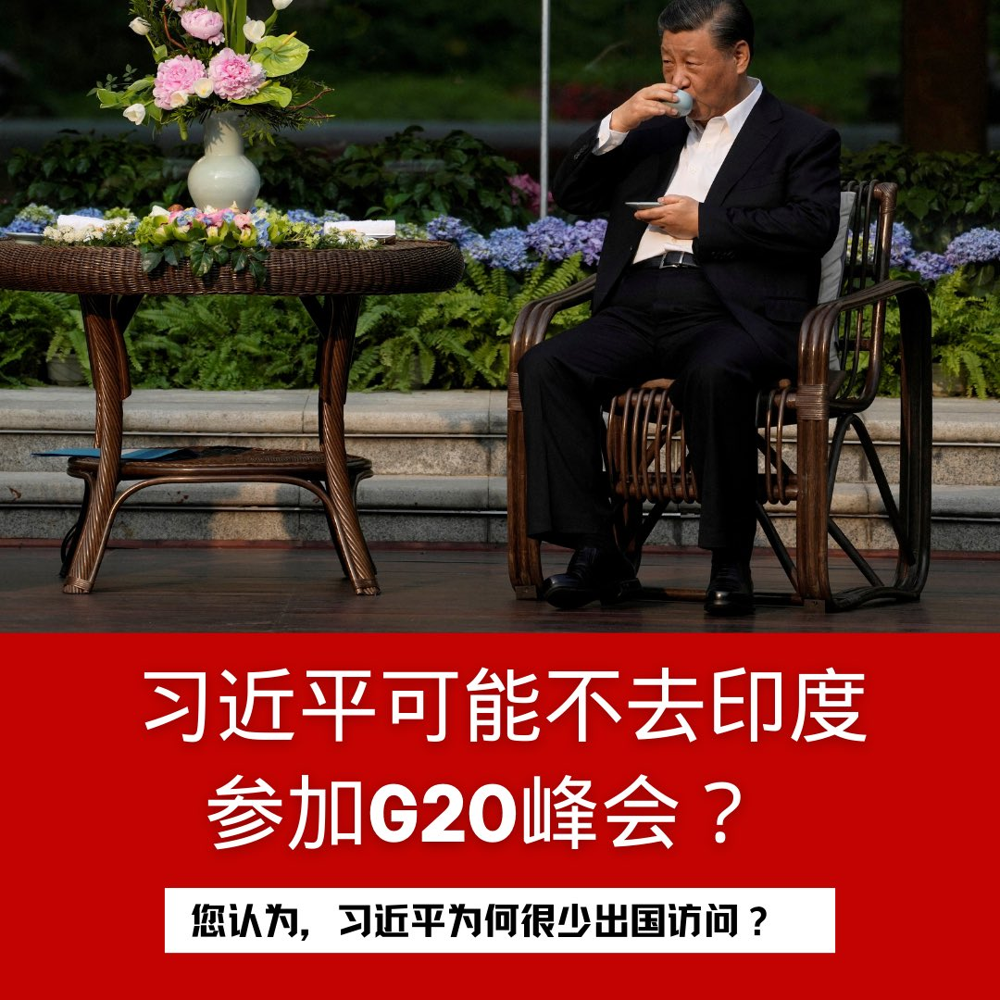

自由亚洲电台 北京时间 2023-09-03T10:22:54Z 1698159603857387857 RT @RFA_Chinese: 【#您怎么看】
据路透社8月31日引述印度和中国的知情人士透露，中国国家主席习近平可能缺席下周在印度举行的20国集团领导人峰会。您认为，习近平为何很少出国访问？ https://t.co/6JL1K9CzQp   自由亚洲电台 北京时间 2023-09-03T03:46:53Z 1698059941909553165 维吾尔人权项目：一些旅游公司罔顾人权仍提供新疆旅游 https://t.co/eOQMgM5TgG   自由亚洲电台 北京时间 2023-09-03T03:47:55Z 1698060202233176182 正在欧洲访问的美国众议院外交事务委员会主席麦考尔认为，习近平和普京之间的联盟对自由世界构成非常大的挑战。https://t.co/FmHDn4e73c   