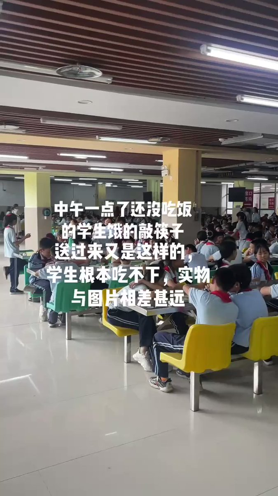
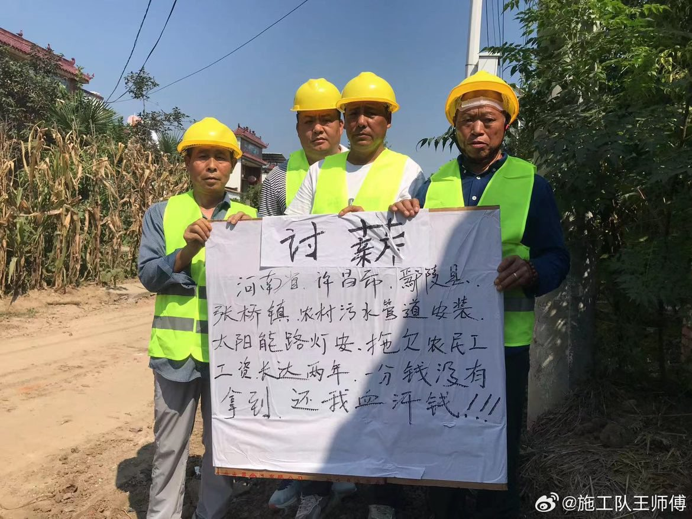
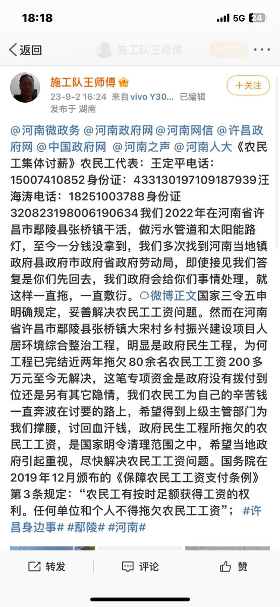
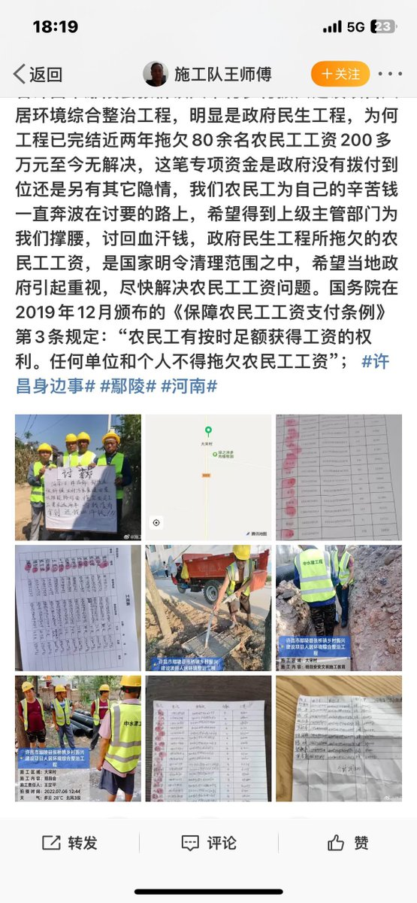

谁将十万横扫三江 北京时间 2023-09-03T16:41:45Z 1698254943386472909 醒悟了，整天这个制裁，那个制裁，谁制裁咱们呢咱们心中有数，三年疫情什么都看明白了 https://t.co/Wlg8SGsGF3   谁将十万横扫三江 北京时间 2023-09-03T16:54:15Z 1698258090192465969 如何在上海0元租房 https://t.co/cqNlV3wNAQ   谁将十万横扫三江 北京时间 2023-09-03T17:20:56Z 1698264805180915932 赣州，刚成立半个月的中央厨房，给各大幼儿园中小学送餐，你愿意你家的孩子吃这种盒饭吗？早上九点做好塑料盒打包一直恒温到12点到手有点余温，冬天是冷的 https://t.co/8MTsbdr60O   谁将十万横扫三江 北京时间 2023-09-03T18:00:02Z 1698274646792319454 RT @whyyoutouzhele: 9月2日晚，受台风影响，广东罗定水库开始泄洪，5个闸全部放水，造成周边村庄受影响 https://t.co/IfSQRskt1r   谁将十万横扫三江 北京时间 2023-09-03T18:15:47Z 1698278608522072391 专业 https://t.co/kq47t8IoTM   谁将十万横扫三江 北京时间 2023-09-03T16:08:52Z 1698246669513703844 RT @whyyoutouzhele: 9月2日，河南省永城市永城一中爆发学生运动
因校方肆意更改假期，取消学生“小星期”，将原本两周一休的“大星期”更改为三周一休，导致学生强烈不满。
起初，学生们只是通过张贴大字报抗议，但是被校方遮盖，最终引发大量学生聚集前往教学楼进行抗议，…   谁将十万横扫三江 北京时间 2023-09-03T16:08:55Z 1698246682792862167 RT @whyyoutouzhele: 9月2日，河南许昌。政府拖欠80余名农民工工资一年，民工们被逼无奈在微博上实名讨薪 https://t.co/aqQsFhgpcm   谁将十万横扫三江 北京时间 2023-09-03T00:08:39Z 1698005021730984253 RT @whyyoutouzhele: 9月1日，刚果民主共和国东部，有枪手袭击了一家矿业公司的车队，造成四人死亡，其中包括两名中国公民。
刚果（金）东部省份南基伍省经常发生武装组织袭击事件。
此外，在当地居民与中国矿工之间也经常发生争夺黄金的冲突。   