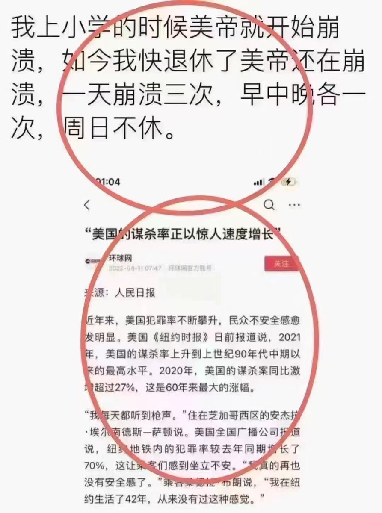
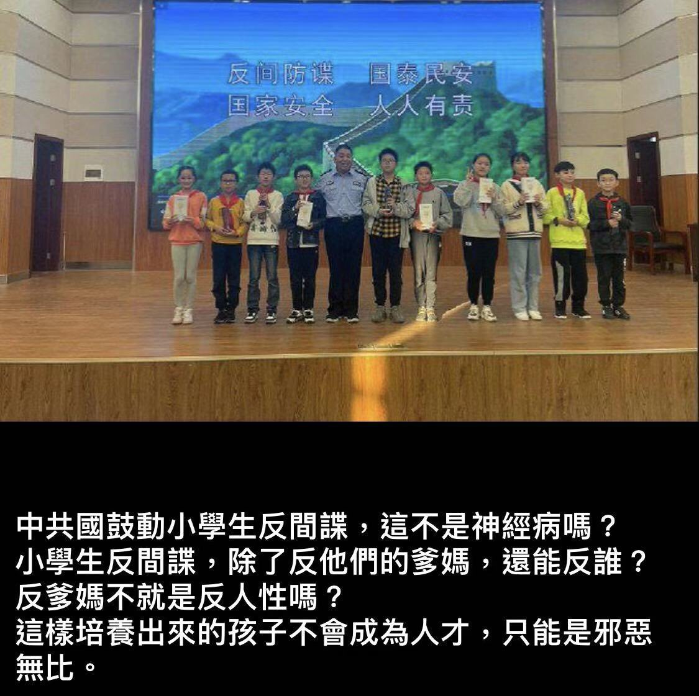
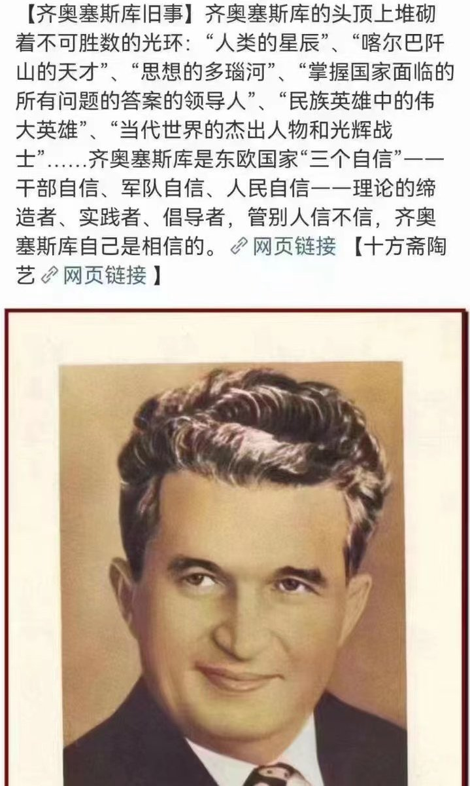
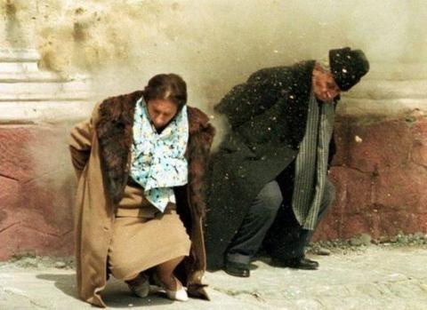

Petrichor 北京时间 2023-09-02T10:14:02Z 1697794986144583929 “美帝国主义一天天烂下去，中华人民共和国一天天好起来”。用习总的话说就是“东升西降”。邓江胡时代，跟着美帝学，有所收获，经济快速发展。习近平上台之后，折腾10年，本来与美国正在缩小的差距，又拉大了。现在加速脱钩，外资企业撤离，限制高新科技出口中国，人们的工资不升反降。房地产和金融危机一触即发，前景不妙。要想扭转这个局面，除非习近平下台，重回改革开放、与世界并轨，包括意识形态，放弃马克思主义。   Petrichor 北京时间 2023-09-02T06:37:30Z 1697740493940027475 什么类型的外国间谍整天与中国各地小学生一起混？让小学生发现他们是间谍？那么还要国家安全部干嘛？直接撤消，省得花纳税人的银子。小学生可以为一切指明方向，但小学生抓不了真正的专业间谍。 https://t.co/tShUyNcxNU   Petrichor 北京时间 2023-09-02T08:49:33Z 1697773725628715372 原来他也提出过“三个自信”。只是到了最后，一个自信也没有了。 https://t.co/UuukvGqXOA   