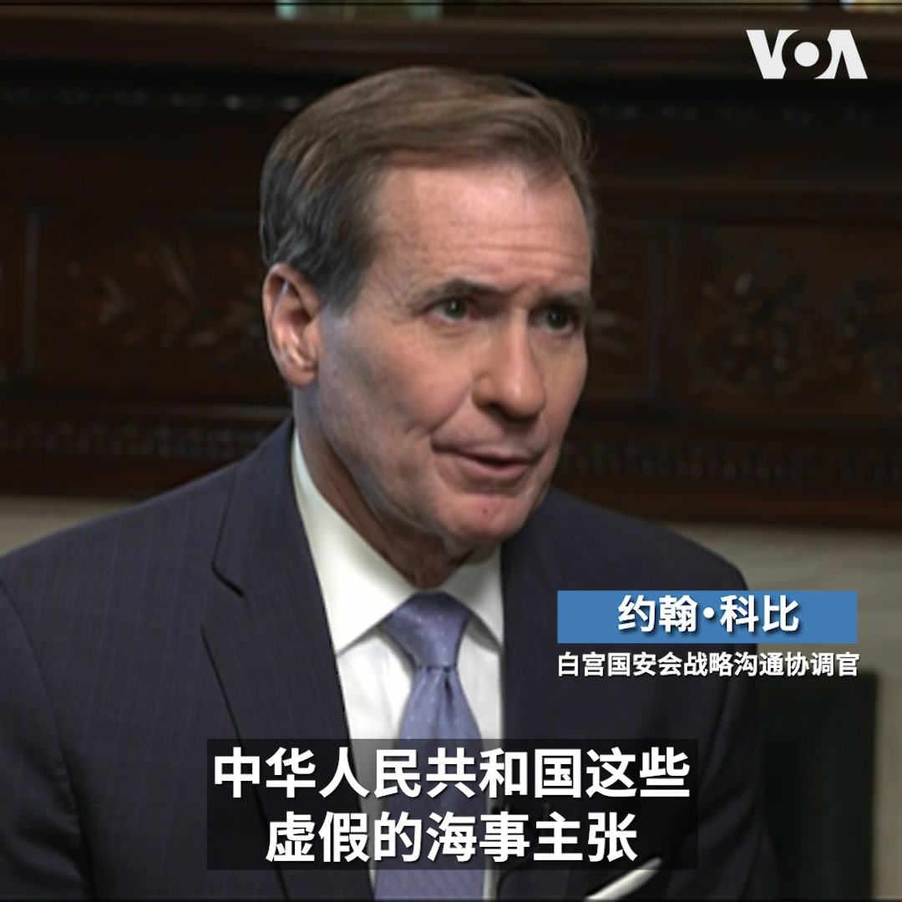
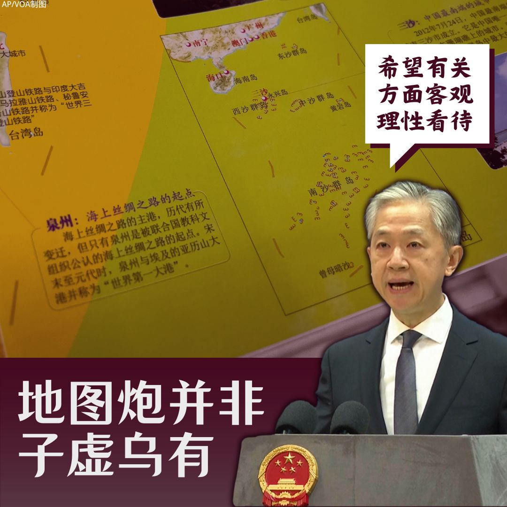
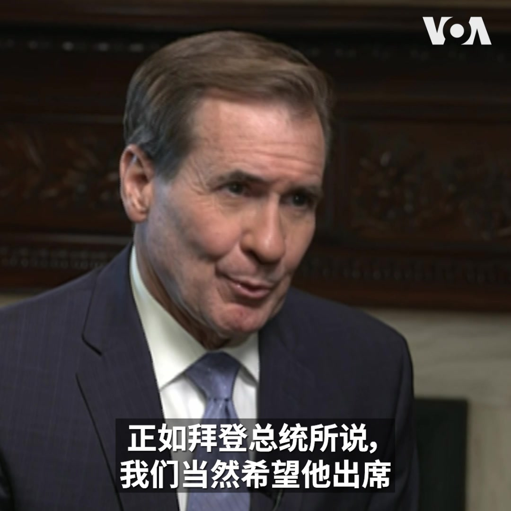

美国之音中文网 北京时间 2023-09-02T06:31:56Z 1697739090463228190 印尼首条高速铁路、由中国资助并协助建设的雅万高铁试营运再度延后，导致外界质疑声不绝于耳。观察人士表示，运营延迟凸显前置作业准备不足，也让印尼反对派对政府有所批评，而雅万高铁争议不断，恐将影响未来印尼与中国的合作。https://t.co/jw42KxdNpu https://t.co/fUNmfyyWRh   美国之音中文网 北京时间 2023-09-02T07:07:06Z 1697747941082226823 俄土总统将讨论恢复谷物协议；白宫注意到乌军过去三天在乌南前线取得进展 https://t.co/MyZl1oYblW   美国之音中文网 北京时间 2023-09-02T07:33:05Z 1697754479645585614 人权组织报告：一些旅游公司罔顾人权问题仍提供新疆旅游项目 https://t.co/LAId3uNrDo   美国之音中文网 北京时间 2023-09-02T08:04:04Z 1697762275774628206 监督机构：外国媒体被拒绝入境香港令人担忧 https://t.co/eToUH5lomW   美国之音中文网 北京时间 2023-09-02T08:18:32Z 1697765918817038453 最新民调显示多数台湾民众盼未来独立，这对2024总统大选有何意涵？ https://t.co/oLZ6Ub3LKb   美国之音中文网 北京时间 2023-09-02T08:30:00Z 1697768802904367562 【家事国事天下事，你有何见解】中国发布新的地图招致一连串周边国家的抗议或不满，其中包括友好国家俄罗斯和尼泊尔。为什么？中国外交部为此发出呼吁：希望有关方面客观理性看待。在中国当局也承认“外部环境复杂严峻”的大形势下，发布新地图一举使环境变得更为复杂严峻，这应算是怎样的理性和战略？ https://t.co/BNx6QRxgMy   美国之音中文网 北京时间 2023-09-02T09:00:04Z 1697776368367620521 VOA专访：白宫国安会发言人反驳中国新地图的“虚假海洋主张” https://t.co/n02T36Uo5M   美国之音中文网 北京时间 2023-09-02T00:45:27Z 1697651897665224891 “我们一直非常一致地反驳中华人民共和国这些虚假的海事主张”，白宫国安会战略沟通协调官约翰·科比9月1号在接受美国之音专访谈到中国刚刚发布的新地图时说。他表示，这是中国在印太地区恐吓邻国的胁迫行为。中国公布的新地图引发了台湾、印度、菲律宾、马来西亚、印度尼西亚等的抗议。 https://t.co/EQx202fi5w   美国之音中文网 北京时间 2023-09-02T00:58:33Z 1697655190814593137 应对外界对其侵权指控，中国组织一些国家驻联合国大使参访西藏 https://t.co/oefR4yg5aQ   美国之音中文网 北京时间 2023-09-02T03:17:03Z 1697690048450400542 【家事国事天下事，你有何见解】中国发布新的地图招致一连串周边国家的抗议或不满，其中包括友好国家俄罗斯和尼泊尔。为什么？中国外交部为此发出呼吁：希望有关方面客观理性看待。在中国当局也承认“外部环境复杂严峻”的大形势下，发布新地图一举使环境变得更为复杂严峻，这应算是怎样的理性和战略？ https://t.co/9tlJBQ1XAy   美国之音中文网 北京时间 2023-09-02T04:28:33Z 1697708041054150817 穆迪上调2023年美国经济增长预测，同时下调中国2024年增长预期 https://t.co/Hp9f75cwAu   美国之音中文网 北京时间 2023-09-02T04:56:32Z 1697715082812350483 芬兰降低对中国经济的依赖 https://t.co/DnMv6Y26OZ   美国之音中文网 北京时间 2023-09-02T05:09:02Z 1697718229853212906 #揭谎频道  日本开始排放核废水后，中国反日情绪升高。《环球时报》社论批评日本借此大做文章，用心阴险，对中国倒打一把。事实是，随着中国继续加强传播有关经处理的核废水的不实信息，日本学校被扔石块，日本企业被骚扰电话轰炸，在华日本公民的安全确实有理由令人担忧。 https://t.co/s9kK6NofNH   美国之音中文网 北京时间 2023-09-02T05:10:03Z 1697718483021349169 联合国人权办公室纪念新疆报告发表一周年，活动人士呼吁联合国采取更强有力的行动 https://t.co/DrGX3DaQHz   美国之音中文网 北京时间 2023-09-02T05:39:32Z 1697725904024379859 简析：中国经济为何放缓？有可能更糟吗? https://t.co/K73AfkfYbz   美国之音中文网 北京时间 2023-09-02T06:00:00Z 1697731055183356067 中国经济奇迹结束了，还是如中国驻美大使谢峰说的那样是“暂时性调整”？美国欧道明大学国际商学教授李少民说，中国经济确实出了很大问题,必须看到失业、房地产暴雷等基本事实。他表示，谢大使说中国增长率是5点几，但也有专家认为是负增长。 #大家谈完整版：https://t.co/HYiRCz4Fzz https://t.co/22zDSEy84K   美国之音中文网 北京时间 2023-09-02T06:09:03Z 1697733330614276295 雅万高铁试乘再延 中国基建还受印尼信任吗？ https://t.co/NltL6VVhst   美国之音中文网 北京时间 2023-09-02T00:27:04Z 1697647269376651290 新疆棉产品继续涌向美国，美国海关检测工作难度很大 https://t.co/uTYL2id2hO   美国之音中文网 北京时间 2023-09-02T00:52:04Z 1697653561495376260 中国海军快速扩张，专家:仍难威胁美军 https://t.co/ZJcRVhL7eo   美国之音中文网 北京时间 2023-09-02T02:15:06Z 1697674458583142908 尽管中国政府近来推出振兴经济和缓解房地产领域困境的一些措施，包括降低首次购房贷款利率等, 不过路透社在上海街头采访的一些民众表示对买房兴趣不大, 因为对他们来说买房依然很贵。分析人士认为今后几个月的房地产销售十分关键。 https://t.co/bACSqjYX8C   美国之音中文网 北京时间 2023-09-02T02:57:32Z 1697685134340915705 《环球时报》带头向大英博物馆追讨中国文物，引来中国网民高声唱和。文物收藏人士说，大英博物馆内的中国文物多属合法取得的收藏或捐赠品，就算真有战时的掠夺品，中国也不一定有权代表历代朝廷追讨。他们认为诉求“贻笑大方”，并呼吁中共自省曾毁坏文物、造成文化浩劫的劣迹。https://t.co/fsXStxedjy https://t.co/I7UXbjlDRN   美国之音中文网 北京时间 2023-09-02T03:05:36Z 1697687164400832516 到蒙古国报道教宗方济各访问的外国媒体与梵蒂冈代表团成员9月1日在距离乌兰巴托一小时车程的特勒吉国家公园欣赏了一场丰富多彩的蒙古文化表演，包括歌舞、摔跤等传统节目。教宗方济各1日抵达蒙古,  不他没有出席这场文化活动，而是在参加了机场的欢迎仪式后到住所休息。 https://t.co/4ZdKcHG1iu   美国之音中文网 北京时间 2023-09-02T03:44:33Z 1697696966808047811 危地马拉政权过渡风波未歇 盟友台湾处境尴尬 https://t.co/AjdRX4Icit   美国之音中文网 北京时间 2023-09-02T04:12:33Z 1697704016099369294 着眼中国 - 印度与斯里兰卡加强军事交往 https://t.co/XuACngTKD6   美国之音中文网 北京时间 2023-09-02T00:03:35Z 1697641358658613666 “我们当然希望他出席，这是一个重要的论坛，”白宫国安会战略沟通协调官约翰·科比(John Kirby)9月1号接受美国之音专访谈到中国国家主席习近平可能不出席在印度新德里举办的二十国集团峰会时表示。他希望中国利用这次峰会，推动20国集团成为改善全球经济合作的论坛。 https://t.co/OWvKIEgGql   美国之音中文网 北京时间 2023-09-02T00:12:02Z 1697643487905435877 民调指近7成年青人对香港前途没信心 评论：反映政府不能取信于民 https://t.co/7nGwTkRsUx   