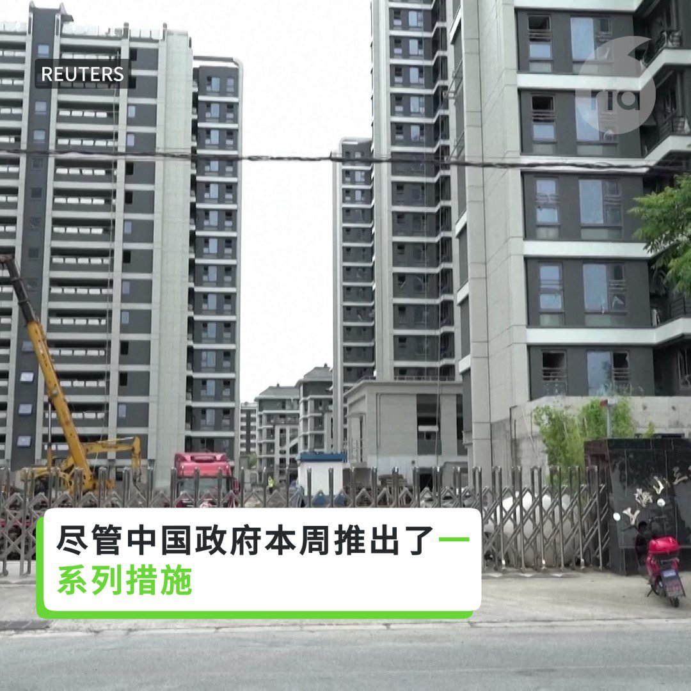

自由亚洲电台 北京时间 2023-09-02T00:25:34Z 1697646893969420388 有学者认为，习近平可能是因为支持俄罗斯而深怕在国际场合遭到孤立，损伤面子。
有学者说中国在金砖角色已弱化，G20是美国主场，习觉得没必要去。
另有分析认为，与中国政府最近发布2023年版标准地图有关...
https://t.co/EWy4YV9s4q
您怎么看？   自由亚洲电台 北京时间 2023-09-02T02:59:59Z 1697685750924578960 【政府密集出台措施 中国百姓买不买房？】
中国政府本周推出一系列措施应对房地产危机，但民众仍表示对买房兴趣不大。 https://t.co/y0MAs258Ij   自由亚洲电台 北京时间 2023-09-02T03:18:13Z 1697690341439164847 四年前的8月31日，大批港警冲进 #太子地铁站"无差别袭击"香港市民，成为2019年 #反送中运动 中让港人愤怒的重要事件之一。事隔四年，当事件真相仍未水落石出、香港的民间纪念活动被禁绝，海外港人则拒绝遗忘。英国至少六座城市的港人发起纪念活动，继续追寻真相。
#831事件
https://t.co/x3GBzXyfn5   自由亚洲电台 北京时间 2023-09-02T03:24:39Z 1697691961463804090 本周五，中国人民银行宣布将下调金融机构外汇存款准备金率后，#人民币兑美元汇率 出现上涨。但这一举动能否扭转人民币持续贬值的态势呢？

https://t.co/QxO0H7evIO   自由亚洲电台 北京时间 2023-09-02T03:27:02Z 1697692559257333986 在美国加州洛杉矶和湾区两地，当地的香港人于8月31日入夜时分集会，悼念四年前发生的香港 #831事件。

 https://t.co/6wP9Ap9ZJo   自由亚洲电台 北京时间 2023-09-02T03:33:18Z 1697694137330569402 2019年香港发生的 #831事件 四周年，加拿大多个城市发起纪念活动，希望海外香港人"如水再聚，莫失莫忘"。尽管已过四年，不少港人仍记忆犹新，一谈起就哽咽落泪。港人组织也积极呼吁民众签名支持加速 #外国代理人注册立法 的请愿活动。

 https://t.co/Zysds6KcRK   自由亚洲电台 北京时间 2023-09-02T03:34:46Z 1697694504533496297 多国驻日内瓦代表目前已收到中方邀请出访 #西藏，而参与此行的国家代表大多来是中国的盟友。外界推估，北京此举是有意为 #西藏人权 问题洗白。今年8月，联合国专家针对西藏人权议题表达担忧，并要求北京当局提供9名西藏人权捍卫者被监禁的具体原因。 https://t.co/dZMpFN3mLN   自由亚洲电台 北京时间 2023-09-02T03:55:35Z 1697699744574038371 据路透社报道，美国国土安全部今年5月对美国的鞋类和服装进行了测试，发现约27%的样品与已经被禁止进口的中国 #新疆棉 花存在关联。美国政府此前出于对强迫劳工的担忧而禁止了进口新疆地区的棉花。
 https://t.co/Yw3BH5mdAb   自由亚洲电台 北京时间 2023-09-02T04:12:58Z 1697704118226477298 【#您怎么看】
8月31日，中国科学院和中国工程院公布1238名“2023年院士增选有效候选人”名单，武汉病毒研究所的病毒专家石正丽入围。石正丽的推荐人正是武毒所80后所长王延轶的丈夫舒红兵。
新冠病毒至今无法溯源，“蝙蝠女王”获提名院士候选人，网络炸翻，您怎么看？ https://t.co/F2oPvbf9ki   