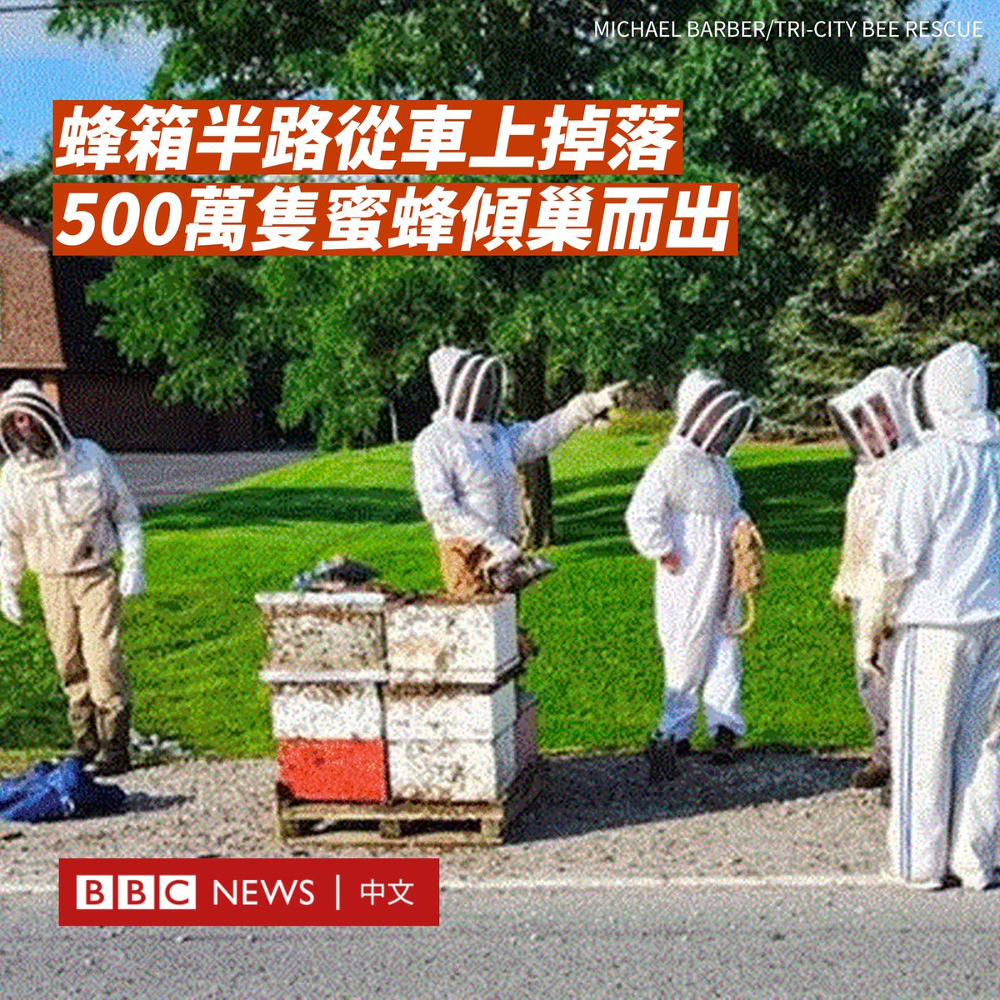

D英国广播公司BBC 北京时间 2023-09-01T12:25:07Z 1697465585591067040 美国拜登政府在一般用于援助主权独立国家的“对外军事融资”（Foreign Military Financing）计划下，首次批准向台湾转让一笔8000万美元的军事装备。
 
国务院在周三（8月30日）通知国会此次计划，称这些装备将“用于通过联合和综合防卫能力、强化海域态势感知和海上安全能力，加强台湾的自卫能力。”

台湾国防部对此表示感谢，但对援助细节不予置评，并指出美国已依据现有政策和法律下帮助加强台湾的作战能力。

中国外交部发言人汪文斌指，此次计划“严重违反一个中国原则和中美三个联合公报特别是‘八·一七公报’的规定，严重违反国际法和国际关系基本准则。”

“对外军事融资”是美国国务院管理的最大规模的军援项目，主要是根据“外国军售”计划向外国政府提供赠款援助，用于购买美国国防装备和军事训练。
 
美联社报道称，此次8000万的规模并不算大，仅占国会已批准20亿美元资金的一小部分。但利用“对外军事融资”的字眼预计会引发中国不满。
 
美国唯一另一次以“对外军事融资”方式提供一个非国家对象的例子是非洲联盟。美国官员表示，向台湾提供该援助并不代表政策上的变化。

据报道，可涵盖的军援可能包括：防空和海岸防御系统、装甲车、步兵战车、无人机、导弹以及通信设备等。

北京曾多次批评华盛顿对台湾的军事援助或军售。中国国防部表示，美国必须“停止一切形式的美台军事勾结”。

作为台湾最重要的武器供应国，美国上个月宣布向台湾提供一项价值高达3.45亿美元的军事援助。   D英国广播公司BBC 北京时间 2023-09-01T13:56:48Z 1697488658528665952 在加拿大安大略省伯灵顿，一辆卡车在运送蜜蜂到它们的冬季栖息地途中，用来固定蜜蜂箱的带子松了，导致蜂箱滑落，五百万只蜜蜂倾巢而出。

警方求助当地蜂农迈克尔·巴伯（Michael Barber），他称自己看到了“相当疯狂的蜜蜂云”，这些蜜蜂“非常愤怒、困惑和无家可归”。

事故发生前，蜂箱被放置在卡车的车尾。

在大量蜜蜂飞出后，它们沿路满天飞舞。当局通知司机们要在驾车时关上车窗，行人要远离该区域。

巴伯说，蜜蜂和蜂箱散落在直径400米的范围内。一些年幼的蜜蜂聚集在附近的汽车和邮筒上。

巴伯接到警方的电话后，就向其他蜂农发出呼吁，最终有大约有十几名蜂农前来帮助围捕这些蜜蜂。

“我的卡车前面可能有一千只蜜蜂。”巴伯说。

几个小时后，大多数蜜蜂都找到了自己的蜂巢，但也有几百只蜜蜂在事故中死亡。

一些蜂农也被蜇伤。卡车司机因为没有穿养蜂服而被蜇了100多下，不过救护人员就在附近，他的伤势并不严重。   D英国广播公司BBC 北京时间 2023-09-01T10:06:13Z 1697430629682458928 中国过去的惊人增长由基建所推动，从道路、桥梁、火车线到机场和楼房，无所不包，但一些经济学家认为，随着基建的饱和，中国需要另辟为民众创造繁荣的方式。

虽然西方经济体倾向于通过消费拉动经济，北京却认为消费主义是一种浪费。习近平想要增长，但不是为了增长而增长。https://t.co/6x7schYZVC   