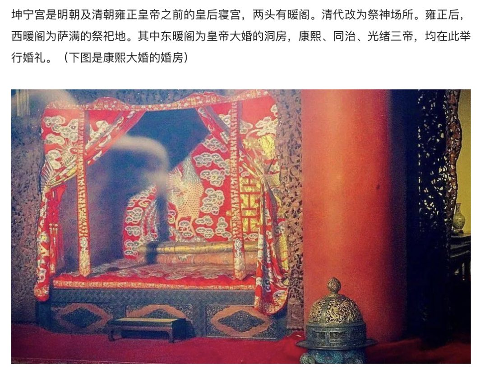
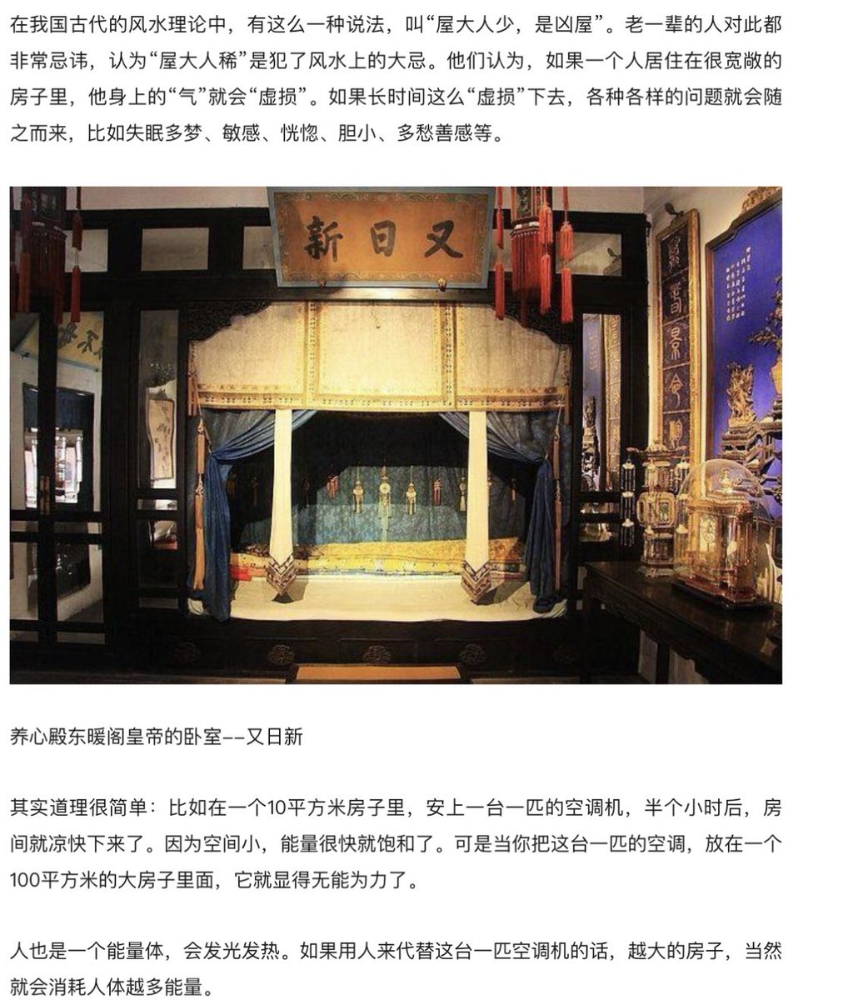

Petrichor 北京时间 2023-09-01T09:34:11Z 1697422568171381062 据澳洲广播公司报道，Vincenzo Badalati、Constantine Hindi和Philip Sansom三人是澳大利亚Hurstville市议会议员。这3人在收受了中国开发商的现金和礼物后，为相关地产开发项目的获批提供便利。开发商邀请他们去中国旅游，有时他们一年去几次，每次通常待一星期左右。旅行记录显示，他们有时一起去，有时单独去。其中两人在中国期间还有“年轻女性伴游”的陪同。中国式腐败走向世界，毒害全球。   Petrichor 北京时间 2023-09-01T10:30:40Z 1697436782797709505 中日核辐射数据比较。结论，你们自己下。 https://t.co/uX2WgSza1A   Petrichor 北京时间 2023-09-01T11:10:17Z 1697446751085486566 房子卖不出去了，中科院专家出来讲话了，说住小房子，人的寿命会减少一半。他们鼓励人们去买大房子。
可是去北京的故宫看一看皇帝的寝宫是怎样的。当我们走进故宫的养心斋和雍正皇帝的书房和书房后面的卧室时，我们会吃惊地发现，皇帝住的地方并不比平民百姓的大多少，也不过十几平方米而已。那张“龙床”也不比百姓的大，而且在睡觉的时候，床前还要放下两道帘子，那么空间就变得更加狭小，大概就是10个平方米。风水中常说，房子会吸引人气。人体散发出来的能量，就是我们所说的人气。当一个人用了那么多的能量去填充一个大房子的空间时，就会对身体有所损害。   Petrichor 北京时间 2023-09-01T10:08:04Z 1697431096433037644 坏事了，搬起石头，没有砸到别人，倒狠狠地砸到自己脚了，傻不傻？ https://t.co/W1TIBKJcjG   Petrichor 北京时间 2023-09-01T07:53:11Z 1697397150462722252 宣传人员的工作任务，总结起来就是给民众洗脑。 https://t.co/d9tEZ8F8Yq   Petrichor 北京时间 2023-09-01T08:00:42Z 1697399040961319233 9月1日《科学》发表一篇论文说：在距今93万年前，人类祖先由于早、中更新世过渡期的气候剧烈变化，在短期内丧失了约98.7%的群体成员，导致人类几乎灭绝。在此后长达11.7万年的时间里，地球上人类平均成年个体数仅为1280。幸运的是，人类终于熬过来了。   Petrichor 北京时间 2023-09-01T00:01:27Z 1697278436283215997 我朋友说，她为这家投资公司担心，不要45集没有拍完，烂尾了。 https://t.co/jDEOXpaXI9   Petrichor 北京时间 2023-09-01T00:08:20Z 1697280168094507032 估计月儿这家会被警察逮捕，销赃和泄露国家秘密罪，判上15徒刑。 https://t.co/8J4dGKkWYJ   