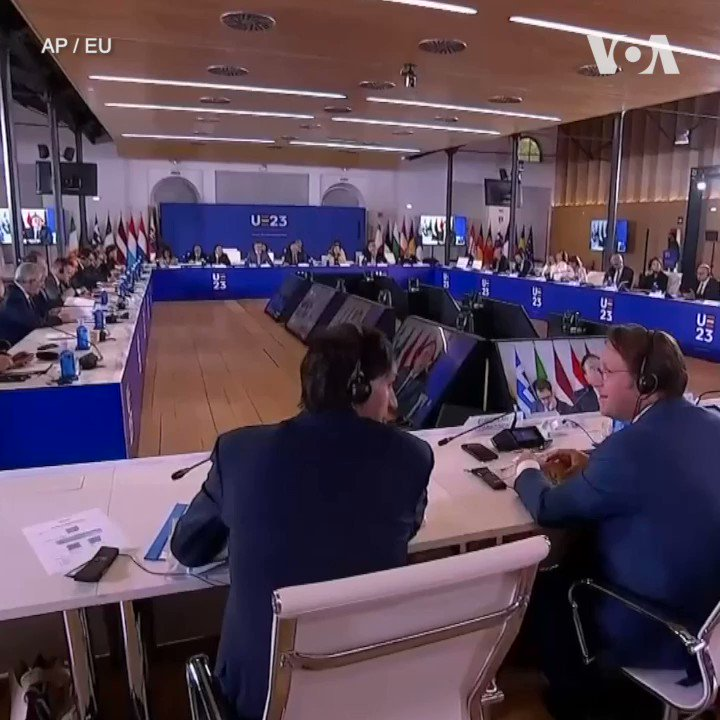

美国之音中文网 北京时间 2023-09-01T07:54:04Z 1697397372186468484 联合国秘书长向俄罗斯提出新的谷物协议方案 https://t.co/G447CXhsMx   美国之音中文网 北京时间 2023-09-01T08:05:00Z 1697400123691569160 【家事国事天下事，你有何见解】批评者说，在延续三年的严酷疫情清零后，在失业率高到不可示人的形势下，习近平当局拒绝给民众发放纾困金，理由是不要使中国变成福利主义国家；但习近平却持续成百亿美元对外“大撒币”。当局是否自认为，即使无视民众困苦，中共政权安全也有保障？高度制度自信？ https://t.co/D7Eu5CSPoj   美国之音中文网 北京时间 2023-09-01T08:40:45Z 1697409120385507756 “我很高兴看到中华人民共和国愿意从沟通的角度进行接触，以便我们能够保持这些渠道的开放，"五角大楼新闻秘书莱德准将8月31日在例行记者会上针对中国军方有关双方通过军事外交渠道“保持着坦诚有效的沟通”的说法时表示。他说，美国印太司令部司令最近在一次区域防长会议上与中国官员举行了会晤。 https://t.co/NA2hzASgtP   美国之音中文网 北京时间 2023-09-01T09:10:33Z 1697416620011143641 专家警告：“金砖”扩容的同时公民空间将缩小 https://t.co/Ed6IKLWnaL   美国之音中文网 北京时间 2023-09-01T04:26:05Z 1697345033643622675 特朗普对佐治亚州干扰选举案表示不认罪 https://t.co/o8UvRM12Lx   美国之音中文网 北京时间 2023-09-01T04:26:07Z 1697345041214382386 北卡校园枪击事件后，中国留学生关切校园安全和留学政策 https://t.co/lrPO0TWs6L   美国之音中文网 北京时间 2023-09-01T04:42:33Z 1697349178169704565 拒绝回答“两百斤麦子重吗”，百度“文心一言”带着重重审查登场 https://t.co/R6N14GYPOG   美国之音中文网 北京时间 2023-09-01T05:27:05Z 1697360382661419136 “有腐必惩”：中国国防部在火箭军易帅后首提军内高层反腐调查 https://t.co/e0p2frkxg5   美国之音中文网 北京时间 2023-09-01T05:44:02Z 1697364647735963871 教宗方济各访问蒙古 更渴望访问中国 https://t.co/tnakuwk2V5   美国之音中文网 北京时间 2023-09-01T06:15:10Z 1697372484557807958 中国科技巨头百度当8月31日正式向公众发布了自行研发的生成式人工智能聊天机器人“文心一言”。美国之音的测试发现，这款希望能与ChatGPT竞争的大型语言模型带有重重审查，极力避免回答涉及敏感话题的问题。在一些情况下，“文心一言”会自动结束对话，并建议使用者输入别的问题。https://t.co/7nSRcucKSW https://t.co/zrNdzUbXnH   美国之音中文网 北京时间 2023-09-01T02:43:35Z 1697319236098732352 港府禁日本十都县海产进口 有日本餐厅指影响不大 民主党吁勿扩大禁令 https://t.co/ZDD0wSROgj   美国之音中文网 北京时间 2023-09-01T02:44:06Z 1697319366474260686 罗马天主教教宗方济各31日启程前往蒙古访问。 https://t.co/eT2uDPK7y2   美国之音中文网 北京时间 2023-09-01T02:46:19Z 1697319926418083955 台湾第一个以女性为主体的政党“小民参政欧巴桑联盟(小欧盟)”8月31日正式成军，并召开记者会宣示投入2024年初的立法委员选战。对于目前台面上，投入台湾总统大选的候选人，小欧盟的多位成员说，4位男性候选人的性别意识都不及格的。报导: https://t.co/AEljKWiJQD https://t.co/ZPLsguHVsk   美国之音中文网 北京时间 2023-09-01T03:10:03Z 1697325897462984745 捷克国家银行清空所有人民币债券 原因是台海局势紧张? https://t.co/UmlPN2dZ8O   美国之音中文网 北京时间 2023-09-01T03:37:23Z 1697332776922468427 英国首相里希·苏纳克8月30日为其对华政策进行辩护。他说，英国可以在捍卫自身价值观和利益的同时与中国保持接触。英国外交大臣克莱弗利正在中国进行访问，寻求修复两国的紧张关系。苏纳克的对华政策面临来自保守党内部的批评和质疑。 https://t.co/zIRWR0IGQg   美国之音中文网 北京时间 2023-09-01T03:41:03Z 1697333701095612919 世界媒体看中国: 异的民间跨国抗议 https://t.co/1MqtjpK7Zf   美国之音中文网 北京时间 2023-09-01T04:10:03Z 1697340998899421366 中国经济“双底衰退”难脱困境 但对美国影响有限 https://t.co/NjqM7ZRtAY   美国之音中文网 北京时间 2023-09-01T00:58:02Z 1697292675098226792 中国国防部：中美两军交往并非处于中断状态 https://t.co/cddiBmQGKJ   美国之音中文网 北京时间 2023-09-01T01:04:26Z 1697294286922903929 【家事国事天下事，你有何见解】批评者说，在延续三年的严酷疫情清零后，在失业率高到不可示人的形势下，习近平当局拒绝给民众发放纾困金，理由是不要使中国变成福利主义国家；但习近平却持续成百亿美元对外“大撒币”。当局是否自认为，即使无视民众困苦，中共政权安全也有保障？高度制度自信？ https://t.co/FocOLIrQ83   美国之音中文网 北京时间 2023-09-01T01:14:03Z 1697296707397235105 美国印尼开始“超级嘉鲁达之盾”军演，十九国参与展示决心捍卫南中国海稳定 https://t.co/1ZAWm2fn3R   美国之音中文网 北京时间 2023-09-01T01:31:26Z 1697301080508441012 乌克兰与英国国防公司贝宜系统 BAE systems31日在基辅签署武器的生产的协议。 乌克兰总统府说，乌克兰军队已经在使用贝宜系统生产的一些武器，包括L119和M777榴弹炮。泽连斯基总统在社媒上说“帮助我们的勇士们保护乌克兰的最好的武器应该在乌克兰制造。我们的当务之急是发展我们自己的武器生产”。 https://t.co/DZ5wK0ZbWq   美国之音中文网 北京时间 2023-09-01T01:50:33Z 1697305891144413347 罗马天主教教宗方济各31日启程前往蒙古访问。这是教宗首次访问亚洲国家。 https://t.co/Xl7AVN5iJZ   美国之音中文网 北京时间 2023-09-01T01:59:42Z 1697308192718426185 正在西班牙出席欧盟国家外长非正式会议的乌克兰外长德米特洛·库列巴8月31日呼吁西方国家向乌克兰提供更多援助。库列巴还说，欧盟应该对俄罗斯施加更多出口限制，以削弱俄罗斯的武器生产能力。 https://t.co/1k5ouDG46a   