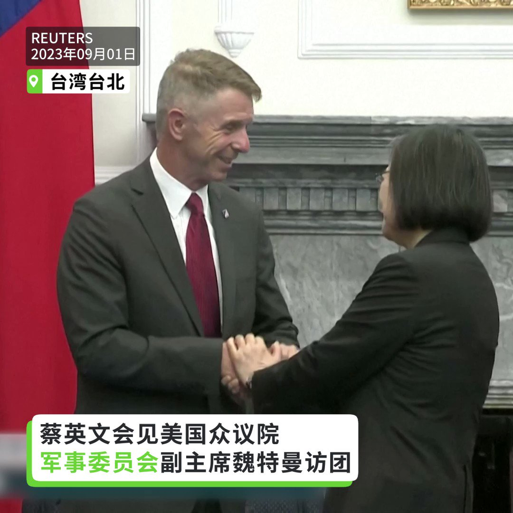
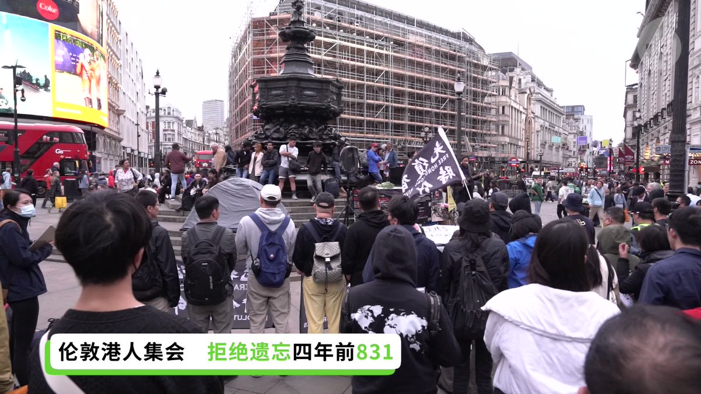
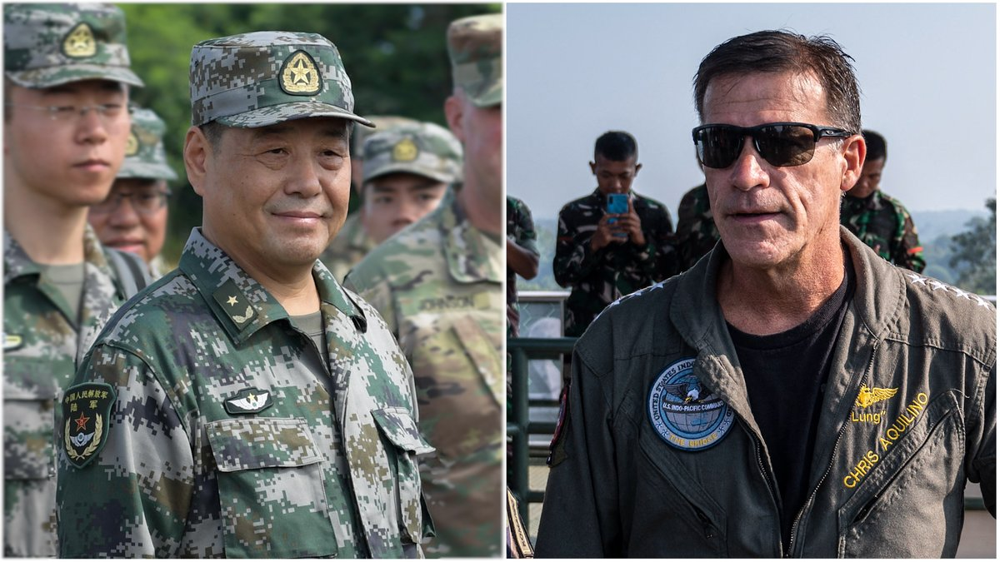
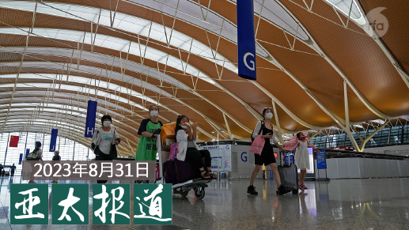
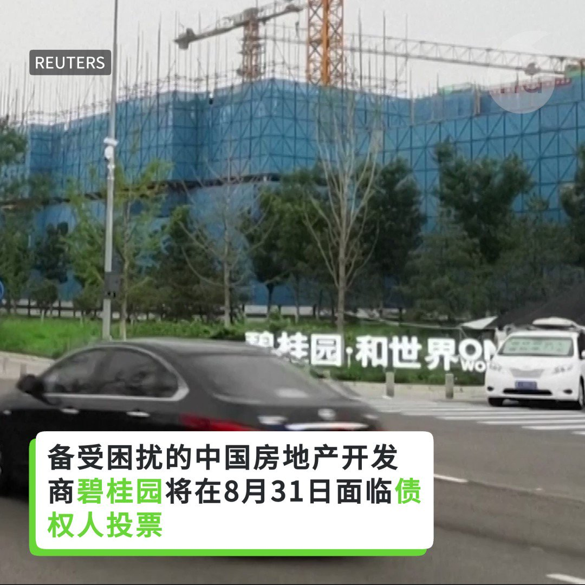

自由亚洲电台 北京时间 2023-09-01T23:21:31Z 1697630771966882215 在习近平提出强化中华民族共同性、增强 #中华民族共同体意识 之际，内蒙古当局要求有关单位暂停发行获奖图书《#蒙古族通史》，并尽快下架。有学者表示，该书符合官方论调却仍遭下架，相信当局有意向少数民族干部或知识分子发出警告。

 https://t.co/5pYrZzX34J   自由亚洲电台 北京时间 2023-09-01T21:21:58Z 1697600688241434918 RT @RFA_Chinese: 【#您怎么看】
据路透社8月31日引述印度和中国的知情人士透露，中国国家主席习近平可能缺席下周在印度举行的20国集团领导人峰会。您认为，习近平为何很少出国访问？ https://t.co/6JL1K9CzQp   自由亚洲电台 北京时间 2023-09-01T21:37:29Z 1697604592719028607 RT @RFA_Chinese: 【三大敏感问题 中国国防部发言人这样答】 https://t.co/bYrdYlQIq0   自由亚洲电台 北京时间 2023-09-01T22:10:26Z 1697612883314507892 评论 | #余杰：全世界最伟大的作家原来是 #习近平
 https://t.co/cJpH0uXusq   自由亚洲电台 北京时间 2023-09-01T19:17:31Z 1697569370225209663 【蔡英文会见美国众院军委会副主席】
【魏特曼：美国会 #坚决回应 对台攻击】
在台湾，总统 #蔡英文 今天接见美国联邦众议员军事委员会副主席 #魏特曼（Rob Wittman）。蔡英文指出，当前面对 #威权主义 扩张，民主伙伴的团结合作更加重要，期待能与美国及更多民主伙伴一起守护 #区域稳定与繁荣。魏特曼表示，如果有任何对台湾发动无端的武力攻击，美国一定会坚决地予以回应。众议院也会致力完成对台湾的 #军售 交付。   自由亚洲电台 北京时间 2023-09-01T17:40:05Z 1697544846997868833 【港人伦敦集会悼8.31四周年】
【高唱《愿荣光归香港》】
“ #831事件”4周年，海外港人仍坚持集会悼念，英国至少6座城市的离散港人发起纪念活动。而在伦敦，有逾百名港人参加集会，抗议港警滥暴，并悼念“8.31事件”。
除了伦敦，英国其他至少5座城市都有纪念活动，包括爱丁堡、伯明翰、曼城等，悼念“8.31事件”，亦希望继续寻求真相。
（记者：董舒悦 / 摄影：石头 / 剪接：江复）

#831四周年
#太子站
#愿荣光归香港   自由亚洲电台 北京时间 2023-09-01T13:29:35Z 1697481807820906726 【美印太司令与解放军上将会面】
【分析：两军事将领会面有助缓和关系】
美国印太司令约翰·阿奎利诺与中国中央军委联合参谋部副参谋长徐起零，近期在太平洋岛国斐济会晤。美中两国国防部发言人周四同时公开证实了上述会面，但未提到会面内容。学者分析，这对缓和中美两国军事关系，避免军事冲突有正面作用。此举预示两国军事关系可能解冻? 详细报道：https://t.co/Hx61dONyIF   自由亚洲电台 北京时间 2023-09-01T07:00:10Z 1697383807467552886 【#亚太报道（2023-8-31）】
欢迎收听和订阅播客【亚太报道】 https://t.co/MjLNSvVMqc
#中国航空公司 上半年亏损严重/#中国制造业 未摆脱经济收缩/美国学界不看好中国经济/#石正丽 名列中国科学院院士候选人/中国政府出手钳制 #聊天机器人 https://t.co/X7hZnpl90X   自由亚洲电台 北京时间 2023-09-01T08:15:57Z 1697402878800101687 #事实快查：日本 #福岛核处理水排海 的五个问题
 https://t.co/88zEldDiYM   自由亚洲电台 北京时间 2023-09-01T04:41:06Z 1697348812099207506 8月31日 "#文心一言"、"#商量" 等四款聊天机器人正式向中国公众开放。但很快传来消息，在向这些机器人提出政治敏感话题时，聊天就会被迫中止。中国政府的钳制手段是如何伸进聊天机器人的？这种限制对人工智能技术的发展又会带来怎样的影响？记者王允 @Jeff23Wang 报道

 https://t.co/cvMCOFsIf2   自由亚洲电台 北京时间 2023-09-01T05:02:28Z 1697354189289259036 【#碧桂园 面临关键考验】
8月31日，中国房地产开发商 #碧桂园 在岸债券持有人投票决定是否延期。 https://t.co/b6ZN4onyZU   自由亚洲电台 北京时间 2023-09-01T05:30:01Z 1697361121802686655 近期，中国经济的不景气引发国际社会关注，外界担忧，如今的现状将会是中国经济节节败退的开端。而在新冠疫情后，#中国经济 究竟能否复甦至疫情冲击前的水平？本周四，美国学界就此进行了讨论。

 https://t.co/qY7iMN1haV   自由亚洲电台 北京时间 2023-09-01T05:41:54Z 1697364111640633367 【#您怎么看】
据路透社8月31日引述印度和中国的知情人士透露，中国国家主席习近平可能缺席下周在印度举行的20国集团领导人峰会。您认为，习近平为何很少出国访问？ https://t.co/6JL1K9CzQp   自由亚洲电台 北京时间 2023-09-01T06:00:07Z 1697368694899560708 一则据传被中国禁播的纪录片《#我家住在烂尾楼》近期在油管热播。48小时即有近百万次点阅。 https://t.co/qJE6WVw23V   自由亚洲电台 北京时间 2023-09-01T02:29:02Z 1697315573833560337 【#您怎么看】
近日，纽约时报发文说，中国经济“僵尸化”，“正面临着通货紧缩和可能的经济衰退，背负着巨额债务，生产力停滞不前，青年失业率超过20%。外国投资正在锐减，增长预测正在下调，人们期待已久的大流行后的复苏未能实现。”
8月30日，中国驻美国大使谢锋则在《华盛顿邮报》发表题为《中国经济发展比你想象的更好》的署名文章，称“越来越多的美国朋友也认识到，中国经济崩溃而美国依然繁荣的想法纯属天方夜谭。”
您赞成谁的观点？您对于中国经济的未来怎么看？   自由亚洲电台 北京时间 2023-09-01T03:09:00Z 1697325632089371028 近日，加拿大环境部长吉尔博(Steven Guilbeault)因在中国环境与发展国际合作委员会年度会议上不但没有批评 #中国燃煤碳排 暴增的问题，反而批评加拿大石油企业而引发诸多争议。
有专家指出，加拿大持续注资中方国合会的举动，是协助中国做了虚伪的绿色形象宣传。

 https://t.co/wSGG82OEcZ   自由亚洲电台 北京时间 2023-09-01T03:33:32Z 1697331805689622600 【三大敏感问题 中国国防部发言人这样答】 https://t.co/bYrdYlQIq0   自由亚洲电台 北京时间 2023-09-01T04:00:19Z 1697338548968661214 专栏 | #军事无禁区：#美台协防－立足于现有技术
 https://t.co/Bz3dpKFjJW   自由亚洲电台 北京时间 2023-09-01T00:31:12Z 1697285921744605655 关注张展！#张展 只剩被捕前一半体重

 https://t.co/yh7QdBj4Iw   自由亚洲电台 北京时间 2023-09-01T01:25:28Z 1697299576691241092 在病毒溯源未厘清前，提名 #石正丽 获选院士候选人，陈秀熙直言很奇怪：“中国现在要用个人角度来看这些对 #新冠肺炎、新兴传染病，生物科技上可找到后面基因序列定位和遗传演化种之间的相关成就，可是人类为了新冠肺炎付出多少代价？我觉得不该是这样衡量科学家的成就。” https://t.co/uCAxILU2uK   自由亚洲电台 北京时间 2023-09-01T01:57:52Z 1697307730590183896 美国拜登政府8月29日通报国会，拟援助台湾八千万美元 #外国军事融资(FMF)，这是美国首度提供台湾军事融资贷款。台湾的总统府周四回应，感谢美国政府持续依据《台湾关系法》及"六项保证"，落实对 #台湾 的安全承诺。

 https://t.co/XxA7ZzOLdy   自由亚洲电台 北京时间 2023-09-01T02:19:21Z 1697313140713861351 8月31日是 #联合国人权高专办公室 发表 #新疆人权问题报告 一周年。国际人权组织国际特赦当天发表一份声明，批评国际社会针对中国侵犯人权采取的反应行动“严重不足”，并指出，通过联合国人权理事会启动针对新疆境内侵犯人权行为的国际调查已刻不容缓。
 https://t.co/R8qTA13KRo   