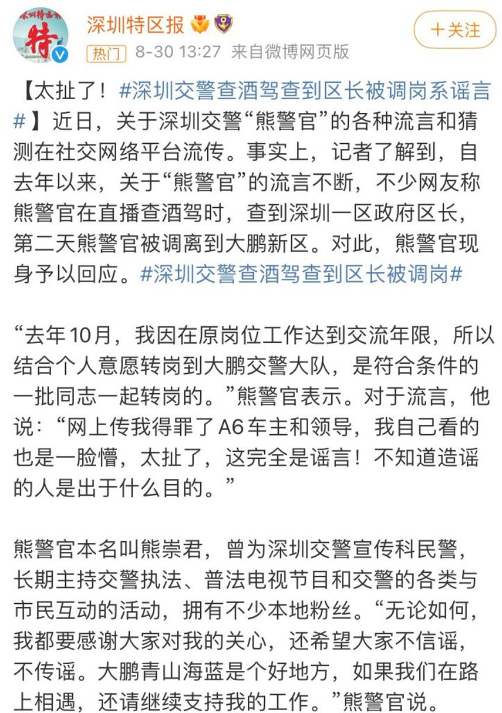
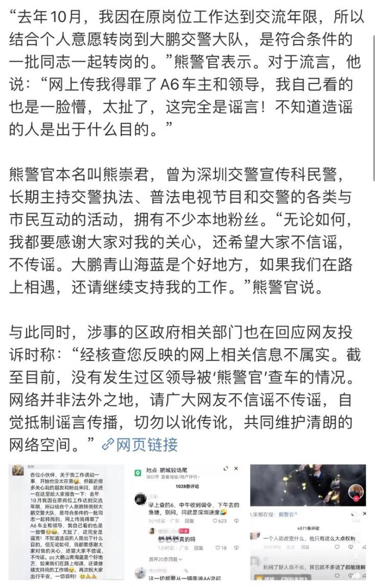
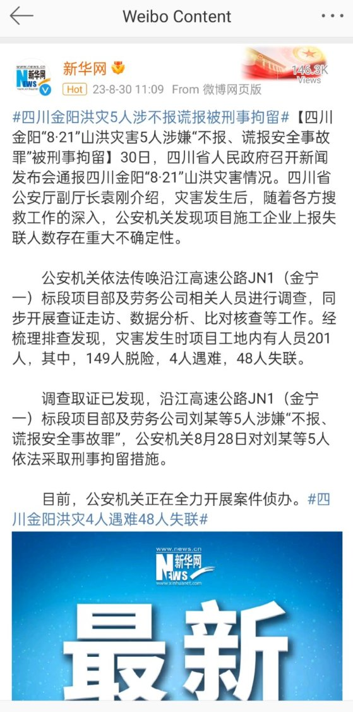

A李老师不是你老师 北京时间 2023-08-31T02:29:44Z 1696953365580657069 网友投稿
在台北市长蒋万安访问大陆的视频下方
网友表现出热切欢迎 https://t.co/rA45NRwV68   A李老师不是你老师 北京时间 2023-08-31T04:11:46Z 1696979042681921649 近日，深受网民喜爱的深圳网红交警“熊警官”被传因得罪领导而被调职到大鹏新区。
8月30日，熊警官辟谣称自己系正常转岗，传言“”太扯“。
有意思的是，熊警官被调离后，“深圳交警”官方微博也不再支持网友举报，甚至会打电话给举报者要求其删除视频。 https://t.co/SCaiVdgoso   A李老师不是你老师 北京时间 2023-08-31T00:28:58Z 1696922972026552492 8月21日四川金阳发生山洪，沿江高速公路JN1段项目工地发生险情造成4人遇难，48人失联。
项目部及劳务公司刘某等5人涉嫌“不报、谎报安全事故罪”被刑事拘留。 https://t.co/srQW8RzaU0   