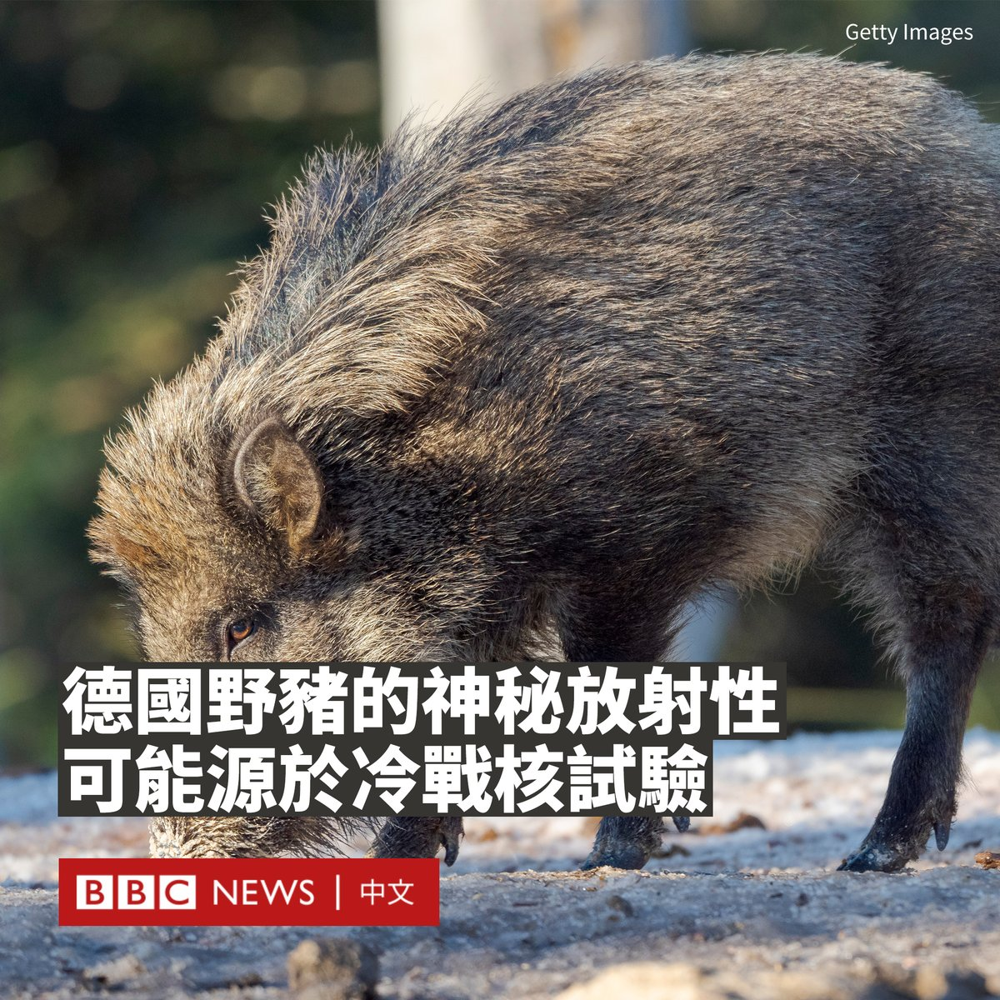
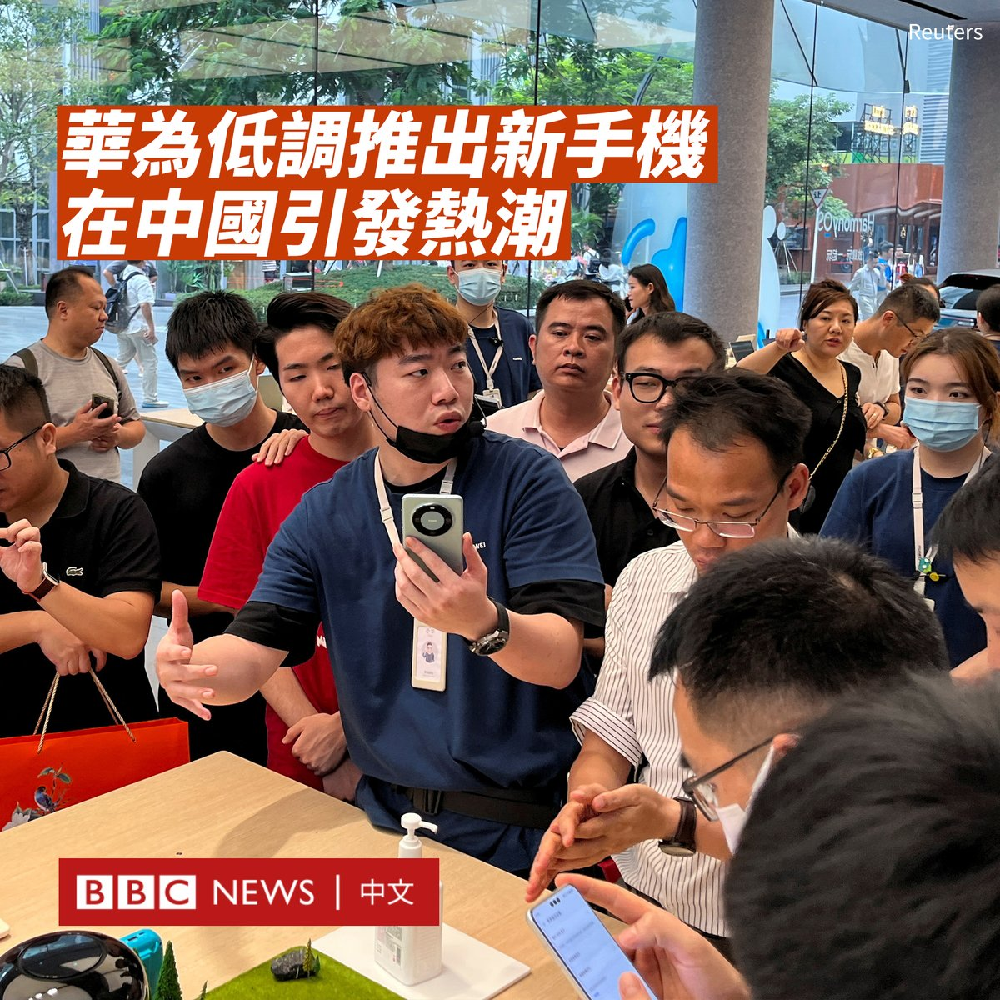
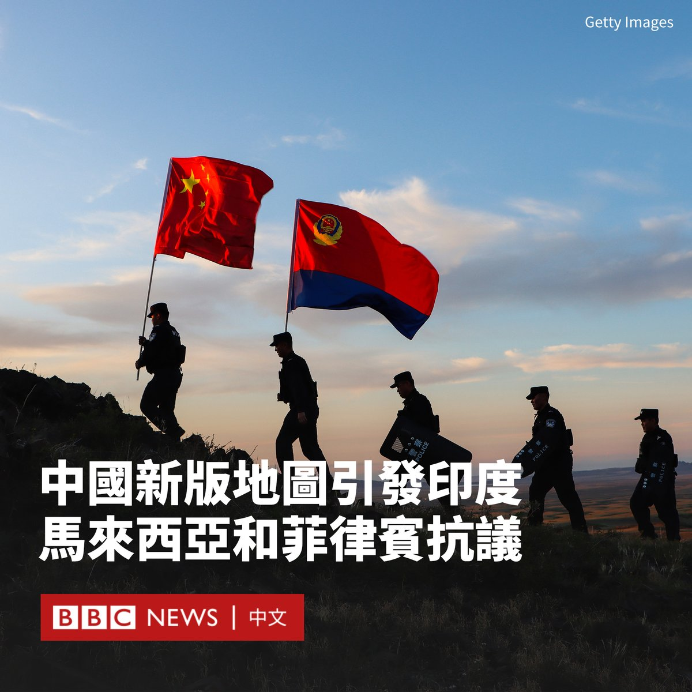
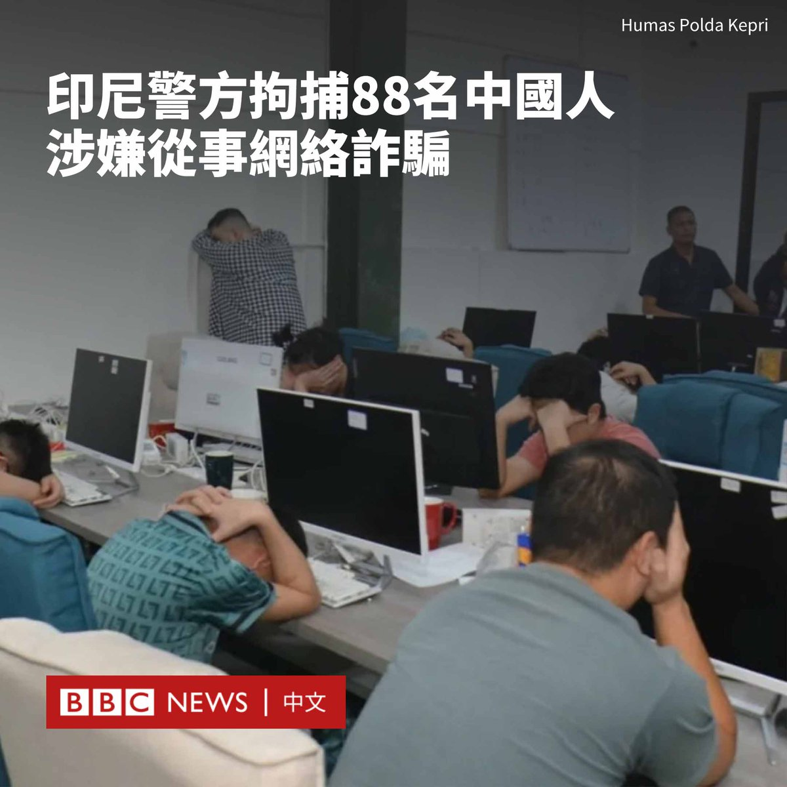
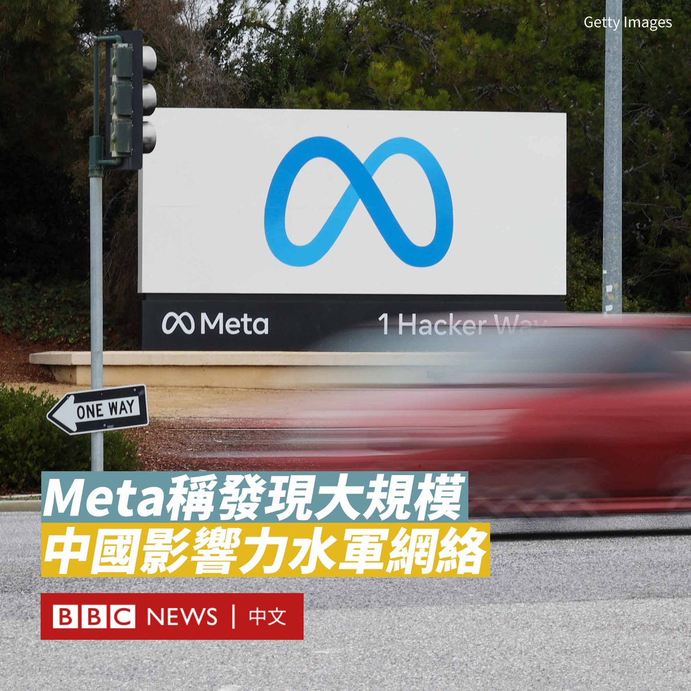

D英国广播公司BBC 北京时间 2023-08-31T21:55:30Z 1697246737696805294 8月27日到30日，美国商务部长雷蒙多（Gina Raimondo）访问中国，为七年来首位访华的美国商务部长。也是继国务卿布林肯、财长耶伦，以及总统气候问题特使克里后， 又一位近期访华的美国高官。雷蒙多访华释放的信号可以总结为：示好，担忧和不妥协。
https://t.co/4X9AeyjW4t   D英国广播公司BBC 北京时间 2023-08-31T18:19:43Z 1697192435288547336 一项新的学术研究指，冷战期间的核武器试验是造成德国东南部地区野猪体内放射性水平较高的主要原因。
 
该地区野猪体内一直有着强放射性，以至于被警告禁止食用，一些猜测曾将原因完全归咎于1986年的切尔诺贝利核灾。

然而，随着时间流逝，其他野生动物的放射性水平有所下降。因此，许多人想知道为什么野猪的污染水平仍然如此之高。

新的研究得出结论，1960年代早期的核武器试验是另一个重要原因，在大气层中引爆原子弹带来的放射性尘埃造成了这一结果。
 
在对德国巴伐利亚州的48只野猪的肉质进行检测后，维也纳工业大学和汉诺威莱布尼茨大学的科学家们发现，冷战时期的核弹爆炸仍在影响着该地区的土壤。

冷战期间，美国、苏联、法国等国引爆了2000多枚核弹，其中500枚在大气中爆炸，释放出的放射性粒子随后飘回地面。
 
科学家在《环境科学与技术》（Environmental Science and Technology）杂志上写道，核试验产生的放射性铯已经随着降雨渗入地下，并污染了野猪喜爱的鹿松露（一种真菌），饥饿的野猪会挖掘土壤找到它们。
 
虽然核试验与核反应堆都可能产生铯，但科学家们根据铯的两种同位素铯-135与铯-137的比例得以对放射性来源进行追溯。

研究报告称，野猪的持续污染威胁着巴伐利亚森林本身：由于野猪无法食用，它们的数量正在以不可持续的方式增长。   D英国广播公司BBC 北京时间 2023-08-31T20:03:59Z 1697218674103660577 华为出人意料地推出了一款高端智能手机，这在中国互联网引发关注，并激发了人们对这家中国科技巨头能否突破美国技术封锁的讨论。

新推出的“Mate 60 Pro”本周在网上商城低调上架。这款价值6999元人民币（约960美元）手机的发售没有提前通知，也没有进行广告营销。

自2019年以来，美国一直限制华为从美国公司获得先进的半导体技术和产品，这严重打击了华为的消费电子业务，只能使用库存芯片推出有限批次的5G机型。

这使得华为新手机使用的芯片以及是否有5G能力格外引起关注。Mate 60 Pro的简介宣传了它进行卫星通话的能力，但没有提供关于芯片和网络制式的信息。

一些提前获得该手机的评测博主声称，该款手机使用的是麒麟9000s芯片，网速可以媲美5G。该消息尚未得到证实。

尽管如此，多支芯片股以及与华为相关的股票周三大涨，一些投资者寄希望于中国公司已经自研出能够与美国一些高端产品相媲美的芯片。但也有分析人士指出，仍需要等待更确切的信息。

Mate 60 Pro的发布恰逢美国商务部长雷蒙多（Gina Raimondo）访华。雷蒙多周二表示，华盛顿拒绝了中方关于减少先进技术出口管制的要求。   D英国广播公司BBC 北京时间 2023-08-31T16:25:34Z 1697163710136193236 在G20峰会召开前夕，中国发布的一张新地图引发印度、马来西亚和菲律宾等邻国的批评。

印度表示，已向中国表示“强烈抗议”，因为该地图将与印度有主权争议的领土纳入其版图，而由于该地图也将南海诸岛纳入其中，马来西亚和菲律宾也分别表示了不满。

据中国官方媒体报道，在中国全国测绘法宣传日到来之际，中国自然资源部周一（8月28日）发布了2023年版标准地图，其中包括有争议的阿鲁纳恰尔邦（中国称藏南地区）和阿克赛钦高原。

阿鲁纳恰尔邦目前由印度控制，但中国对其中9万平方公里的土地声称拥有主权。印度则声称中国占领了阿克赛钦地区3.8万平方公里的土地。

虽然这张地图相较中国此前发布的地图似乎没有区别，但仍引起德里的不满。印度外交部长苏杰生（Subrahmanyam Jaishankar）批评中国的做法“荒谬”。

印度外交部发言人阿林达姆·巴吉（Arindam Bagchi）周二（8月29日）在一份声明中表示：“我们今天通过外交渠道向中方就所谓的2023年中国‘标准地图’提出强烈抗议，该地图对印度领土声称拥有主权。”

“我们拒绝该做法，因为它们没有根据。中方的这些举措只会使边界问题的解决变得更加复杂。”

中国外交部发言人汪文斌周三（8月30日）表示，发布该地图“是中方依法行使主权的例行性做法，希望有关方面客观冷静看待，不要过度解读”。

今年4月，中国民政部宣布对藏南地区的11个地名进行“标准化处理”，以重新命名，引发印度的反对。

马来西亚外交部也批评了中国的“单方面主张”，表示马来西亚一贯“拒绝任何外方对马来西亚海域的主权、主权权利和管辖权的主张”。

菲律宾也加入批评的行列。马尼拉周四表示，菲律宾“拒绝接受”该地图，因为其没有国际法依据。   D英国广播公司BBC 北京时间 2023-08-31T14:31:13Z 1697134929149399131 加蓬发生军事政变后，被软禁的总统邦戈（Ali Bongo）周三（8月30日）发布短片，称自己被软禁在总统官邸，其家人也不知所踪，呼吁世界各地的支持者为其发声。

加蓬上周举行大选，64岁的邦戈再次当选，准备开始第三任期。军方夺权后宣布取消选举结果、解散所有国家机构并任命过渡领导人，推翻邦戈家族超过半个世纪的统治。

此次政变遭到联合国、非盟以及前宗主国法国的谴责。中国呼吁确保邦戈总统人身安全，通过对话和平解决分歧。   D英国广播公司BBC 北京时间 2023-08-31T16:22:08Z 1697162842246627570 在G20峰会召开前夕，中国发布的一张新地图引发印度、马来西亚和菲律宾等邻国的批评。

印度表示，已向中国表示“强烈抗议”，因为该地图将与印度有主权争议的领土纳入其版图，而由于该地图也将南海诸岛纳入其中，马来西亚和菲律宾也分别表示了不满。

据中国官方媒体报道，在中国全国测绘法宣传日到来之际，中国自然资源部周一（8月28日）发布了2023年版标准地图，其中包括有争议的阿鲁纳恰尔邦（中国称藏南地区）和阿克赛钦高原。

阿鲁纳恰尔邦目前由印度控制，但中国对其中9万平方公里的土地声称拥有主权。印度则声称中国占领了阿克赛钦地区3.8万平方公里的土地。

虽然这张地图相较中国此前发布的地图似乎没有区别，但仍引起德里的不满。印度外交部长苏杰生（Subrahmanyam Jaishankar）批评中国的做法“荒谬”。

印度外交部发言人阿林达姆·巴吉（Arindam Bagchi）周二（8月29日）在一份声明中表示：“我们今天通过外交渠道向中方就所谓的2023年中国’标准地图’提出强烈抗议，该地图对印度领土声称拥有主权。”

“我们拒绝该做法，因为它们没有根据。中方的这些举措只会使边界问题的解决变得更加复杂。”

中国外交部发言人汪文斌周三（8月30日）表示，发布该地图“是中方依法行使主权的例行性做法，希望有关方面客观冷静看待，不要过度解读”。

今年4月，中国民政部宣布对藏南地区的11个地名进行“标准化处理”，以重新命名，引发印度的反对。

马来西亚外交部也批评了中国的“单方面主张”，表示马来西亚一贯“拒绝任何外方对马来西亚海域的主权、主权权利和管辖权的主张”。

菲律宾也加入批评的行列。马尼拉周四表示，菲律宾“拒绝接受”该地图，因为其没有国际法依据。   D英国广播公司BBC 北京时间 2023-08-31T13:27:10Z 1697118813006041174 印度尼西亚警方抓获了88名中国籍男子和女子，他们涉嫌经营网络恋爱诈骗集团，这被俗称为“杀猪盘”。

据印尼媒体报道，该国警方周三（8月30日）称其根据中国当局提供的线报并采取行动，在廖内群岛省（Riau Islands）巴淡（Batam）市的工业区抓获了这批嫌疑人。
  
当地警方指，该集团的诈骗对象主要也是中国人，其中很多受害人是公务人员，涉案金额暂未公布。
 
被捕的嫌犯当中，有83名男性和5名女性，他们涉嫌通过视像电话，假装对诈骗对象怀有爱慕之情，并诱骗对方作出性行为。

其他嫌犯负责录下影片并勒索诈骗对象，若拒绝要求的话，他们的影片会被上传到社群媒体上。
 
廖内群岛省警方发言人向法新社表示：“我们正在调查受害者中是否有印尼人。如果没有，诈骗者将立即被驱逐出境。”
 
警方先前表示，在中国对国内犯罪网络进行打击后，许多诈骗集团已转移到印尼和其它东南亚国家。

警方称，自今年1月以来，该犯罪团伙的成员使用旅游签证从中国前往印尼，每次为期三个月。

联合国周二（8月29日）发布报告称，有数十万人被犯罪团伙贩运到东南亚国家并遭胁迫进行网络诈骗活动。

该报告援引“可靠消息来源”估计，在缅甸至少有12万人、柬埔寨约有10万人可能卷入诈骗活动，而老挝、菲律宾和泰国也有数万人参与其中。   D英国广播公司BBC 北京时间 2023-08-31T12:22:02Z 1697102423054270787 Facebook母公司Meta于周二（8月29日）发布安全报告，指其已经取缔了“世界上已知最大规模的秘密影响力行动”，该行动旨在影响社交媒体上的人们对中国的看法。

Meta表示，有逾7700个Facebook账户和数百个专页、群组和Instagram账号被删除。

Meta表示，这个被称为“Spamouflage”的网络活动可以追溯到2018年，它们批量传播对中国的积极评论，并攻击美国、西方外交政策和中国政府的批评者。

中国外交部发言人汪文斌周三（8月30日）回应称，北京不了解该情况。但他表示，“一些人员和机构频频通过社交媒体平台对中国发起‘造谣运动’，散布大量针对中国的虚假信息”。

“希望有关媒体秉持客观公正原则，避免双重标准，真正甄别出什么是谎言谣言、什么是事实真相，切实清除涉华虚假信息。”他说道。

Meta表示这种操作模式活跃于50多个平台，包括Facebook、Instagram、TikTok和X（推特）。最近的活动显示，它将足迹扩展至Medium、Reddit、Quora和Vimeo等较小平台。

报告表示，该网络与中国执法部门相关人员有关联。这些假账号用户集群来自中国不同地区，但似乎以明确的轮班模式运作，包括有北京时间的午餐和晚餐时间。

这些虚假账号在Facebook上积累了大约56万个关注者账号，但Meta的管理人员表示，他们认为这些账号大多是从越南和孟加拉国等地的商业垃圾信息运营商那里购买的，几乎没有看到真正的受众或参与度的证据。

该网络以美国、台湾、英国和澳大利亚等地为目标，主要分享垃圾邮件、链接、表情包和文字帖子。

Meta全球威胁情报总监本·尼莫（Ben Nimmo）表示：“这次行动规模和声势浩大，但却很难超越自己的虚假回声室。”   D英国广播公司BBC 北京时间 2023-08-31T12:18:40Z 1697101575242883434 Facebook母公司Meta于周二（8月29日）发布安全报告，指其已经取缔了“世界上已知最大规模的秘密影响力行动”，该行动旨在影响社交媒体上的人们对中国的看法。

Meta表示，有逾7700个Facebook账户和数百个专页、群组和Instagram账号被删除。
 
Meta表示，这个被称为“Spamouflage”的网络活动可以追溯到2018年，它们批量传播对中国的积极评论，并攻击美国、西方外交政策和中国政府的批评者。

中国外交部发言人汪文斌周三（8月30日）回应称，北京不了解该情况。但他表示，“一些人员和机构频频通过社交媒体平台对中国发起‘造谣运动’，散布大量针对中国的虚假信息”。

“希望有关媒体秉持客观公正原则，避免双重标准，真正甄别出什么是谎言谣言、什么是事实真相，切实清除涉华虚假信息。”他说道。
   
Meta表示这种操作模式活跃于50多个平台，包括Facebook、Instagram、TikTok和X（推特）。最近的活动显示，它将足迹扩展至Medium、Reddit、Quora和Vimeo等较小平台。

报告表示，该网络与中国执法部门相关人员有关联。这些假账号用户集群来自中国不同地区，但似乎以明确的轮班模式运作，包括有北京时间的午餐和晚餐时间。

这些虚假账号在Facebook上积累了大约56万个关注者账号，但Meta的管理人员表示，他们认为这些账号大多是从越南和孟加拉国等地的商业垃圾信息运营商那里购买的，几乎没有看到真正的受众或参与度的证据。

该网络以美国、台湾、英国和澳大利亚等地为目标，主要分享垃圾邮件、链接、表情包和文字帖子。
 
Meta全球威胁情报总监本·尼莫（Ben Nimmo）表示：“这次行动规模和声势浩大，但却很难超越自己的虚假回声室。”   D英国广播公司BBC 北京时间 2023-08-31T11:49:04Z 1697094125387190532 Facebook母公司Meta于周二（8月29日）发布安全报告，指其已经取缔了“世界上已知最大规模的秘密影响力行动”，该行动旨在影响社交媒体上的人们对中国的看法。

Meta表示，有逾7700个Facebook账户和数百个专页、群组和Instagram账号被删除。
 
Meta表示，这个被称为“Spamouflage”的网络活动可以追溯到2018年，它们批量传播对中国的积极评论，并攻击美国、西方外交政策和中国政府的批评者。

中国外交部发言人汪文斌周三（8月30日）回应称，北京不了解该情况。但他表示，“一些人员和机构频频通过社交媒体平台对中国发起“造谣运动”，散布大量针对中国的虚假信息”。

“希望有关媒体秉持客观公正原则，避免双重标准，真正甄别出什么是谎言谣言、什么是事实真相，切实清除涉华虚假信息。”他说道。
   
Meta表示这种操作模式活跃于50多个平台，包括Facebook、Instagram、TikTok和X（推特）。最近的活动显示，它将足迹扩展至Medium、Reddit、Quora和Vimeo等较小平台。

报告表示，该网络与中国执法部门相关人员有关联。这些假账号用户集群来自中国不同地区，但似乎以明确的轮班模式运作，包括有北京时间的午餐和晚餐时间。

这些虚假账号在Facebook上积累了大约56万个关注者账号，但Meta的管理人员表示，他们认为这些账号大多是从越南和孟加拉国等地的商业垃圾信息运营商那里购买的，几乎没有看到真正的受众或参与度的证据。

该网络以美国、台湾、英国和澳大利亚等地为目标，主要分享垃圾邮件、链接、表情包和文字帖子。
 
Meta全球威胁情报总监本·尼莫（Ben Nimmo）表示：“这次行动规模和声势浩大，但却很难超越自己的虚假回声室。”   D英国广播公司BBC 北京时间 2023-08-31T09:25:01Z 1697057872864235624 在日本向太平洋正式排放经处理的放射性污水后，中国的反日情绪高涨。两国政府则相互指责有滋扰行动发生。 https://t.co/XMsuTadwIH   