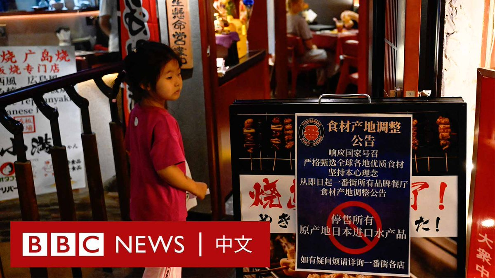

D英国广播公司BBC 北京时间 2023-08-31T11:49:04Z 1697094125387190532 Facebook母公司Meta于周二（8月29日）发布安全报告，指其已经取缔了“世界上已知最大规模的秘密影响力行动”，该行动旨在影响社交媒体上的人们对中国的看法。

Meta表示，有逾7700个Facebook账户和数百个专页、群组和Instagram账号被删除。
 
Meta表示，这个被称为“Spamouflage”的网络活动可以追溯到2018年，它们批量传播对中国的积极评论，并攻击美国、西方外交政策和中国政府的批评者。

中国外交部发言人汪文斌周三（8月30日）回应称，北京不了解该情况。但他表示，“一些人员和机构频频通过社交媒体平台对中国发起“造谣运动”，散布大量针对中国的虚假信息”。

“希望有关媒体秉持客观公正原则，避免双重标准，真正甄别出什么是谎言谣言、什么是事实真相，切实清除涉华虚假信息。”他说道。
   
Meta表示这种操作模式活跃于50多个平台，包括Facebook、Instagram、TikTok和X（推特）。最近的活动显示，它将足迹扩展至Medium、Reddit、Quora和Vimeo等较小平台。

报告表示，该网络与中国执法部门相关人员有关联。这些假账号用户集群来自中国不同地区，但似乎以明确的轮班模式运作，包括有北京时间的午餐和晚餐时间。

这些虚假账号在Facebook上积累了大约56万个关注者账号，但Meta的管理人员表示，他们认为这些账号大多是从越南和孟加拉国等地的商业垃圾信息运营商那里购买的，几乎没有看到真正的受众或参与度的证据。

该网络以美国、台湾、英国和澳大利亚等地为目标，主要分享垃圾邮件、链接、表情包和文字帖子。
 
Meta全球威胁情报总监本·尼莫（Ben Nimmo）表示：“这次行动规模和声势浩大，但却很难超越自己的虚假回声室。”   D英国广播公司BBC 北京时间 2023-08-31T09:25:01Z 1697057872864235624 在日本向太平洋正式排放经处理的放射性污水后，中国的反日情绪高涨。两国政府则相互指责有滋扰行动发生。 https://t.co/XMsuTadwIH   