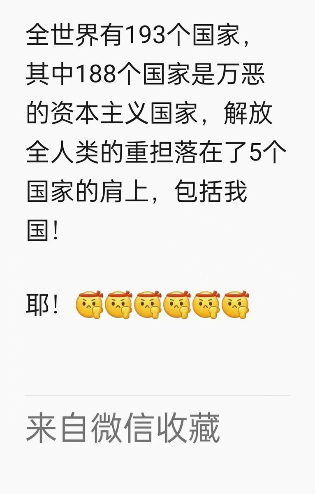
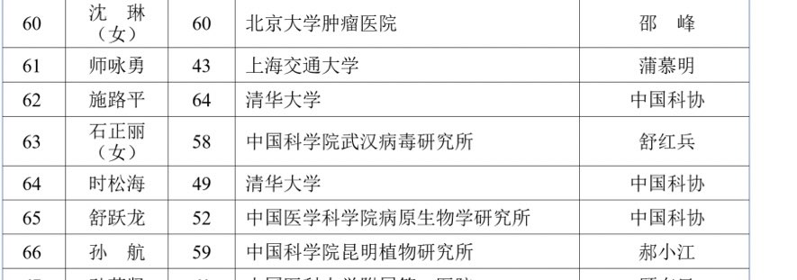

Petrichor 北京时间 2023-08-31T12:33:13Z 1697105234865037523 这5个国家大概是朝鲜、委内瑞拉、俄罗斯、伊朗等。 https://t.co/7HAKnxqaCI   Petrichor 北京时间 2023-08-31T12:03:04Z 1697097647432069496 不得了，武汉蝙蝠病毒女郎石正丽出现在2023年中国科学院院士增选有效候选人名单里面，推荐人是中科院院士舒红兵。此人不是别人，正是武汉病毒研究所所长王延轶的老公。新冠病毒从武汉爆发后，传播全球，死人无数。中国因此封控三年，经济遭到重创。之后突然放开，死人高峰。我看石正丽不当院士，对中国科学院声誉更好。   Petrichor 北京时间 2023-08-31T07:42:00Z 1697031949070577707 “近期最大海外人才招聘及社交活动（纽约，波士顿）：......你是不是尽管身在美帝，却有着一颗报效祖国的心？你是不是感觉空有一身好本领，却苦于在美国施展不开拳脚，内心正在隐隐地期待国内的好机会？你听说过国家为顶尖人才设置的‘某某计划’吗？想成为其中的一员吗？”

这是北美华人科技工商联合会2016做的广告。该协会主席苏祖琦，现已经被美国FBI逮捕，涉嫌充当外国代理人，并在FBI调查中涉嫌故意、蓄意并试图共谋阻挠、影响和妨碍司法程序等。此“侨领”身份复杂，联合国总部附近开中餐馆，兼顾留学中介、为中国招财引智。   Petrichor 北京时间 2023-08-31T08:04:46Z 1697037675906158910 今年6月27日，一位名叫李旭明（Xuming Li)的南佛罗里达化学博士被捕，因为他多次使用装满液体的注射器将液体注入邻居家里，导致他们一家人极度头痛、咳嗽和呕吐。
有人说：千万不要得罪化学博士或博士生，他们的危险系数非常高，浓硫酸、氰化钾等剧毒的化学物品触手可及。因为工作压力，他们中许多人有了精神毛病。

齐太磊枪杀导师的事情之后，有位在美国大学任教的华人调侃道：“能熬到65岁退休还不被自己研究生杀了，就算幸运”。   