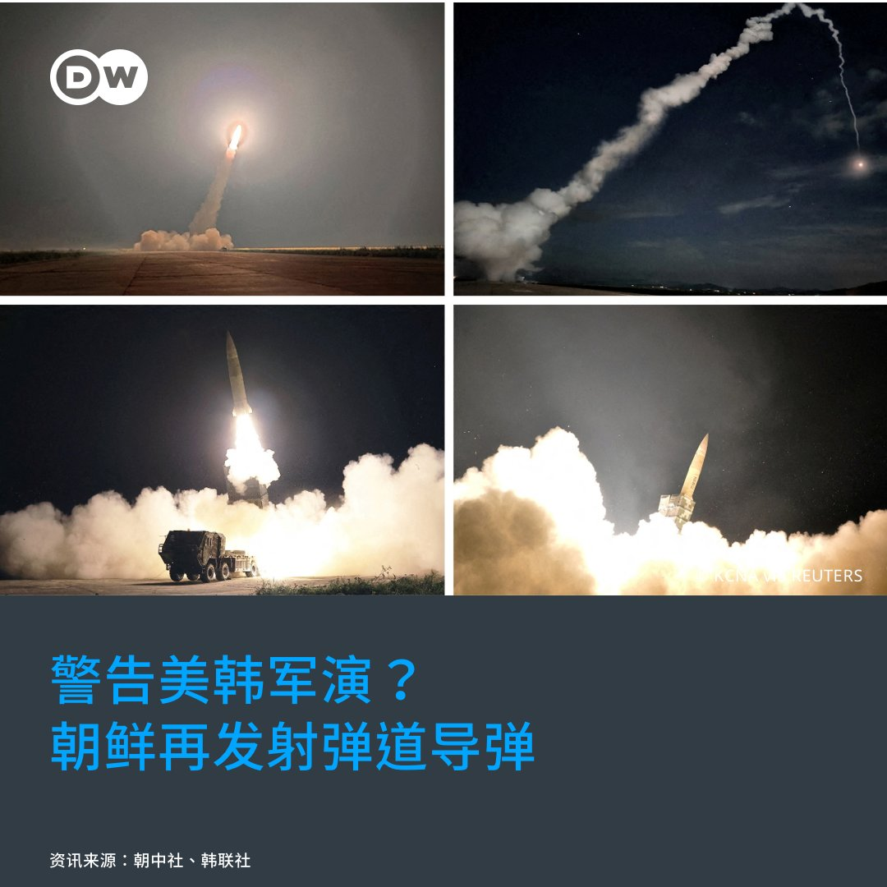

德国之声 北京时间 2023-08-31T05:58:00Z 1697005775007437255 🇺🇸🇨🇳《商报》评论雷蒙多访华行程写道：“就目前而言，华盛顿似乎正在执行双管齐下的对华战略：政治高层摆出强硬姿态，而较低层面则采取务实态度。当然，雷蒙多的温和表态也许很快就会被强硬措辞所取代。但就目前而言，中美双方已经就最低限度的务实态度达成了共识。”
https://t.co/5T7zw22nde   德国之声 北京时间 2023-08-31T11:58:20Z 1697096454869803244 【美军演出动B-1B轰炸机 朝鲜发射导弹】🇺🇸 🇰🇷 🇰🇵  

为期11天的美韩联合军演21日登场，30日美方派出了B-1B战略轰炸机，朝鲜30日晚间则发射2枚弹道导弹，被视为对该军演的警告。此前，朝鲜领导人金正恩批评，美韩把朝鲜半岛附近变成世界上"最不稳定的海域"。 
详细报导👉https://t.co/XAVDSjCTUZ https://t.co/mrJSrNXTij   