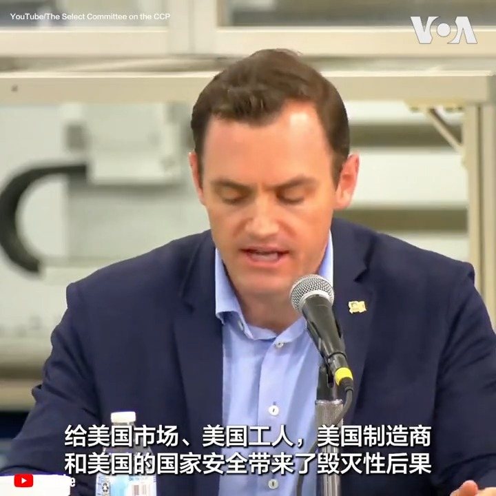

美国之音中文网 北京时间 2023-08-31T17:07:34Z 1697174276338798972 日本拟大幅提升新财年国防预算 应对来自中俄朝不断增强的军事威胁 https://t.co/fR1GENHvxX   美国之音中文网 北京时间 2023-08-31T18:06:03Z 1697188994147385532 日本政府将投入百亿支持渔业 美驻日大使指责中国对日实施经济胁迫 https://t.co/ElfbriFXER   美国之音中文网 北京时间 2023-08-31T14:29:34Z 1697134515955839253 台湾首个女性政党宣示选立委 评4位男性总统候选人性别意识不及格 https://t.co/ss9rSWfZy6   美国之音中文网 北京时间 2023-08-31T13:56:58Z 1697126312664547490 北卡罗来纳大学教堂山分校30日举行悼念仪式，纪念在28日枪击事件中遇害的副教授严资杰。校园中标志性的钟楼在当天下午1点02分鸣钟，这也是当时枪击事件发生的时间。仪式结束后一些学生举行游行集会，呼吁加强枪支管控避免悲剧再次发生。 https://t.co/IHyEPzEYZ2   美国之音中文网 北京时间 2023-08-31T13:57:03Z 1697126333451829688 美韩军演结束前 朝鲜对韩国进行模拟“焦土”核打击 https://t.co/dUbez6YbXp   美国之音中文网 北京时间 2023-08-31T12:21:26Z 1697102269123354938 “这是一个悲剧，我希望这样的事情不再发生。”北卡大学教堂山分校生物系华裔副教授杰克在谈到齐太磊枪杀导师严资杰事件时眼眶泛泪。他教学和工作的场所距离案发现场仅一街之隔。他希望教职员工和校方能多注意学生心理健康，避免悲剧重演。枪击案后，学校为学生提供全天候免费心理咨询和热线。 https://t.co/2OjVks1MWe   美国之音中文网 北京时间 2023-08-31T11:41:40Z 1697092263115939929 东盟将于9月5日至7日举办东盟中国、东盟美国及东亚峰会等会议，不过白宫稍早宣布，美国总统拜登不会出席。观察人士表示，这显示美国在缅甸危机上仍不愿扮演主导地位，但这可能让中国扩大对缅甸的影响力、同时在南中国海继续进行扩张，也恐让东盟明年制定更多对北京有利的政策。https://t.co/FTrgpNjDey https://t.co/uxQFXhu3KT   美国之音中文网 北京时间 2023-08-31T10:48:06Z 1697078782186705407 “中国共产党完全没想过要遵守规则”，美国国会中国特设委员会首席民主党议员克里希纳莫提30日在威斯康星州一场圆桌会议上说。出席会议的还包括委员会主席加拉格尔以及美国各行业代表，他们讨论了中共如何通过国家补贴、不遵守规则等行为给美国制造业带来极大威胁。https://t.co/pV234U2r41 https://t.co/Ybo2nBLkL3   美国之音中文网 北京时间 2023-08-31T09:00:01Z 1697051582750249437 一键解锁 #美国热搜 榜1、四十年繁荣落幕：青年失业惨，替失业的父母求职更难，两代人的困境2、卑贱如尘埃，习近平如何革了小业主的命3、网民检测：杭州湾辐射比福岛高4、中共开始降温仇日情绪5、福岛核废水VS科技与狠活6、人民铁道表演为人民服务 https://t.co/GuhzA6x6NX https://t.co/uMMQXq6b2x   美国之音中文网 北京时间 2023-08-31T09:26:33Z 1697058258954125595 美众议院两党议员讨论中共不公平产业政策对美国制造业的影响 https://t.co/oc5WJ2tFmm   美国之音中文网 北京时间 2023-08-31T09:26:35Z 1697058266654867725 美国支持的军队在叙利亚东部发生内部武装冲突 https://t.co/Uec3M5gYFV   美国之音中文网 北京时间 2023-08-31T09:55:33Z 1697065558150402382 北卡大学举行烛光守夜悼念枪击案遇难教授 https://t.co/YjMeOGSFvv   美国之音中文网 北京时间 2023-08-31T10:16:00Z 1697070702615253172 “我们的要求非常简单，非常卑微，仅仅希望（知道）他是不是活着，” 被失踪六年，音信全无的维权律师高智晟的妻子耿和哽咽地说。8月30日“强迫失踪受害者国际日”当天，多名人权活动者谴责中国政府利用强迫失踪制造恐怖，压制异见人士，呼吁世人不要忘记那些被失踪者。 https://t.co/Hk04CL8TS8   美国之音中文网 北京时间 2023-08-31T04:42:05Z 1696986670850297946 香港经济表现持续疲弱旅客北上多于南下 各界质疑能否搞活夜市刺激经济 https://t.co/Er9w4emIX4   美国之音中文网 北京时间 2023-08-31T09:13:37Z 1697055004870250510 #美中对标  美籍华裔女歌手李玟生前的一段音频暴露出中国最火真人秀《中国好声音》评选不公。美国电视业作为开创真人秀节目的鼻祖，是如何管理类似的知识竞赛节目的？在过程中又遭遇哪些困难？完整版戳 https://t.co/cZG75FHaux https://t.co/Cew44ETneB   美国之音中文网 北京时间 2023-08-31T05:13:04Z 1696994469399376204 美国警告俄罗斯与朝鲜可能达成的武器交易 https://t.co/QVO2RJlkwk   美国之音中文网 北京时间 2023-08-31T05:56:05Z 1697005294013104285 军方拘留加蓬总统后华盛顿“密切”关注局势 https://t.co/AFAwcjGSiY   美国之音中文网 北京时间 2023-08-31T06:23:05Z 1697012089003585787 中加关系中的气候变化 https://t.co/9oGG09MzeX   美国之音中文网 北京时间 2023-08-31T06:56:34Z 1697020516022853747 中国经济持续疲软，外界呼吁中国政府拿出强力政策刺激消费，包括向民众发放现金。北京是否应该采纳？中国经济政策痴迷公共投资而轻视居民消费，习近平的意识形态是否成为中国经济纾困的一大障碍？面对地缘政治的最大对手出现经济困难，美国应该乐见还是担忧？请留言参与8/31时事大家谈。 https://t.co/KIskCMVEkV   美国之音中文网 北京时间 2023-08-31T05:26:33Z 1696997861639246307 飓风伊达利亚猛烈冲击美国东南部 https://t.co/Gn0jfXArQg   美国之音中文网 北京时间 2023-08-31T06:10:03Z 1697008810374910423 乌克兰向俄罗斯发动一波无人机袭击 https://t.co/hQY4CmYTSx   美国之音中文网 北京时间 2023-08-31T06:56:03Z 1697020385894740264 拜登政府批准美国历来首度对台军事融资，该项目通常用于主权国家 https://t.co/z6pOdC05CX   美国之音中文网 北京时间 2023-08-31T07:08:32Z 1697023524219847095 面对中国国内的监视、拘留和镇压，大批维吾尔人逃往国外。即便如此，许多维吾尔人仍处在危险之中。美国之音考察了中国政府如何利用外交、经济压力以及国际机构来扩大其影响范围，抓捕海外异见人士和政敌。 https://t.co/8WE9VUP5SP   美国之音中文网 北京时间 2023-08-31T07:26:32Z 1697028058090459509 中国拘留涉嫌瞒报洪水死亡人数的五名责任人 https://t.co/P6NeHTqUZr   美国之音中文网 北京时间 2023-08-31T07:43:07Z 1697032229476876705 印度和马来西亚在G20峰会前就新版地图抗议中国的领土主张 https://t.co/EZoFnCfKl5   美国之音中文网 北京时间 2023-08-31T07:48:40Z 1697033626964164729 对于2023年排队观看电影《芭比》(Barbie)的观众来说，地缘政治可能是他们最不关心的事情。但这部取材于儿童玩偶的好莱坞粉色大片似乎踩进了一个全球最具争议的地区，导致其在越南被禁，在菲律宾遭审查。https://t.co/C1DYfTjenZ https://t.co/5nJOAmttNY   美国之音中文网 北京时间 2023-08-31T08:00:01Z 1697036482047795446 【原声带·即将推出】他曾是一名刑警，做过公务员，还是一名中共党员。2019年被开除党籍、公职、后举家润到美国，投身自媒体行业。邓海燕，笔名“二大爷”，在与美国之音“原声带”栏目专访中，讲述自己从工具人到党国反贼的转变之路，及对中国政坛、官场的洞察。 https://t.co/j9i1sPq6oS   美国之音中文网 北京时间 2023-08-31T08:10:00Z 1697038993764847770 【家事国事天下事，你有何见解】台湾鸿海集团创办人郭台铭28日正式宣布竞选台湾总统。郭声言当前台湾"主流民意"是要“捍卫中华民国永生永世”，并强调“要和平，不要战争”。但中共政权坚称郭所谓的中华民国是其领土的一部分，并誓言必要时使用武力夺取它。台湾"主流民意"能否使中共回心转意？ https://t.co/0RviC0cC6k   美国之音中文网 北京时间 2023-08-31T03:36:40Z 1696970206810353713 乌俄战争爆发后，欧美日韩的跨国汽车企业纷纷撤离俄罗斯，而中国车企则寻求扩大在俄罗斯的市场份额。俄罗斯媒体报道说，2023年上半年，俄罗斯从中国进口汽车的数量比去年同期增长了四倍。在正在举行的莫斯科国际车展上，一些俄罗斯车主分享了他们对中国汽车的看法。 https://t.co/KbPtH3WiUS   美国之音中文网 北京时间 2023-08-31T03:55:34Z 1696974964283551858 习近平在乌鲁木齐强调新疆战略 聚焦稳定与同化 https://t.co/Ps9Rd3ZDxN   美国之音中文网 北京时间 2023-08-31T04:42:03Z 1696986663015297190 日本要求中国敦促其公民停止骚扰活动 https://t.co/64KMasFeBp   美国之音中文网 北京时间 2023-08-31T05:56:03Z 1697005286127710447 拜登将缺席东盟峰会 美中在东南亚影响此消彼长？ https://t.co/yvuz5Ol4o4   美国之音中文网 北京时间 2023-08-31T06:15:04Z 1697010071123697883 “我认为没有人能再否认气候危机的影响。环顾四周，历史性的洪水，更严重的干旱，酷热，严重的野火，造成了我们前所未见的严重破坏，”美国总统拜登8月30日在谈到联邦政府将尽全力帮助夏威夷毛伊岛进行重建工作时说。  拜登强调，重建毛伊岛的工作要确保尊重夏威夷的传统与文化。 https://t.co/etZBeOmem9   美国之音中文网 北京时间 2023-08-31T01:42:03Z 1696941365027024991 克里姆林宫：普里戈津座机坠毁可能是“蓄意”破坏所致 https://t.co/ZgSTcY54dK   美国之音中文网 北京时间 2023-08-31T03:21:33Z 1696966405743325604 中国为什么惦记着格鲁吉亚？可能攸关格鲁吉亚地缘政治未来的黑海港口 https://t.co/dMQIoKVpBe   美国之音中文网 北京时间 2023-08-31T04:12:24Z 1696979202354892930 印尼警方8月30说，警方在巴淡岛一个工业园区以涉嫌网络诈骗为由逮捕了88名中国公民，其中包括83名男性和5名女性。印尼警方是在从中国公安部获得信息后采取这次行动的。据印尼警方介绍，这个诈骗集团从今年年初开始运营，他们的受害者大多是中国居民，诈骗金额目前仍在调查之中。 https://t.co/xC5HsoP6z1   美国之音中文网 北京时间 2023-08-31T00:12:03Z 1696918714598514872 中国大型房企碧桂园的离岸债权人谋求参加其债务重组谈判 https://t.co/ZoPGWyKUt8   美国之音中文网 北京时间 2023-08-31T00:30:13Z 1696923285718712693 日本首相岸田文雄8月30日以打捞自福岛附近的海鲜作为午餐，试图打消外界对日本水产品的疑虑。日本官员对媒体表示，岸田文雄邀请了三位内阁成员共进午餐。主菜包括比目鱼、章鱼和鲈鱼制成的生鱼片。日本上星期开始排放福岛核处理水。中国随即宣布全面禁止从日本进口水产品。 https://t.co/OcrYNQgwzI   美国之音中文网 北京时间 2023-08-31T01:09:04Z 1696933064537157952 香港捍卫粤语组织停运 广东话会消失吗？ https://t.co/755tE6wB4x   美国之音中文网 北京时间 2023-08-31T01:28:04Z 1696937843007041643 中国人民币贬值 华人新移民叫苦 https://t.co/mOTpMl8ID1   美国之音中文网 北京时间 2023-08-31T01:28:05Z 1696937850762309804 最新报告: 印度中国等六国仍在全球空气污染最严重之列 https://t.co/l7WdKo6wtk   美国之音中文网 北京时间 2023-08-31T02:00:56Z 1696946115701256387 8月30日是“强迫失踪受害者国际日”。美国国务卿布林肯在当天发表声明说，美国与那些遭受与家人和朋友分离痛苦的人站在一起，并对那些为维护强迫失踪的受害者权益不懈努力的人表示支持。 布林肯并呼吁各国政府正视被失踪或失踪人员问题。 https://t.co/ngAZOjCTT8   美国之音中文网 北京时间 2023-08-31T02:11:14Z 1696948709077168395 印度官员8月29日“强烈抗议”中国在新近出版的地图中将印度认为属于本国领土的地区划入中国版图，其中包括靠近中印两国在2020年爆发冲突的领土。中国政府对此回应称，中国有关部门依法颁布地图是行使主权的例行做法，希望印方冷静看待。详细：https://t.co/xbZ6X3AfYo https://t.co/tkZpReUQrD   美国之音中文网 北京时间 2023-08-31T00:12:05Z 1696918722852888995 英外相访华与韩正会面 英国会报告称台湾为独立国家 https://t.co/PFf81hRqiT   