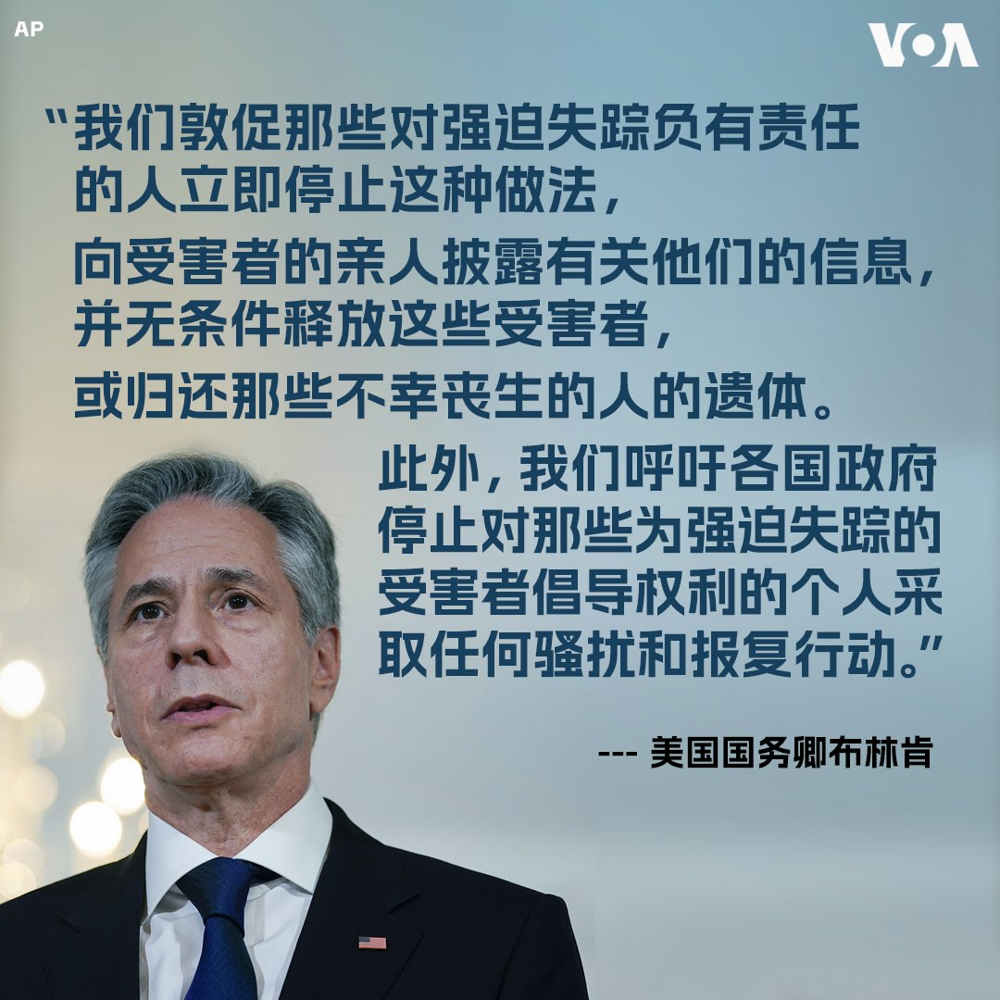
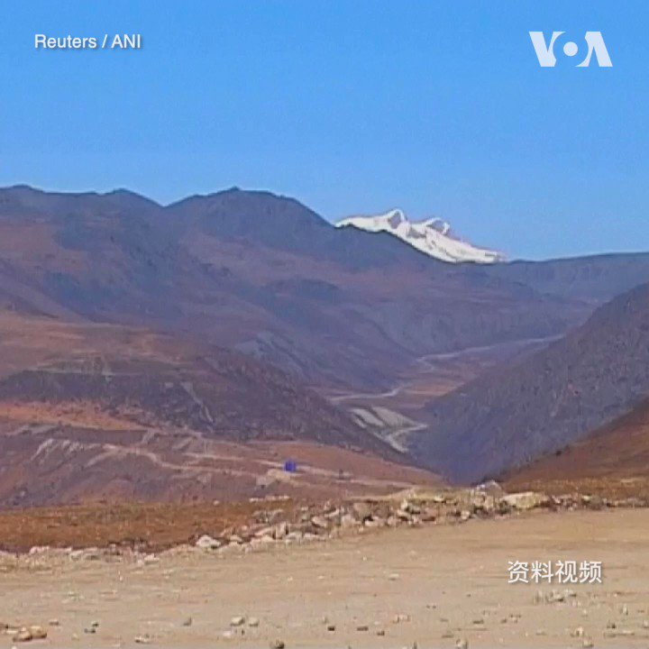

美国之音中文网 北京时间 2023-08-31T05:56:03Z 1697005286127710447 拜登将缺席东盟峰会 美中在东南亚影响此消彼长？ https://t.co/yvuz5Ol4o4   美国之音中文网 北京时间 2023-08-31T06:15:04Z 1697010071123697883 “我认为没有人能再否认气候危机的影响。环顾四周，历史性的洪水，更严重的干旱，酷热，严重的野火，造成了我们前所未见的严重破坏，”美国总统拜登8月30日在谈到联邦政府将尽全力帮助夏威夷毛伊岛进行重建工作时说。  拜登强调，重建毛伊岛的工作要确保尊重夏威夷的传统与文化。 https://t.co/etZBeOmem9   美国之音中文网 北京时间 2023-08-31T01:42:03Z 1696941365027024991 克里姆林宫：普里戈津座机坠毁可能是“蓄意”破坏所致 https://t.co/ZgSTcY54dK   美国之音中文网 北京时间 2023-08-31T03:21:33Z 1696966405743325604 中国为什么惦记着格鲁吉亚？可能攸关格鲁吉亚地缘政治未来的黑海港口 https://t.co/dMQIoKVpBe   美国之音中文网 北京时间 2023-08-31T04:12:24Z 1696979202354892930 印尼警方8月30说，警方在巴淡岛一个工业园区以涉嫌网络诈骗为由逮捕了88名中国公民，其中包括83名男性和5名女性。印尼警方是在从中国公安部获得信息后采取这次行动的。据印尼警方介绍，这个诈骗集团从今年年初开始运营，他们的受害者大多是中国居民，诈骗金额目前仍在调查之中。 https://t.co/xC5HsoP6z1   美国之音中文网 北京时间 2023-08-31T00:12:03Z 1696918714598514872 中国大型房企碧桂园的离岸债权人谋求参加其债务重组谈判 https://t.co/ZoPGWyKUt8   美国之音中文网 北京时间 2023-08-31T00:30:13Z 1696923285718712693 日本首相岸田文雄8月30日以打捞自福岛附近的海鲜作为午餐，试图打消外界对日本水产品的疑虑。日本官员对媒体表示，岸田文雄邀请了三位内阁成员共进午餐。主菜包括比目鱼、章鱼和鲈鱼制成的生鱼片。日本上星期开始排放福岛核处理水。中国随即宣布全面禁止从日本进口水产品。 https://t.co/OcrYNQgwzI   美国之音中文网 北京时间 2023-08-31T01:09:04Z 1696933064537157952 香港捍卫粤语组织停运 广东话会消失吗？ https://t.co/755tE6wB4x   美国之音中文网 北京时间 2023-08-31T01:28:04Z 1696937843007041643 中国人民币贬值 华人新移民叫苦 https://t.co/mOTpMl8ID1   美国之音中文网 北京时间 2023-08-31T01:28:05Z 1696937850762309804 最新报告: 印度中国等六国仍在全球空气污染最严重之列 https://t.co/l7WdKo6wtk   美国之音中文网 北京时间 2023-08-31T02:00:56Z 1696946115701256387 8月30日是“强迫失踪受害者国际日”。美国国务卿布林肯在当天发表声明说，美国与那些遭受与家人和朋友分离痛苦的人站在一起，并对那些为维护强迫失踪的受害者权益不懈努力的人表示支持。 布林肯并呼吁各国政府正视被失踪或失踪人员问题。 https://t.co/ngAZOjCTT8   美国之音中文网 北京时间 2023-08-31T02:11:14Z 1696948709077168395 印度官员8月29日“强烈抗议”中国在新近出版的地图中将印度认为属于本国领土的地区划入中国版图，其中包括靠近中印两国在2020年爆发冲突的领土。中国政府对此回应称，中国有关部门依法颁布地图是行使主权的例行做法，希望印方冷静看待。详细：https://t.co/xbZ6X3AfYo https://t.co/tkZpReUQrD   美国之音中文网 北京时间 2023-08-31T00:12:05Z 1696918722852888995 英外相访华与韩正会面 英国会报告称台湾为独立国家 https://t.co/PFf81hRqiT   