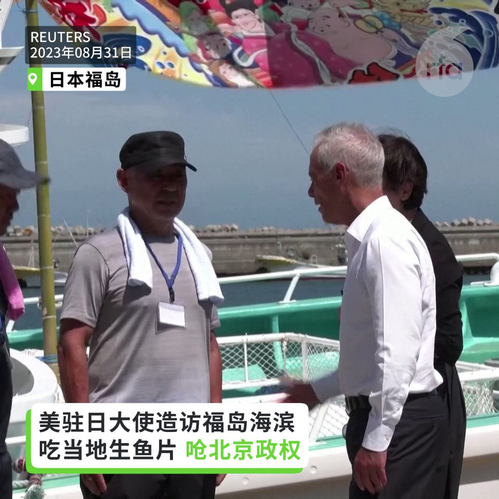
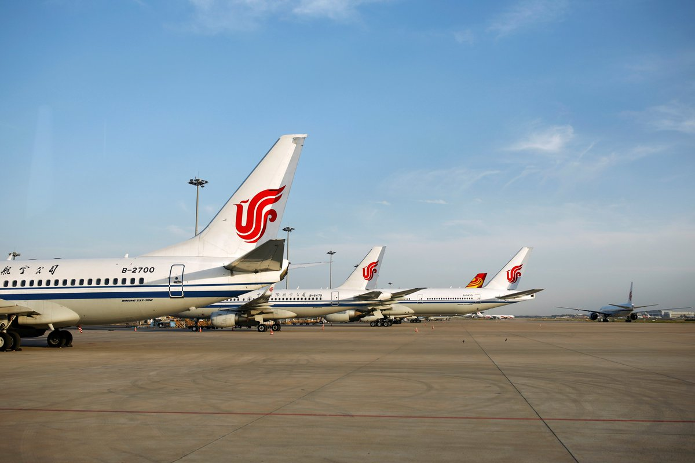
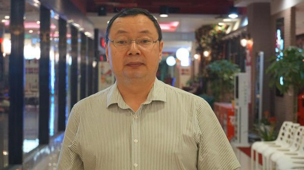
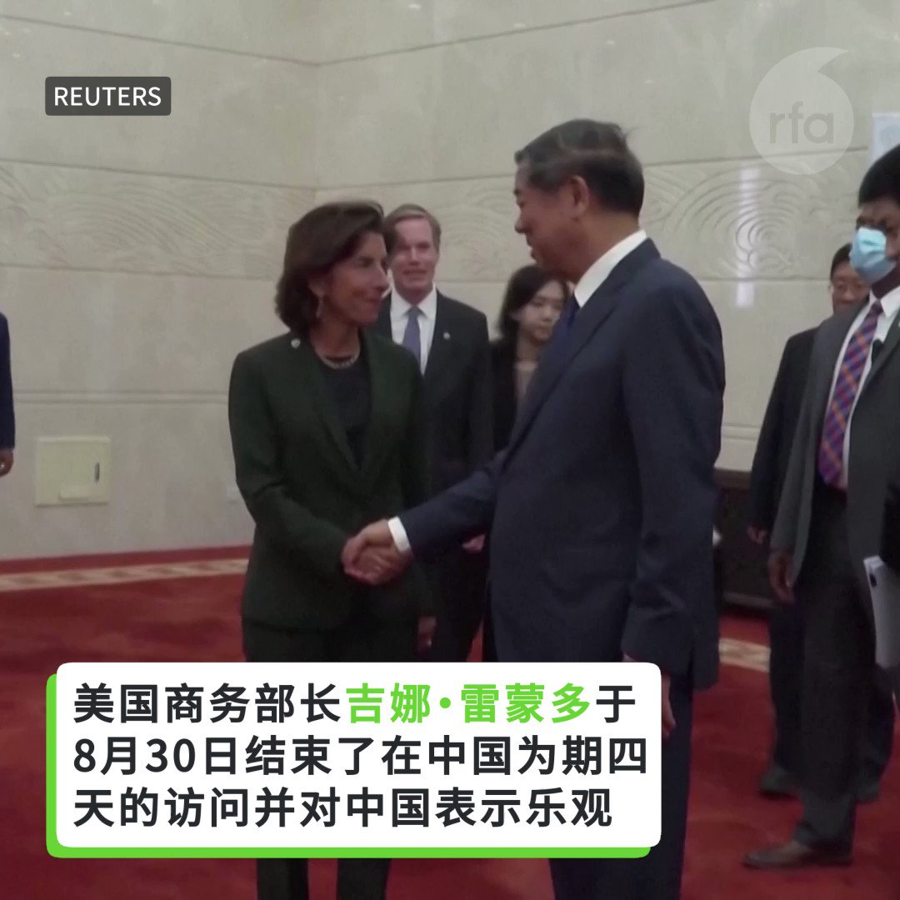
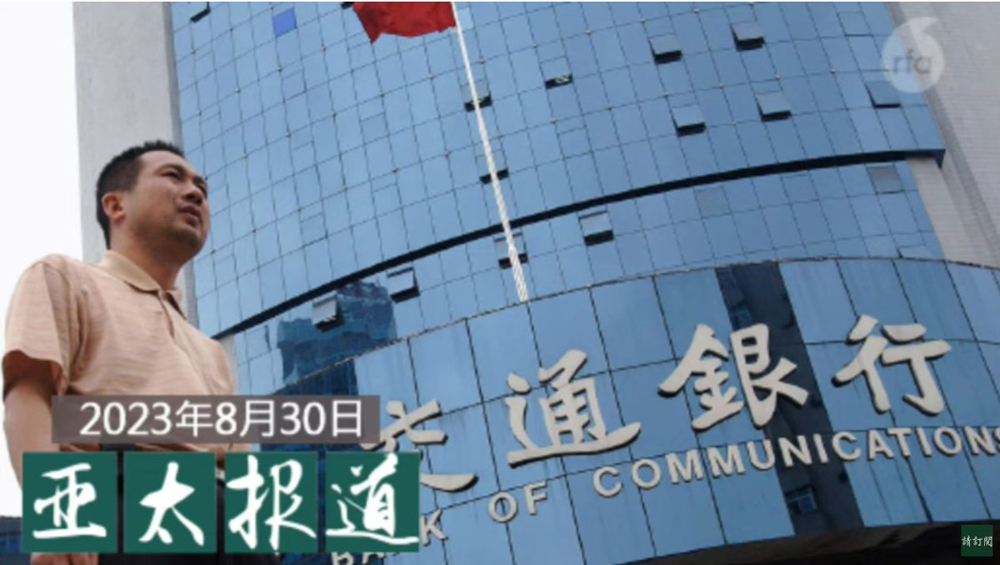
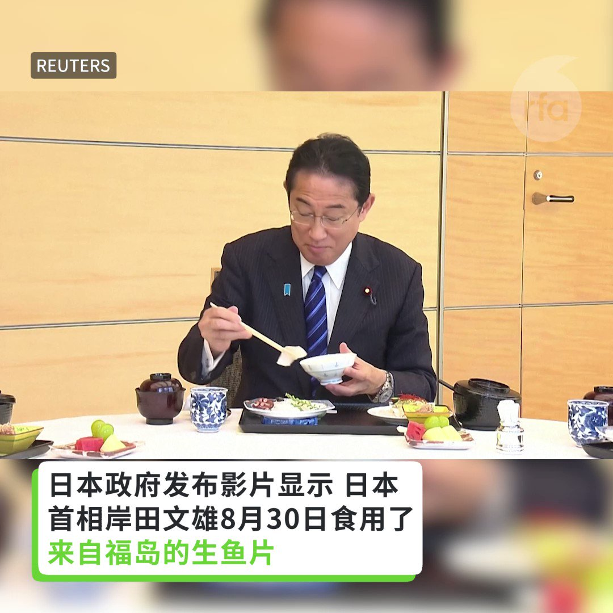

自由亚洲电台 北京时间 2023-08-31T23:27:09Z 1697269804753629499 评论 | 何清涟@HeQinglian：举世关注 #金砖 效应，究竟能砸多大坑？
https://t.co/AX4lBohMGj   自由亚洲电台 北京时间 2023-08-31T19:08:05Z 1697204605791408633 【美国驻日大使炮轰中国】
【称反日作为是政治手段和套路】
【习近平可带普京去中国核电站附近吃鱼】
#美国驻日大使 #拉姆伊曼纽尔 （Rahm Emanuel）31日造访 #福岛 县海滨城市 #相马，对日本排放 #核废水 的政策，和当地渔业表示支持。他重炮抨击中国对日本排放的反应，还表示如果 #习近平 对 #中国核电站 附近的鱼产很有信心的话，可以在普京访华时带他去饱餐一顿。   自由亚洲电台 北京时间 2023-08-31T14:44:33Z 1697138287155241282 【中国三大航空公司上半年亏损超125亿】
【30年导游首次接不到外国团】
中国多家航空公司近日发布年报，中国 #国航、#东航 及 #南方航空 等三大航空业龙头企业，今年上半年合共亏损约125.8亿元人民币。另外，前往北京、上海旅游的外国人仅是疫情前约一成。有导游说，当了三十年导游，第一次遇到接不到外国团。
#航空亏损
https://t.co/OKwTNRsa5q   自由亚洲电台 北京时间 2023-08-31T15:43:33Z 1697153133108150731 【大学教授杨绍政涉煽颠罪被判刑4年6个月】
贵州大学经济学院前教授 #杨绍政 被控“#煽动颠覆国家政权罪”一案，在延迟一年后，本周四在贵阳市中级法院一审开庭。杨绍政委托的辩护律师在庭审结束后发消息，贵州省贵阳市中级法院宣判杨绍政教授构成煽动颠覆国家政权罪，判刑4年6个月。
https://t.co/6QkfGNJnkM   自由亚洲电台 北京时间 2023-08-31T13:33:15Z 1697120343620813264 https://t.co/IsG3TaRbyW   自由亚洲电台 北京时间 2023-08-31T11:49:35Z 1697094253287981542 RT @RFA_Chinese: 上周，日本将失事核电站的水排入太平洋引发抗议和批评浪潮。日本政府发布影片显示，日本首相岸田文雄8月30日食用了来自福岛的生鱼片。韩国总统尹锡悦高调吃海鲜午餐，望以此缓解舆情忧虑。目前，北京已宣布全面禁止来自日本的所有水产品。 https://t…   自由亚洲电台 北京时间 2023-08-31T11:49:46Z 1697094302558466192 RT @RFA_Chinese: 评论 | 易富贤 @fuxianyi ：中国房地产"堰塞湖"和 #一胎化政策 是双胞胎
 https://t.co/fJBBLrPuH2   自由亚洲电台 北京时间 2023-08-31T05:00:00Z 1696991179706085615 19.6%的日本企业视中国大陆为最重要的海外销售市场，比冠病疫情前的调查少了6.3个百分点。 https://t.co/i6sdCoX6Na   自由亚洲电台 北京时间 2023-08-31T04:38:48Z 1696985845277053274 【美国商务部长结束访华】
美国商务部长吉娜·雷蒙多于8月30日结束了她在中国为期四天的访问，并对中国表示乐观。但她也警告称，需要采取更多措施来安抚希望在中国投资的美国公司。 https://t.co/TAu60LU3Ji   自由亚洲电台 北京时间 2023-08-31T04:42:56Z 1696986886739513658 专栏 | #网络博弈：华人电子画册关于 #普京 立场非常明确
 https://t.co/TAGnQscRB2   自由亚洲电台 北京时间 2023-08-31T05:30:00Z 1696998731428843942 俄罗斯总统 #普京 计划在10月份出席中国的“#一带一路”论坛。这将是国际刑事法院发布对普京的逮捕令之后，他首次前往俄罗斯或其盟友领土以外的地方。
  https://t.co/qpmWeoBYmR   自由亚洲电台 北京时间 2023-08-31T06:33:41Z 1697014754865500399 英国议会首次称台湾为"独立国家"，中国外交部回应：颠倒是非，混淆黑白。
您认为，台湾是"独立国家"吗？ https://t.co/HnJ4ehodhi   自由亚洲电台 北京时间 2023-08-31T07:00:08Z 1697021414010966086 【#亚太报道（2023-8-30）】
欢迎收听和订阅【亚太报道】播客 https://t.co/MjLNSvVMqc

广州深圳公布 #认房不认贷 措施 / #英外相访华 多次提人权 / #G20峰会 会有“#拜习会”吗？/ 中国“#反日”“#挺日”两极化 / #王全璋 一家仍遭监控 儿子入学难 https://t.co/YkW4SqRzbC   自由亚洲电台 北京时间 2023-08-31T01:00:08Z 1696930816516051380 台北市长 #蒋万安 到上海参加 #双城论坛 致辞时，呼吁珍惜和平的可贵，若成功化解分歧消弭对立，双城论坛效益无可限量。
上海市长龚正表示，要共创中华民族伟大复兴的美好未来。
曾经是中共最大反动派的蒋家传人都跑去跟中共共圆中国梦，算不算中国宣传的成功?

 https://t.co/TTjMWpNTEK   自由亚洲电台 北京时间 2023-08-31T04:34:57Z 1696984876908728532 #英国外相 克莱弗利（James Cleverly）本周三（30日）访华，会晤了中国国家副主席 #韩正 和外交部长 #王毅。这也是时隔五年后，再次有英国高层官员到访中国。对于克莱弗利这次访问，外界最关切的议题是什么？过去五年来，#英中关系 又发生了怎样的变化？

 https://t.co/FFVjiQwGbx   自由亚洲电台 北京时间 2023-08-31T06:00:01Z 1697006284254663122 专栏 | #中国透视：大厦将倾，且看他们如何支撑？
 https://t.co/IpFOsmt1nY   自由亚洲电台 北京时间 2023-08-31T01:41:20Z 1696941182591648222 中宣部会同教育部组织编写的高校教材《习近平新时代中国特色社会主义思想概论》（以下简称《概论》）从8月29日起在全国发行。
有网友讽刺这本书说，“能够把简体中文这门语言，彻底变成废话文学其实也是一种超能力。”
 https://t.co/4HrAXRWWyp   自由亚洲电台 北京时间 2023-08-31T03:02:42Z 1696961659502502323 评论 | 易富贤 @fuxianyi ：中国房地产"堰塞湖"和 #一胎化政策 是双胞胎
 https://t.co/fJBBLrPuH2   自由亚洲电台 北京时间 2023-08-31T03:45:56Z 1696972541364171100 学者推估 #习近平 与 #拜登 有机会在G20见面

 https://t.co/1gVdP5eqBJ   自由亚洲电台 北京时间 2023-08-31T03:47:28Z 1696972926233543096 上周，日本将失事核电站的水排入太平洋引发抗议和批评浪潮。日本政府发布影片显示，日本首相岸田文雄8月30日食用了来自福岛的生鱼片。韩国总统尹锡悦高调吃海鲜午餐，望以此缓解舆情忧虑。目前，北京已宣布全面禁止来自日本的所有水产品。 https://t.co/74RX1bPNoj   自由亚洲电台 北京时间 2023-08-31T04:13:22Z 1696979442336452748 【#福岛 排水第5天  访日游客怕不怕？】 https://t.co/6kzzSrvISE   自由亚洲电台 北京时间 2023-08-31T04:17:26Z 1696980468233851359 美中两国研究人员2020年对中国进行了八个月的测评，得出的结论是公众对 #空气质量 违规行为的投诉（例如在社交媒体平台上）比私下呼吁更有效，可以减少企业的违规行为和排放。
 https://t.co/PlAcTkpusS   自由亚洲电台 北京时间 2023-08-31T00:51:15Z 1696928578758214102 RT @RFA_Chinese: 【欢迎加入自由亚洲电台电报群】https://t.co/UkKZmFSRkG https://t.co/Qid2LNZxJn   自由亚洲电台 北京时间 2023-08-31T01:24:07Z 1696936853054828622 专栏 | #报导者时间：红色网战： #中国骇客 组织发起网路攻击链，#台湾 百处基础设施如何防备？
 https://t.co/PWKGzn8bRg   自由亚洲电台 北京时间 2023-08-31T02:19:26Z 1696950770980237700 广州和深圳周三（8月30日）宣布开始实施"#认房不认贷"的政策，给予首套购房者更多优惠。
这一措施能否挽回房市的颓势，又是否符合中国整体经济的发展方向？

  https://t.co/EAnQov44nF   自由亚洲电台 北京时间 2023-08-31T00:18:03Z 1696920224438833499 中国自然资源部28日以《规范使用地图，一点都不能错》为题，正式发布 #新版地图。其中，纳入 #台湾 、#南海诸岛，以及与 #印度 之间存在领土争议的地区。台湾和印度都强调，中方此举无法改变事实。

 https://t.co/DZId2RfnUB   