谁将十万横扫三江 北京时间 2023-08-31T22:28:29Z 1697255040929689827 性少数父母自述：大樊妈妈 https://t.co/XiDhdtyJEy   谁将十万横扫三江 北京时间 2023-08-31T22:09:01Z 1697250139516375310 RT @Pandazhq: 山东一教授，花了一个月时间体验送外卖，然后写了一篇调研报告，如实记录了外卖骑手的生活。白描的叙述，没有任何情感渲染，却让人不禁泪目。

那种被看见和被理解的的感动。 https://t.co/salRtLqeeq 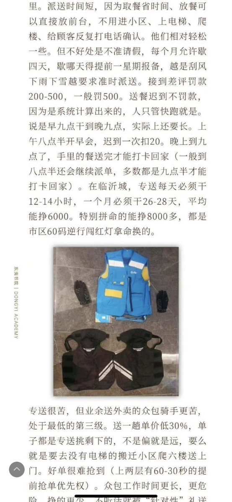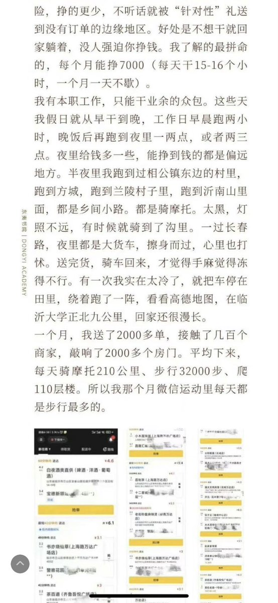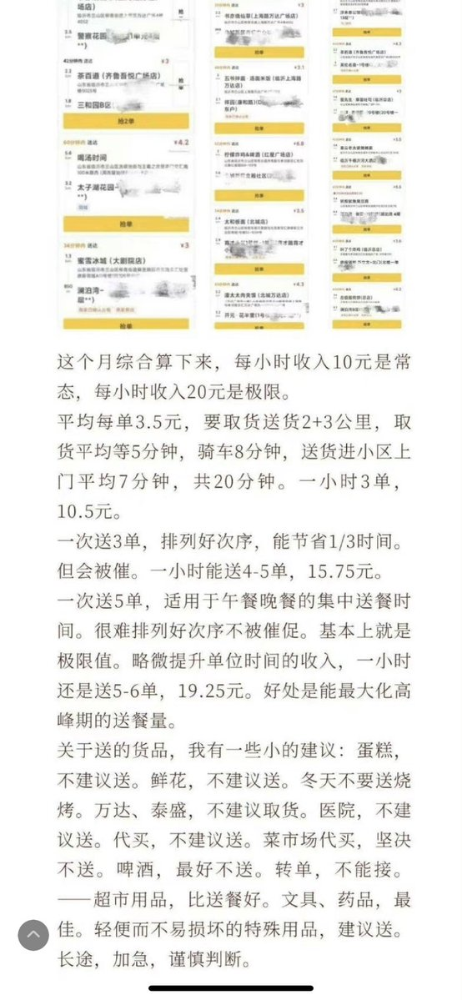  谁将十万横扫三江 北京时间 2023-08-31T22:34:02Z 1697256434508157380 你法我笑 https://t.co/KOHrNFImSW 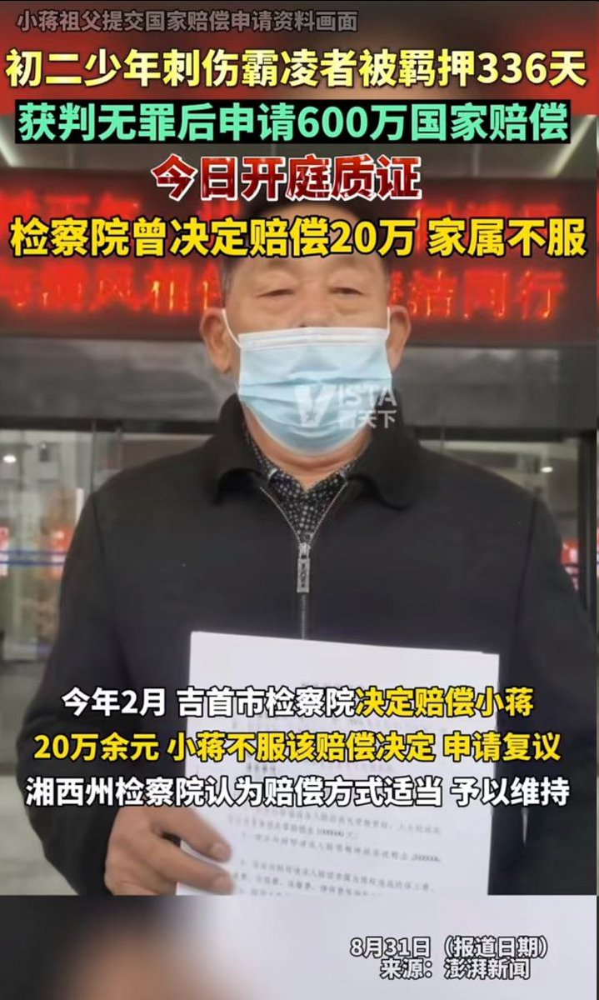  谁将十万横扫三江 北京时间 2023-08-31T19:03:45Z 1697203517881262409 #Metoo
她生活创始人苏娟：面对360性骚扰和职场霸凌，我也是个不完美受害者

这两天，作为奇虎360的前员工，被卷入陈年往事，一段以为已经过去的记忆被再次唤醒，长痛不如短痛，决定来知乎还原一下事情的经过。
这是一个大家认为有能力发声的资深媒体人，女性创业者，曾经遭遇的惨痛的职场性骚扰和职场霸凌。
起因来自于网络上一篇热帖，来自和360合作过的一个创业者张磊（我在投资部见过他，但从未私下打过交道）。他说起，360投资部王翌曾经因为骚扰女下属被公司处理过。
不少前同事纷纷转帖给我。我认为张磊还原的事实不够详尽清晰，我至今也无法确认被公司处理的事件是否是我那件，因为没有接到过法务向我的告知。但无论如何，10年之后，我不应该再沉默了，沉默等于死去，等于被王和360不断在离职后的尽调中构陷我是被公司开除的，导致创业融资受损，找工作走投无路。
以下是我对这件事的事实还原：
这事没说清楚，既然在推特上被“女主角“了，前同事让我重新讲下经过。
我就是被360前同事王翌骚扰过的女同事之一（我在职的时候他不是投资部负责人，投资部周总亲自管过一段时间，其他时间有姚珏、刘俊等人管理，王翌对外说自己是投资部负责人，是总监，被老周多次发火警告过）。  王翌作为老员工，在我入职一个月不到的时候就开始骚扰我，发淫秽语音，还要求我一起出差。我拒绝了，并向上级反馈过。在试用期通过后转正时，他假传HR部门的话，说我没通过试用，让我离职。  我问我们当时的领导姚珏，姚说，王没有人事权，别理他，你通过试用了。  我向相关领导反馈过王翌的骚扰，HR大姐也听过语音，当场表示真恶心（但并没有处理他）。  后来我收购了两个团队进360，集合成一个团队做图片电商项目“我喜欢”，继马占凯之后的这个项目的负责人，老周就让我负责这个项目的运营，汇报给陈杰，他急眼了，没少主动跑去跟陈杰说我坏话（因为我手头有他的录音，他各种希望我离开公司）；  为了制造我要离开360的幻觉，他也打过电话给业界投资人李娜，说我需要找工作，要不要收留我（当时我还拿着360的公章在深圳出差投项目），听到云锋基金娜姐（我是李娜推荐到360的）给我打电话询问时我惊呆了；  后来我还有一部分事情是和投资部相关的，王就开始公开针对我。到近两年后突然有一天，我被刚分来主管投资部的刘俊叫到办公室，问我要不要去市场部，我说为什么，他说，你不能留在投资部了。  我很诧异，顿时明白了王一直不遗余力在背后搞事情，公司并没有为女员工伸张正义的企图。  对于王，我在任职期间没有想过将他绳之以法或与公司据理力争，因为他性骚扰女性同行不止一两个，而我也很看重自己职业生涯的完整（公司HR没有开掉他我便知道公司是默认这种行为的，如果我忍不了只有诉诸法律和主动离职），没想到他由于内心恐惧竟然已经在背后搞得木已成舟（我至今不知道他在背后搞了什么，但这人说谎栽赃没有任何底线，比如对业界说创业者张磊拿了360 “800万”投资私吞了，实际上公司只投了张50万，工商可查）。  于是就跟刘俊说，我辞职吧（既是对360的企业文化和管理风格非常失望，也是因为自己受够了屈辱）！但我也把王翌对我的骚扰正式告知了他（说着自己忍不住痛哭失声，各种委屈和屈辱涌上来，他眼神表示同情，但没有改变决定）。

离开公司以后的事情就不得而知了，反正我走的时候360并没有处理他，应该是后来又骚扰了哪个女同事被闹到了法务部（公司搬到酒仙桥以后），公司才下的决心。  这事在我的人生中，我以为就这么当个屁放了，让老天收拾他吧，我有我的路要走。见过的小人不少，王翌这样卑劣又愚蠢的算是极致；服务过三家上市公司，360的企业文化让我非常失望，只想尽快离开；

当时没有追究还有一个重要原因，时值我正好有可能出来创业或参与创业，作为一个预期创业者，我对以投资人身份活跃在业界的流氓有所忌惮。

但真正的噩梦，从这个时候才刚刚开始。我对人渣的忍耐和沉默，造成了职业生涯的极大被动，甚至是创业拿投资时的关键一击。

补充一个中间桥段：在我从360出来后的前三个月，也有不少投资机构邀请我去，绝大部分是一线主流基金（我在行业人脉和口碑都不错），作为一个在360无论是身体还是精神过于透支自己的职业女性，我也不是没想过不创业而选择去基金做投资人，但是在机构的尽调过程中，发现王翌以我的“领导”的名义说我是被开掉的，这事有多严重你们知道吗？不少从360离职的员工在背调过程中也都遭遇过和我同样的情况；

后来我创业拿投资，投资人尽调时也遭遇这样的构陷，要不是自己在圈里早有口碑，几经周折拿到了三家机构的投资，就被他害惨了。

但还是在最关键一轮融资中，在拿到8家基金的意向投资后，被卡住了。投资人DD中出了问题。这事有多严重相信创投界都清楚；我们当时做了中国最大的女性达人社区，已经在社群和地方城市验证成功，并开发迭代了几个版本的女性达人社区APP“她生活”，是目前小红书达人社区的原型，如果这时有几百万美金的注入，我们至少能率先于行业做出“她生活”，不管有没有后来的小红书，公司以上亿人民币的估值被卖掉是有极大机会的（在这里我向股东正式道歉，是我的疏忽和不愿与原公司当面对质的逃避导致）。

这件事，在我心里压了10年。但所有的压力和重担，都抵不过我对她生活投资人和股东的亏欠，抵不过对自己10年青春的亏欠。

前几年在养病（身体得了比较严重的病），今年趁着事件的再次被提及，我想，是到了彻底陈诉事实的时候了，我的身体和精神，无论有没有做好准备，我都应该做个勇士！为自己，也为更多的女性和创业者。

到底是什么造成了我这样一个本该发声的人，有力量发声的人的沉默？是环境？是流氓？还是内心的怯懦？还是缺乏针对流氓的手段……

文章发出，我知道，会承受前所未有的压力和风险，我指控的不仅是王翌的不作为，也是360这家公司的管理制度和HR部门。

我指控的，是中国在高速发展的一个时间阶段，资本的强势和创业者的弱势。创业受了欺负不敢声张，因为，只要恶劣投资人还在江湖上混，他就有可能让你在圈子里社死。

王翌这种人，说谎无底线，他可以在投资领域毫无建树，但他，很会颠倒是非，立人设身份。

不干实事的他，永远比创业者有作恶的时间和空间。

这里也特指360的HR部门，你们到底对离职员工还给了多少恶评？相信行业里早有耳闻。

这是一种更恶毒的职场霸凌……

你，和你们，在离职员工背后颠倒黑白影响商誉是不是一种犯罪？

至于我的经历，分享给更对女性，是想告知大家，职场性骚扰往往伴随着一场重大的职场霸凌，你忍了，后续就是个“死”，因为对于作恶者而言，他们容不得你“生”，他们终其一生，都要“毁尸灭迹”。

趁现在，我们还活着……或许曾经软弱，但以后不会了。   谁将十万横扫三江 北京时间 2023-08-31T19:55:57Z 1697216652994355565 RT @whyyoutouzhele: 网传河北保定灾区开始号召灾民向自己捐款。 https://t.co/0JXNjponRc 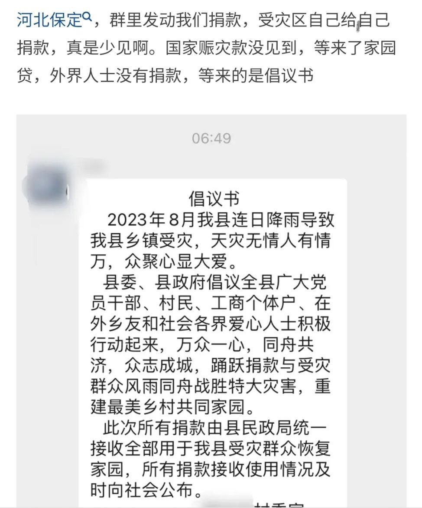  谁将十万横扫三江 北京时间 2023-08-31T20:30:22Z 1697225315532292246 网友投稿：宁上社会主义的班，不休资本主义的假 https://t.co/TY3UgieRID 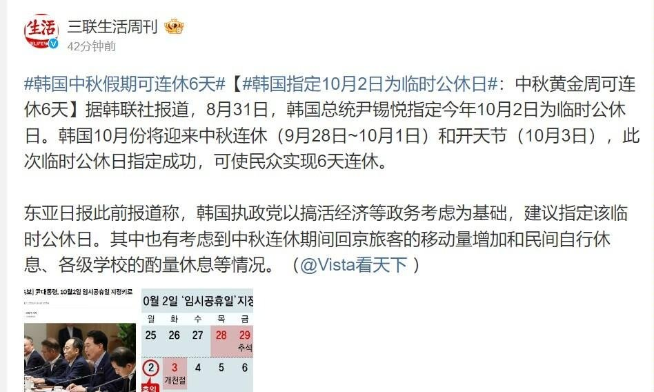  谁将十万横扫三江 北京时间 2023-08-31T09:26:53Z 1697058341728723295 湖北监利，学校说教育局下来个什么通知，逼着学生们吃学校的订餐。好多家长甚至还租好房子，是不是普通老百姓好压榨些？一下子改变计划让做家长们的接受不了。如果不是压榨那麻烦你们把火食费降低成本，本来如今钱也不太好挣。 https://t.co/uU26kFFwbw   谁将十万横扫三江 北京时间 2023-08-31T09:27:46Z 1697058564152738208 8月29、30日海口琼山，幼升小，小学分流，外地户口的，有的被划到60公里外就读，引起家长不满。

30日，家长去教育局抗议，有的跳楼有的堵路，买了房又交了社保，还是不能就近上学。晚上还在楼顶 https://t.co/2NnHXBD8Nr   谁将十万横扫三江 北京时间 2023-08-31T09:31:00Z 1697059377386328430 8月28日湖南永州泽远玩具厂，老板讲话不算数，工资也不发，也没电也没饭给员工吃 https://t.co/suxsHdRIel   谁将十万横扫三江 北京时间 2023-08-31T09:34:45Z 1697060321410843049 因为女孩子出生在河北，所以连长头发都成了奢求。河北教育局要求所有中学生都剪短头发
他们考虑的是方便管理，干部子弟学校，考虑的是服务 https://t.co/NjcR0NakjX   谁将十万横扫三江 北京时间 2023-08-31T09:11:48Z 1697054547972354213 8月30日，安徽合肥翠庭园小学，开学因新生过多，安排六年级学生在板房上课，没教室了，学校给二年级和四年级孩子安排的是从建到结束才好2天的房子，目前还没有完全完工，你会让孩子进入上课吗？刺鼻的的气味，我去呆一会就不舒服，喉咙疼，头疼，晚上回家还咳嗽，有的家长还过敏一身的疹子，还有发烧的。家长质疑有甲醛：待10分钟就头晕恶心。晚上家长叫校长出来，被警察维稳 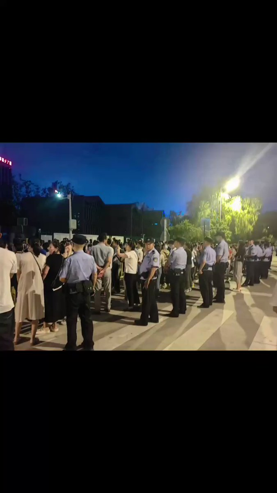  谁将十万横扫三江 北京时间 2023-08-31T08:38:50Z 1697046252024988080 “用人的公平有点小问题”，全是封建贵族在世袭罔替，为什么军队大校能出问题？将军都是什么人在做？全是吃老本，新人根本升不上去   谁将十万横扫三江 北京时间 2023-08-31T07:47:52Z 1697033423934947334 RT @whyyoutouzhele: 网友投稿
河北邯郸一家服装厂的工价
最高者仅为9元一小时，最低4元。
务工者多为中老年妇女 https://t.co/OzjCCnecWR 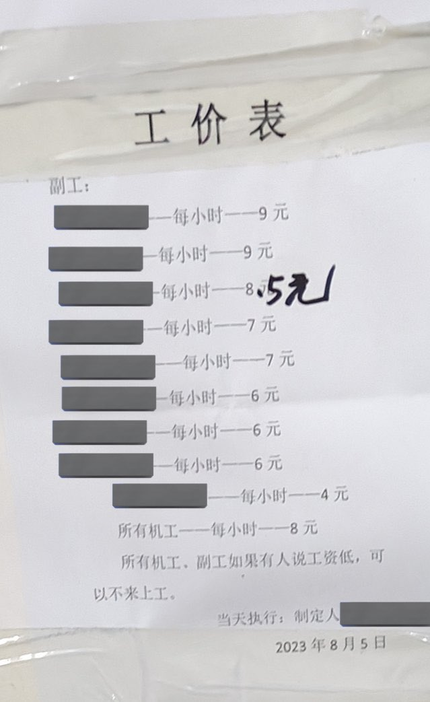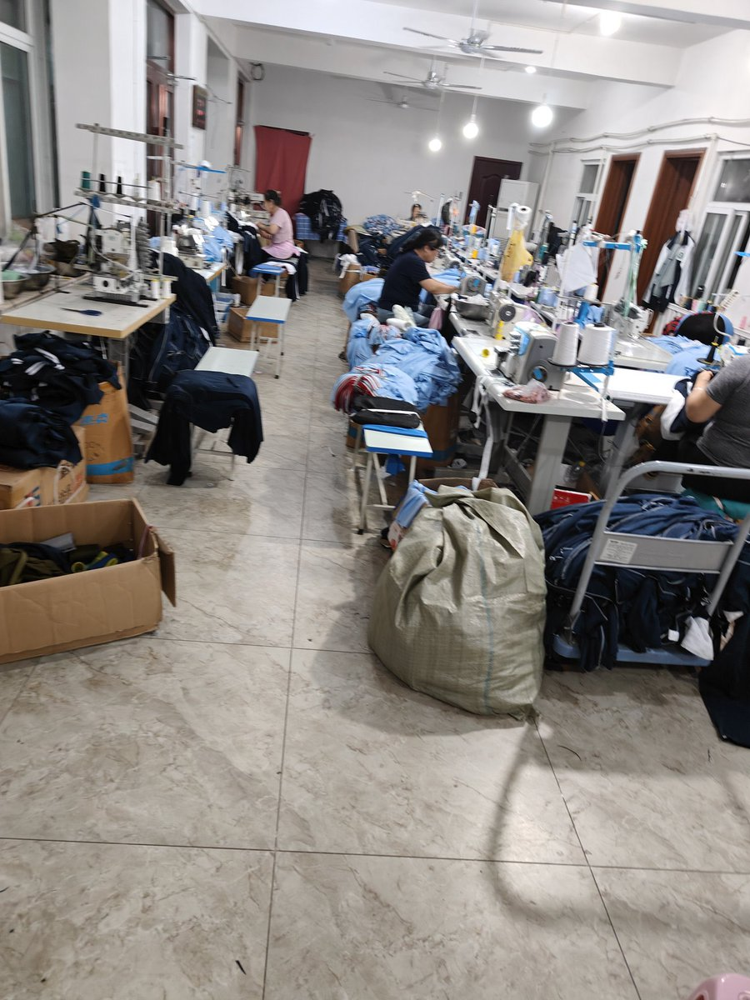  谁将十万横扫三江 北京时间 2023-08-31T07:54:29Z 1697035088226381870 8月24日、30日云南农民工去办公室敲盆讨薪 https://t.co/9Mb0Xe6Qt1 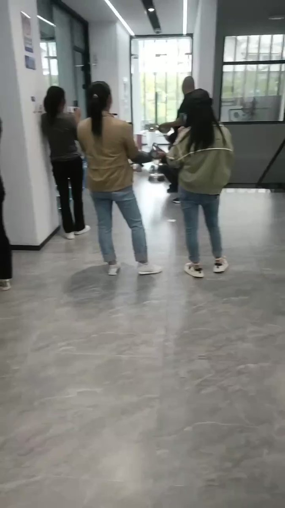  谁将十万横扫三江 北京时间 2023-08-31T07:56:02Z 1697035480276324378 这个也是鲁山的大佛，耗资2.8个亿，鲁山县还是贫困县，十几年维护花了十二亿，维护工作能传家了 https://t.co/qVYE5O3LE3 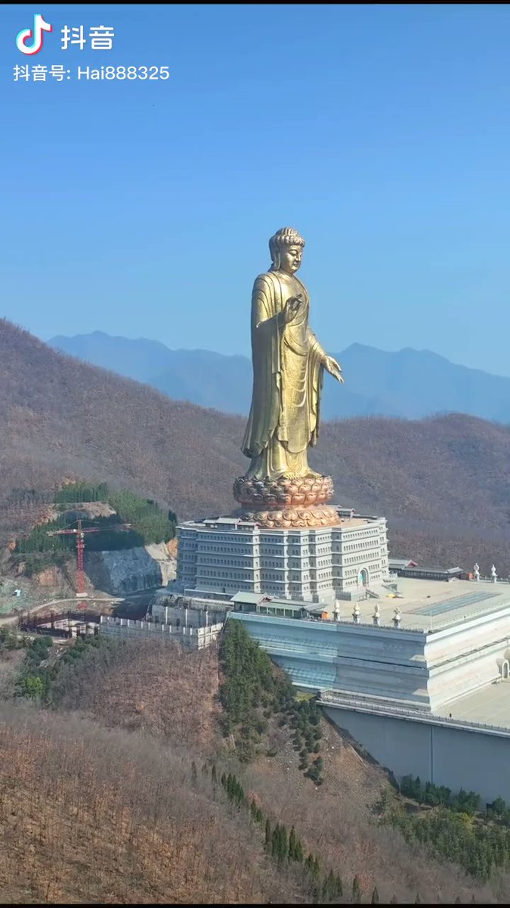  谁将十万横扫三江 北京时间 2023-08-31T08:17:57Z 1697040994645184540 RT @nursenika1840: 勃勃与齐太磊

勃勃相传有个局长爹，齐太磊确实有个农民爹

勃勃老家湖南人，齐太磊老家河南人

勃勃2006年读浙大物理系，齐太磊2010年读武大物理系（复读一年，第一年落榜天津大学）

勃勃本科毕业直接伯克利读博，齐太磊本科毕业，先在民企…   