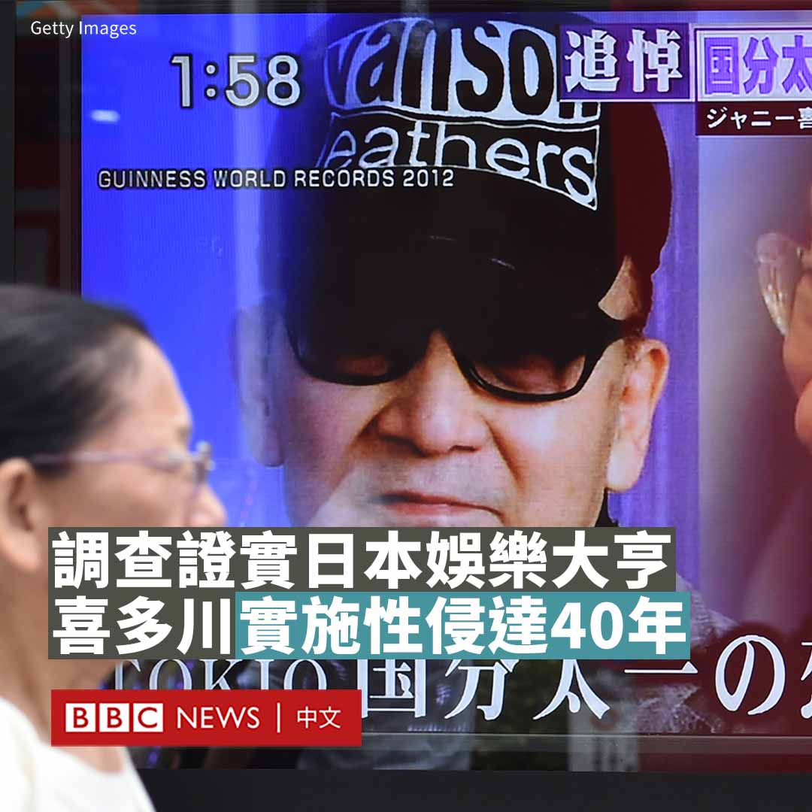
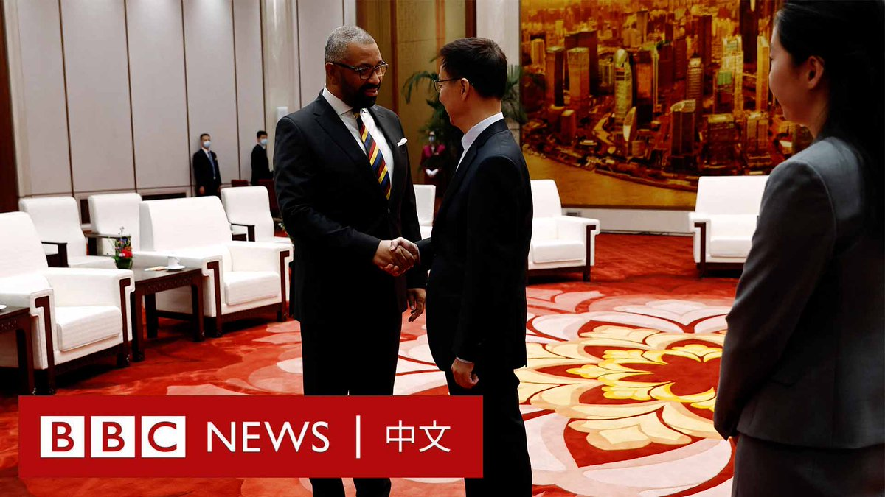

D英国广播公司BBC 北京时间 2023-08-30T20:30:10Z 1696862875992608860 五年来首次有英国外相访华之际，中国官媒《环球时报》公开要求大英博物馆向中国归还文物。社论给出的首要理由是博物馆最近曝光的监守自盗丑闻。https://t.co/BTsu8Nr9QG   D英国广播公司BBC 北京时间 2023-08-30T18:16:28Z 1696829230649405488 针对日本演艺经纪公司杰尼斯事务所（Johnny & Associates）的独立调查小组于周二（8月29日）发布报告，证实已故著名娱乐大亨及公司创办人强尼·喜多川在1970年代到2010年代曾经性侵多名男艺人。
 
调查小组表示，公司内部的家族式管理“是治理失效的最大原因”之一，因此要求现任杰尼斯事务所总裁藤岛茱莉景子必须辞职。藤岛是喜多川的侄女。

由该公司聘请的外部调查员还要求公司道歉，并向受害者赔偿。

调查小组由日本前检事总长林真琴、一位精神科医生及一位临床心理学家共同组成，他们访问了41人，包括23名受害者。

杰尼斯事务所在一份声明中道歉，并承诺在研究完该团队的报告后将召开新闻发布会。

调查小组发现，喜多川透过成立杰尼斯事务所，广泛地对“大量”年轻男性施以虐待。喜多川在2019年去世，享年87岁。

今年3月，BBC播出纪录片《捕食者：J-Pop的秘密丑闻》（Predator: The Secret Scandal of J-Pop）揭露了喜多川如何对十几岁的男孩进行残酷的性剥削和虐待，当中亦有受害人现身说法。此后，还有其他几名自称是受害者的人站出来。

8月初，联合国工商业与人权工作组的调查结果同样发现，喜多川曾猥亵数百名男孩，指日本演艺圈的工作环境使得性侵犯者可以逍遥法外。

小组表示，藤岛应该对这些虐待行为有所了解，但没有采取任何行动。

喜多川在日本拥有国宝级地位，曾打造出大量热门男子乐队，例如ARASHI（岚）和拥有木村拓哉的SMAP。喜多川本人也拥有多项世界纪录。虽然他生前就卷入性剥削的指控，但他从未走上法庭，日本媒体也大多保持沉默。   D英国广播公司BBC 北京时间 2023-08-30T15:02:16Z 1696780355808968950 【现场画面】英国外交大臣詹姆斯·克莱弗利（祁湛明；James Cleverly）访问北京，与中国国家副主席韩正会晤。 https://t.co/6WAVUcuTjT   D英国广播公司BBC 北京时间 2023-08-30T10:33:15Z 1696712655791431724 瓦格纳集团首领普里戈津（Yevgeny Prigozhin）在圣彼得堡被悄声下葬。BBC俄罗斯事务编辑罗森伯格（Steve Rosenberg）报导说，葬礼本身很低调，但墓地周围戒备森严。 https://t.co/RaHsx4DmEA   D英国广播公司BBC 北京时间 2023-08-30T11:59:33Z 1696734374346330452 【最新消息】英国外交大臣詹姆斯·克莱弗利（祁湛明；James Cleverly）抵达北京，与中国国家副主席韩正会晤。

克莱弗利表示，中国和英国定期面对面会晤以避免误解很重要，解决各国在双边关系中面临的挑战和意见分歧也很重要。

韩正表示，他希望通过相互尊重和务实合作，推动中英关系取得新进展。

克莱弗利原计划于七月底访问中国，但未能成行。他此行是五年来英国外相首次访华，也是五年来访华的最高级别英国官员。

敬请留意BBC News 中文的后续报导。   