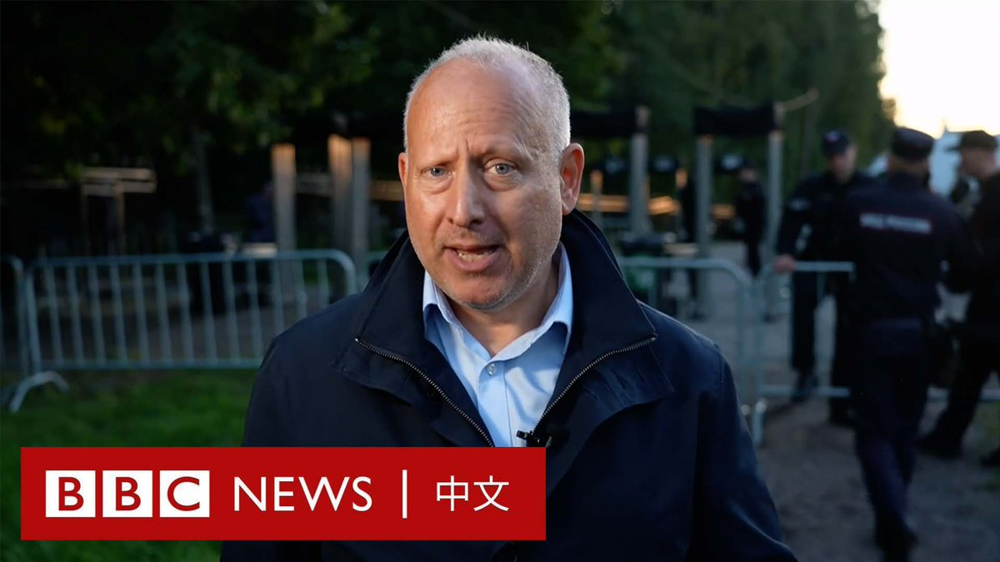
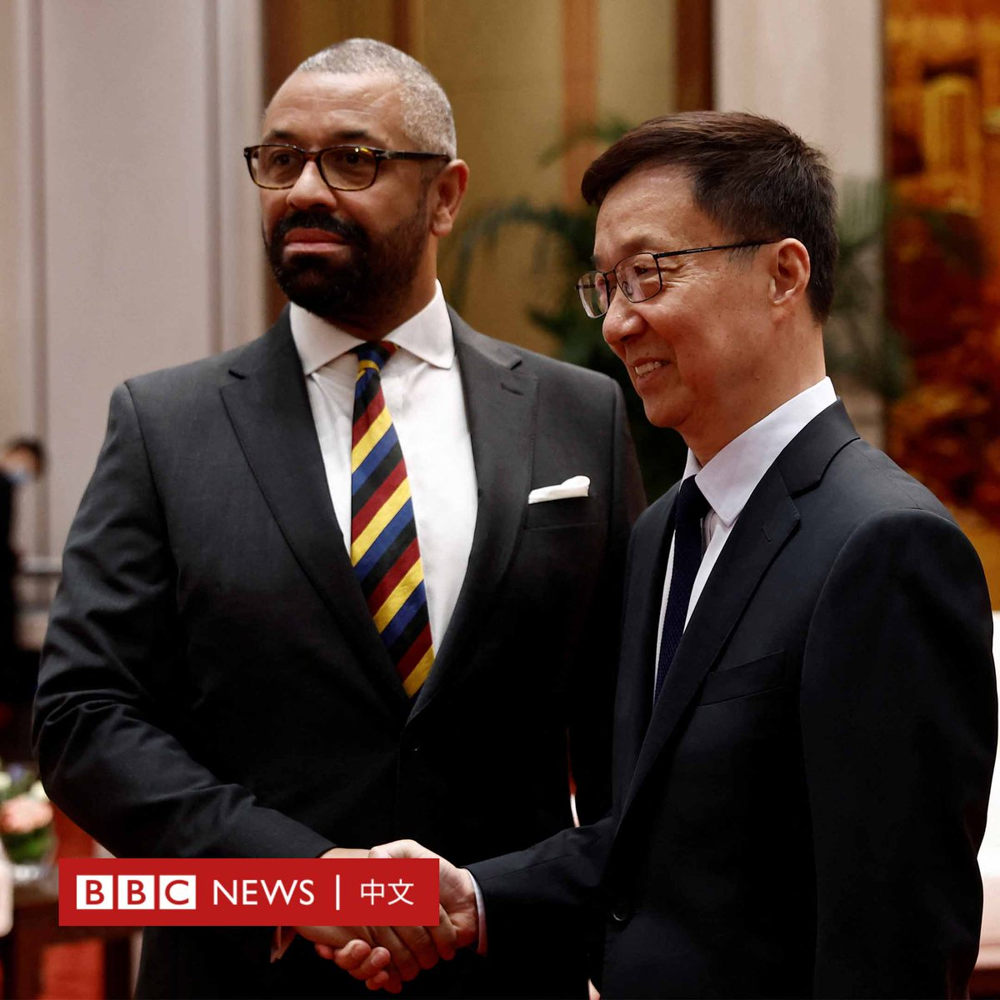

D英国广播公司BBC 北京时间 2023-08-30T10:33:15Z 1696712655791431724 瓦格纳集团首领普里戈津（Yevgeny Prigozhin）在圣彼得堡被悄声下葬。BBC俄罗斯事务编辑罗森伯格（Steve Rosenberg）报导说，葬礼本身很低调，但墓地周围戒备森严。 https://t.co/RaHsx4DmEA   D英国广播公司BBC 北京时间 2023-08-30T11:59:33Z 1696734374346330452 【最新消息】英国外交大臣詹姆斯·克莱弗利（祁湛明；James Cleverly）抵达北京，与中国国家副主席韩正会晤。

克莱弗利表示，中国和英国定期面对面会晤以避免误解很重要，解决各国在双边关系中面临的挑战和意见分歧也很重要。

韩正表示，他希望通过相互尊重和务实合作，推动中英关系取得新进展。

克莱弗利原计划于七月底访问中国，但未能成行。他此行是五年来英国外相首次访华，也是五年来访华的最高级别英国官员。

敬请留意BBC News 中文的后续报导。   