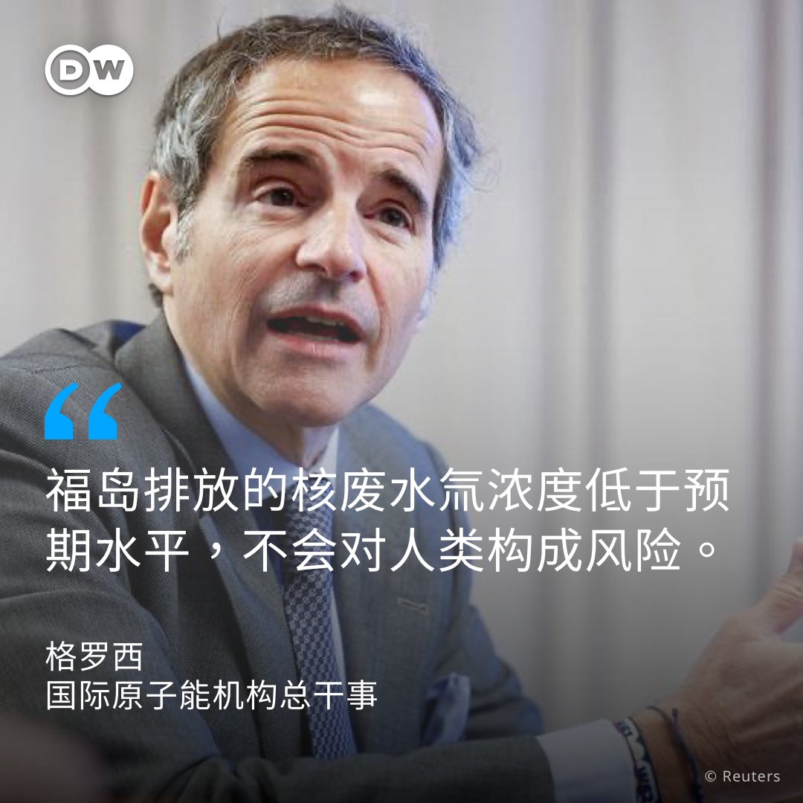

德国之声 北京时间 2023-08-30T15:02:31Z 1696780418534539274 针对🇷🇺莫斯科的无人机袭击越来越频繁。仅仅是高楼和商家聚集的莫斯科城，迄今已4次遭无人机攻击，这里也是两个俄罗斯部委的所在地。
专家指出，🇺🇦乌克兰希望通过无人机攻击传递一种具有媒体效应的信号——乌克兰不是坐以待毙，而是在对俄罗斯的侵略做出反应。
https://t.co/7f7mojTTZ4   德国之声 北京时间 2023-08-30T16:38:00Z 1696804448205439198 脸书母公司Meta于8月29日表示，近期共移除了大约7700个推广亲中言论的脸书账号，以及数百个页面、群组和Instagram帐户；这些帐户跟所谓的“垃圾信息伪装”（Spamouflage）有关，它们透过Meta的平台，暗中运作以提升🇨🇳中国的形象。
https://t.co/l1SowR1Rso   德国之声 北京时间 2023-08-30T17:22:35Z 1696815667314340090 国际原子能机构（IAEA）总干事格罗西表示，🇯🇵福岛第一核电站排放☢️废水的氚含量低于预期水平，对民众没有构成威胁。
格罗西在访问斯德哥尔摩时说，“我们迄今可以证实，这些废水的首批排放不包含任何有害水平的放射性核素。”
上周IAEA曾表示，经过独立分析，稀释后排放的核废水氚浓度远远低于每公升1500贝克勒尔的排放标准。
🔎回顾日本福岛核电站废水排海风波的来龙去脉👉https://t.co/n5AXGgaQO2   德国之声 北京时间 2023-08-30T19:58:00Z 1696854779929202698 【福岛核废水排放引发中国“反日潮”：日本社会舆论如何看待？】🇨🇳🇯🇵
日本政府从24日开始将福岛核废水排入海洋，对此中国政府予以大力谴责，中国各地也陆续开始出现杯葛日本产品运动，不少当地日本餐厅纷纷挂上“绝不使用日本食材”等文字，一场大规模排日抗议似乎已经蓄势待发。
https://t.co/xnw50esi99 https://t.co/1kIT1qOXw1   德国之声 北京时间 2023-08-30T20:52:00Z 1696868369603977718 【耳机耳塞会带来听力衰退的风险】
全球4.3亿人有听力障碍，10亿人面临听力衰退的风险。怎样正确使用耳机耳塞，才不会增大这一风险呢？
❗此刻正在塞着蓝牙耳机刷手机的朋友，让自己的👂休息一下吧~
#dwdigital https://t.co/wzIGFEvdrr   德国之声 北京时间 2023-08-30T21:18:00Z 1696874912680382930 印度外交部官员表示，🇮🇳对一张宣示了领土主张的新版🇨🇳中国地图提出抗议。
印度提出抗议的时机引人注目，因为下周G20峰会將在新德里举行，预计中国国家主席习近平将出席这场峰会。
https://t.co/JrUaTTkOMZ   德国之声 北京时间 2023-08-30T22:35:00Z 1696894290767540732 联合国一项报告指出，至少有12万人在缅甸以及大约10万人在柬埔寨被强迫从事网络犯罪活动。
联合国人权事务高级官员图尔克（Volker Türk）："他们是受害者，不是犯罪分子。当我们为那些网络诈骗的受害者们伸张正义的时候，也不应忘记，在这一复杂现象背后，存在两组受害群体。"
https://t.co/UDiudywVmX   德国之声 北京时间 2023-08-30T23:04:00Z 1696901589473144837 这些年来福岛一直努力摆脱☢️“核悲剧”这个代名词。当地居民说，他们已经慢慢恢复了元气。但是将核灾废水排入大海让福岛再度成为全世界的头条新闻。
福岛县渔业协同组合联合会会长野崎哲在发给德国之声的一份声明中重申，他反对“没有得到渔民和公众理解”的排海作业。
https://t.co/KCHjxP7UM2   