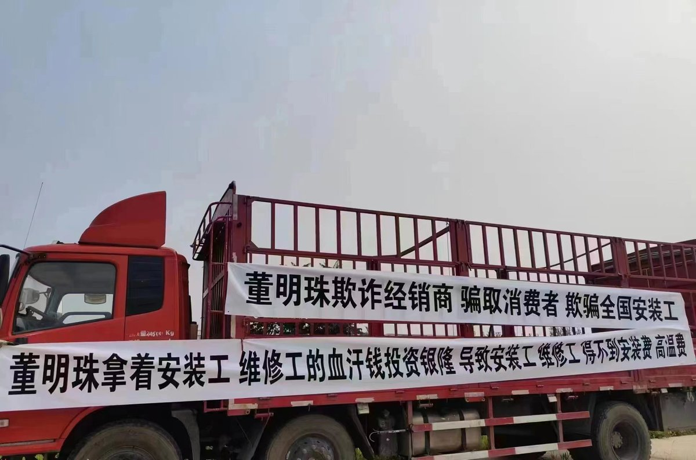
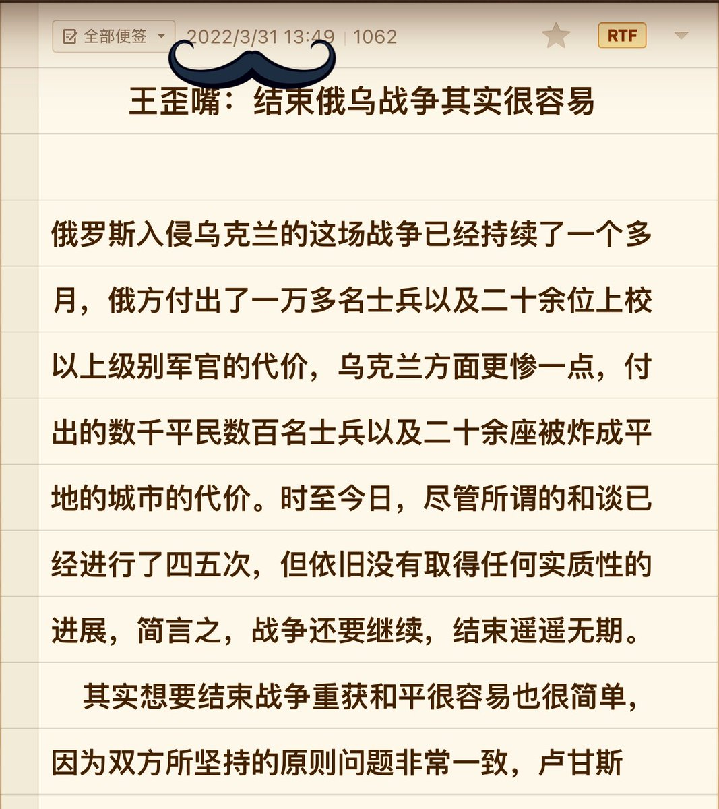

王歪嘴 北京时间 2023-08-30T16:45:04Z 1696806228180218223 这届人民实在太不像话了，一点儿觉悟都没有！
给民族企业干活儿，咋还有脸要钱呢？董大妈一个电话就能把你们全都送进监狱里去，接受党国再教育，不晓得你们怕不怕？ https://t.co/qYcTQ6zXcm   王歪嘴 北京时间 2023-08-30T10:32:33Z 1696712480129683920 王歪嘴：结束俄乌战争其实很容易

俄罗斯入侵乌克兰的这场战争已经持续了一个多月，俄方付出了一万多名士兵以及二十余位上校以上级别军官的代价，乌克兰方面更惨一点，付出的数千平民数百名士兵以及二十余座被炸成平地的城市的代价。时至今日，尽管所谓的和谈已经进行了四五次，但依旧没有取得任何实质性的进展，简言之，战争还要继续，结束遥遥无期。
    其实想要结束战争重获和平很容易也很简单，因为双方所坚持的原则问题非常一致，卢甘斯克、顿涅斯克（下面简称顿巴斯地区）以及克里米亚地区的领土主权。
    乌克兰方面认为顿巴斯与克里米亚地区是乌克兰领土，绝不允许任何国家侵占，也不会允许“分裂势力”在本国领土上高级俄国旗帜搞革命闹独立。
     俄罗斯方面认为顿巴斯地区以及克里米亚地区想要宣布独立合情合理合法，因为宣布独立之后再演一场全民公投的舞台剧就可以加入俄罗斯版图，所以本质上出兵入侵乌克兰是在保护俄罗斯的领土主权。
    什么北约东扩论、欧洲威胁论都是扯犊子，更别提什么围剿法西斯、消灭纳粹之类连普通傻逼都不会信的出兵借口了。乌克兰的顿巴斯地区以及克里米亚地区俄罗斯都惦记十几年了，培植势力团伙玩儿政治闹革命都以失败告终，乌克兰抓着领土主权死活不肯割让咋办？
   按照俄罗斯一贯作风，要么打到他跪地求饶主动割让，要么打死他，霸占他全家！所以说想要结束战争其实很简单，要么乌克兰宣布顿巴斯地区以及克里米亚地区自古以来就是俄罗斯的领土，外加缴械投降从此不再配置军队不再发展军事力量国家政权任由俄国处置。
    要么俄罗斯宣布战败将所有军事力量撤出乌克兰领土范围，承认卢甘斯克、顿涅茨克以及克里米亚地区是乌克兰领土，同时对屠杀的乌克兰军民以及摧毁的军事基地和城市建筑进行赔偿。
    老王预见到接下来的谈判双方第一次“重大让步”达成的共识，必然是乌克兰方面不追究俄方入侵的赔偿责任，俄方也不再勒令乌克兰解除武装不再坚持干涉乌克兰国家政权。    因为其余部分依旧属于原则性问题，除非普京主动或被动放弃坚持，亦或乌克兰人民被彻底击败再无反抗之力，否则依旧是没有任何达成共识的可能。
    上面这句话的意思是：俄罗斯总统普京可以为整个俄罗斯做主，乌克兰总统泽连斯基无权代表乌克兰人民投降。俄罗斯坚持的原因是最高统帅不允许，乌克兰坚持的原因是全国人民不同意。
    总之一句话：只要Putler还掌权，这场侵略战争就不会结束，只要乌克兰人不死光，Putler的苏联梦就不会实现。

文/王歪嘴
2022/03/31   