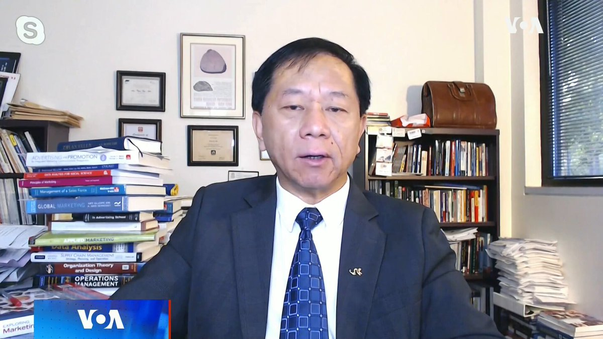
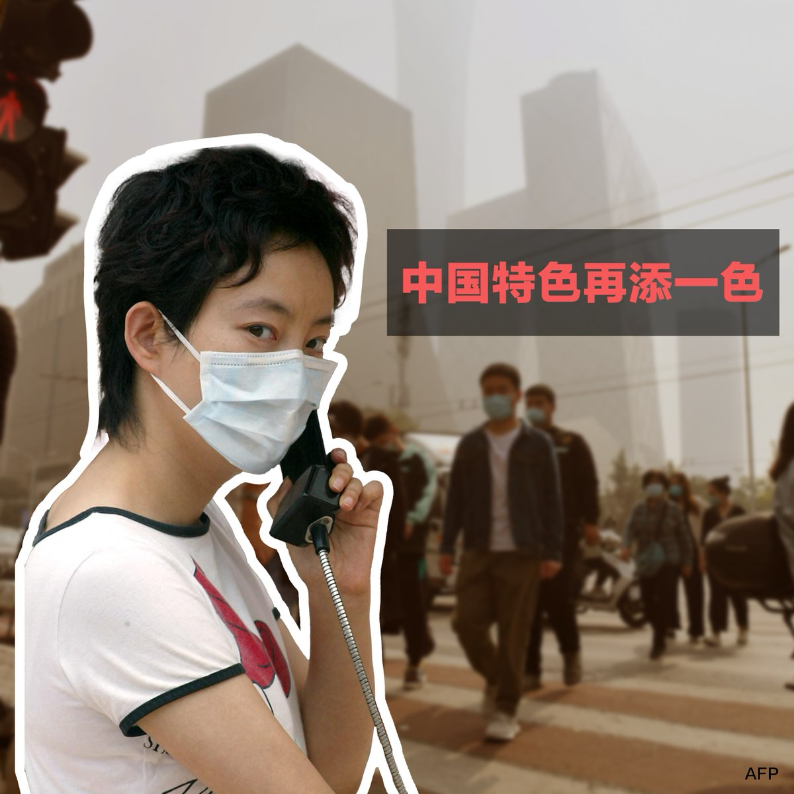
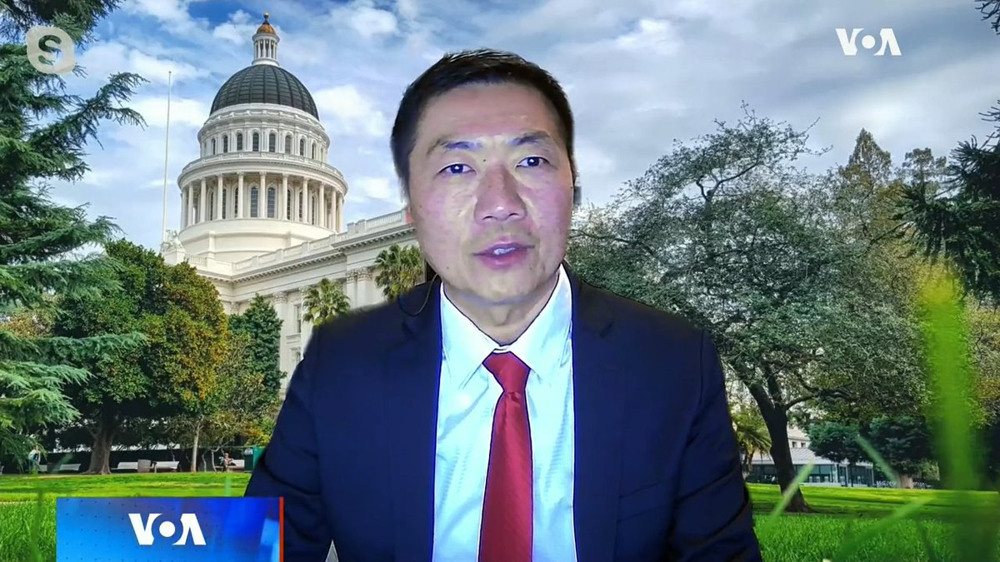
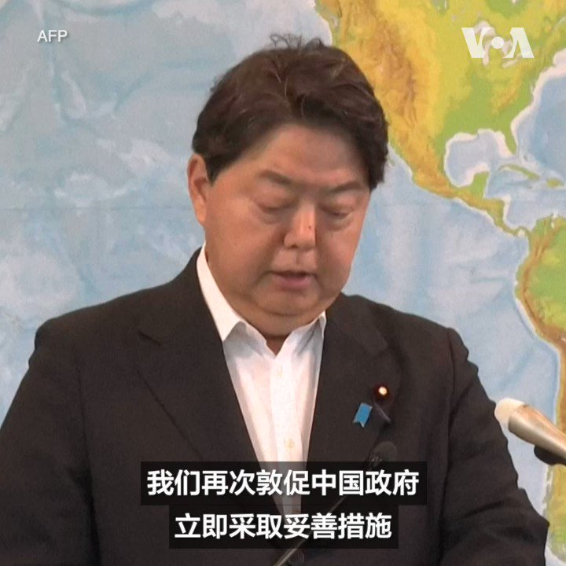
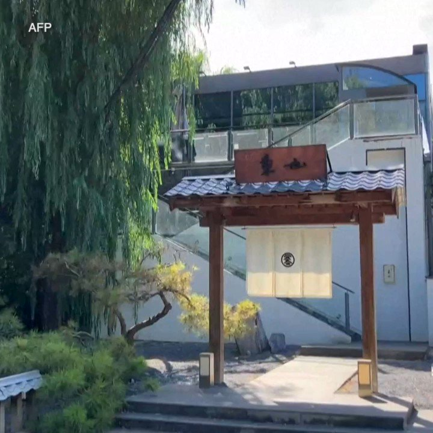

美国之音中文网 北京时间 2023-08-30T13:47:02Z 1696761425572876598 雷蒙多：许多美国企业反映无法在中国投资且风险太大 中方反驳 https://t.co/rnwLzTRrmT   美国之音中文网 北京时间 2023-08-30T13:54:48Z 1696763378532794394 29日晚上百名北卡罗来纳大学教堂山分校的学生在校园里集会，举烛悼念一天前被枪手杀害的该校副教授严资杰。活动主办人表示，也希望通过烛光悼念让大家畅所欲言，平复因枪击事件带来的不安。来自上海的大一新生乔治在枪击事件发生时正在案发大楼隔壁的图书馆自习，他对美国之音讲述了他的经历。 https://t.co/ikpUILDWKz   美国之音中文网 北京时间 2023-08-30T07:51:04Z 1696671843237937370 记者对话：驻华外媒记者的减少对所有人来说都是损失 https://t.co/Ud4qQ59NHZ   美国之音中文网 北京时间 2023-08-30T09:35:05Z 1696698020648362041 北卡大学枪击案嫌疑人齐太磊被继续关押不得保释 https://t.co/NLNO5Z58Bz   美国之音中文网 北京时间 2023-08-30T10:17:19Z 1696708646757884386 北卡罗来纳大学教堂山分校枪击案嫌疑人、34岁的中国留学生齐太磊被控一级谋杀罪。在29日的首次法庭听证上，法官下令将他继续拘押不得保释，将其下次出庭时间定在9月18日。齐太磊是北卡大学教堂山分校应用物理系博士生，涉嫌于28日下午枪杀自己的博导、该校副教授严资杰。报道：https://t.co/DgwqiiYynG https://t.co/zOlJ8pa3Wn   美国之音中文网 北京时间 2023-08-30T10:57:26Z 1696718743529816537 中国领导人习近平於金砖峰会上再提出140亿美金的外援。观察人士说，这笔资金中，少数无偿金援确有助贫穷国家重建疫后经济，但多数仍属有息贷款，若利息高、还款期短恐不具吸引力。他们说，面对欧美阵营的地缘围堵，习近平为了保政权，不惜“赔本”洒币，以“金钱外交”攻势，拉拢非洲等国。 https://t.co/H2gA7xBlPG   美国之音中文网 北京时间 2023-08-30T04:29:25Z 1696621095300878346 中国监管机构机构推出“认房不认贷”，试图激活房地产市场。南卡大学艾肯商学院讲座教授谢田说，这是强心剂，但更像是瘾君子给自己注射的毒剂，降低借贷门槛，反而害了借款人、贷款公司和房地产公司，制造次贷危机。  #完整版：https://t.co/DikTVuydBI https://t.co/AFvrNa0Zl2   美国之音中文网 北京时间 2023-08-30T04:34:34Z 1696622389780685105 脸书母公司删除7700多中国“垃圾伪装”账号，切断全球历来所见最大秘密影响力行动 https://t.co/cQoiTYR2FD   美国之音中文网 北京时间 2023-08-30T05:04:04Z 1696629813619105873 印度就地图问题向中国发出“强烈抗议” https://t.co/ecHdL6jUlg   美国之音中文网 北京时间 2023-08-30T07:51:02Z 1696671835629498610 中国将在华工作的外国人的税收减免延长至2027年 https://t.co/P5xtjeCw3i   美国之音中文网 北京时间 2023-08-30T08:04:03Z 1696675108914622559 美为乌再提供2.5亿美元军援，首含响尾蛇导弹，但有款武器却千呼万唤仍不见影 https://t.co/dRwURJduv0   美国之音中文网 北京时间 2023-08-30T09:35:03Z 1696698012503040226 巴基斯坦前总理汗判决被取消却依然被监禁 https://t.co/c9l315QjzY   美国之音中文网 北京时间 2023-08-30T10:20:06Z 1696709349358653642 佛罗里达州居民在飓风和风暴潮来临之前离开墨西哥湾沿岸 https://t.co/t2Vr5ESsl3   美国之音中文网 北京时间 2023-08-30T07:00:00Z 1696658991672369331 郭台铭宣佈参选、台湾在野阵营分裂，等于保送民进党上台？台湾2024总统大选如何牵动台海情势？习近平将收回台湾视为毕生使命，不断加强对台文攻武吓，把台湾民心越推越远，他才是真正的台独之父？周三【时事大家谈】欢迎留言参加讨论。 https://t.co/JIon5S22Gi   美国之音中文网 北京时间 2023-08-30T08:15:00Z 1696677864064917965 【家事国事天下事，你有何见解】许多国家许多人抗议环境污染，抗议核发电，这种环保抗议活动也发展为国内或国际政治运动，诞生出绿党这样的政党。以个人打电话骚扰他国企业或个人的形式进行抗议显然是别具一格的中国特色。这会在中国发展出环保运动和组织吗,会赢得世人赞叹还是会招致世人的嘲笑，不屑? https://t.co/8cI7TCuWdd   美国之音中文网 北京时间 2023-08-30T08:47:04Z 1696685934937505975 新加坡破获价值数亿美元的洗钱行动，据报所有被捕者皆源自福建 https://t.co/PpRoRFLy3K   美国之音中文网 北京时间 2023-08-30T09:03:04Z 1696689960487940143 联合国大会将举行，台湾提四诉求盼参与：联大2758号决议未授权中华人民共和国代表台湾 https://t.co/1r3Pu0pft4   美国之音中文网 北京时间 2023-08-30T01:58:02Z 1696583000455254017 印度密切关注中国和不丹的边界谈判 https://t.co/hxHuuwMGUg   美国之音中文网 北京时间 2023-08-30T03:22:05Z 1696604149389885502 美国商务部长雷蒙多在北京说，保护美国利益绝不妥协。可是之前，美国把27家中国实体移出美国出口管制。加州州政府研究首席廖启宏说，这并不是让步，谈判中让利是正常操作，也避免中国面对经济压力和社会矛盾，把焦点转向军事冲突。 #完整版：https://t.co/DikTVuydBI https://t.co/QzDvxuEt3K   美国之音中文网 北京时间 2023-08-30T04:22:33Z 1696619367415550323 国际原子能机构总干事：福岛废水无毒 https://t.co/0eN1dNEi3o   美国之音中文网 北京时间 2023-08-30T04:34:35Z 1696622397422702912 柬埔寨牙医诊所袭击事件中被劫走的台湾籍囚犯与10名同伙被捕 https://t.co/scABP37m7j   美国之音中文网 北京时间 2023-08-30T06:17:04Z 1696648184385134824 瓦格纳集团首领普里戈津被私下埋葬，终止他动荡的旅程 https://t.co/AFxTQF715X   美国之音中文网 北京时间 2023-08-30T01:49:03Z 1696580739918135586 日本外务大臣林芳正8月29日敦促中国政府采取措施，避免两国紧张关系升级。日本政府当日还表示，针对北京以福岛核处理水排海为由对日本水产品实施进口禁令，日本可能会向世贸组织提出诉讼。报道：https://t.co/qQV9rfT5YG https://t.co/hh0B9kg6rg   美国之音中文网 北京时间 2023-08-30T02:24:33Z 1696589671604588790 【家事国事天下事，你有何见解】许多国家许多人抗议环境污染，抗议核发电，这种环保抗议活动也发展为国内或国际政治运动，诞生出绿党这样的政党。以个人打电话骚扰他国企业或个人的形式进行抗议显然是别具一格的中国特色。这会在中国发展出环保运动和组织吗,会赢得世人赞叹还是会招致世人的嘲笑，不屑? https://t.co/lIg0pspkgv   美国之音中文网 北京时间 2023-08-30T03:37:03Z 1696607915220807900 美国众议院二号共和党人斯卡利斯确诊罹患血癌 https://t.co/rJSjHUmTHb   美国之音中文网 北京时间 2023-08-30T03:52:06Z 1696611706464583689 纽约曼哈顿中城一条127年历史的主水管8月29日凌晨发生爆裂，导致附近街道和纽约市地铁线枢纽42街/时报广场站被淹。事故发生后，工人在40街和第七大道路口把路面挖开，对这条老旧的管线进行了封堵。市政官员说，当天中午，从管线下方行驶的三条地铁线已经部分恢复通车。 https://t.co/geLVFj3JLK   美国之音中文网 北京时间 2023-08-30T00:30:03Z 1696560856425812442 孔子学院名亡实存 美国民间组织继续“追杀” https://t.co/Si2Gt2KJ1C   美国之音中文网 北京时间 2023-08-30T01:14:04Z 1696571932819550398 香港民主派初选47人案暂押后至11月底结案陈词 或影响黎智英国安案再押后 https://t.co/xqIKRo0Ugv   美国之音中文网 北京时间 2023-08-30T01:29:34Z 1696575834860163497 英国外交大臣时隔五年后首次访华，能否降低紧张改善关系受关注 https://t.co/Wlo42BEt5e   美国之音中文网 北京时间 2023-08-30T01:30:02Z 1696575951822352392 日本福岛第一核电站启动排放核处理水之后，引爆中国人的反日情绪，日本驻华大使馆和日本人学校甚至遭人投掷石头攻击。一位在北京经营高档寿司店的日本业主8月29日在接受法新社采访时谈到他的个人经历。报道：https://t.co/hsyZZrb7UE https://t.co/KiBJOjUq2E   美国之音中文网 北京时间 2023-08-30T01:42:34Z 1696579104215273776 北卡大学枪击案嫌疑人被控一级谋杀罪，警方将审讯被告了解动机 https://t.co/l9AjbsK9Qu   美国之音中文网 北京时间 2023-08-30T01:58:04Z 1696583008265048305 再增资百亿美元金援非洲 分析:习近平赔本撒币、扩大非洲影响力 https://t.co/Uz9zgxTwZx   美国之音中文网 北京时间 2023-08-30T00:01:34Z 1696553688649609527 为鼓励早婚早育，中国地方政府违背上意大搞“现金刺激” https://t.co/ujFdiZCcBW   