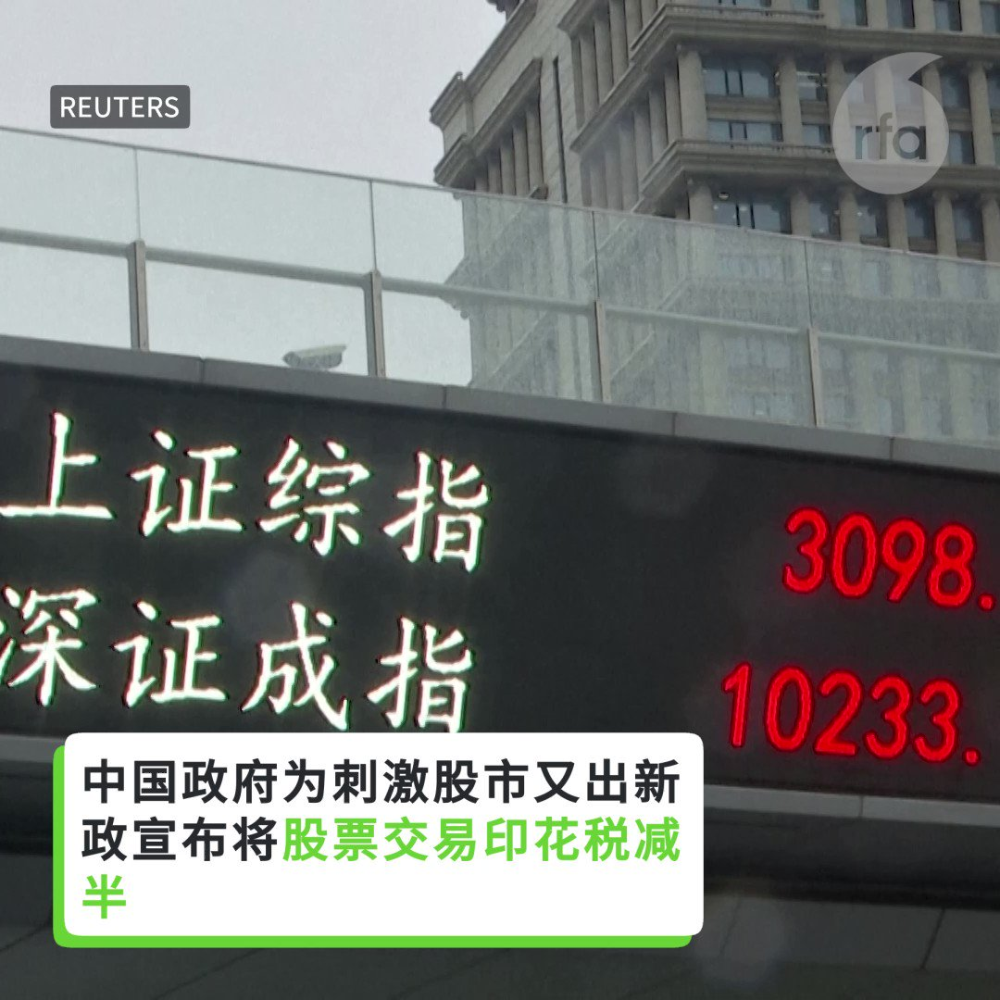
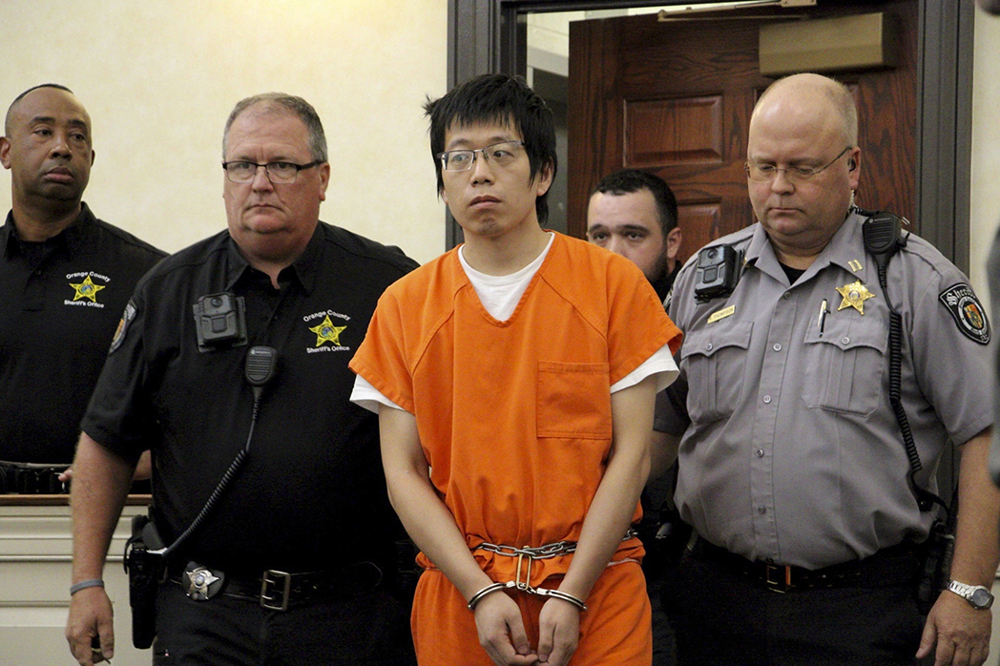

自由亚洲电台 北京时间 2023-08-30T02:37:51Z 1696593019120783719 【#变态辣椒：洪家的游戏】
 #洪森 的长子首相 #洪马内 上任后誓言要促进善治，并在2050年将柬埔寨变成一个高收入国家。批评者称，洪马内将因腐败、裙带关系和威权主义这些他父亲所留下的遗产而受挫。 洪森仍将是洪马内内阁的幕后掌权者，而内阁成员都是创建柬埔寨政体的退休官员的后代及亲属。 https://t.co/iRwG3x4Lk3   自由亚洲电台 北京时间 2023-08-30T03:17:06Z 1696602895171666180 【中国股市电击疗法 管用吗？】
为刺激股市，中国政府股票交易印花税减半，3招稳定股市。 https://t.co/9rdeC6Teb4   自由亚洲电台 北京时间 2023-08-30T04:29:06Z 1696621015051407473 美国民间组织 #亚洲协会 北加州分会于8月28日举行了名为《风云变幻：报道中国的不断变化》（Shifting Landscapes: the Changing Face of Reporting on China）的线上讨论会。多位 #美国记者 在会上讨论了近年来随着美中关系的紧张，他们在华从业环境的变化。

 https://t.co/JIkFpujZyX   自由亚洲电台 北京时间 2023-08-30T05:24:37Z 1696634988362600580 中国针对 #福岛核电站 排放废水而全面禁止日本水产品进口后，日本政府29日表示，可能就此向WTO提出申诉。
近年来，中国当局在涉及新冠病毒溯源、台海局势及人权等问题上往往出于政治目的而采取经济胁迫甚至霸凌行为。那么，#国际仲裁机制 能够改变北京的行为方式吗？

 https://t.co/UoxPBxbGO2   自由亚洲电台 北京时间 2023-08-30T05:28:53Z 1696636059709476871 评论 | 王丹 @wangdan1989：#医药业反腐 是新的"三反五反"运动   自由亚洲电台 北京时间 2023-08-30T06:00:01Z 1696643895847796879 专栏 | #周末茶馆：#保北京 #雄安 牺牲河北说法没依据吗？#洪灾 教训反思

 https://t.co/OwqW6wCy2c   自由亚洲电台 北京时间 2023-08-30T00:37:37Z 1696562760807600609 【哪里才是大局？| “#动物庄园”动画剧场】
龙家老说“大局”，"大局"到底在哪儿？全国各地都吃亏，难道只有中南海是”大局“？！ https://t.co/2c6CB7UPjp   自由亚洲电台 北京时间 2023-08-30T03:13:54Z 1696602092423745810 联合国在8月29日的一份报告中称，数十万人被犯罪团伙贩卖，被迫在诈骗中心工作。大多数受害者来自东南亚国家以及中国、台湾等，也有一些是从遥远的非洲和拉丁美洲招募的。 https://t.co/WvKBF2km68   自由亚洲电台 北京时间 2023-08-30T03:18:50Z 1696603333157347530 【什么仇什么怨？中国留学生涉嫌枪杀华人导师】

据美联社报道，美国北卡罗莱纳州立大学教堂山分校周一（8月28日）下午发生一起枪击案件，学校一名华裔教授被枪杀，嫌疑人是一名中国留学生。北卡大学为此在周二全天关闭了校园。

枪击事件发生在主校区核心区域的一栋科学大楼中。在枪击事件被上报后一个半小时，嫌疑人就被警方抓获。据警方通报，嫌疑人是在该校应用物理系就读博士项目的中国留学生齐太磊（Tailei Qi），而被杀的是他的指导教授严资杰（Zijie Yan）。警方在周二宣布对齐太磊提起了一级谋杀的指控。但他为何实施这一被指控的行为，警方并没有披露。

报道指出，齐太磊去年刚刚加入严资杰的纳米材料研究小组。严资杰在加入北卡大学前，曾在克拉克森大学（Clarkson University）担任助理教授。

本台记者在福克斯新闻网披露的齐太磊的推特页面上看到，他最后一篇推文是转发了8月4日发布的中国东北部暴雨的一个视频。此前在一些推文中，他曾对博士就读期间的劳累表示抱怨。

齐太磊的一位同学匿名接受采访时称，齐太磊很安静，看起来很善良；难以想象他会做这样的事情。

据“世界新闻网”报道，河南省当地官媒大河网披露，齐太磊出身农村，此前曾在武汉大学就读物理专业。   自由亚洲电台 北京时间 2023-08-30T03:50:10Z 1696611216909807827 近年来，中国当局阻挠台湾参与国际事务的状况日趋严重，如何拓展国际空间已成为台湾面对的迫切问题。
8月28日，美国华盛顿智库威尔逊中心（Wilson Center）就此召开研讨会，与会学者针对 #台湾的国际参与问题 进行了分析并提出建议。

 https://t.co/mAQN74l9ZF   自由亚洲电台 北京时间 2023-08-30T04:06:41Z 1696615374576554500 8月29日，国际社交媒体平台"#脸书"（Facebook）的母公司Meta宣布，数千个与中国政府有关的可疑账户已被移除，而这些账户是中方影响网络舆论行动的一部分。
有学者指出，#推特 (现在的X ) 才是中国网络水军的重灾区。

 https://t.co/hWgTs1gDUa   自由亚洲电台 北京时间 2023-08-30T02:10:52Z 1696586229658292634 Meta的高管表示，这一 #亲中虚假宣传网络 已经成为迄今为止最大的跨平台影响行动，至少在50个服务平台上存在，包括Medium、Reddit、Quora和Vimeo等较小的平台。虚假帐号主要来自中国的不同地区，但共享数字基础设施，并且似乎按照明确的轮班模式运作。
宣传效果如何？  https://t.co/0mxpSfsRXz   自由亚洲电台 北京时间 2023-08-30T00:12:25Z 1696556420013998569 香港国安再针对香港的公民团体出手，连不涉及政治的撑粤语团体"#港语学"也宣布停运解散。
身在海外的"港语学"主席陈乐行表示，事件反映港府已把致力 #撑粤语，视作煽动和分离主义行为。
评论指出，港府连串针对不同文化范畴的行动，是想消灭香港的独有文化。

 https://t.co/bCH6sk4tOT   