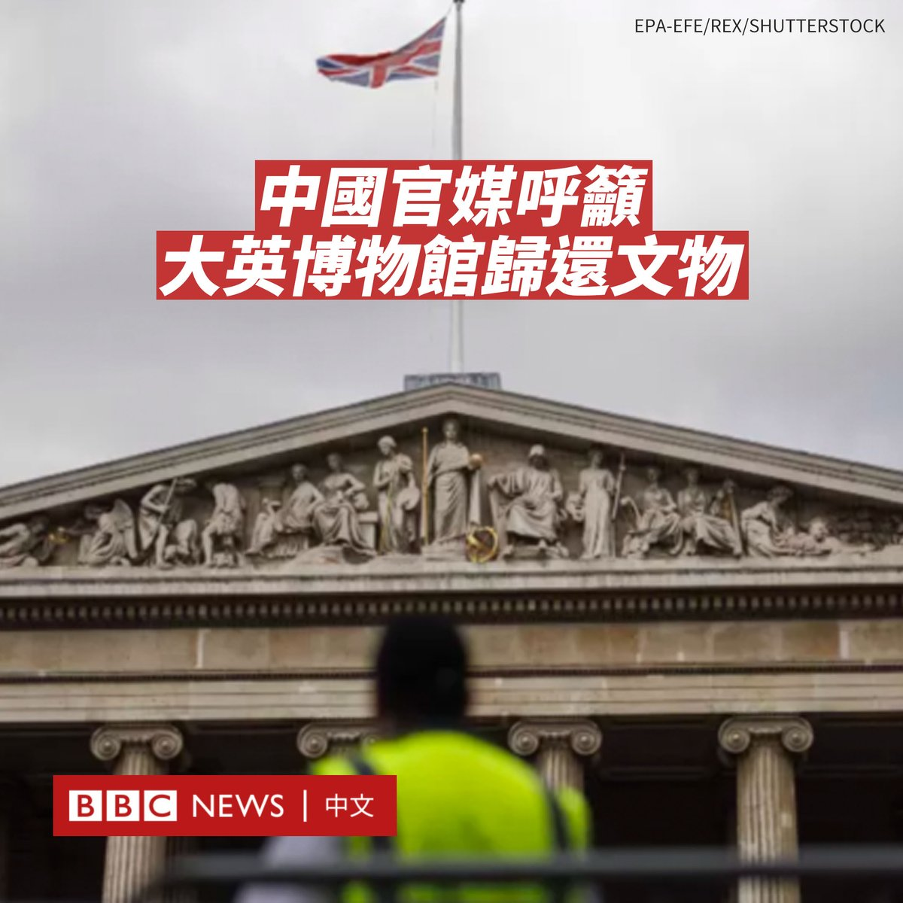
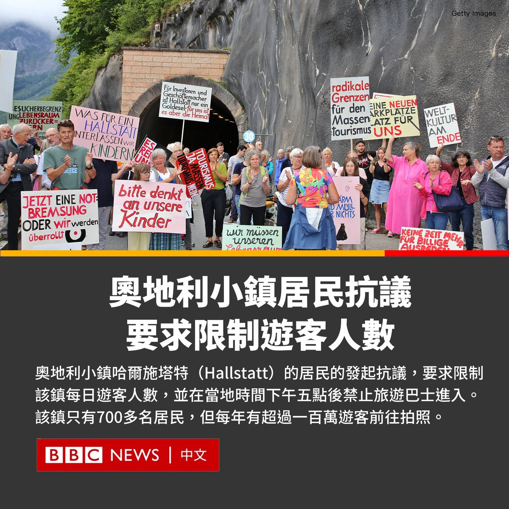

D英国广播公司BBC 北京时间 2023-08-29T11:37:03Z 1696366325520843041 在大英博物馆近2000件文物被指失窃后，中国官方媒体《环球时报》呼吁大英博物馆无偿归还中国文物。

这一话题在社交媒体引发热议，一度成为微博最热门的话题。

《环球时报》周日（8月27日）晚发文称：“大英博物馆没有保管好的、弄丢弄坏的，其实主要是属于其他国家的文化财产，这怎能不让人心疼。”

该社论写道，大英博物馆里约2.3万件来自中国的文物是如何被该博物馆获取的可能难以追溯，但“它们大多都是当年英国趁人之危、趁火打劫，甚至直接对中国制造劫难趁机劫掠或盗取得来的”。

大英博物馆尚未回应BBC的置评请求。

两周前，大英博物馆有约2000件文物被报告“失踪、被盗或损坏”，这让该博物馆一直面临质疑。

该博物馆的一名员工被解雇，博物馆馆长哈特维格·费舍尔（Hartwig Fischer）也宣布辞职。

《环球时报》在社论中称，“这次丑闻所暴露出来的大英博物馆在文物管理和安全防护方面的巨大漏洞，令一个流传很久很广的说法不攻自破，即’外国文物在大英博物馆得到了更好的保护’。”

“只要英国不能证明哪一件藏品来自合法、干净的渠道，那么这件藏品的母国就有权利去追索。”作者补充道。

在微博上，很多网友响应该报纸的呼吁。有网友称，这些文物是“英国犯罪的象征”。还有网友写道：“没有一个中国人能笑着走出大英博物馆。”

虽然有数以万计的人表示支持，也有网民质疑当局正在中国和西方关系恶化的情况下，操纵民族主义情绪。

不过，要求大英博物馆归还文物的情绪并不局限于中国。在文物疑似被盗事件发生后，一些其他国家也表示大英博物馆不再被信任。

希腊政府一直要求大英博物馆归还帕特农神庙的埃尔金石雕，在此案发生后再次提出要求。

尼日利亚官员还呼吁大英博物馆归还贝宁王国的数百件青铜器。1897年，英国军队入侵现在位于尼日利亚境内的贝宁王国，这些文物被从贝宁城运走。   D英国广播公司BBC 北京时间 2023-08-29T10:10:26Z 1696344529153200260 被喻为奥地利最美小镇的哈尔施塔特（Hallstatt）的居民发起抗议，要求限制该镇每日游客人数，并在当地时间下午五点后禁止旅游巴士进入。

哈尔施塔特是联合国教科文组织世界遗产，只有700多名居民，但每年接待的游客约100万人。

尽管旅游业对哈尔施塔特的经济发展有利，但一些当地居民表示游客数量过多。今年5月，该镇居民在热门拍照地点竖起了围栏，以阻止游客拍摄阿尔卑斯山的照片。

哈尔施塔特是一个风景如画的小镇，坐落在一片原始的高山湖泊畔，周围环绕着峭壁嶙峋的山脉，被认容为迪士尼电影《冰雪奇缘》的灵感来源。

2006年，该镇在一部韩国浪漫爱情电影中出现，提升了它在亚洲的知名度。2012年中国广东惠州市斥资60亿元人民币在中国“复制”了该小镇，哈尔施塔特镇长当时飞往中国参加开幕礼。

作为欧洲最过度旅游的目的地之一，一些当地居民表示游客数量过多，特别是那些乘坐大型巴士前往该镇进行一日游的游客。

目前，就像威尼斯和其他受到过度旅游影响的地方一样，哈尔施塔特似乎不得不忍受其受欢迎度所带来的利弊。   D英国广播公司BBC 北京时间 2023-08-29T09:06:54Z 1696328538691940776 中国香港特区立法会议员李梓敬是《香港国安法》坚定的拥护者之一。外界认为香港的民主运动在该法下已几近被歼灭，但这有否让外来投资者却步？ @BBCHARDtalk 连线对谈李梓敬。https://t.co/8O9mr8KyFz   