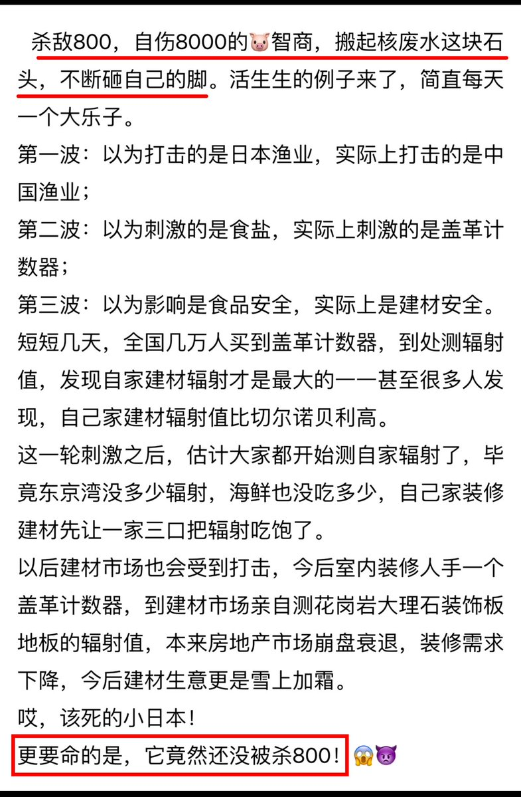

Petrichor 北京时间 2023-08-29T04:40:49Z 1696261576368550109 朋友是，花岗岩特别是颜色发红的花岗岩反射性强度很大的。盖格计数器证明这一点。 https://t.co/PTrSjfrduM   Petrichor 北京时间 2023-08-29T09:27:10Z 1696333637208141828 加拿大，深更半夜，一位中国大妈，像幽灵一样进入当地华人后院菜园子偷冬瓜、苦瓜，然后骑电单车离开。各回各家，各管各妈。 https://t.co/0XuozQC16B   Petrichor 北京时间 2023-08-29T09:41:03Z 1696337133588341145 这年头的中国，好人做不得，同情心会被坏人利用。大家警惕啊，千万小心。 https://t.co/80OsjeaBRS   Petrichor 北京时间 2023-08-29T10:46:28Z 1696353596546162970 日方有责任保证中方使领馆免受电信骚扰，但是驻日中国使馆的通信业务又属于中国的主权范围。骚扰电话在技术上跟普通电话没有区别，日方怎么在不了解通信内容的情况下鉴定哪一个来电是骚扰性质？ https://t.co/jStpfsrgx9   Petrichor 北京时间 2023-08-29T04:49:08Z 1696263667556250024 中共建国以后长期实行严格的户籍制、属地制、档案制，是对人民自由迁徙的空间制约。归根结底，是对人类自由本质的系统性、体制性侵夺。邓江胡时代，约🈶️松动。只有彻底地做到自由迁徙，才能释放整个国家经济建设最深厚的人口红利和整个民族最长远的精神红利。因为，在本质上，它所释放的是公民谋生权背后更普遍的自由选择权。

作为社会生产力最核心、最活跃的要素——劳动者，能否自由地支配自己的劳动，正是从奴隶到自由人的决定性一步。而人的解放所焕发出的积极性和创造性，必然带来物质财富的极大丰富，物质的极大丰富又必然带来消费者更加广阔的选择权。   Petrichor 北京时间 2023-08-29T05:14:15Z 1696269992201732290 爱因斯坦的论文中只有一篇经历过同行评议，并且这令他感到十分惊讶和不安，最后他将文章发表在另一个期刊上。 https://t.co/7GUzRkNarL   Petrichor 北京时间 2023-08-29T05:38:57Z 1696276205446512721 生命的奇妙。

 https://t.co/jEDf6Pf58J   