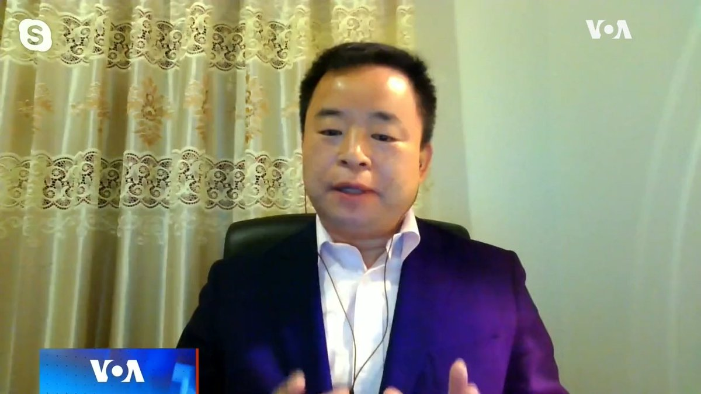
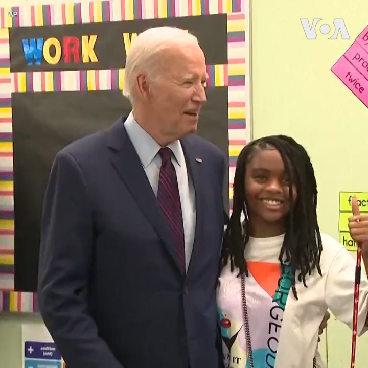

美国之音中文网 北京时间 2023-08-29T17:30:04Z 1696455165468131468 美国务院据信已选定资深外交官接管对华政策 或兼管中国组 https://t.co/dCZDwp3Qqv   美国之音中文网 北京时间 2023-08-29T16:59:34Z 1696447488461570186 雷蒙多：美国永不寻求与中国经济脱钩 https://t.co/MsBhfHwYbP   美国之音中文网 北京时间 2023-08-29T18:18:33Z 1696467367025627518 指责美日韩联合军演 金正恩称朝鲜海军将成为国家核遏制力的组成部分 https://t.co/K9gPzdjoY8   美国之音中文网 北京时间 2023-08-29T15:18:03Z 1696421943564751322 美国防部副部长：美军能用可消耗与可快速复制的自动化装备战胜中国的数量优势 https://t.co/O9YpCy4m5N   美国之音中文网 北京时间 2023-08-29T13:06:04Z 1696388724790280486 福岛核处理水排海 中日互控骚扰 日首相要求确保在华日侨安全 https://t.co/5FPiAcDMtm   美国之音中文网 北京时间 2023-08-29T07:07:03Z 1696298376998879337 麦考尔议员批评美中成立商务工作组是“幼稚”和“危险”的 https://t.co/U9EOsncHVh   美国之音中文网 北京时间 2023-08-29T09:42:34Z 1696337514813108298 研究显示中国是俄罗斯无人机关键部件的主要供应国 https://t.co/3KKeuwGrKA   美国之音中文网 北京时间 2023-08-29T11:25:02Z 1696363302732136874 雷蒙多访华促成美中新建沟通渠道，但紧张关系尚难真正缓解 https://t.co/pOYRAlht70   美国之音中文网 北京时间 2023-08-29T11:32:37Z 1696365207998632021 北卡罗来纳大学教堂山分校28日下午发生枪击案。官员表示，该校一名教职员工丧生，没有其他伤亡。但校方未公布受害者身份。嫌疑人的名字也未正式公开，不过警方在事发时公布的嫌疑人照片与该校一名中国留学生的相片吻合。目前尚不清楚作案动机。学校宣布当天之后及第二天停课。https://t.co/OgYvqHaU8R https://t.co/w5Oi8L5wpa   美国之音中文网 北京时间 2023-08-29T05:20:33Z 1696271577594413355 推特上的中国：美商务部长访华同时引起乐观与担忧 https://t.co/vJmGybSlCZ   美国之音中文网 北京时间 2023-08-29T05:20:37Z 1696271592668741676 中国还是发展中国家吗？ https://t.co/2FViVyXnq1   美国之音中文网 北京时间 2023-08-29T07:36:03Z 1696305676652306547 福岛排水后中国反日情绪高涨 https://t.co/6WBa6mFMo8   美国之音中文网 北京时间 2023-08-29T07:50:03Z 1696309196701192335 北卡大学教堂山分校一教职员在枪击案中丧生，事发时公布的嫌疑人照片与某中国留学生照片相符 https://t.co/Qk2XRyyDgt   美国之音中文网 北京时间 2023-08-29T07:50:04Z 1696309204007756161 法官将特朗普选举干扰案审判日期定于明年3月4日 https://t.co/ITcC2ajfTF   美国之音中文网 北京时间 2023-08-29T09:00:00Z 1696326803865194895 一键解锁#美国热搜 榜 1、帝吧出征新形态，打国际长途骚扰日本人2、为什么改革开放四十年却国富民穷？3、习近平的福利主义恐惧症4、习近平金砖之旅的豪华排场5、爱国大V借机兜售食盐6、中草药抗核辐射？7、胡锡进倡导不育中年可吃国产海鲜8、中国渔业业者欲哭无泪 https://t.co/wWM6acAXjG https://t.co/q3IaF4n74a   美国之音中文网 北京时间 2023-08-29T09:59:02Z 1696341659943080300 美国会研究处报告：面对中国军事压力美台各有不同挑战须克服 https://t.co/kjkHJZr3qz   美国之音中文网 北京时间 2023-08-29T05:20:35Z 1696271585286701502 瑞典指控一名男子为俄罗斯对瑞典和美国进行间谍活动 https://t.co/YHsXOnMJER   美国之音中文网 北京时间 2023-08-29T05:36:03Z 1696275477194031260 伊朗说，伊拉克同意解除库尔德斯坦激进分子的武装并使之迁移 https://t.co/mvuVS51rSu   美国之音中文网 北京时间 2023-08-29T06:30:00Z 1696289054101262367 海水是相通的，中国禁止日本海鲜，俄罗斯和中国海域的海鲜就安全？中国独立作家慕容雪村认为，没有科学依据的决策必将反害到自己，制裁日本最终将制裁到海鲜产量世界第一的中国，受害者将是中国的餐饮业和消费者。#时事大家谈 完整版：https://t.co/YPGKCK3yUe https://t.co/QCe4XDoyB7   美国之音中文网 北京时间 2023-08-29T06:54:02Z 1696295100911955976 新疆强劳产品进入美国，限制一年后效果如何？ https://t.co/N0E4oxLbl0   美国之音中文网 北京时间 2023-08-29T07:00:00Z 1696296603085365255 美国商务部长雷蒙多正在中国访问，如何在对中国施加近年来最强硬的贸易限制的同时，又要促进美中商业关系？中国监管机构推出“认房不认贷”政策，放宽房贷条件，促进房地产销售。是房地产市场松绑的信号？还是爆雷的预兆？请收看8月29号的【时事大家谈】并留言。 https://t.co/bQJvOlCChY   美国之音中文网 北京时间 2023-08-29T07:00:01Z 1696296605933326519 #揭谎频道：中国外交部发言人表示，西藏越来越多的寄宿制学校是保护西藏人权和文化的生动案例。然而联合国的一份调查报告的结果恰恰相反，约100万藏族儿童与家人分离，被迫在这些寄宿学校接受同化教育。https://t.co/5nqs57Cbzb   美国之音中文网 北京时间 2023-08-29T08:30:00Z 1696319252167323894 习近平在金砖峰会上发表主旨讲话，决心不让任何一个国家在世界现代化进程中掉队。有评论担心，习近平的豪言壮语不知又要耗费中国多少真金白银。香港和台湾执业律师、独立时评人桑普联想起不久前王毅一笔勾销17个非洲国家的23笔债务，认为习近平正在重走毛时代外交的老路。https://t.co/6vsKzQjMbF https://t.co/zpZ1orO0w6   美国之音中文网 北京时间 2023-08-29T09:00:01Z 1696326806276866390 【家事国事天下事，你有何见解】竞选台湾总统的鸿海集团创办人郭台铭在美国华盛顿邮报发表文章称：台湾与中国大陆双方“过去有过‘一中各表'（一个中国，各自表述）的‘九二共识’”。但中共当局2001年11月正式声明说：双方从未有过这种共识。如今中共当局有可能改口说曾经跟台湾有过这共识吗？ https://t.co/qqIM4RwpQc   美国之音中文网 北京时间 2023-08-29T09:15:00Z 1696330575630807042 【家事国事天下事，你有何见解】日本政府以公开透明的方式，在得到国际原子能机构确认符合排放标准的情况下向海洋排放核废水。许多中国人给日本企业打电话进行骚扰式抗议，令日本和国际社会感到困惑：这些人是受中国政府操控？是出于关心环境的自发抗议？他们对中国政府不透明的环保做法有过什么反应？ https://t.co/KDZqZHAPzd   美国之音中文网 北京时间 2023-08-29T02:29:35Z 1696228549315711434 【家事国事天下事，你有何见解】竞选台湾总统的鸿海集团创办人郭台铭在美国华盛顿邮报发表文章称：台湾与中国大陆双方“过去有过‘一中各表'（一个中国，各自表述）的‘九二共识’”。但中共当局2001年11月正式声明说：双方从未有过这种共识。如今中共当局有可能改口说曾经跟台湾有过这共识吗？ https://t.co/Y7Bl8OGgVG   美国之音中文网 北京时间 2023-08-29T04:27:38Z 1696258260645380376 #快讯 北卡罗来纳州大学教堂山分校28日下午发生枪击案。校园警方发布的嫌疑枪手的照片与该校一位名叫Tailei Qi的中国留学生的照片吻合。警方发布的警示告诫师生就地避难。学校当天剩余课程和活动全部取消。 https://t.co/0ApDHLNG9O   美国之音中文网 北京时间 2023-08-29T04:34:25Z 1696259965357629804 【家事国事天下事，你有何见解】日本政府以公开透明的方式，在得到国际原子能机构确认符合排放标准的情况下向海洋排放核废水。许多中国人给日本企业打电话进行骚扰式抗议，令日本和国际社会感到困惑：这些人是受中国政府操控？是出于关心环境的自发抗议？他们对中国政府不透明的环保做法有过什么反应？ https://t.co/21YHAHmCV5   美国之音中文网 北京时间 2023-08-29T04:35:33Z 1696260253103636803 法国大使不顾军政府命令拒绝离开尼日尔 https://t.co/xX85iX1Y4Z   美国之音中文网 北京时间 2023-08-29T06:02:10Z 1696282049441677595 白宫8月28日宣布，美国总统拜登将在参加20国领导人峰会后于9月10日抵达越南首都河内，进行为期一天的访问。拜登将在访问期间和越南共产党总书记阮富仲举行会谈，就加强美越关系进行讨论。详细报道：https://t.co/b4qu7aL8Su https://t.co/QzoE3unT62   美国之音中文网 北京时间 2023-08-29T01:36:34Z 1696215208770027898 澳籍华人作家杨恒均因患肾囊肿而担心会死在北京拘留所 https://t.co/bkZrlfX6Fg   美国之音中文网 北京时间 2023-08-29T03:05:57Z 1696237704495960145 美国总统拜登与夫人吉尔·拜登28日来到首都华盛顿的公立学校艾略特-海恩中学 Eliot-Hine Middle School，在2023-2024学年开学第一天欢迎学生们返校。 https://t.co/ZmHCm2dAGM   美国之音中文网 北京时间 2023-08-29T03:21:05Z 1696241510570696787 香港民研调查: 多项社会指标创新低 学者指反映行使自由及政治公民权利收窄 https://t.co/GjsHDfzRxC   美国之音中文网 北京时间 2023-08-29T03:21:37Z 1696241644410966100 法国教育部8月27日宣布，将从今年新学期开始禁止公立学校学生穿着穆斯林服饰“阿巴亚”（Abaya）长袍。这种长袍是穆斯林女性外出时经常穿着的从头盖到脚的传统服装。法国在一个多世纪前颁布世俗教育法律，严禁在公立学校内出现具有宗教含义的标识。 https://t.co/HOIAvRc7wi   美国之音中文网 北京时间 2023-08-29T03:53:06Z 1696249569825190241 复制器项目：五角大楼计划部署数千无人机，以抗衡中国的数量优势 https://t.co/lIxNLg9uJX   美国之音中文网 北京时间 2023-08-29T00:48:35Z 1696203132123111805 港警挥舞国安法大棒，港语学组织创办人遭恐吓被迫停办 https://t.co/x0fJRHrj6J   美国之音中文网 北京时间 2023-08-29T01:25:47Z 1696212496359768257 波兰与波罗的海国家28日警告说在发生军事事件或者大规模移民涌入的情况下会关闭与白俄罗斯的边界。这些国家表示北约、欧盟与白俄罗斯的边界紧张在加剧，白俄罗斯接纳了许多俄罗斯瓦格纳雇佣军，并且将来自中东和非洲的移民送到与这些国家的边界。 https://t.co/lOUYNTBCP4   美国之音中文网 北京时间 2023-08-29T01:43:52Z 1696217046223139176 乌克兰总统弗拉基米尔·泽连斯基8月28日说，乌克兰有可能在适当条件下于2024年举行总统选举。他说，这些条件包括伙伴国同意分担选举开支、本国议会批准以及选民可以顺利投票等。美国联邦参议员林赛·格兰姆上星期在访问基辅期间呼吁乌克兰如期举行选举。 https://t.co/wNoKauL1bq   美国之音中文网 北京时间 2023-08-29T02:06:34Z 1696222757137301811 从钱凯到上海: 充满憧憬的南美洲海运丝路 https://t.co/vDpozWPoW0   