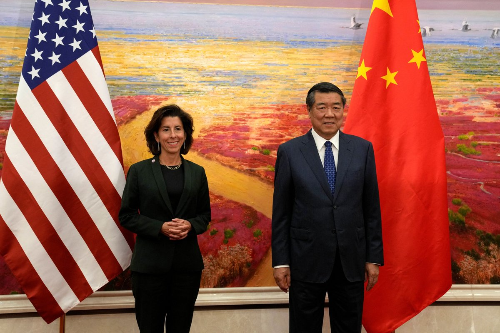
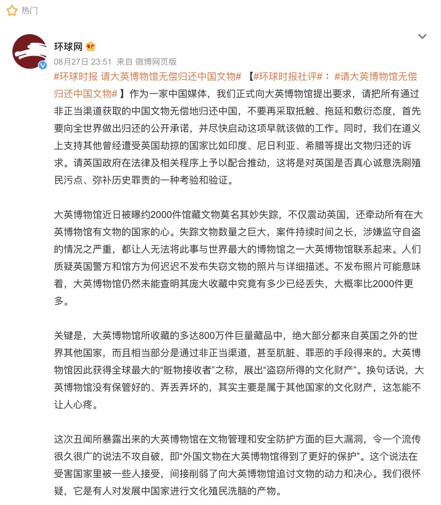
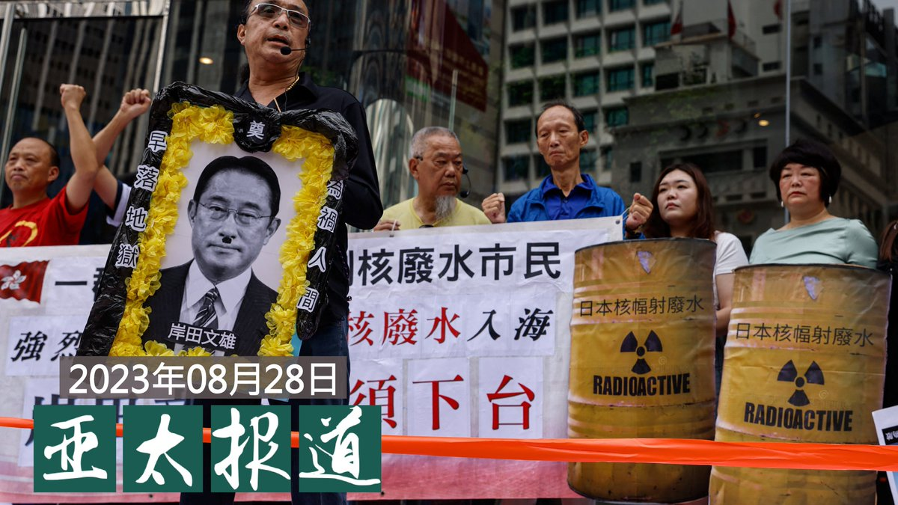

自由亚洲电台 北京时间 2023-08-29T23:32:22Z 1696546338929041536 【#您怎么看】25岁以下新娘子有奖！中国地方催婚催生奇招有用吗？
8月29日，浙江省衢州市常山县“给予女方25周岁及以下初婚夫妇1000元奖励”的消息引发关注。
据常山县统计局数据显示，2022年，常山县人口自然增长-397人，人口自然增长率为-1.2‰。
您如何评价这个政策？ https://t.co/RiWutCJPz8   自由亚洲电台 北京时间 2023-08-29T21:41:24Z 1696518413009686931 RT @RFA_Chinese: 【#您怎么看】
继近日中国暂停公布青年失业率后，据彭博社统计，中国正在向世界隐瞒越来越多的数据。
您认为，在中国，还有哪些公众有知情权的数据被隐瞒？欢迎补充！ https://t.co/DSIvHaleTy   自由亚洲电台 北京时间 2023-08-29T21:41:34Z 1696518457083203916 RT @RFA_Chinese: 《华尔街日报》周一发文《中共对“福利主义”的恐惧给重振经济带来困难》。概述可见 https://t.co/UZYVdINHXq
中国的经济前景日趋暗淡，但北京拒绝给民众普发现金以刺激消费。您认为以下哪个选项更能解释北京的顾虑？或者兼而有之？请在…   自由亚洲电台 北京时间 2023-08-29T18:23:10Z 1696468527404765291 【雷蒙多与中国总理副总理会面】
【李强：经贸关系是中美关系压舱石】
【雷蒙多：世界期待两国合作解决问题】

美国商务部长 #雷蒙多 周二在北京，与与中国总理 #李强，及副总理 #何立峰 分别会面。李强指经贸关系是中美关系的压舱石，良好经贸关系不仅有利于两国，也有利于全世界。雷蒙多表示，美国希望与中国在气候变化、人工智能、芬太尼危机等方面开展合作，世界期待中美一起解决问题。
较早前，雷蒙多会晤中国国务院副总理何立峰，路透社报道，雷蒙多谈到美国把国家安全放在优先位置，但不寻求与中国脱钩。   自由亚洲电台 北京时间 2023-08-29T16:09:57Z 1696435002123145518 【美中商务部新工作组每年两次会晤】
【学者：部长级交流不足以稳定两国关系】
周二下午，中国副总理 #何立峰 和到访的美国商务部部长 #雷蒙多 见面。美中两国商务部同意建立副部长层级工作组，进行定期对话，以扩大不涉及安全问题的 #贸易 往来。美方认为此一交流机制提供一个平台，减少中国误解美国安全政策。有学者认为，商务部级别官员的沟通，不足以稳定两国关系。
https://t.co/biGSUNTSY1   自由亚洲电台 北京时间 2023-08-29T06:12:35Z 1696284669430452393 【#您怎么看】
继近日中国暂停公布青年失业率后，据彭博社统计，中国正在向世界隐瞒越来越多的数据。
您认为，在中国，还有哪些公众有知情权的数据被隐瞒？欢迎补充！ https://t.co/DSIvHaleTy   自由亚洲电台 北京时间 2023-08-29T06:48:34Z 1696293726342054142 “经济还不够差吗？”这句话放在改革开放四十五年后的中国，大概是回响声最大的问句之一。人们眼目所见，到处是经济萧条的征兆。
#中国经济 到底出了什么问题？在1978年打开国门四十五年后，中国如何才能继续改革开放？
#习近平 #胡锦涛

 https://t.co/pArEERsSDk   自由亚洲电台 北京时间 2023-08-29T08:46:40Z 1696323444994973737 RT @RFA_Chinese: 【#您怎么看】
8月27日，#环球时报 在微博发文，#请大英博物馆无偿归还中国文物，引发高赞热评。
请问您同意文章的观点吗？环球时报为何在此时提出这一主张？请在评论区分享高见。 https://t.co/kMvNNViycL   自由亚洲电台 北京时间 2023-08-29T07:00:08Z 1696296637566435785 【#亚太报道（2023-8-28）】
欢迎收听和订阅播客【亚太报道】 https://t.co/MjLNSvVeAE

中国 #反日 宣传降温 / 上千中国来电骚扰日本民间机构 / #美商务部长访华 / #习近平 拒绝发钱刺激消费 / 中国股市大涨 谁被割韭菜谁获益？ https://t.co/nOKbmL7qeA   自由亚洲电台 北京时间 2023-08-29T08:51:29Z 1696324658423894527 RT @RFA_Chinese: 【#亚太报道（2023-8-28）】
欢迎收听和订阅播客【亚太报道】 https://t.co/MjLNSvVeAE

中国 #反日 宣传降温 / 上千中国来电骚扰日本民间机构 / #美商务部长访华 / #习近平 拒绝发钱刺激消费 / 中国股市…   自由亚洲电台 北京时间 2023-08-29T08:53:18Z 1696325116316012793 RT @RFA_Chinese: “经济还不够差吗？”这句话放在改革开放四十五年后的中国，大概是回响声最大的问句之一。人们眼目所见，到处是经济萧条的征兆。
#中国经济 到底出了什么问题？在1978年打开国门四十五年后，中国如何才能继续改革开放？
#习近平 #胡锦涛

 http…   自由亚洲电台 北京时间 2023-08-29T04:38:57Z 1696261105570758812 经济不景气之下，外资纷纷撤离中国，中国银行家和企业高管只能越来越依赖于国内资本。为建立与当地主管官员的人脉关系，募集资金，一种称为“掼蛋”的扑克牌游戏成为了 #中国金融业 者募资的重要手段。
 https://t.co/HyknsDMbzr   自由亚洲电台 北京时间 2023-08-29T05:14:28Z 1696270045964615826 在中国经济复苏乏力之际，中国政府近期出台一系列刺激措施救市，周一A股飙升。中国股市只是昙花一现还是从此步入牛市？出台措施能否完全消除投资者的担忧？

 https://t.co/iLa7JP1YH7   自由亚洲电台 北京时间 2023-08-29T05:27:02Z 1696273206498509136 专栏 | #夜话中南海：由人大常委会处理 #秦刚 合“法”但却违宪
 https://t.co/kbYE0HdPia   自由亚洲电台 北京时间 2023-08-29T06:14:36Z 1696285178098847800 【#您怎么看】
台湾亿万富翁、鸿海集团创办人郭台铭宣布独立参选台湾总统，对战侯友宜、柯文哲、赖清德。
路透社报道指出，《美丽岛电子报》上周进行的一项民意调查显示，郭台铭的支持率仅为 12%。
而据台湾目前多数民调，执政党民进党的总统候选人、台湾副总统赖清德在民调中领先。
台湾民众党的总统候选人、前台北市长柯文哲则在民调中总体排名第二。
国民党的总统候选人侯友宜民调落后，总体排名第三。
如果您参与投票，您投谁？   自由亚洲电台 北京时间 2023-08-29T00:52:12Z 1696204043381838064 #小粉红 出征日本餐馆、酒店和医院
骚扰电话行为获得中国当局默许？ https://t.co/wjlsJXvAuU   自由亚洲电台 北京时间 2023-08-29T04:10:39Z 1696253985475174795 《华尔街日报》周一发文《中共对“福利主义”的恐惧给重振经济带来困难》。概述可见 https://t.co/UZYVdINHXq
中国的经济前景日趋暗淡，但北京拒绝给民众普发现金以刺激消费。您认为以下哪个选项更能解释北京的顾虑？或者兼而有之？请在评论区分享高见。   自由亚洲电台 北京时间 2023-08-29T01:51:32Z 1696218973036278135 2019年8月31日，香港参与"#反送中"运动的大批市民在 #地铁太子站 内遭到警方殴打。在该事件四周年前夕的8月26日，澳大利亚悉尼华人举行集会，继续表达对 #香港警察暴力 的不满。
#831事件

 https://t.co/vCGBmvHDXZ   自由亚洲电台 北京时间 2023-08-29T00:20:18Z 1696196014120825085 中国领导人 #习近平 结束访问 #南非, 回来后直奔 #新疆 考察，强调维护社会稳定，推进伊斯兰教中国化以及中国式现代化等。
习近平是在为中国"向西发展"找活路吗?

 https://t.co/NViTok11qQ   