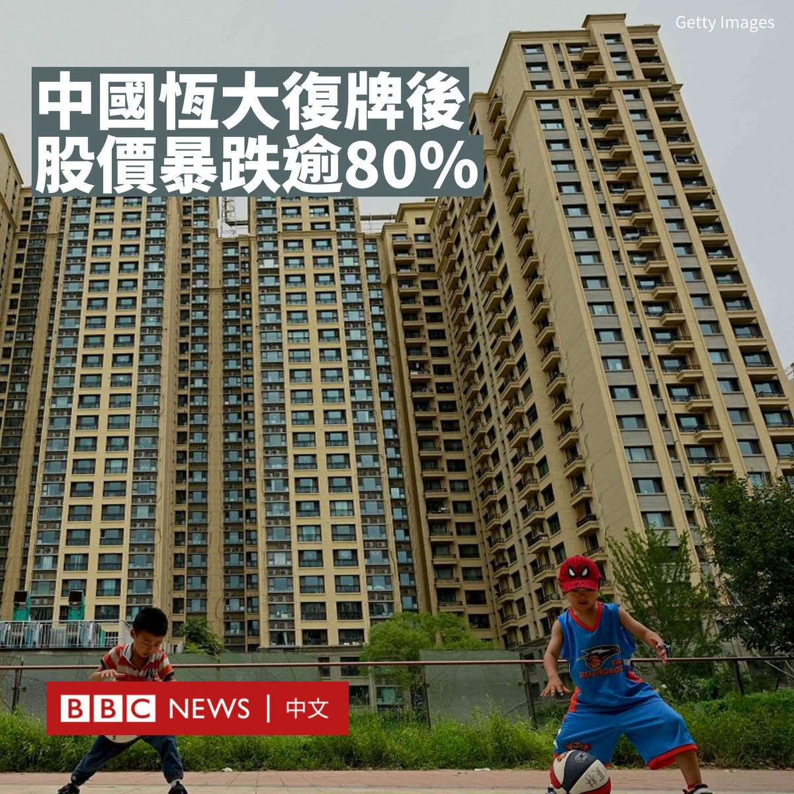
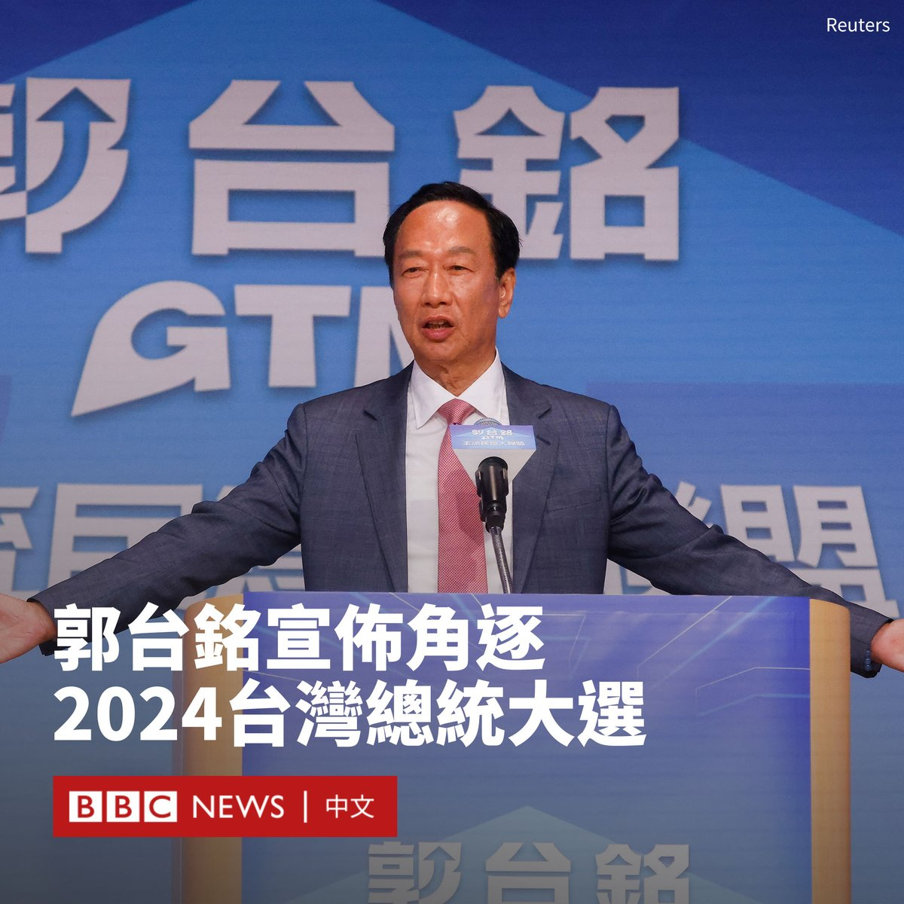
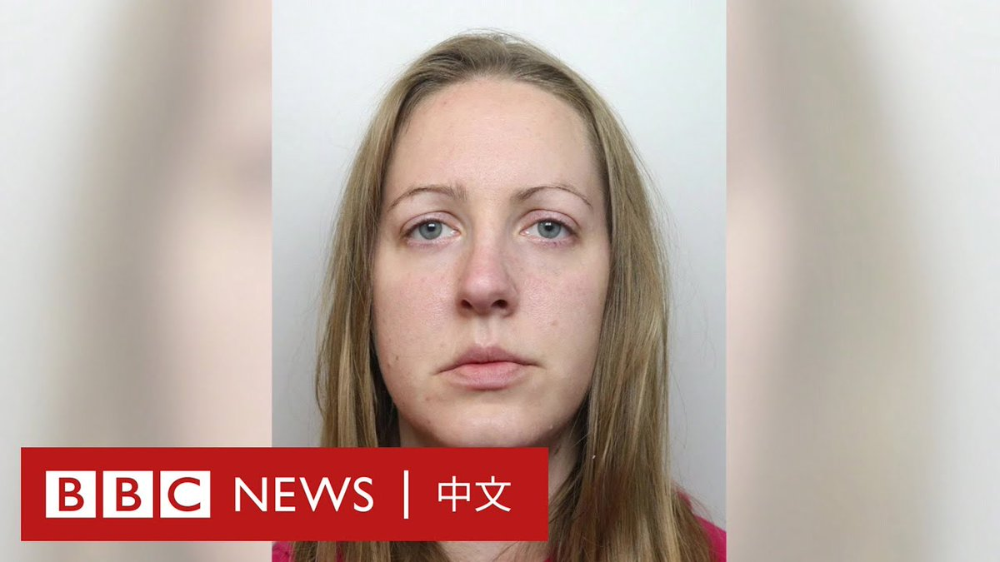

D英国广播公司BBC 北京时间 2023-08-28T19:00:07Z 1696115437199585698 随着福岛排海计划在中国引发愤怒，日本表示该国企业和机构接到大量恶意来电，而中国两所日本人学校遭投掷物件。日本外务省呼吁，在华日本人要提高警惕，避免不必要地大声说日语。https://t.co/NuhvcxdZXf   D英国广播公司BBC 北京时间 2023-08-28T21:32:53Z 1696153884404936878 美国前总统特朗普（Donald Trump）的竞选团队表示，自上周四（8月24日）他前往佐治亚州亚特兰大一所监狱投案并被拍下带有“怒容”的嫌犯照以来，已经筹集了710万美元。

大部分资金来自印有该照片的马克杯、T恤衫和帽子等商品。

特朗普被控密谋推翻佐治亚州2020年大选的选举结果。他在监狱登记后很快以20万美元保释金被释放候审。他还面对另外三起针对他的刑事起诉。

特朗普否认所有指控，并辩称针对他的起诉是出于政治动机。目前，他在2024年总统选举共和党内提名竞争中处于领先地位。

针对他的案件似乎反过来激励了支持者，他已在三周内筹集了近2000万美元。

在特朗普前往监狱投案后，他周五立即筹集了418万美元，有报道称这是他迄今为止在竞选活动中24小时内达到的最高数字。

在该事件后，特朗普还重返X（推特），这是他自2021年1月以来首次发帖。他分享了这张嫌犯照，并配文“选举干预。永不投降！”以及他的网站地址。   D英国广播公司BBC 北京时间 2023-08-28T22:36:38Z 1696169928452178293 台湾富商郭台铭决定以独立身分参选总统，政治学者对BBC中文分析，若郭台铭执意参选到底，只会让民进党参选人赖清德“躺赢”。 https://t.co/3JgcW7WuMo   D英国广播公司BBC 北京时间 2023-08-28T20:13:30Z 1696133907022749724 中国政府近日陆续发布多项刺激措施，意在提振中国股市，周一沪深两市均强力上涨，但仅维持10分钟后，涨幅开始回落。https://t.co/JAUyRshkGX   D英国广播公司BBC 北京时间 2023-08-28T17:48:20Z 1696097371661467674 中国北方地区在上个月遭遇了罕见的暴雨及洪水灾情，而在降雨量原本充沛的南方，鄱阳湖上的岛屿却因干旱更早地露出干涸的河床。

BBC驻中国记者麦笛文（Stephen McDonell）报道说，气候变化曾是一个抽象的概念，但它正日益对居民生活带来影响。 https://t.co/ZM04h6KBPK   D英国广播公司BBC 北京时间 2023-08-28T16:10:44Z 1696072813004853567 深陷债务危机的中国房地产开发商恒大集团周一（8月28日）在香港交易所复牌，股价大幅下跌逾80%，每股一度跌至0.22港元。

在过去三年里，由于北京对房地产行业开展整顿行动，该公司的股价已缩水了99%以上。

恒大在周日表示，该公司今年上半年净亏损人民币330亿元（约合45亿美元）。与去年同期664亿元的亏损相比有所改善。收入同比增长44%。

恒大在提交给香港交易所的一份文件中表示，公司“董事已采取多项措施，改善集团的流动资金状况及财务状况”。

恒大曾是中国最大的房地产集团之一，其于2021年首次出现债务违约，总负债达到2.4万亿元人民币，引发中国房地产市场大规模危机。恒大的股票自去年3月21日起暂停交易。

在债务违约后，恒大一直在与境外债权人就债务重组进行谈判。本月早些时候，恒大向纽约一家法院申请破产保护。

基金公司先锋领航（Vanguard）亚太区首席经济学家王黔对BBC表示：“决策者目前的关键是防止金融传染，限制对整个金融体系的溢出效应。”

“政策制定者需要为经济和房地产行业提供进一步的流动性和信贷支持。”她补充道。   D英国广播公司BBC 北京时间 2023-08-28T12:23:34Z 1696015641701138882 台湾电子大亨、鸿海集团创办人郭台铭周一（8月28日）召开记者会，宣布以独立参选人身份加入2024年总统选战，这可能给台湾蓝营在大选中挑战执政的民进党带来更多阻力。

“这七年多来，我看着台湾的政经局势，不管是经济、国防、外交，逐渐从过往的兴盛，逐渐走到悬崖边上，若不悬崖勒马，将坠入无法回头的深渊里。”他在演讲中说道。

“面对台海与中美关系的兵凶战危，台湾绝对不能成为乌克兰，我也绝对不会让台湾成为下一个乌克兰。”他说道。

“我们必须下架民进党！”他补充道。“我的参选，就是要推进在野整合。”

根据台湾法律，他需要进行连署以取得参选资格。中央社报导称，这一门槛是最近一次立委选举人总数的1.5%，约29万人。

根据台湾中央选举委员会公布的期程，9月13日至9月17日受理申请为总统、副总统选举被连署人，9月19日至11月2日受理连署书件，11月14日前公告连署结果。

四年前退出国民党的郭台铭早前参加国民党总统初选，但未获提名，国民党最终征召新北市市长侯友宜参选。

民进党表示尊重郭台铭的决定，而国民党表示“极度遗憾”，呼吁其信守当初“会尽最大努力支持侯市长胜选”的承诺，归队支持国民党总统参选人侯友宜。

2019年，郭台铭卸任鸿海集团董事长一职，随即准备投入2020年总统竞选。但他在国民党内提名选举中输给韩国瑜后，宣布退出国民党，但在最后一刻宣布放弃连署竞选总统。   D英国广播公司BBC 北京时间 2023-08-28T13:58:02Z 1696039418602430722 阿富汗塔利班政府宣布禁止女性进入该国标志性的班达米尔国家公园，指女性在公园内没有遵守穆斯林妇女的头巾规定。

阿富汗媒体报道称，阿富汗代理劝善惩恶部部长穆罕默德·哈纳菲（Mohammad Khaled Hanafi）表示，去公园观光“不是必须的”，并呼吁宗教人士和安全机构在找到解决办法前禁止女性进入场所。

位于巴米扬省的班达米尔是深受阿富汗人欢迎的热门景点，于2009年成为阿富汗的第一个国家公园。联合国教科文组织（UNESCO）将该公园描述为“具有特殊地质构造和结构，以及自然和独特之美的自然湖泊群”。

巴米扬的宗教人士表示，有外地来的女性游客参观了公园，但未遵守规定。

阿富汗前议员玛丽亚姆·索莱曼希尔（Mariam Solaimankhil）在社交平台X（推特）上分享了一首她写的关于该禁令的诗，并写道“我相信我们会回来的。”

人权观察组织（Human Rights Watch）研究员费雷什塔·阿巴西（Fereshta Abbasi）指出，女性在妇女平等日被禁止进入公园，这是“对阿富汗女性的完全不尊重”。

联合国阿富汗人权状况特别报告员理查德·贝内特（Richard Bennett）也反问道，为什么“为了遵守伊斯兰教法和阿富汗文化”，就需要阻止女性访问班达米尔？

塔利班历来禁止女性从事某些活动，并坚称这些活动只是临时性的，包括在2022年12月禁止女性上学。

自塔利班于2021年8月重新掌权以来，妇女被禁止参与的活动不胜枚举，例如关闭阿富汗的美容院和理发店，并于7月中旬禁止女性参加全国大学入学考试。   D英国广播公司BBC 北京时间 2023-08-28T11:00:36Z 1695994766230712567 英国连环杀手护士露西·莱特比（Lucy Letby）因谋杀七名婴儿而被判终身监禁。针对她的案件现已结案，但许多问题仍未得到解答——她为什么要杀人，以及她是如何做到的？ https://t.co/Z1PsavPpt5   D英国广播公司BBC 北京时间 2023-08-28T08:40:21Z 1695959468398293418 中国电子烟品牌SKE（斯科尔）风靡英国，但其营销手法因被指吸引儿童而受到批评。SKE营销总监对BBC说，该公司社交媒体账户已被删除以进行“审查”，并对未加入政府回收计划表示歉意。https://t.co/KjTakot0iX   