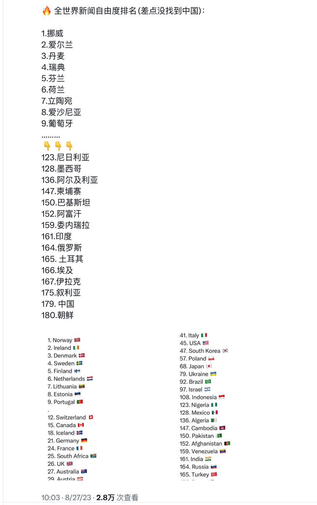

Petrichor 北京时间 2023-08-28T10:41:10Z 1695989875588087847 全球新闻自由度排名，中国第二，朝鲜第一，倒数。 https://t.co/d5uSPlrkul   Petrichor 北京时间 2023-08-28T11:19:41Z 1695999565944521210 这姑娘大脑清醒：一个连我们底层人民死活都不在乎的政府，怎么突然关心起日本福岛核电站处理水排放大海是否会影响我们吃海鲜的问题，好奇怪。我们失业没工作，连饭有没有得吃都成问题，还吃海鲜？ https://t.co/MxEx6R2Zn8   