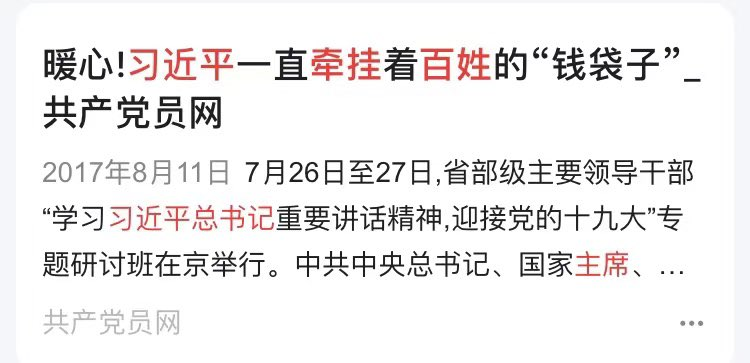
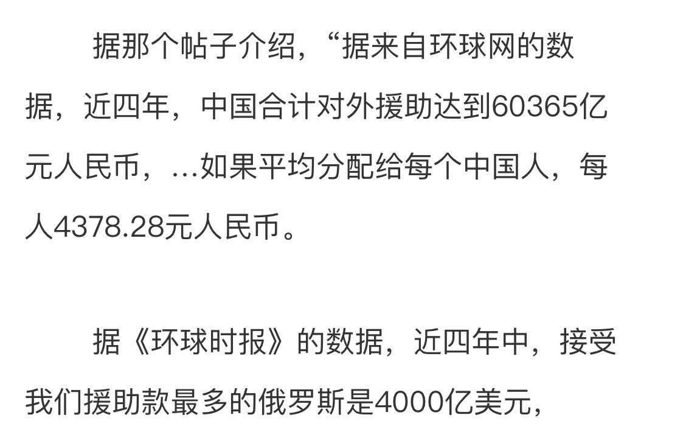
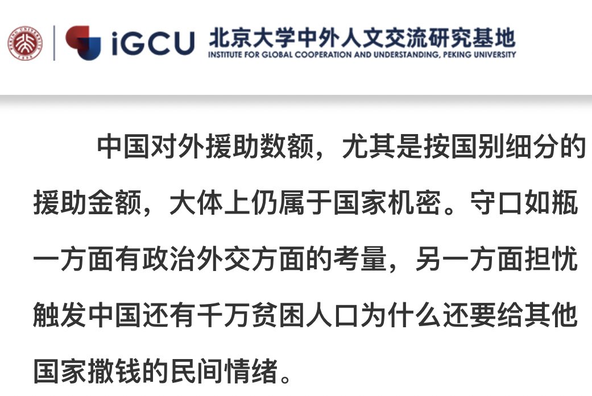
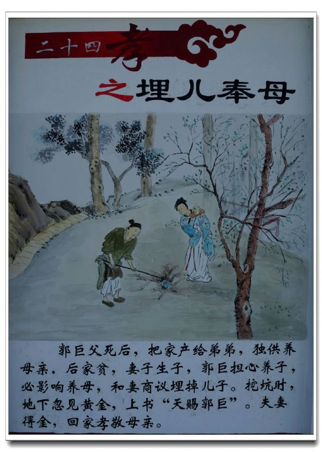
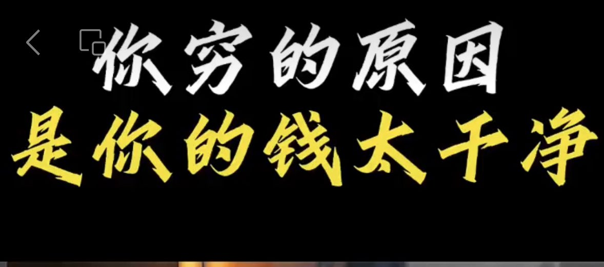

Petrichor 北京时间 2023-08-28T23:39:52Z 1696185838437044385 放四张图片，网友仔细看，然后请将结论写在推后评论区。 https://t.co/bbRq7ta1Hd   Petrichor 北京时间 2023-08-28T23:50:45Z 1696188577279807612 有句话这么说：中国人民总是受蒙蔽的群众，他们受统治者煽风点火、怂恿仇外，成功转移统治者和被压迫者之间的不可调和的矛盾。义和团如此、红卫兵如此、小粉红如此。细想起来，中国人民的苦难有多少是外国人造成的，吃地沟油、江河湖海污染、失业下岗、文凭贬值、高房价、高油价、生不起孩子、看不起病、上不起学、巨大的穷富差别、红二代红三代垄断财富和资本……哪样是外国“敌对势力”干的？   Petrichor 北京时间 2023-08-28T20:19:27Z 1696135404745793848 毛泽东时代里钱学森不仅没有挨批斗，反而更是升腾发达，原因在于他善于猜摸圣意，从科学家角度去证明“伟大领袖的英明”。相反，同时代回国报效祖国的留学博士们却报销了（迫害至死）。 https://t.co/Y8OpfhuvPM   Petrichor 北京时间 2023-08-28T10:52:10Z 1695992643816210441 贫穷的原因，终于找到了。 https://t.co/B6SSdYqjUp   Petrichor 北京时间 2023-08-28T10:41:10Z 1695989875588087847 全球新闻自由度排名，中国第二，朝鲜第一，倒数。 https://t.co/d5uSPlrkul   Petrichor 北京时间 2023-08-28T11:19:41Z 1695999565944521210 这姑娘大脑清醒：一个连我们底层人民死活都不在乎的政府，怎么突然关心起日本福岛核电站处理水排放大海是否会影响我们吃海鲜的问题，好奇怪。我们失业没工作，连饭有没有得吃都成问题，还吃海鲜？ https://t.co/MxEx6R2Zn8   