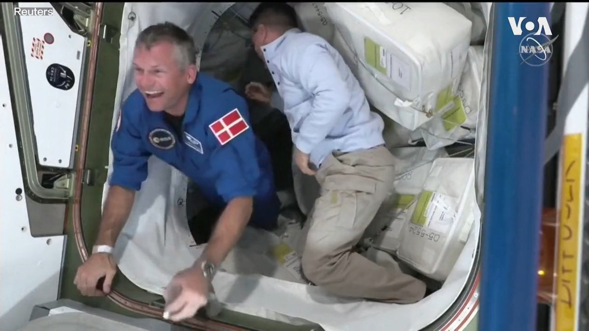

美国之音中文网 北京时间 2023-08-28T14:58:03Z 1696054522526003579 中国国防部主办中非安全论坛 推进中国治理模式与西方抗衡 https://t.co/97r37ir8mM   美国之音中文网 北京时间 2023-08-28T13:28:33Z 1696031996760428867 时隔17个月恢复交易 中国恒大股价暴跌逾86% https://t.co/PA3dLxX5oA   美国之音中文网 北京时间 2023-08-28T07:00:00Z 1695934214913286382 在中国媒体和专家的大肆渲染下，日本核废水排放几乎等同于毁灭世界，各地民众诅咒日本，刮起抢盐风。中国人非理性行为的根源在哪里？中国制裁最终将损害谁的利益？习近平在金砖峰会再度出手大方，誓言不让一个国家在现代化进程中掉队。中国现在还有大撒币的本钱吗？请看周一时事大家谈并留言互动。 https://t.co/SqW2GzXKuV   美国之音中文网 北京时间 2023-08-28T11:31:05Z 1696002437377872205 雷蒙多访华与中国官员们开谈：美中稳定经济关系乃全世界所望 https://t.co/ji0YpJGp4C   美国之音中文网 北京时间 2023-08-28T12:01:32Z 1696010097720447429 异言网报告:中国劳权及住房抗争激增 反映经济恶化窘境 https://t.co/aAf8OU06vQ   美国之音中文网 北京时间 2023-08-28T08:06:34Z 1695950965235724676 香港警方盘问海外活动人士亲属 https://t.co/cTk8pHwPL1   美国之音中文网 北京时间 2023-08-28T08:37:04Z 1695958642506477610 专访香港“通缉犯”袁弓夷：“香港议会”意义重大 https://t.co/1FlQACPVJQ   美国之音中文网 北京时间 2023-08-28T10:04:33Z 1695980659817451530 乌克兰：泽连斯基誓言采取更严厉的反腐败措施 https://t.co/ymvRTNfZDU   美国之音中文网 北京时间 2023-08-28T06:23:03Z 1695924918045872566 中国将股票交易印花税减半以提振市场 https://t.co/8ZA6aAfKXE   美国之音中文网 北京时间 2023-08-28T09:06:03Z 1695965935440711983 美国商务部长雷蒙多曾任州长、律师和风险投资家 对中国持强硬立场但不主张脱钩 https://t.co/zDmfAogFOP   美国之音中文网 北京时间 2023-08-28T04:43:03Z 1695899751492051410 美国海军：北京的“南中国海行为”必须受到挑战 https://t.co/9GpCBEQM1X   美国之音中文网 北京时间 2023-08-28T05:52:33Z 1695917241064448142 美国商务部长寻求与中国谈判促进贸易和旅游业 https://t.co/cgBcTFPjPN   美国之音中文网 北京时间 2023-08-28T01:42:02Z 1695854197114306686 贸易壁垒增高、人口老化、能源转换等新趋势将加剧全球通胀压力 https://t.co/mwahnQXKz3   美国之音中文网 北京时间 2023-08-28T01:21:57Z 1695849141065179292 超过1千7百人装扮成哈利·波特26日聚集在德国汉堡的市政厅前，创下在同一个活动上哈利·波特人数的新世界纪录。这个活动同时也庆祝哈利·波特书籍首次在德国发行25周年。 https://t.co/0IC02vryo7   美国之音中文网 北京时间 2023-08-28T02:15:51Z 1695862704546947106 运送轮换宇航员到国际空间站的龙飞船27日与国际空间站对接。这4名宇航员分别来自美国、丹麦、日本和俄罗斯。 https://t.co/61izVtkmxM   