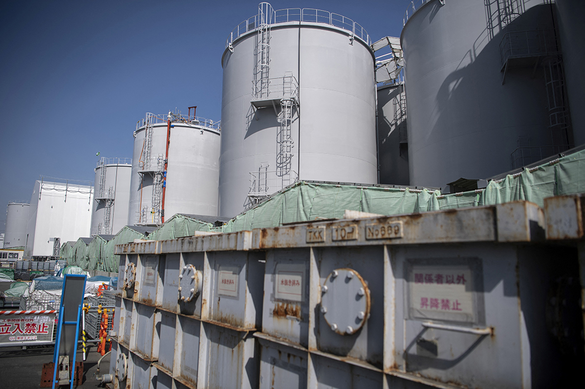
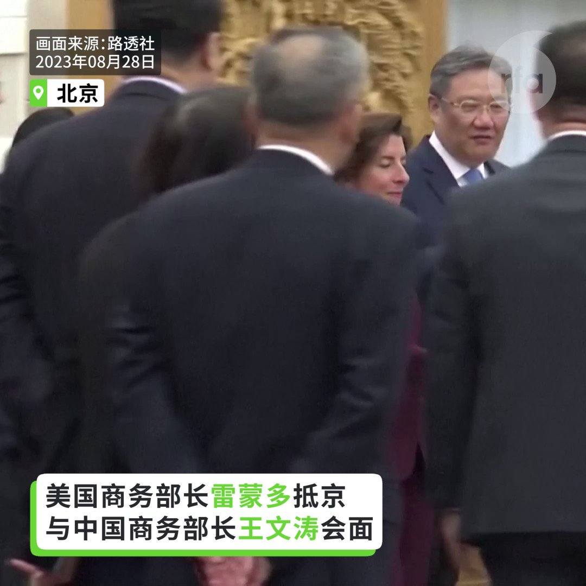
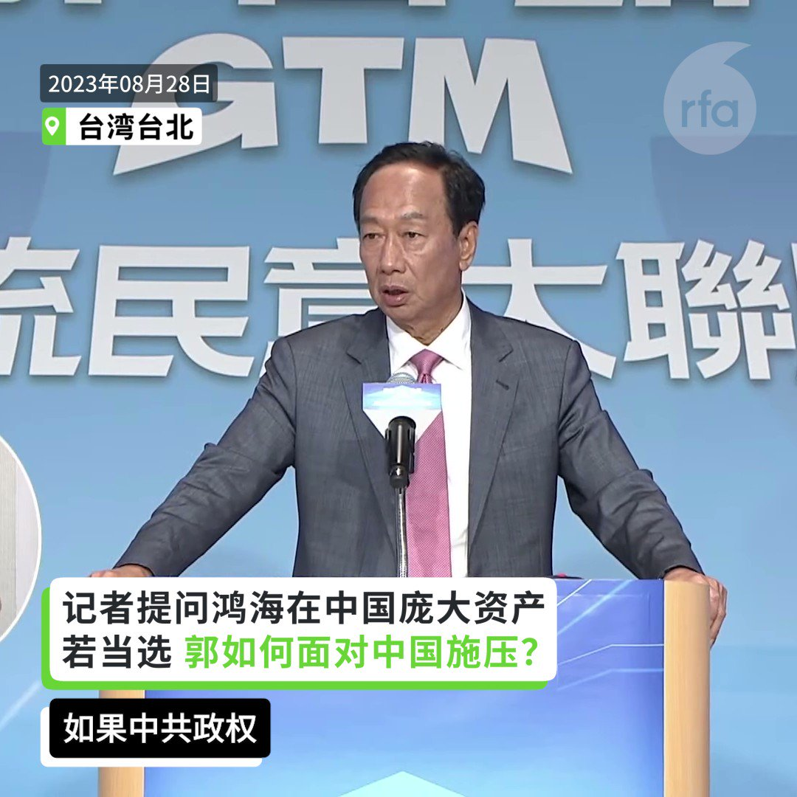
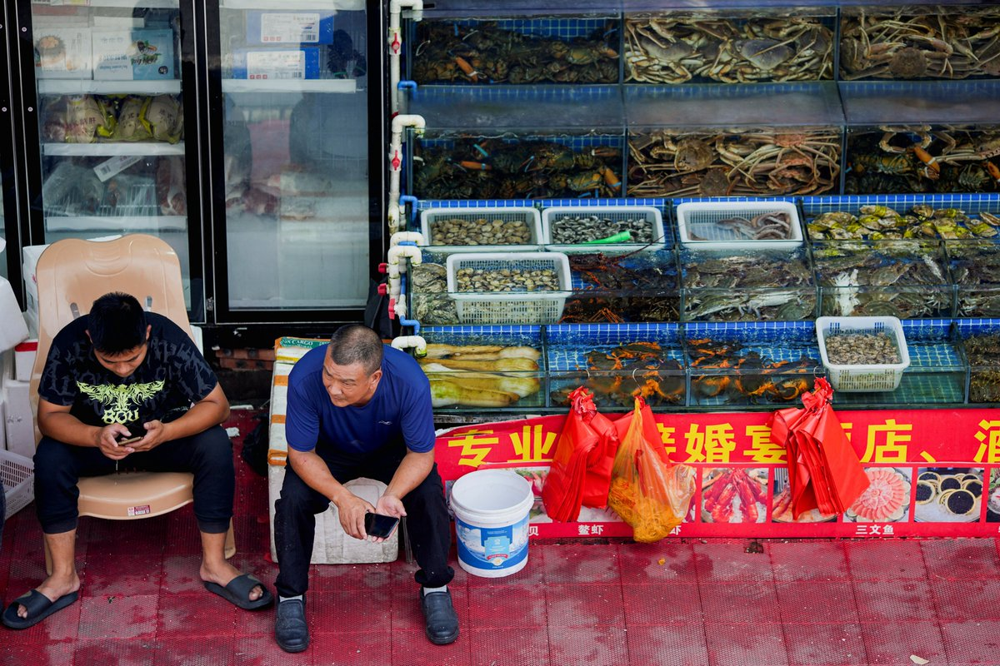
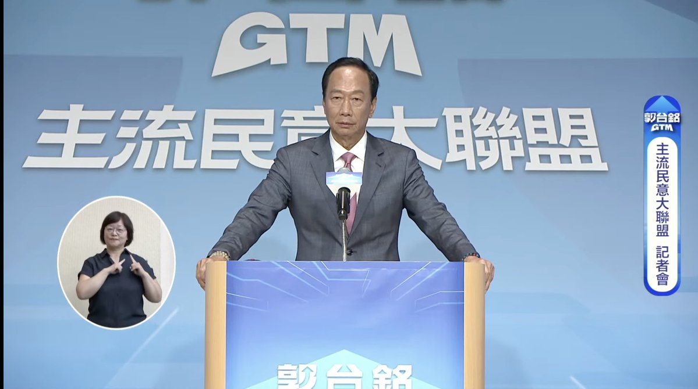

自由亚洲电台 北京时间 2023-08-28T22:58:24Z 1696175402853753322 美国商务部长 #雷蒙多 28日与中国商务部部长 #王文涛 会晤了约二小时。雷蒙多指出，全世界都期待美国和中国保持稳定的经济关系，两大经济体维持稳定经济关系极其重要。两国的年贸易额超过7000亿美元。

 https://t.co/ilAoxKimeL   自由亚洲电台 北京时间 2023-08-28T22:18:20Z 1696165320929484941 【#您怎么看】
8月27日，#环球时报 在微博发文，#请大英博物馆无偿归还中国文物，引发高赞热评。
请问您同意文章的观点吗？环球时报为何在此时提出这一主张？请在评论区分享高见。 https://t.co/kMvNNViycL   自由亚洲电台 北京时间 2023-08-28T23:33:49Z 1696184318891037153 长期关心中国核电政策的香港资深工程师黎广德说：
“根据实时监测结果，目前 #福岛核废水 的氚核废料水平，只是饮用水标准的七分之一。所以按照这个标准来排废水，在核工业里面是完全可以接受的。”
根据日本《读卖新闻》引述日本官员言论，每年中国核电站排放的氚是日本福岛核电站的6.5倍。此前，也有香港媒体表示，据中国官方资料显示，中国大亚湾核电站的氚排放上限要比日本福岛的排放标准高十倍。
那么，中日 #海产品 哪个更安全？【#您怎么看？】
https://t.co/n29wfWW9l6   自由亚洲电台 北京时间 2023-08-28T23:53:33Z 1696189284863340751 中国多地针对退休人员领取 #养老金 的政策发生了变化。自今年年初起，北京、山东、河南等地的退休人员需每年向当地社保局证明自己"活着"方可继续领取退休金。有些人即使瘫痪在床，也被要求"抬着去社保局"，而居住在境外的退休人员则要接受中国使领馆的资格审查。

 https://t.co/rxXDFbf2Bb   自由亚洲电台 北京时间 2023-08-28T18:31:34Z 1696108252168368476 【美商务部长雷蒙多访华】
【与中商务部长王文涛会谈】

美国商务部长 #雷蒙多 周一与中国商务部长 #王文涛 会谈。她表示，美中这两个全球最大经济体保持稳定经济关系“极其重要”。

她说：“这是一种复杂、具挑战性的关系，我们当然会在某些问题上存有分歧，但我认为，双方若抱持直接、开放和务实的态度，将能取得进展。”

雷蒙与中国政商界领袖举行为期3天的会谈，以促进这两个全球最大经济体之间的商业关系。

王文涛则表示，美中经济关系不仅影响到两国，也关系到全球其他国家，他对雷蒙多称她乐意与中国从事贸易的言论感到欣慰。

他表示愿意共同努力，“为加强两国企业合作、营造更有利的政策环境，以稳定、可预测的方式促进双边贸易和投资。”   自由亚洲电台 北京时间 2023-08-28T14:57:43Z 1696054435330617714 【鸿海大量资产在中国 郭若当选如何面对中国施压？】
【郭台铭：不会听中共指派 但鸿海动向牵连国际产业链】

#郭台铭 表示，“如果中共政权说，你不听我的话，就把 #鸿海 财产没收。我会说 Yes, Please. Do it!” ，“如果牺牲我个人的财产，他不来打台湾，我愿意重新做 #模具工人。只要他不来打台湾，但是我不能听从它的指派。”
他说，鸿海99%的客户都是欧美最重要的客户，包括苹果、特斯拉、亚马逊、和英伟达等，如果鸿海被没收而停工，全球供应链出货将出问题。“中国政府要如何对全世界的国际品牌解释？何况它现在 #经济糟透了！”

https://t.co/RJzm06CBpb   自由亚洲电台 北京时间 2023-08-28T15:50:45Z 1696067782969036852 【反日浪潮殃及无辜商人】
【官方降温反日情绪】
日本 #福岛 #核处理水 排入大海，中国官方通过舆论渲染日本核污染危害国民健康，再度触发民间 #反日 情绪，各地抵制日货行动一发不可收拾。本周一，官方有限度的压制反日言论。在微博，有关日本的议论一度“跌出”排名前50。
https://t.co/4ajFbb5vRW https://t.co/HMdHlTXkaF   自由亚洲电台 北京时间 2023-08-28T10:31:28Z 1695987432540577897 【郭台铭宣布参选2024 #台湾总统大选】
鸿海创办人 #郭台铭 周一召开“#主流民意大联盟”记者会，表示，决定以总统参选人的身分，投入2024总统大选。这为台湾选情带来更多变数。
根据台湾中选会的规定，今年9月13日起受理申请总统、选举连署，11月2日前送联署书件。 https://t.co/859Qw2J2Nt   自由亚洲电台 北京时间 2023-08-28T06:10:40Z 1695921798431580345 当地时间8月27日晚，美国商务部部长雷蒙多乘机抵达北京，中国商务部美大司司长林峰及美国驻华大使伯恩斯前往机场迎接。雷蒙多成为继国务卿布林肯和财政部长耶伦之后，最新到访中国的拜登政府官员。 https://t.co/q0pKizaG4V   自由亚洲电台 北京时间 2023-08-28T06:11:15Z 1695921945743863891 美国一项最新研究发现，中国政府在去年底突然取消"清零"措施后，不但令十四亿民众大面积感染新冠病毒，而且可能导致了近两百万人超额死亡。 https://t.co/2mrEXZ3XIK   自由亚洲电台 北京时间 2023-08-28T00:28:50Z 1695835775592706482 据维权网发布的消息，被控涉嫌“#煽动颠覆国家政权罪”的原 #贵州大学 教授 #杨绍政 案将于8月31日，在贵阳市中级法院宣判。杨绍政于2021年5月18日遭当地国保秘密抓捕，并在指定监视居住半年后被捕，目前关押在贵阳市第一看守所内。 https://t.co/euLmwu3NSH   自由亚洲电台 北京时间 2023-08-28T00:16:30Z 1695832670830522528 香港保安局长 #邓炳强 本周日针对“ #反送中”运动标志性雕塑“#国殇之柱”表示，有关证物与一些案件有关，处置方法与其他证物一样，会待案件完结再按规定处理。 https://t.co/neWZDFeeKf   