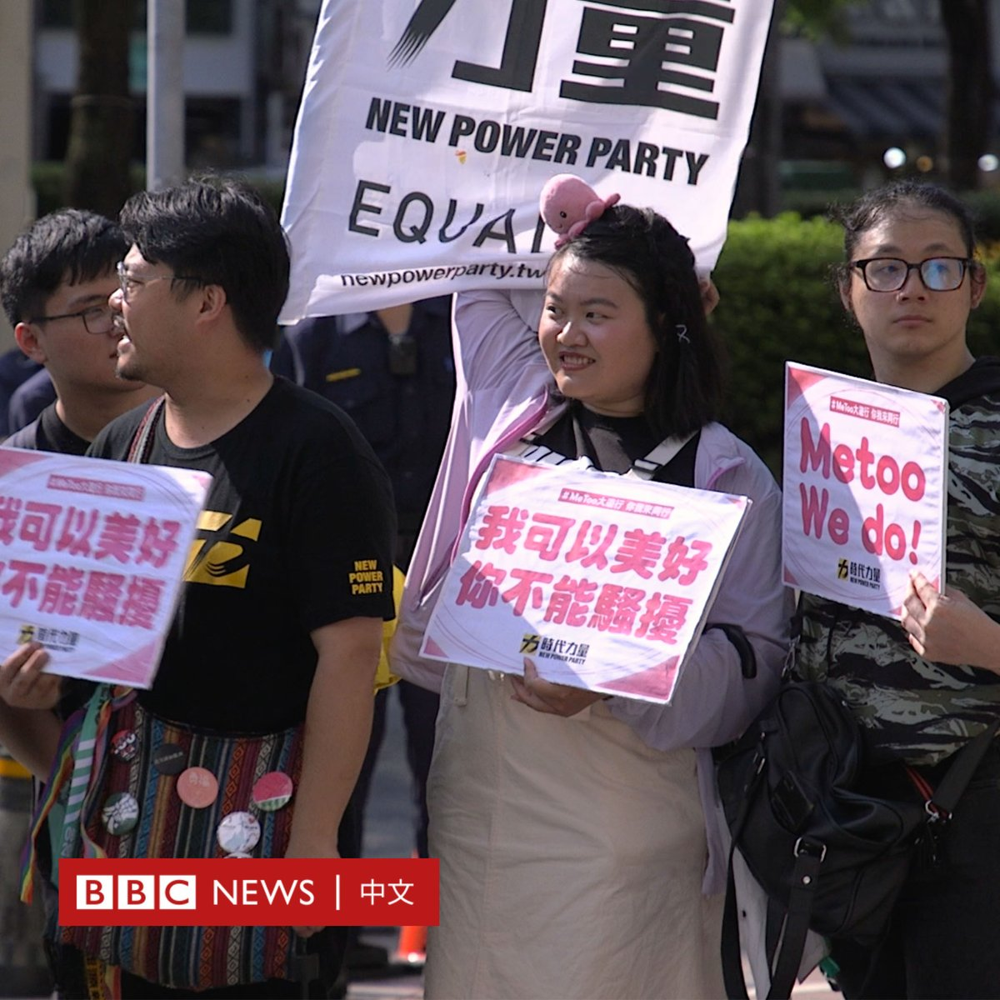
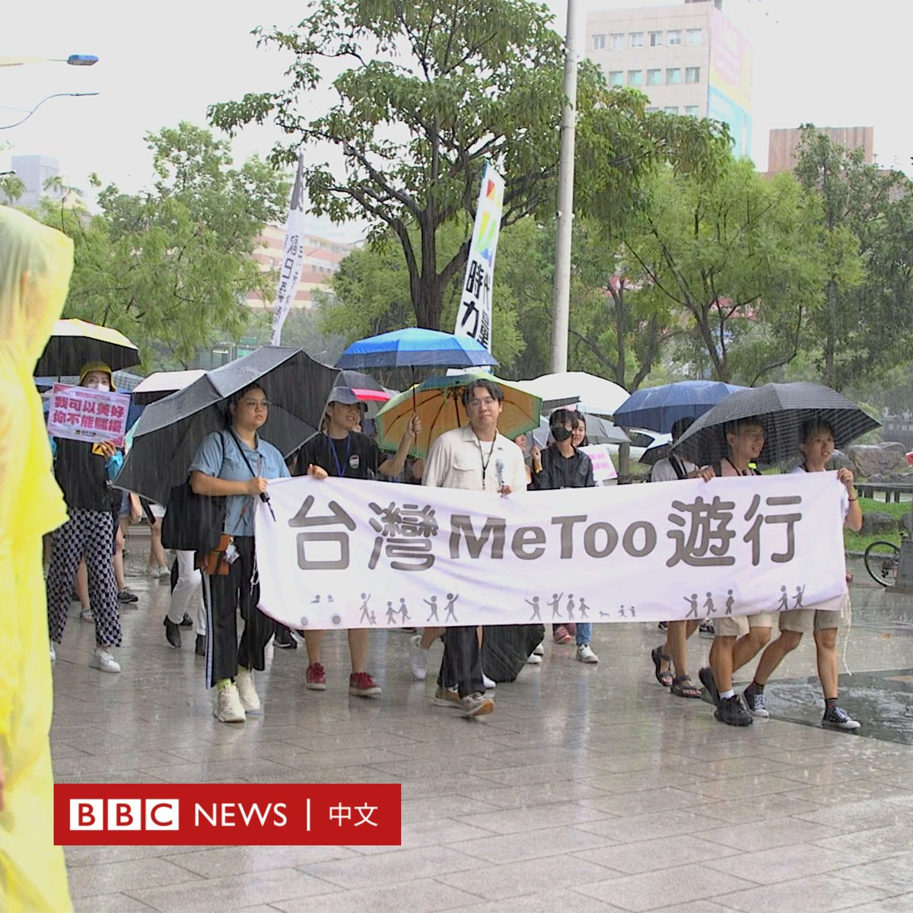
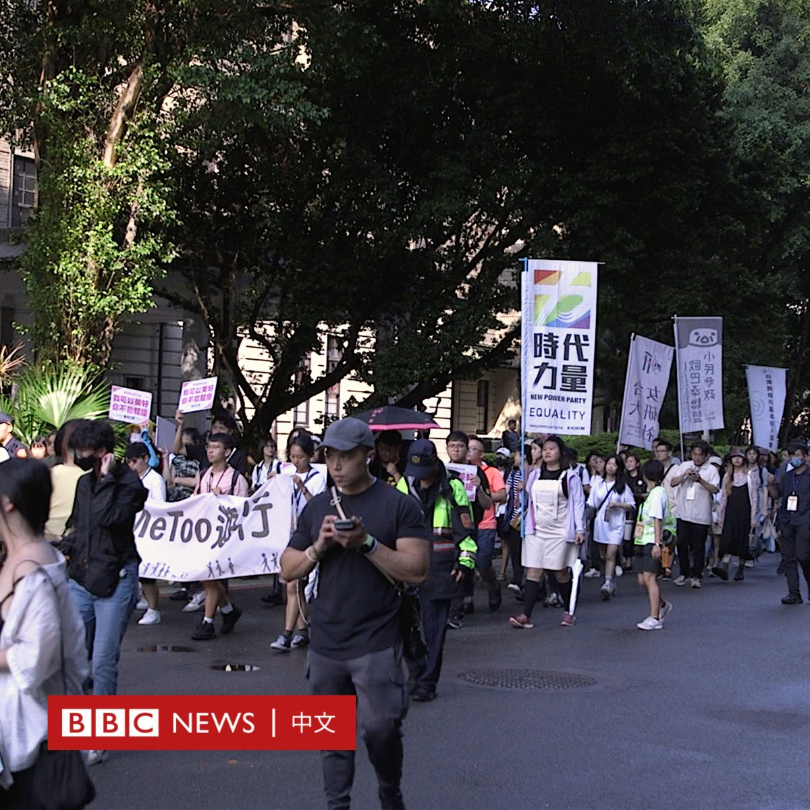
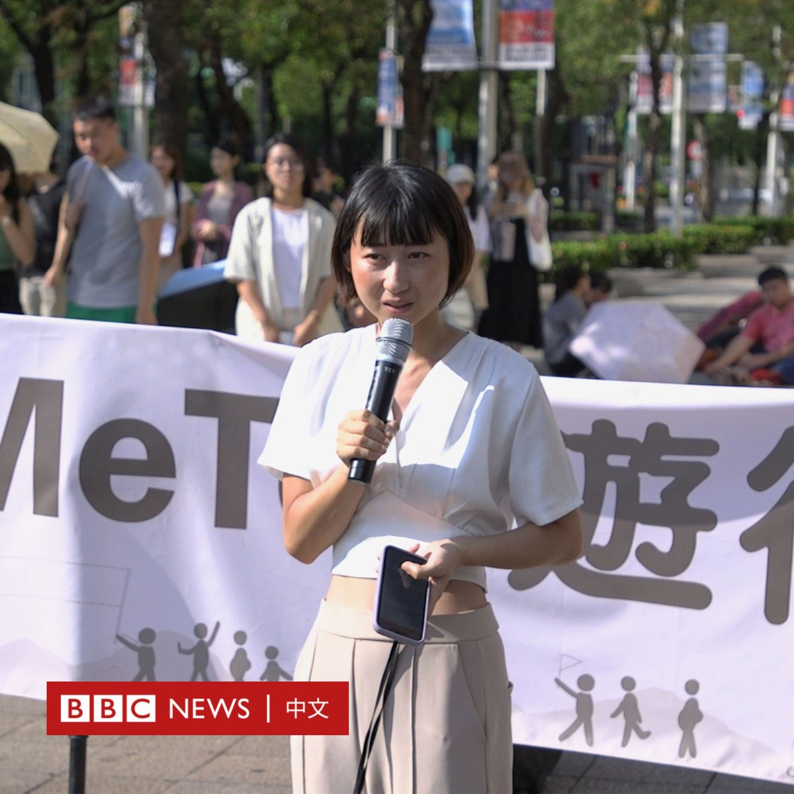
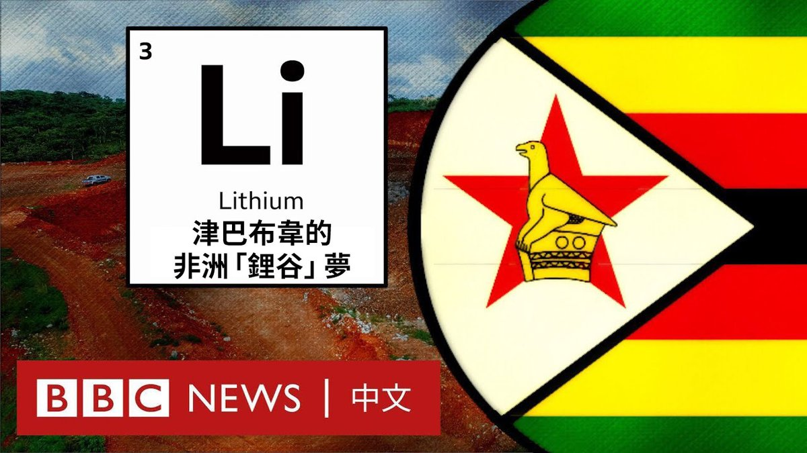

D英国广播公司BBC 北京时间 2023-08-27T20:10:05Z 1695770660403044759 自今年五月 #MeToo 运动席卷台湾各界后，该浪潮周日（8月27日）首次由网络走向实体集会。

一场由大学生发起的MeToo游行在台北西门町集结出发。发起人希望透过公众演说、站上街头的方式，唤起社会对该议题更多的关注。

筹办人之一的李超群表示，除了广泛的女性受害者之外，这波运动也让男性了解如何表达不舒服、拒绝不适当的身体碰触。

参与者朱怡君于活动分享自己的经历。她称自己于9岁至12岁遭受亲属性侵，成年后曾报案控告对方，但因案件已过法律追诉期，加害者被无罪释放。

她告诉BBC中文，自己花了超过20年、经历多年心理谘商才得以将过去经历说出来：“做错事情的不是我们，是那些伤害我们的人……我不需要戴着口罩、我不需要躲躲藏藏。”

她也表示，这波MeToo运动对于曾经历性暴力的人来说是一种安慰，因为“你会感觉你真的不是孤单的一个人。”

时代力量数名成员与民进党立委范云也到场参与。范云曾提告国民党立委陈雪生性骚扰，于今年六月胜诉。她表示，从五月该运动爆发开始，她的办公室已接获超过50件相关报告，求助者男女兼有。

台湾立法院于七月底三读通过“性平三法”（即《性别平等工作法》、《性别平等教育法》、《性骚扰防治法》）修法，包括加重利用权势进行性骚扰的裁罚、加强企业性骚扰防治以及延长《性骚扰防治法》申诉期限等。   D英国广播公司BBC 北京时间 2023-08-27T16:53:14Z 1695721118181773447 津巴布韦拥有非洲最大的锂储量，这种被称为“白色黄金”的金属是电动车电池的关键原料。在中国和西方公司涌入之下，津巴布韦正在寻求成为“锂谷”。 https://t.co/2n40O38X6N   D英国广播公司BBC 北京时间 2023-08-27T13:20:53Z 1695667679959359617 【一周热点回顾】普京与普里戈津的友谊始于后苏联时期的混乱，止于乌克兰战争开始后的动荡和叛乱。它夹生于国家安全部门与黑帮互相勾结的灰色地带，不可避免地让一对老友反目成仇。https://t.co/XRqOulpHe4   