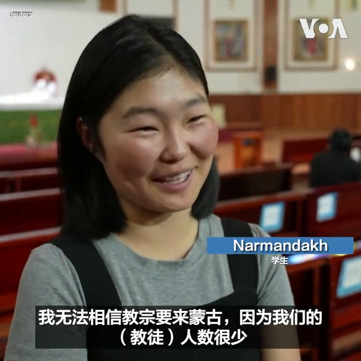
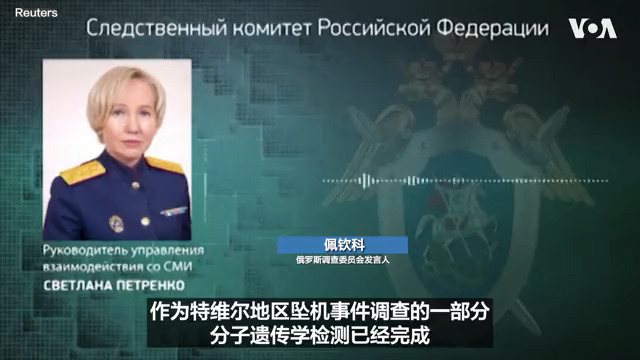

美国之音中文网 北京时间 2023-08-27T22:37:03Z 1695807644219630078 中国经济持续疲软 工业公司利润今年连降七个月 https://t.co/1dNKU3Otbx   美国之音中文网 北京时间 2023-08-27T22:37:29Z 1695807752944140655 美国商务部长吉娜·雷蒙多 （Gina Raimondo）27日抵达中国访问。美国商务部表示这次访问将在有关美中商务关系，美国企业面临的挑战以及潜在的合作领域与中国进行“建设性的对话”。 
更多：https://t.co/cwsP77krB5 https://t.co/4dvksFJJCg   美国之音中文网 北京时间 2023-08-27T21:10:23Z 1695785835051028723 在蒙古首都乌拉巴托，天主教徒们27日在圣彼得和保罗大教堂 （the Saints Peter and Paul Cathedral）参加弥撒。罗马天主教教宗方济各8月31日至9月4日到访蒙古期间将访问这座教堂。一些信徒表示他们对于教宗选择只有不到两千名教徒的蒙古进行访问感到意外，但同时对于教宗的来访表示兴奋。 https://t.co/DzOgSWFCuf   美国之音中文网 北京时间 2023-08-27T21:48:02Z 1695795309178474518 参加多国军演的一架美国飞机在澳北部一岛屿坠毁三人阵亡 https://t.co/R7qVwTqcEW   美国之音中文网 北京时间 2023-08-27T22:11:36Z 1695801238929969622 俄罗斯调查人员27日说基因测试证实瓦格纳集团首领普里戈津死于23日的坠机。俄罗斯当局早先公布了坠机死亡者名单，其中包括普里戈津和他的助手乌特金。 https://t.co/72uemEiz8u   美国之音中文网 北京时间 2023-08-27T19:03:03Z 1695753788727165068 俄中舰队结束太平洋联合巡逻 https://t.co/5uo3s5Ao7y   美国之音中文网 北京时间 2023-08-27T19:16:33Z 1695757186591510845 在排放福岛核污水后 来自中国的电话打爆日本企业 https://t.co/RKBSQaypVq   美国之音中文网 北京时间 2023-08-27T15:02:02Z 1695693135488442745 在新冠疫情锁国多年后 朝鲜终于开放国门允许其公民归国 https://t.co/aksSprvL3I   美国之音中文网 北京时间 2023-08-27T13:30:03Z 1695669985648288045 澳大利亚对中国经济感到忧心 正“密切监控 https://t.co/wN5sFNcF4u   美国之音中文网 北京时间 2023-08-27T14:01:03Z 1695677789993926741 中国九部门鼓励退休人员回乡 面对农村返贫当局束手无策 https://t.co/G2i7ajd6Nc   美国之音中文网 北京时间 2023-08-27T08:27:33Z 1695593861241082006 加拿大环境部长访问中国，讨论气候和生物多样性议题 https://t.co/FrzUMjSBZv   美国之音中文网 北京时间 2023-08-27T09:00:00Z 1695602025051111915 #美中对标 中国热点对标美国论据，用一杯咖啡的时间聊聊中国热点的美国冷思考。中国好声音曝出黑幕丑闻被停播，与其类似模式，同等热度的美国好声音是否遇到同类指控？美国FCC又是如何管制电视节目的？https://t.co/0SI18rLTSc https://t.co/AH0BzpQRSZ   美国之音中文网 北京时间 2023-08-27T04:19:03Z 1695531322801066288 中国发布禁令后，俄罗斯希望增加对中国的鱼类和海产品出口 https://t.co/hXrSbXTmXt   美国之音中文网 北京时间 2023-08-27T05:05:02Z 1695542896580243873 俄新社：俄罗斯与伊朗的军事关系将经受地缘政治的压力 https://t.co/XyVvKMFfDl   美国之音中文网 北京时间 2023-08-27T01:04:04Z 1695482254783598831 中国打喷嚏，全球经济会感冒吗? https://t.co/NXJ5khVypZ   美国之音中文网 北京时间 2023-08-27T03:00:01Z 1695511433877065904 中国经济走缓，引发国际担忧其成长疲软的外溢效应。有经济学家说，中国每年贡献全球增长的三成以上，若中国打喷嚏，全球经济肯定会感冒。但也有人认为，中国是制造工厂，消费力不如欧美买家，因此，只有依赖中国市场的亚洲经济才会跟著降温。报道:https://t.co/xB40o888if https://t.co/dfzrfdluRL   美国之音中文网 北京时间 2023-08-27T01:04:02Z 1695482247313592450 中国警务专家进入岛国瓦努阿图，相关国家警惕关注 https://t.co/7x29cXwlAF   美国之音中文网 北京时间 2023-08-27T02:00:00Z 1695496331484148144 被指控勾结外国势力、颠覆国家政权的香港议会发起人袁弓夷表示，中共最大的谎言就是宣称自己代表14亿中国老百姓，他筹组“香港议会”就是要用一人一票的普选来揭穿中共是一个假民主的伪政权，将来还要制宪、公投自决、与藏人和维吾尔人合作，实践中国真正的民主。#纵深视角 ：https://t.co/0V3WZw2iPD https://t.co/kJtfl32Vmw   