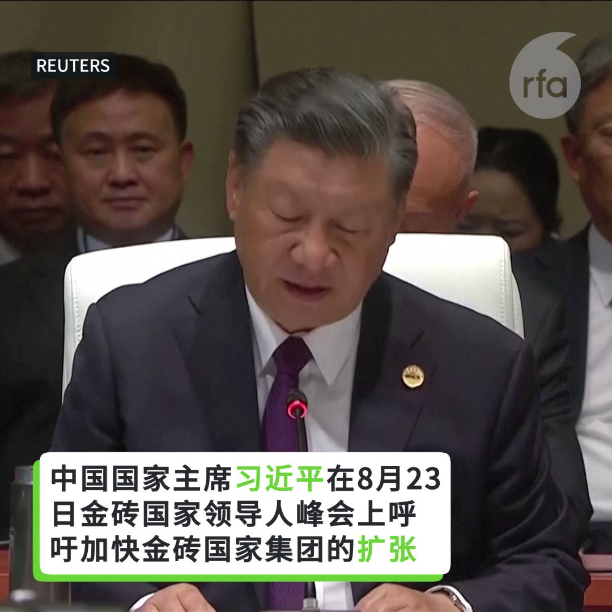

自由亚洲电台 北京时间 2023-08-27T23:28:30Z 1695820589624078711 RT @RFA_Chinese: 【金砖国家集团扩张 能否撼动国际秩序？】

#习近平 在8月23日的 #金砖国家领导人峰会 上，呼吁加快金砖国家集团的扩张。 https://t.co/qxA2i8DGfW   自由亚洲电台 北京时间 2023-08-27T23:29:28Z 1695820832902172969 RT @RFA_Chinese: #李玟 生前控诉《#中国好声音》黑幕的录音和视频上周曝光后，《中国好声音》母公司 #星空华文 股价断崖式暴跌，近两个交易日累计跌幅高达47%，市值蒸发达200亿港元。截至发稿，《中国好声音2022》豆瓣评分至已降至2.4分。评论区愤怒声讨排山倒…   自由亚洲电台 北京时间 2023-08-27T23:27:56Z 1695820447672127559 RT @RFA_Chinese: 【中国荣景40年落幕 年轻人还有盼头吗？(戴忠仁/程晓农/张俊杰)｜#亚洲很想聊】
完整视频：https://t.co/553r501FbK
经济学家 #程晓农 分析中国经济泡沫到底有多大？中国债有多大？习近平要赖帐到底吗？
刚“润”到新西兰的…   自由亚洲电台 北京时间 2023-08-27T23:28:23Z 1695820561459413481 RT @RFA_Chinese: 【习近平步入金砖会场 翻译被拦在门外】
【习近平频回头 显得十分不安】
金砖国家领导人参加峰会第二天，中国国家主席习近平步入会场后，他的随行翻译也试图进入，遭工作人员制止，拦在门外。习近平发现翻译没跟上，停下脚步，频频回头察看，显得十分不安。…   自由亚洲电台 北京时间 2023-08-27T23:28:40Z 1695820631625929014 RT @RFA_Chinese: 如果中国真的出现2008年那样的经济危机，是否会严重蔓延到世界其他地区，尤其是美国？
8月22日，《纽约时报》刊发专栏作家保罗·克鲁格曼文章《中国的经济危机有多可怕》称：美国受中国潜在危机的影响小得惊人。
美国在中国投资仅5150亿美元。… h…   自由亚洲电台 北京时间 2023-08-27T23:56:43Z 1695827691713204586 日本环境省本周日公布东京电力福岛第一核电站启动核处理水排海行动后，于8月25日早上，在当地方圆约40公里、11处地点采样海水的分析结果。结果显示，所有地点的放射性物质氚的浓度均低于能检测出的下限数值。日本环境省表示，核处理水排海“对人和环境没有影响”。https://t.co/H8HgLYxmx6   自由亚洲电台 北京时间 2023-08-27T12:58:55Z 1695662153733431562 专栏 | #西藏纵览：一年一度 #雪顿节 被警察破坏；美国务院签证制裁中国官员
 https://t.co/DOF8ZJPPlM   自由亚洲电台 北京时间 2023-08-27T10:58:38Z 1695631879515582563 专栏 | #解读新疆：#维吾尔 活动人士父亲去世数月后方才获悉 ；学习 #古兰经 遭监禁的维族老人狱中死亡
 https://t.co/39baboVqRA   自由亚洲电台 北京时间 2023-08-27T04:19:31Z 1695531438433862076 中国国家主席习近平周六抵达新疆，并称赞这一长期遭受袭击的地区有“来之不易的社会稳定”。

 https://t.co/yhFN06dr5l   自由亚洲电台 北京时间 2023-08-27T06:57:29Z 1695571195201196165 专栏 | #有问有答：关注营救人权律师 #卢思位 最新发展
 https://t.co/cgF9ZhZ3ST   自由亚洲电台 北京时间 2023-08-27T07:25:47Z 1695578314176622914 日本自8月24日开始排放经处理的 #核废水。中国媒体对此展开宣传，表示这些核废水会导致癌症、畸形等多种疾病。中国已经 #禁止进口日本水产品，中国外交部则对日本政府提出了“严正交涉”。那么，这些 #核废水排海 究竟有多大影响？几位接受本台采访的专家，讲述了他们的观点。

 https://t.co/PU9h9u53We   自由亚洲电台 北京时间 2023-08-27T04:24:11Z 1695532613694537982 日本驻华使馆官方微博26日发文表示，因为向海洋释放核处理水，日本国内不相关的个人及团体相继接到来自中国的骚扰电话，日本使馆强调这是“犯罪行为”。

 https://t.co/suPN7UvMun   自由亚洲电台 北京时间 2023-08-27T02:48:42Z 1695508586745749688 #日本驻中国大使馆 周五发出声明说，在中国的 #日本 公民外出时尽量不要大声讲日语，务必慎重言行。如果要去大使馆，要密切留意大使馆周边的情况。 https://t.co/vqT2bOiDGI   自由亚洲电台 北京时间 2023-08-27T02:59:32Z 1695511313668280713 美国驻华大使伯恩斯日前探视了被中国错误拘留的一位美国公民。他的家属希望美国政府尽快与中国达成协议，将他们的亲人带回家，但在过去两年里并没有看到太多的进展。

 https://t.co/lWIsFIyjkM   