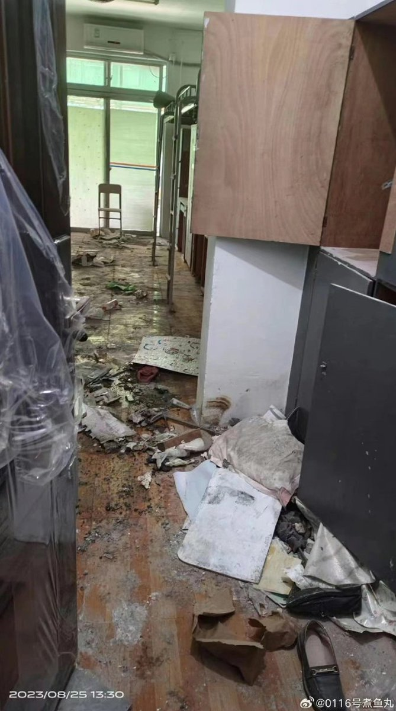
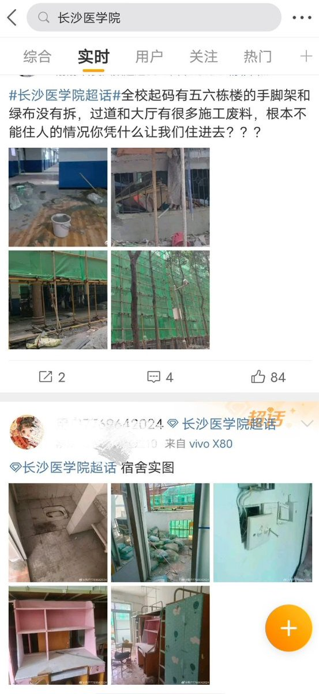
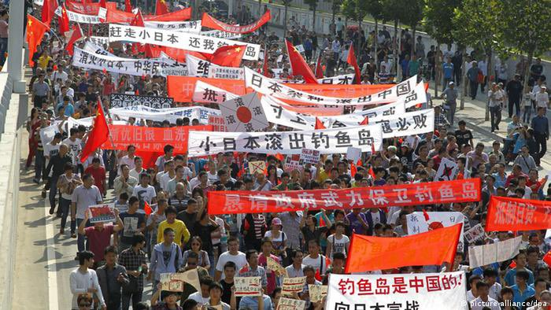
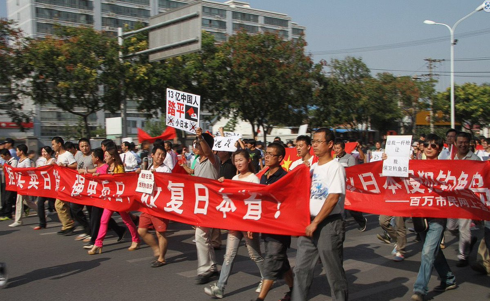

谁将十万横扫三江 北京时间 2023-08-27T18:33:07Z 1695746255111233853 RT @FreeFrom_Nostr: 今天，我们向推特宣战

天下苦推特X久矣。
你受够了他对个人数据的贪婪，你受够了他对内容的限制。我们都受够了。

今时今日，我们需要一个不受审查、彻底保护隐私的互联网工具。我们不需要“他们”—— 中心化的产品和系统。

秉持此种信念，我们…   谁将十万横扫三江 北京时间 2023-08-27T16:58:28Z 1695722437814768001 RT @whyyoutouzhele: 8月25日，湖南长沙医学院学生在网上曝出，临近开学，宿舍却还在装修，过道和大厅全是废料无法入住。
而在学校门口有大量农民工维权，疑似与施工方产生纠纷停工。 https://t.co/JScpXT0ZRr   谁将十万横扫三江 北京时间 2023-08-27T09:34:55Z 1695610814403838422 RT @Ipkmedia: 【独家·  张鸣：佳士工人运动五周年———走向分化的年轻毛左，后继无人的佳士路线？】

2018年7～8月间发生的佳士事件中，北大马院的毛左学生岳昕、沈梦雨、邱占萱等和部分因争取组织工会而遭公司解聘的员工一起抗争维权。大学生参与工运引起极大的关注，他…   谁将十万横扫三江 北京时间 2023-08-27T08:37:23Z 1695596333149904913 RT @FreeChinaaa: 十年前的粉红：抗议、串联游行、示威、上街表达诉求、拉横幅、喊口号

现在的粉红：网上猎巫式喷网友、给不相关的日本普通人打骚扰电话、在渔民卖货直播间刷屏 https://t.co/zLsPPp5fS7   