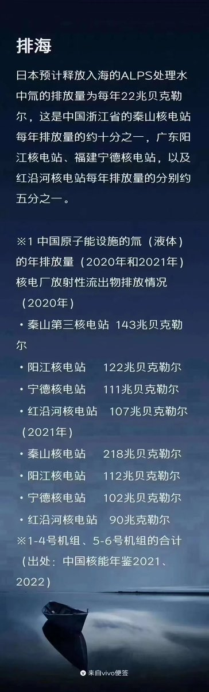
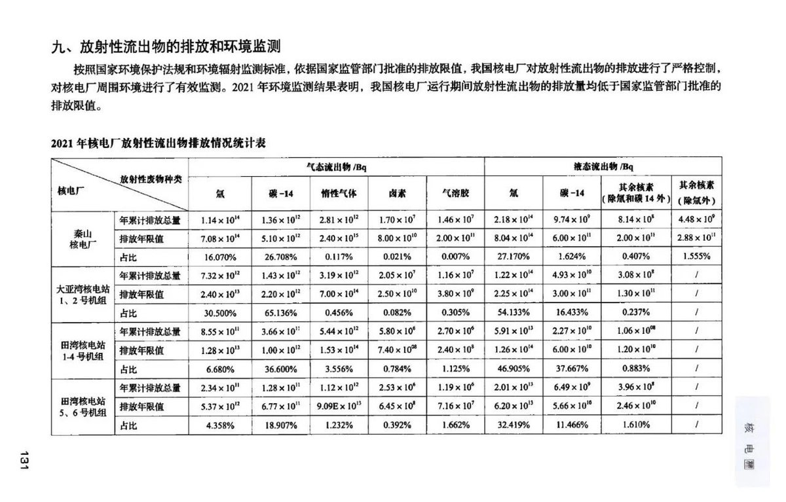
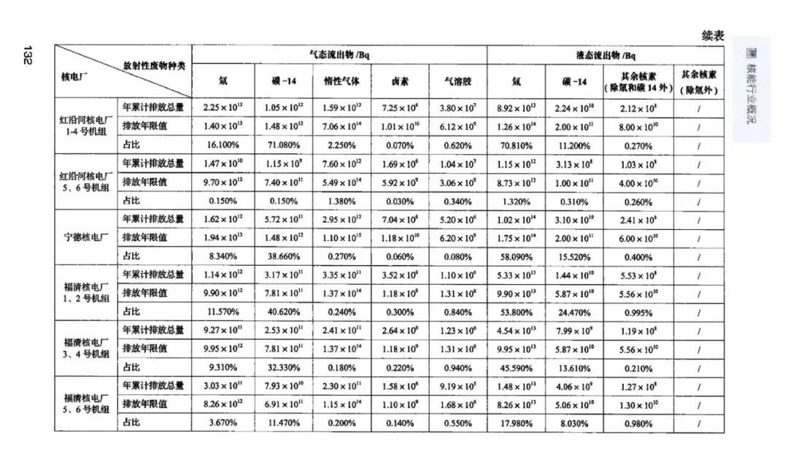
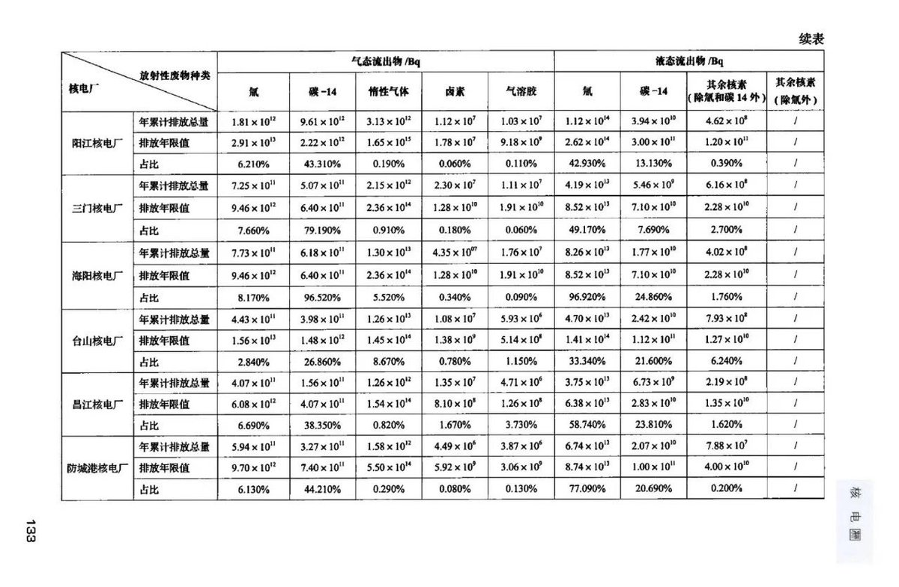
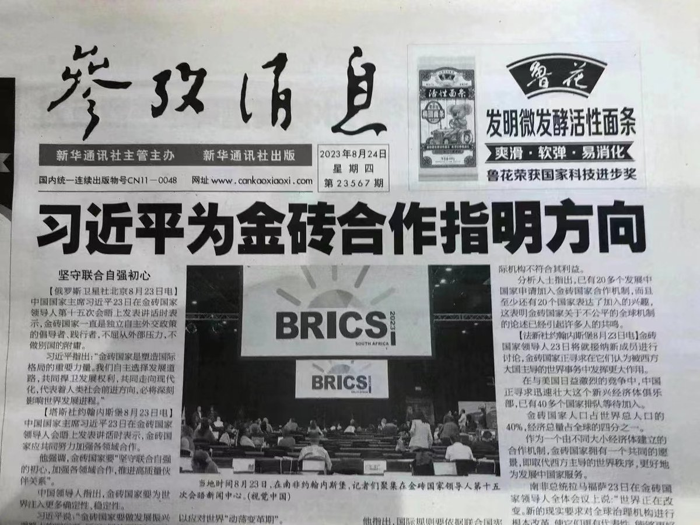

Petrichor 北京时间 2023-08-26T12:26:13Z 1695291534462288013 是真打吗？被打的后背衣服下有一块铁板？这样的训练，有必要吗？到战场上，与美军无人机对打？ https://t.co/Kg7PD2GIkh   Petrichor 北京时间 2023-08-26T10:26:21Z 1695261368931295418 刘华是国家原子能委员会的中国代表。他于2021年2月20日开始履行副总干事兼技术合作司司长的职责。他是一名在核科学和辐射防护领域有着30多年经验的工程师和科学家，具中国原子能科学研究院辐射防护与环境保护专业博士学位和辐射防护与核安全专业硕士学位。他还取得清华大学高级工商管理硕士学位和中国长沙国防科学技术大学核物理专业学士学位。
在日本福岛核电站处理水排放大海问题上，他从科学出发，郑重地投了赞成票。不失科学家讲真话的本色。

在加入国际原子能机构之前，刘先生于2018年至2021年任生态环境部副部长，2016年至2018年任环境保护部副部长。在2016年至2021年期间，他还任负责监管和确保中国所有民用核基础设施安全的政府机构国家核安全局局长。   Petrichor 北京时间 2023-08-26T10:38:01Z 1695264304424001905 这个视频讲当下中国医疗行业反腐的，同时承认这次反腐重点是医院领导，而非普通医生。承认中国医生收入比国外差，普通医生适当收受红包，补贴家用，也是可以理解的。 https://t.co/UgtH4ph7eK   Petrichor 北京时间 2023-08-26T12:17:13Z 1695289270410359004 预计接下来中国从俄罗斯进口海鲜产品会增加，而俄罗斯从日本进口海鲜产品也会同步增加。中国的吃货有福了，吃的是从俄罗斯转口中国的日本海鲜，但海鲜价格会大幅上涨。 https://t.co/Yp2AmunhAu   Petrichor 北京时间 2023-08-26T07:36:47Z 1695218697630040197 老妈看视频笑哈哈的，我问她怎么这么高兴，她于是转发这个视频给我。 https://t.co/FWfNwcWdoq   Petrichor 北京时间 2023-08-26T07:30:13Z 1695217043262324796 震惊了，还指明方向啊？都什么时候了？先弄清楚自己的方向错没错？生命不息，牛逼不止。 https://t.co/ShWOMRlb9G   Petrichor 北京时间 2023-08-26T07:46:30Z 1695221141311225994 “抵制日本生鱼片”。即使美国和加拿大，开日本生鱼片店的大多是华人。 https://t.co/mYu1JYiNhN   Petrichor 北京时间 2023-08-26T07:51:34Z 1695222418468458687 反日，又游行了！没有政府怂恿，这样游行绝不会发生。反科学的游行，把本来的科学问题政治话、武器化。 https://t.co/Z3E4Q4y6Y9   Petrichor 北京时间 2023-08-26T00:42:48Z 1695114514457403594 【咱们这一代，抢过米，抢过面，抢过酱油，抢过蒜，抢过口罩，抢过酒精，抢过消毒液和鸡蛋，这次又要抢食盐。除了银行咱没抢，其它咱都抢了个遍！】网友评论。 https://t.co/zOIUkpk8Wn   Petrichor 北京时间 2023-08-26T02:09:15Z 1695136269116833914 虽然这样的坏蛋，任何民族都有，但是我还是希望这不是中国人。媒体报道多了，不免让其他民族的人对华人反感。 https://t.co/99w3GiyRGH   