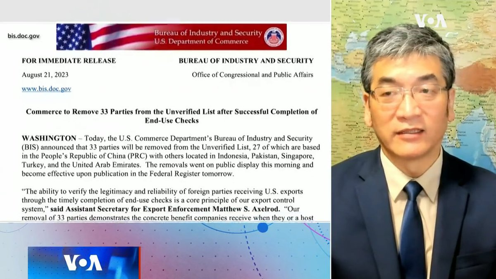
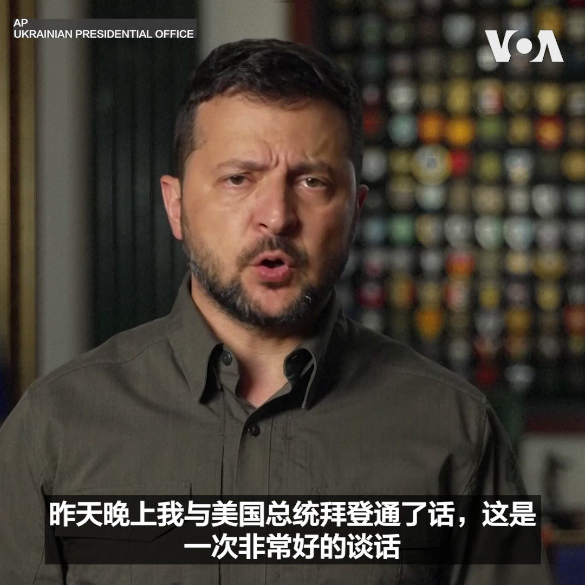
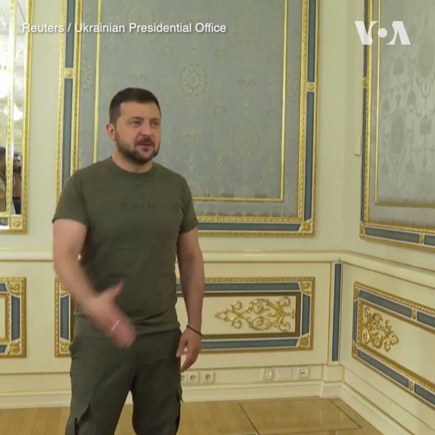
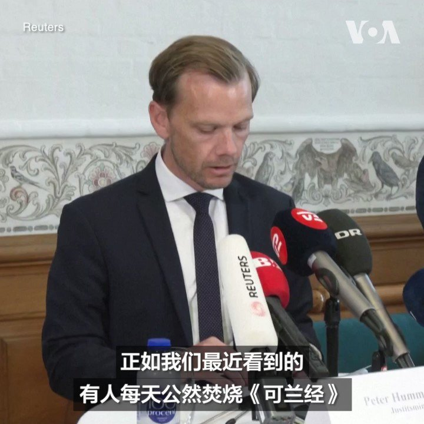

美国之音中文网 北京时间 2023-08-26T06:40:03Z 1695204419510620203 日本排核废水入海遭中国谴责 北京的反对合理吗？ https://t.co/ElfbtzF6eL   美国之音中文网 北京时间 2023-08-26T06:53:04Z 1695207694758727840 采访问答：中国房地产泡沫是怎样炼成的？中国政府是否会救市？应对措施能否奏效？ https://t.co/65QMrYvaGm   美国之音中文网 北京时间 2023-08-26T07:23:34Z 1695215368875430020 涉贿赂中国官员，3M公司因违反美国《反海外腐败法》而支付650万美元罚金 https://t.co/49W2uqMAKH   美国之音中文网 北京时间 2023-08-26T08:18:33Z 1695229208510042255 随着总统选举临近，美国人对乌克兰的支持可能在减弱 https://t.co/cMevn1Fi0A   美国之音中文网 北京时间 2023-08-26T08:49:04Z 1695236885071925698 戴维营三边安全协议可能引发中国对韩国的报复 https://t.co/Jj0OzdOY8b   美国之音中文网 北京时间 2023-08-26T09:00:01Z 1695239642394607923 一键解锁#美国热搜 榜：1、情报；普里戈任空难原因 2、谁要了普里戈津的命？3、全民抢盐运动背后的推手，中共的算计 4、习近平这次要锤爆海洋渔业，1600万人将失业 5、某211高校实际就业率14% 6、金正恩是个好领导 7、陈秋实：为什么中国是个卡夫卡式的社会 https://t.co/ngUQJI9Kck   美国之音中文网 北京时间 2023-08-26T09:04:02Z 1695240655386415221 中国要美“立即撤销”对台军售，专家称美售台红外侦搜系统有助台战机“看见敌人” https://t.co/JzCCLPoxNE   美国之音中文网 北京时间 2023-08-26T04:44:04Z 1695175230157971651 澳大利亚、菲律宾和美国军队在南中国海演练夺回岛屿 https://t.co/8Po8EgmZVN   美国之音中文网 北京时间 2023-08-26T04:57:03Z 1695178498300858588 华为与爱立信续签技术许可协议 https://t.co/kQxv8OGSYh   美国之音中文网 北京时间 2023-08-26T05:12:32Z 1695182395799130245 福岛核电站运营商称水样在安全范围内 https://t.co/8we4JEEemm   美国之音中文网 北京时间 2023-08-26T05:32:05Z 1695187315147296959 “金砖五国”宣布纳入伊朗、沙特、埃及、阿联酋、阿根廷和埃塞俄比亚六个新成员国家。中国和俄罗斯一直在努力推动扩大这个新兴经济集团，希望制衡西方的影响力。不过专家认为，金砖的扩张并不意味着中俄就能成功推动该集团反美、反西方。详细内容：https://t.co/53XtWe75fS https://t.co/2VpSZ20Xww   美国之音中文网 北京时间 2023-08-26T05:43:04Z 1695190076832239844 政变者结盟：马里和布基纳法索承诺向尼日尔军政府提供援助 https://t.co/vpJVumbWAn   美国之音中文网 北京时间 2023-08-26T06:00:02Z 1695194346344026239 美国商务部长雷蒙多将出访北京，独立时评人，《旭光时评》主持人郑旭光先生说，北京期望美国能放松高科技出口限制，并再考虑投资禁令，但是同时这也是美国国会议员所担心的。#时事大家谈 完整版：https://t.co/KnKzohNkRs https://t.co/W77MwHRRDj   美国之音中文网 北京时间 2023-08-26T03:21:16Z 1695154391882592283 乌克兰总统泽连斯基25日说美国将参加训练乌克兰 F-16战机飞行员的项目。 https://t.co/38D1EJLp8S   美国之音中文网 北京时间 2023-08-26T03:24:48Z 1695155282287136854 乌克兰总统泽连斯基8月25日在基辅会见了到访的土耳其外交部长费丹。两人讨论乌俄战争局势、乌克兰提出的和平方案以及如何恢复黑海谷物运输通道等议题。俄罗斯上个月退出了允许乌克兰经黑海航道出口粮食的《黑海谷物倡议》。 https://t.co/s0FYo0fEPD   美国之音中文网 北京时间 2023-08-26T03:40:02Z 1695159116707270812 中国军舰在斯里兰卡停靠引发印度的安全担忧 https://t.co/XKPe7W1y3Q   美国之音中文网 北京时间 2023-08-26T03:40:04Z 1695159124261212572 美国务院声明全文：日本从福岛排放经处理水的程序“安全、透明并基于科学”，美方表示“满意” https://t.co/FG9vvQxRke   美国之音中文网 北京时间 2023-08-26T00:57:32Z 1695118223279259957 中国房地产业危机日益加深之际，国务院批准规划建设保障性住房指导意见 https://t.co/pwuLZfkJ7x   美国之音中文网 北京时间 2023-08-26T01:45:05Z 1695130186399076380 北京当局面对经济困局着急上火 动员国内外投资者出钱出力 https://t.co/ltMbtEUdwl   美国之音中文网 北京时间 2023-08-26T02:15:06Z 1695137741225234510 丹麦司法部长8月25日宣布，丹麦政府拟通过立法，禁止在公共场所焚烧伊斯兰教经书《可兰经》。最近几星期，丹麦和瑞典连续发生多起焚烧和破坏《可兰经》事件，引起多个穆斯林国家的强烈抗议。反对丹麦政府拟定禁令的批评者认为，禁令将损害丹麦人的言论自由。 https://t.co/EeYXQG7j73   