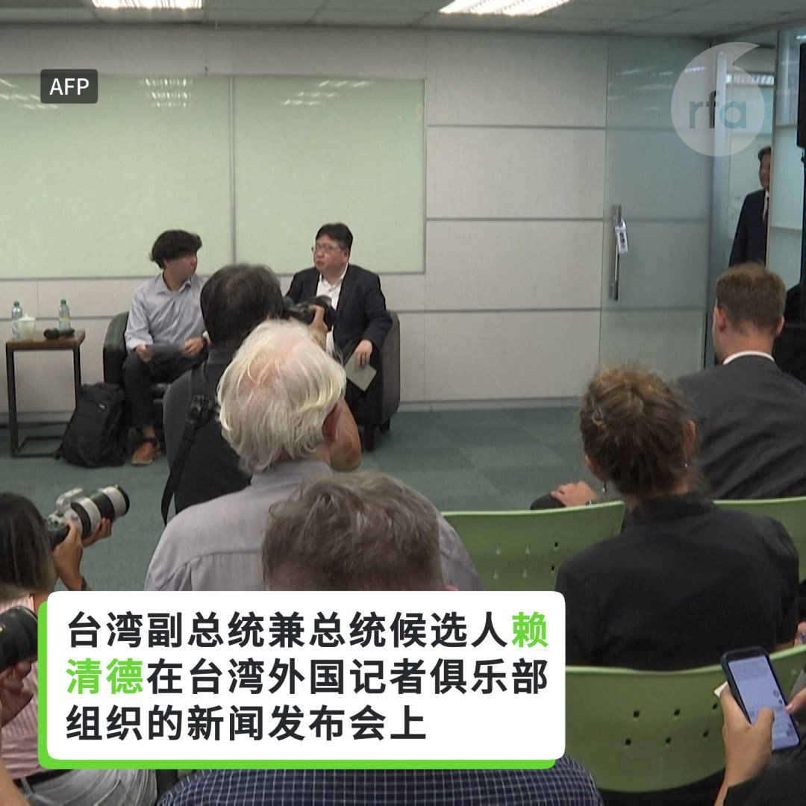
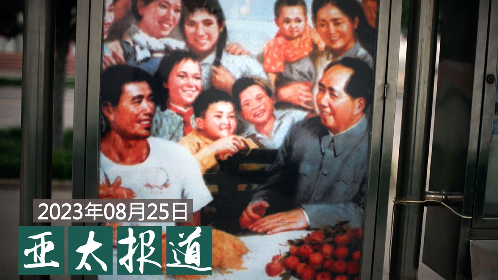
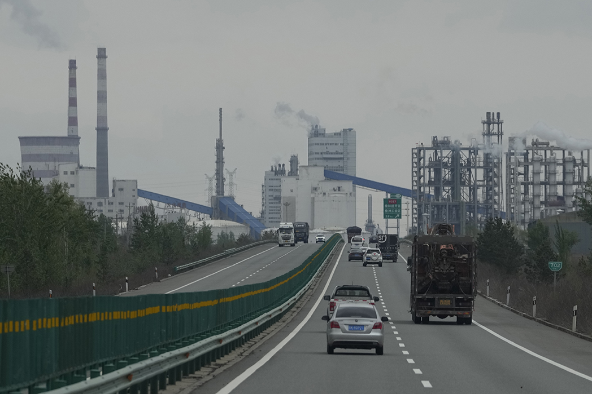
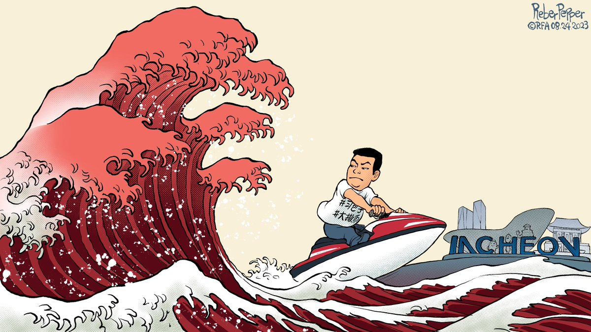
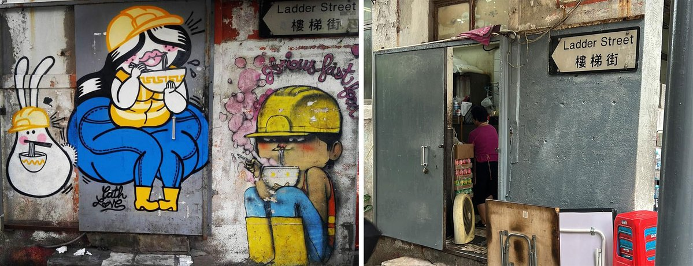

自由亚洲电台 北京时间 2023-08-26T10:29:01Z 1695262041710440578 美国国务院发言人马修·米勒（Matthew Miller）25 日下午发表声明，对日本“安全、透明和基于科学”地排放 #福岛 核电站的处理水感到满意，并欢迎日本继续与国际原子能机构及区域利益攸关方保持透明和接触。
 https://t.co/JvXti3FEeo   自由亚洲电台 北京时间 2023-08-26T10:18:09Z 1695259304159248811 RT @RFA_Chinese: 【中国禁止进口日本海鲜　政治意义大于经济意义？】
8月24日日本开始排放核污水，中国宣布禁止进口日本海鲜。
对日本有何影响？
日本对外贸易主要以汽车为主，海产品仅占日本全球贸易不到1%，中国是日本最大海鲜出口市场。
去年日本向中国供应的15.6…   自由亚洲电台 北京时间 2023-08-26T10:18:39Z 1695259432047816948 RT @RFA_Chinese: 【金砖国家集团扩张 能否撼动国际秩序？】

#习近平 在8月23日的 #金砖国家领导人峰会 上，呼吁加快金砖国家集团的扩张。 https://t.co/qxA2i8DGfW   自由亚洲电台 北京时间 2023-08-26T10:19:06Z 1695259543595274744 RT @RFA_Chinese: #李玟 生前控诉《#中国好声音》黑幕的录音和视频上周曝光后，《中国好声音》母公司 #星空华文 股价断崖式暴跌，近两个交易日累计跌幅高达47%，市值蒸发达200亿港元。截至发稿，《中国好声音2022》豆瓣评分至已降至2.4分。评论区愤怒声讨排山倒…   自由亚洲电台 北京时间 2023-08-26T04:44:43Z 1695175393991610657 【赖清德 ：“坚定不移”支持两岸现状】
台湾副总统兼总统候选人 #赖清德 在台湾外国记者俱乐部组织的新闻发布会上表示：“坚定不移”支持两岸现状。 https://t.co/J0RAsjADi9   自由亚洲电台 北京时间 2023-08-26T05:13:17Z 1695182585180405841 专栏 | #夜话中南海：已知有哪几位二十届 #全国人大代表 面临被“终止资格”
 https://t.co/UL8fFxgoGu   自由亚洲电台 北京时间 2023-08-26T07:24:44Z 1695215665651880303 【#亚太报道（2023-8-25）】
欢迎收听和订阅播客【亚太报道】 https://t.co/MjLNSvVMqc

中国多地发生民众 #抢盐 事件 / 习提 “#乡情牌”引发文革式 #下乡 担忧 / “#拆墙运动”发起人 #乔鑫鑫 家属寻求国际声援 / “#709大抓捕案”家属 #李文足 申办护照遭拒 / 中国新冠“#清零”政策突变或致百万人死亡 https://t.co/7CqASt7y5I   自由亚洲电台 北京时间 2023-08-26T07:39:00Z 1695219254440988985 评论 | #陈破空：#中国经济 一败再败，在于 #习近平 的性格。性格决定命运
 https://t.co/G1P2kQKyw3   自由亚洲电台 北京时间 2023-08-26T08:00:01Z 1695224544418828396 专栏 | #周嘉有话说：“#间谍 就在你身边”
#周孝正
 https://t.co/5RyzrZoDKV   自由亚洲电台 北京时间 2023-08-26T09:11:34Z 1695242548548440463 专栏 | #财经时时听：#碧桂园 等接连爆雷 中国 #雷曼时刻 已至？
 https://t.co/ClBRthPLF3   自由亚洲电台 北京时间 2023-08-26T03:57:09Z 1695163425075384475 【中国海鲜商贩太难了！】
中国政府宣布自8月24日起 #禁止进口日本海鲜。很多中国海鲜商贩们表示支持，但也担心影响生意。 https://t.co/AuXtSZ2MoA   自由亚洲电台 北京时间 2023-08-26T04:33:27Z 1695172560554709484 一场名为"#冒险极乐园"（Perilous Playground）的艺术展于8月24日在旧金山唐人街的中华文化中心（Chinese Culture Center）对外开放，并将持续到明年八月，其中有来自香港、台湾和新加坡等地的艺术家参展。本次展览关注城市变迁对民众的影响，以及民众与政府周旋的过程。

 https://t.co/PvFDm9FWWu   自由亚洲电台 北京时间 2023-08-26T04:57:26Z 1695178594040033561 #侯友宜 竞选办公室24日发布的新闻稿，侯友宜计划9月14日出发，展开八天 #访美 行程，首站到纽约，之后到华盛顿，9月21日再从旧金山搭机返台。侯友宜除了将会晤美国国会参众议员，拜会美国在台协会（AIT）理事主席Laura Rosenberger，也将应邀在智库演讲，并出席侨界活动。
 https://t.co/Ch0mK2jQt6   自由亚洲电台 北京时间 2023-08-26T05:30:00Z 1695186791094178116 美国《华尔街日报》25日发文，指出中国当前萎靡不振的原因有很多，关键问题可能要归结为家庭财务, 而普通民众对于疫情封控解除后，生活将持续改善的信心已发生严重动摇，这可能会拖累整体经济。
 https://t.co/bdMwIbDKHA   自由亚洲电台 北京时间 2023-08-26T00:38:41Z 1695113477550199048 #李文足："我去办护照，北京说是巴东县公安局给我限制，而巴东县公安局说他们的电脑显示是限制办理，但没有理由，然后要求叫来领导，领导说'原因你比我们更清楚'，又说，都是上头的意思。我说你要给我一个理由，他却说不行，因为涉及到秘密，不能给我出示书面的材料..."

 https://t.co/3BxjRYrgXv   自由亚洲电台 北京时间 2023-08-26T02:24:27Z 1695140093550531015 据路透社25日报道，由美国联邦政府资助的西雅图哈钦森癌症中心研究项目，采用了来自中国一些大学发布的死亡率数据样本和在线搜索结果。研究发现，2022年12月至2023年1月期间，除西藏外中国大陆所有省份因各种原因导致的30岁以上人群额外死亡人数多达187万人。

 https://t.co/2mrEXZ3XIK   自由亚洲电台 北京时间 2023-08-26T03:31:03Z 1695156857449406687 据本台英语组报道，国际货币基金组织（IMF）最新报告说，2022年全球 #化石燃料补贴 达到创纪录的7万亿美元，相当于全球国内生产总值的7%以上。按地区划分，东亚和太平洋地区占全球补贴的近一半。
报告显示，按国家绝对值计算，中国在 2022 年的补贴额最大（2.2 万亿美元），其次是美国（7,600 亿美元）、俄罗斯（4,200 亿美元）、印度（3,500 亿美元）和欧盟（3100 亿美元）。
根据IMF周四(24日)发布的这份报告，由于俄罗斯入侵乌克兰以及新冠病毒 (COVID-19) 大流行带来的经济反弹，全球 #能源价格 飙升，促使各国政府向消费者和企业提供财政补贴，以稳定消费者价格。
报告称：“化石燃料定价过低意味着政府放弃了急需的宝贵收入来源，并损害了分配和减贫目标，因为定价过低带来的大部分好处都归于较富裕的家庭。”
报告指出，考虑到气候变化造成的损害以及大量的人口因化石燃料空气污染而过早死亡（每年 450 万人），有效燃料价格与当前燃料价格之间的差距往往很大。   自由亚洲电台 北京时间 2023-08-26T04:14:03Z 1695167678749757862 【#变态辣椒：用摩托艇投票】
三十五岁的中国异议人士 #权平， 曾因身穿把中国领导人习近平比做希特勒的T恤衫而服刑，他最近驾驶摩托艇跨越三百公里宽的黄海逃到了韩国。这名朝鲜族活动人士现身韩国港口城市仁川并向警方自首。他表示，他是为了躲避政治迫害及当局监视而非法进入韩国。 https://t.co/1eP7zkyuQB   自由亚洲电台 北京时间 2023-08-26T01:08:23Z 1695120952978510211 左图：引起争议的“#黄帽工人”壁画早在香港爆发社会运动之前已存在。
右图：港府接获居民投诉后，派人把“黄帽工人”涂鸦清除。（“#辉煌快餐店”脸书图片）
【香港快餐店外"黄帽工人"壁画被移除：非执法部门政治审查？】
详见：https://t.co/0VOJX1DBCa https://t.co/5BK3bd8zhn   自由亚洲电台 北京时间 2023-08-26T01:29:11Z 1695126188346536212 涉嫌煽动颠覆国家政权的拆墙运动发起人 #乔鑫鑫（本名 #杨泽伟）被当局正式逮捕后，家属决意向国际人权组织寻求协助，并同意让体制外的律师介入。但是面对当局强力维稳，要确保乔鑫鑫能公正受审，估计仍有不少困难。

 https://t.co/aBVL1UPN9F   自由亚洲电台 北京时间 2023-08-26T00:07:07Z 1695105534540861890 出席 #金砖峰会 的中国国家主席 #习近平 周四结束了对南非的访问，台湾的总统府周五宣布，#蔡英文 总统也将在九月初访问台湾在非洲的唯一友邦史瓦帝尼王国（或译斯威士兰王国）。对此，台湾方面强调纯属“时间巧合”。

 https://t.co/YTvmjFbOC9   