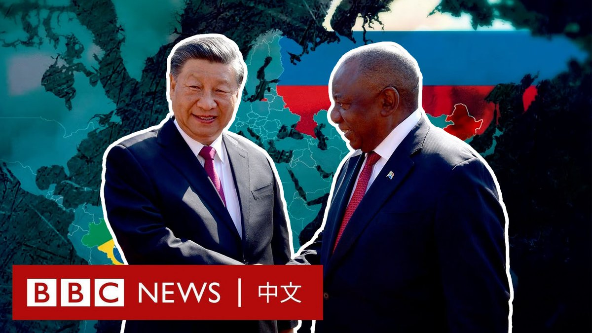
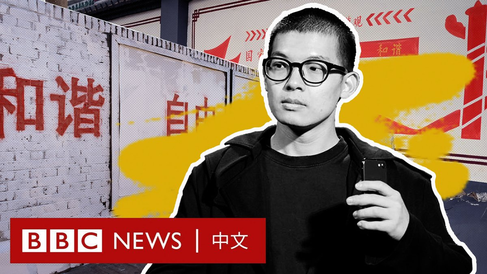
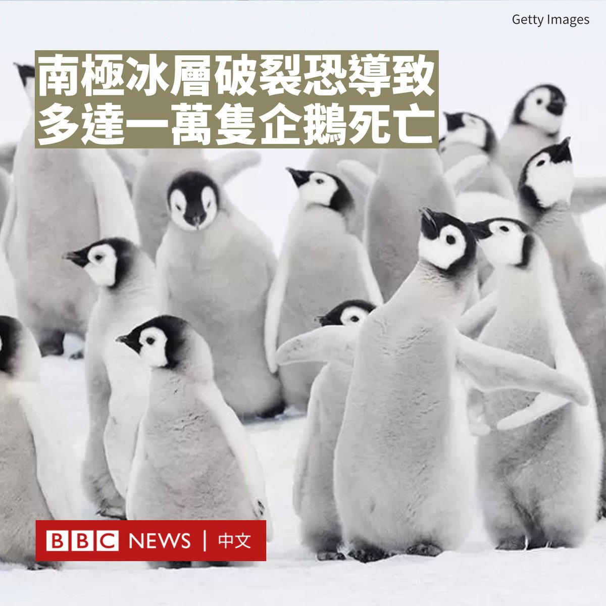
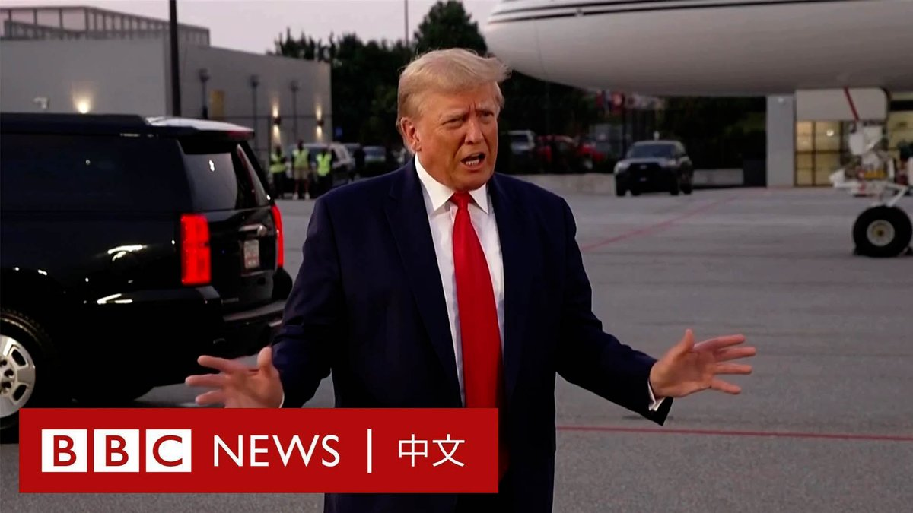
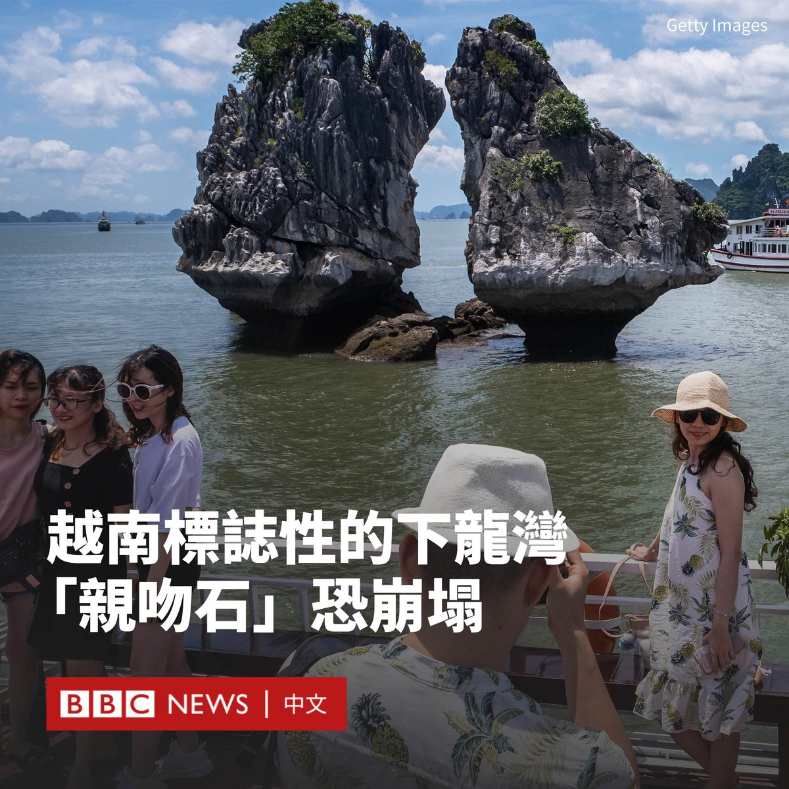
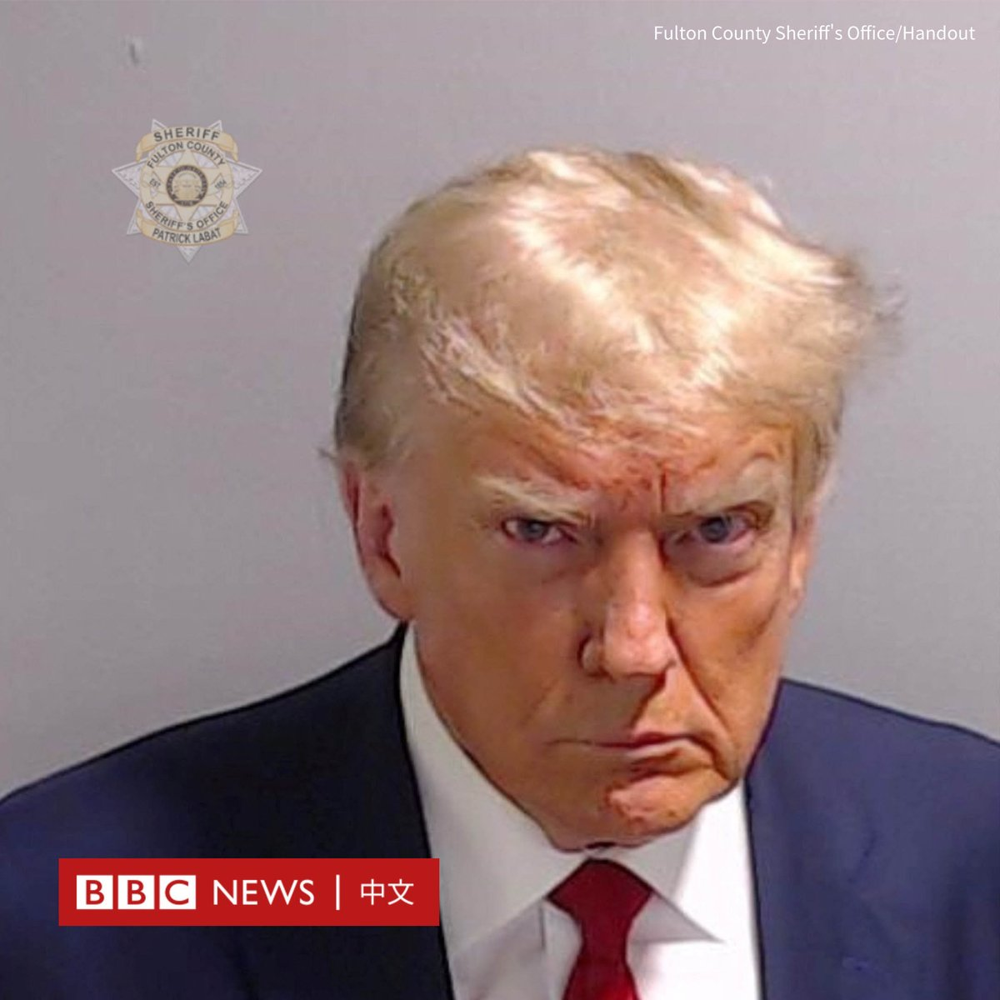

D英国广播公司BBC 北京时间 2023-08-25T22:15:18Z 1695077395131412946 “在一个不涉及美国或西方的自家俱乐部里会面并发表重大声明，是非常有力的。”

金砖国家峰会在南非落幕。此次峰会吸引了很多发展中国家的目光，也凸显了很多国家所面临的束缚——如何在崛起的新兴世界挑战者和代表旧秩序的西方之间左右逢源。

一些观察者认为，金砖集团仍将以经济合作为主，但一些人已将其比作七国集团的竞争对手。金砖国家会成为新世界秩序的重心吗？   D英国广播公司BBC 北京时间 2023-08-25T18:19:33Z 1695018064377426256 普京与普里戈津的友谊始于后苏联时期的混乱，止于乌克兰战争开始后的动荡和叛乱。它夹生于国家安全部门与黑帮互相勾结的灰色地带，不可避免地让一对老友反目成仇。https://t.co/cfBhDPd511   D英国广播公司BBC 北京时间 2023-08-25T20:13:06Z 1695046642444255561 “很多人总是觉得你要不就是‘小粉红’，要不就是‘高级黑’。”

本月初，一群来自中国的留学生在伦敦东部的红砖巷，用白漆覆盖了一整面涂鸦墙上的作品，并以红色喷漆写上中国大街小巷常见的“社会主义核心价值观”宣传标语，这在社交媒体上掀起巨大争议。

该活动的主创“一鹊”（本名王汉铮）在事件发酵后接受了BBC中文的访问，讲述了这次涂鸦创作的初衷以及对其作品质疑的回应。他称希望借该作品“测试西方民主自由”。   D英国广播公司BBC 北京时间 2023-08-25T15:19:41Z 1694972801789362680 南极洲出现了帝企鹅幼崽灾难性的死亡事件，估计有多达10,000只企鹅雏鸟死亡。

新刊发的研究显示，在2022年年末，一群帝企鹅雏鸟出生后，在换羽期间而还未长出防水羽毛之前，海冰突然融化并碎裂，导致它们很可能被淹死或冻死。

英国南极调查局（BAS）的彼得·弗雷特韦尔（Dr Peter Fretwell）博士及团队在《地球与环境通讯》（Communications Earth & Environment）杂志上报告了这起死亡事件。

弗雷特韦尔博士告诉BBC说：“帝企鹅的繁殖期依赖于海冰。海冰是它们哺育幼崽的稳定平台。但如果海冰的面积没有足够大或更快碎裂，这些鸟就会有麻烦。”

科学家们以卫星图像监控了在南极大陆西部，临近别林斯高晋海的位置，帝企鹅的在五个栖息地的繁殖情况，分别是罗斯柴尔德岛、威尔地湾、斯迈利岛、布莱恩半岛和普弗罗格纳角。

但卫星图像显示，只有罗斯柴尔德岛的帝企鹅雏鸟繁殖成功。

随着南半球冬季的来临，帝企鹅在三月左右跳上海冰，进行求爱、交配、产卵及育雏，然后在接下来的几个月里喂养雏鸟，直到雏鸟长大。

每年12月到次年一月稳定连接到陆地的海冰，是帝企鹅成功长大、走向海洋的关键，但研究小组发现，帝企鹅栖息地下的海冰在11月份就已经碎裂，成千上万只雏鸟来不及换羽。

自2016年以来，南极夏季的海冰急剧下降，而周围的冰冻水域总面积不断减少，创下历史新低。

在过去两年的夏季，别林斯高晋海几乎完全没有冰盖。更重要的是，近几个月浮冰形成缓慢，这意味着至少在未来一年内，可能都不会再有雏鸟诞生。

据预测，到本世纪末，90%以上的帝企鹅繁殖地将消失，因为在全球暖化下，南极大陆的季节性海冰将逐渐萎缩。   D英国广播公司BBC 北京时间 2023-08-25T13:04:37Z 1694938812416491979 美国前总统特朗普（Donald Trump）前往佐治亚州因条件恶劣而声名狼藉的富尔顿县监狱投案。

特朗普因被控试图推翻2020年佐治亚州大选的结果而被刑事起诉。他被拍下了嫌犯大头照，随后保释候审。 https://t.co/N0KqYFPqbH   D英国广播公司BBC 北京时间 2023-08-25T11:28:44Z 1694914679016210466 一份研究警告说，越南下龙湾标志性的“亲吻石”面临倒塌的风险。

“亲吻石”位于广宁省下龙湾的核心地带，这里星罗棋布着数百个小岛，是当地著名观光景点之一，获联合国教科文组织（UNESCO）评为世界自然遗产。

“亲吻石”也被一些人称为“斗鸡石”，它耸立在海湾中，看似互相触碰或“接吻”，吸引了很多游客来打卡。

越南地质科学与矿产资源研究所的专家何天聪（Ho Tien Chung，音译）表示，非法捕鱼和不受监管的旅游业正在加速岩石的侵蚀。专家观察到岩石上出现很深的裂缝。

专家警告称，如果不采取措施保护它们，“亲吻石”可能会倒塌。

进行研究期间，工作人员观察到一艘观光船停在离该岩石仅19米的地方。

“水位较低时，露出了岩石的支撑脚，而这些支撑脚正在逐渐被侵蚀，如果不尽快采取措施保护和加固，就会造成坍塌的危险。”他说道。

长期以来，下龙湾的小岛一直受到海岸侵蚀的影响。报告呼吁官方在下龙湾制定新规，包括限制通过该区域的船只速度为每小时5至10公里。

报告还建议鼓励当地渔民远离岩石附近捕鱼，以减少搅动，同时可以在裂缝中注入水泥以加固其基础。   D英国广播公司BBC 北京时间 2023-08-25T09:38:03Z 1694886826472075695 美国佐治亚州富尔顿县治安官办公室周四（8月24日）发布了前总统特朗普（Donald Trump）的嫌犯大头照。

特朗普被收押大约20分钟。根据富尔顿县的登记系统记录，他并被登记为编号P01135809的囚犯，头发为“金色或草莓色”、蓝眼睛，身高6英尺3英寸，体重215磅。

富尔顿县治安官办公室还公布了其他特朗普同案被告的大头照。

当天早些时候，特朗普因被控试图推翻2020年总统大选在该州的结果，前往富尔顿县监狱投案。他在那里被捕并做登记，包括录入指纹和拍摄嫌疑人大头照。随后他以20万美元保释金被释放候审。

特朗普否认13项针对他的指控，包括有组织敲诈勒索和虚假陈述，并表示这些指控是出于政治动机。

此前从未有美国总统或前总统被控刑事罪行，但特朗普现在面临四项刑事起诉。   D英国广播公司BBC 北京时间 2023-08-25T00:25:19Z 1694747728339693896 【最新消息】俄罗斯总统普京（Vladimir Putin）向瓦格纳集团首领普里戈津（Yevgeny Prigozhin）的家人表示哀悼。

普京称普里戈津是一名“才华横溢的商人”，表示他从上世纪90年代开始便与之相识，但他也提及普里戈津“犯了严重的错误”。

他还补充称，调查人员需要时间对该事件展开进一步调查。 https://t.co/st2mZOidH1   