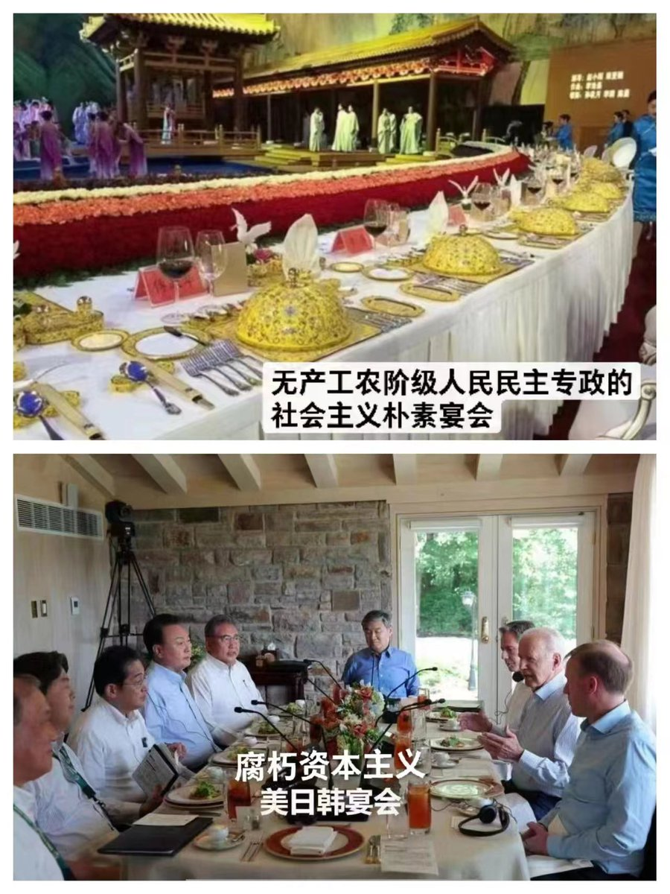
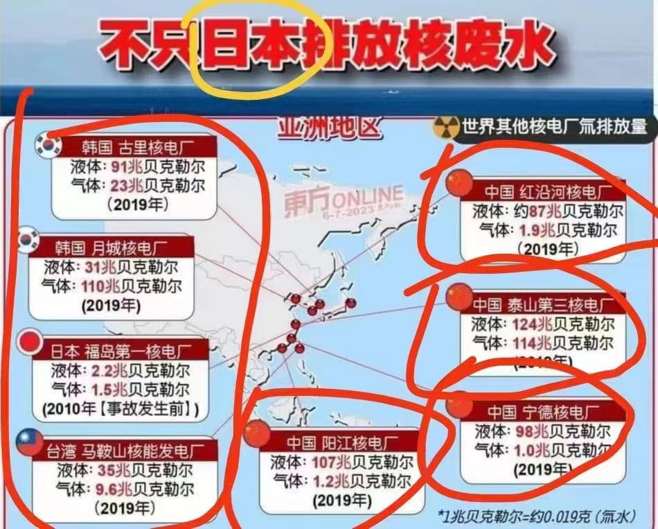
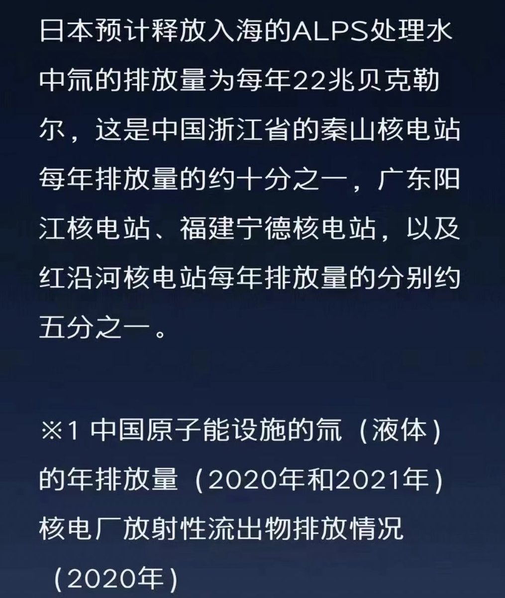
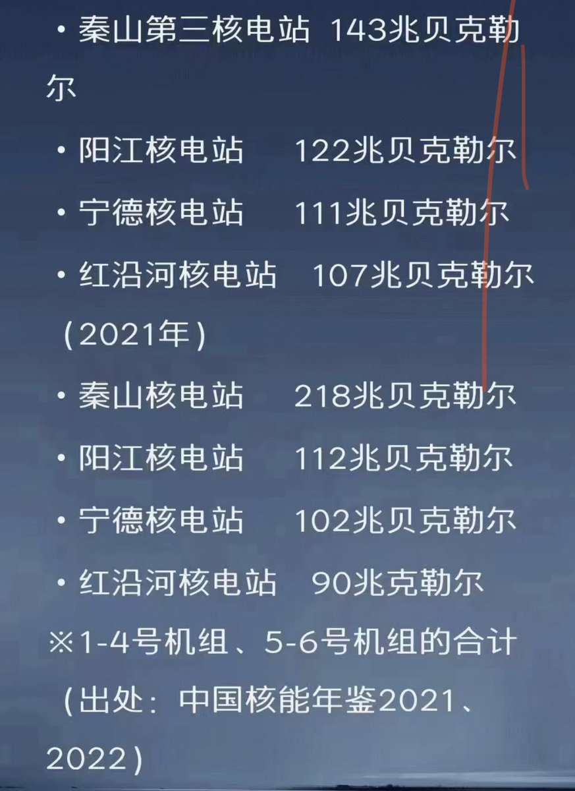
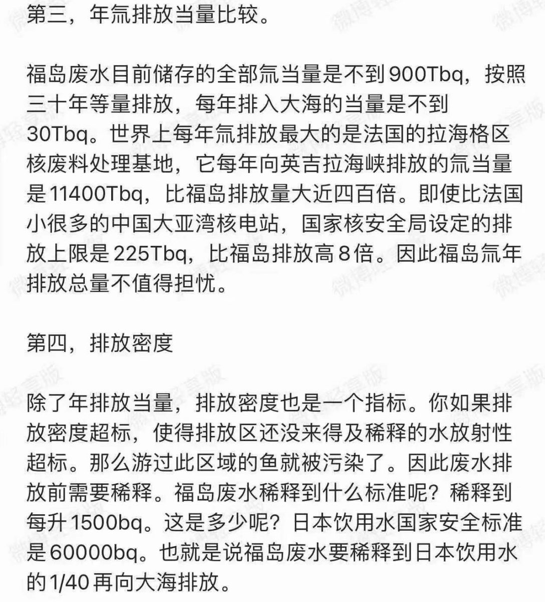

Petrichor 北京时间 2023-08-25T09:07:59Z 1694879260081532949 民选政府与独裁政府的差别，不在他们口头上，而在他们实际行动中。 https://t.co/MP6vGvjEx9   Petrichor 北京时间 2023-08-25T03:09:08Z 1694788951628767544 中国自媒体大量炒作日本福岛废水排放大海的事情，许多老百姓买盐，其实大家理应相信国际原子能机构的结论报告。日本人的海产消费大国，环境保护的各项指标历来比中国为高，日本人民不怕，中国人怕啥？真以为中国沿海地区的核电站不往附近海里排冷却水？里面的放射性量比处理过的福岛核电站冷却水更高呢？   