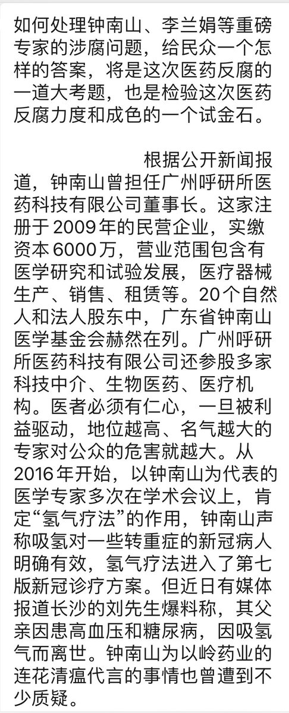
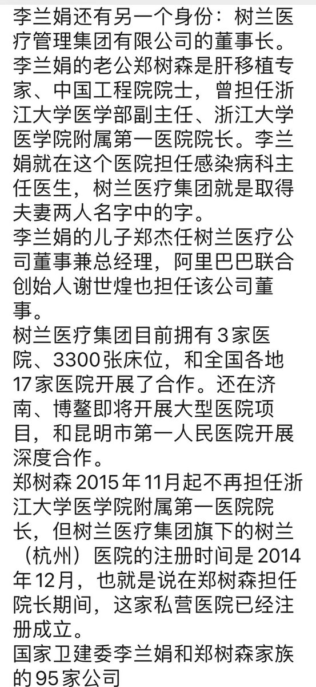
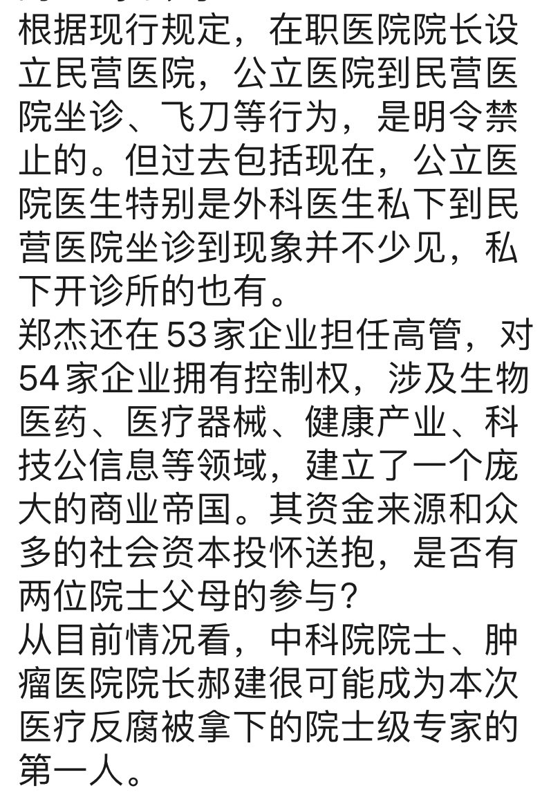
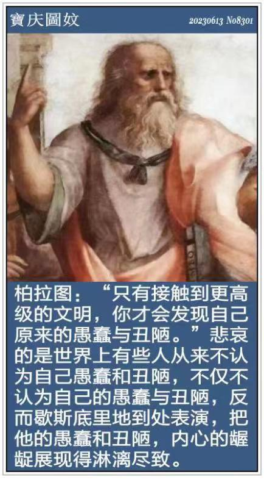
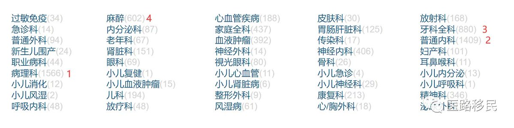
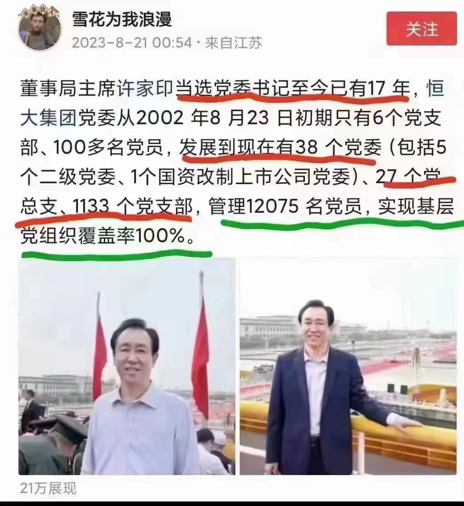
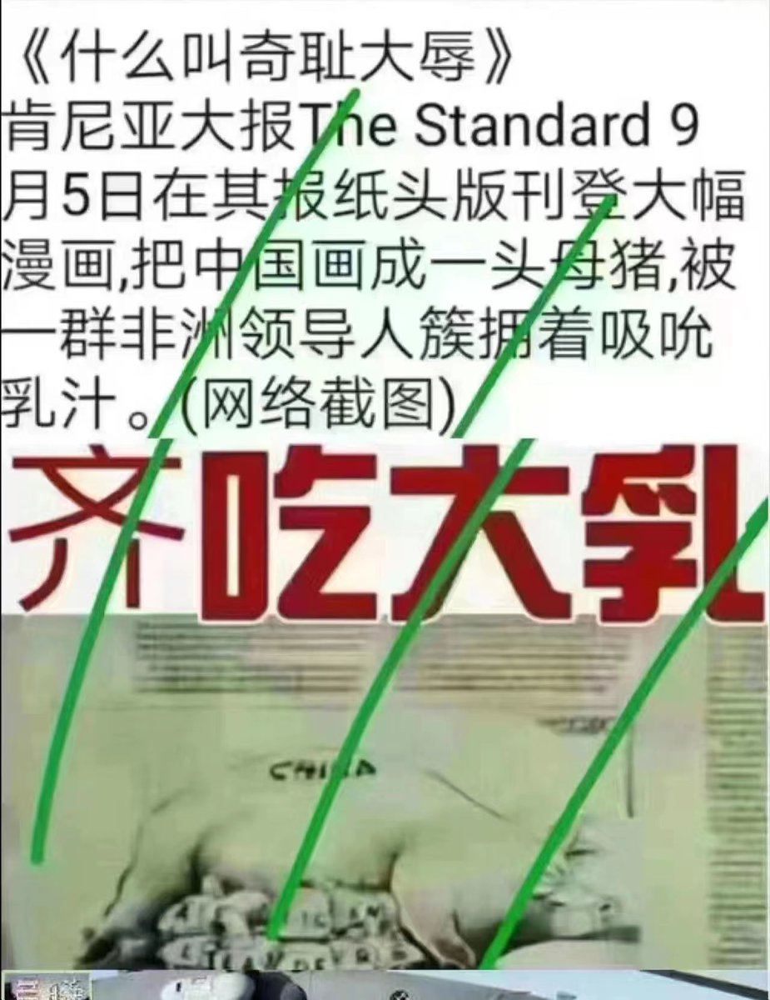

Petrichor 北京时间 2023-08-25T11:20:39Z 1694912645910970620 “两个维护”是中共中央总书记习近平于2018年9月提出的政治口号，是指“坚决维护习近平总书记党中央的核心、全党的核心地位，坚决维护党中央权威和集中统一领导”。
这样的两个维护在欧美民主国家是难以接受的，也是不可能实现的。你有政绩，大家才能维护你。你若政绩很差，还自吹自擂，到处撒币，决策连连错误，事事烂尾，反对党要拉你下台，即使自己党内也会辇你滚蛋。老百姓也不答应，一人一票赶你下台。
这就是意识形态的不同，与普世价值格格不入。   Petrichor 北京时间 2023-08-25T11:27:51Z 1694914459876184514 医疗行业的反腐，必须从查处钟南山、李兰娟这些人开始，经济效果和政治效果都会好。 https://t.co/W8PZAK2iJU   Petrichor 北京时间 2023-08-25T07:25:57Z 1694853583244529702 柏拉图的规则不适合中国人，中国人是接触到更高级文明之后，才发现自己更爱原先的愚蠢与丑陋。这就是为什么许多人来到欧美之后，立马做起“侨领”，充当独裁国家的代理人的原因。 https://t.co/1XjiJlFtZu   Petrichor 北京时间 2023-08-25T08:18:27Z 1694866794769793137 胡搅蛮缠的发言人 https://t.co/YY0GYQrCsI   Petrichor 北京时间 2023-08-25T09:25:52Z 1694883758388768798 现在美国行医的中国医学院毕业生（CMG）的人数一共有8136人，其中男性占49.56%，女性占50.44%；这些在美国执业的中国医学院毕业生中，有36.97%同时拥有PhD学位。
特别需要说明的是，这些在美国职业的CMG中，并不都是华裔，还有一些是毕业于中国医学院的国际生。从专业领域看，在美国行医的CMG中，所从事专业领域最多的是病理科，占19%；后面依次是普通内科、牙科全科、麻醉科、家庭全科、神经科等。从毕业院校来源看，北京医科大学（现北京大学医学部）的毕业生最多，有1118位，占14%；其次是复旦大学医学院（原上海医科大学），有658位；第三多的是中山大学医学院（即中山大学中山医学院，原中山医科大学），有481位毕业生在美国行医。   Petrichor 北京时间 2023-08-25T06:51:50Z 1694844995646189645 不实现人人免费医疗的国家不是好国家。
不实现人人免费医疗的国家不是文明国家。 https://t.co/4veRYeUHjO   Petrichor 北京时间 2023-08-25T07:06:28Z 1694848680510083250 恒大欠债数额随着公司内部中共党员人数增加而快速增长。 https://t.co/GVaiuYuD3e   Petrichor 北京时间 2023-08-25T08:16:39Z 1694866339486138537 一群小黑猪，齐吃大乳。 https://t.co/02SU7RE1X8   Petrichor 北京时间 2023-08-25T08:47:02Z 1694873988755824933 中国青年的七夕，累而愉快着。 https://t.co/RGN2iN7xud   Petrichor 北京时间 2023-08-25T09:07:59Z 1694879260081532949 民选政府与独裁政府的差别，不在他们口头上，而在他们实际行动中。 https://t.co/MP6vGvjEx9   Petrichor 北京时间 2023-08-25T03:09:08Z 1694788951628767544 中国自媒体大量炒作日本福岛废水排放大海的事情，许多老百姓买盐，其实大家理应相信国际原子能机构的结论报告。日本人的海产消费大国，环境保护的各项指标历来比中国为高，日本人民不怕，中国人怕啥？真以为中国沿海地区的核电站不往附近海里排冷却水？里面的放射性量比处理过的福岛核电站冷却水更高呢？   