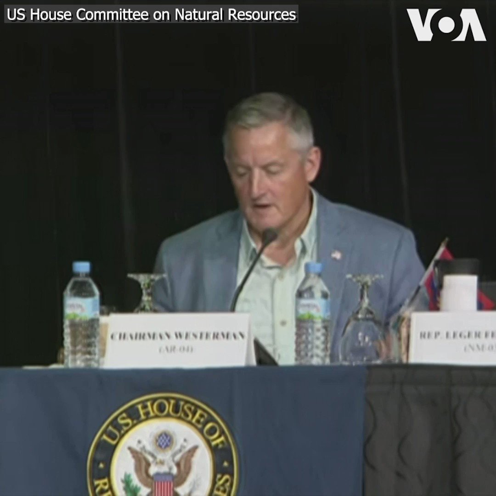

美国之音中文网 北京时间 2023-08-25T07:54:02Z 1694860651603345667 流亡维吾尔人驳斥外国代表团对中国新疆政策的赞扬 https://t.co/hriLSBq5CQ   美国之音中文网 北京时间 2023-08-25T07:54:04Z 1694860659429937356 美国情报初步评估显示普里戈津坠机事件源于蓄意爆炸,但无导弹击落迹象 https://t.co/rBGgw2uotY   美国之音中文网 北京时间 2023-08-25T08:23:02Z 1694867947762938362 美国制裁参与绑架、驱逐乌克兰儿童的俄罗斯人 https://t.co/igLm7XeHf0   美国之音中文网 北京时间 2023-08-25T09:21:04Z 1694882551364784548 特朗普在佐治亚州投案，宣称没做错任何事 https://t.co/hauY9uVvcE   美国之音中文网 北京时间 2023-08-25T09:40:00Z 1694887315632480593 美国前总统唐纳德·特朗普8月24日在佐治亚州亚特兰大市投案。他因涉试图推翻2020年在佐治亚的败选结果而在该州受到有组织敲诈勒索和串谋罪指控。完成登记手续并获保释后，特朗普在机场发表简短讲话，坚称没做错任何事。这是这位前总统五个月来受到的第四次刑事起诉。https://t.co/Kfuo9GVSEw https://t.co/C9WYFIA2ov   美国之音中文网 北京时间 2023-08-25T09:51:03Z 1694890099299995740 戴维营协议可能使中国在南中国海更加咄咄逼人 https://t.co/MGXQ7ZPuwJ   美国之音中文网 北京时间 2023-08-25T09:51:05Z 1694890107034382420 “只要中共掌权，它就永远不会承认” 中国生物军事研究不透明，美中是否还有合作可能？ https://t.co/aTT3ZwqVu5   美国之音中文网 北京时间 2023-08-25T04:44:04Z 1694812844141990315 印度总理莫迪就边境议题向习近平表达关切 https://t.co/vBpddtKJbn   美国之音中文网 北京时间 2023-08-25T05:11:33Z 1694819757361607093 引用“奥特曼”批评福岛核废水释放，中国反日宣传攻势全开 https://t.co/mJk9iqyM9y   美国之音中文网 北京时间 2023-08-25T05:34:46Z 1694825601641947498 五角大楼发言人莱德准将8月24日在例行简报会上表示，根据初步评估，瓦格纳集团首领普里戈津可能在坠机事故中丧生。他未就美国国防部认为飞机如何或为何坠毁做进一步说明，不过他说，飞机是被某种地对空导弹击落的说法是不准确的。 https://t.co/eEBfUQP75S   美国之音中文网 北京时间 2023-08-25T06:26:35Z 1694838641741414794 美国淡化金砖国家的扩容行动 https://t.co/FzZu9hL7nB   美国之音中文网 北京时间 2023-08-25T06:42:03Z 1694842536429560068 除中俄外的安理会成员国谴责缅甸军方杀害平民 https://t.co/bV9oAHnR2m   美国之音中文网 北京时间 2023-08-25T08:00:01Z 1694862154380271988 【家事国事天下事，你有何见解】在宪法被修改以便最高领导人可以任期无限的中国，网民对新加坡总理宣布到期卸任的议论受到封杀或限制，凸显当今中国的言论管控之严密。中国民众如今甚至举一张白纸上街也可以被抓捕。当今世界还有哪个或哪几个国家对表达自由管制如此之严？这与“道路以目”境界何异？ https://t.co/k4u3P9GMXS   美国之音中文网 北京时间 2023-08-25T08:38:03Z 1694871725631209941 日本排放经处理的福岛核废水后，中国敦促消费者不要疯狂囤盐 https://t.co/MdeZUTrMt0   美国之音中文网 北京时间 2023-08-25T04:28:04Z 1694808815106203917 着眼新兴科技和产业创新，台湾明年度科技预算增长18% https://t.co/VNSvOQJPRF   美国之音中文网 北京时间 2023-08-25T04:53:43Z 1694815272325292150 俄罗斯总统普金24日打破沉默，谈到普里戈津的死亡时表示，“普里戈津是一个命苦(命运坎坷)，在生活中犯过严重的错误的人。” 普里戈津乘坐的私人飞机8月23日晚飞往圣彼得堡途中在莫斯科西北部坠毁，包括三名机组人员在内的机上十人全数罹难。https://t.co/1Ffkr3AsNc https://t.co/FSwEXr3Ay7   美国之音中文网 北京时间 2023-08-25T05:27:04Z 1694823662682304603 特朗普前往佐治亚州投案，面对第四次刑事起诉 https://t.co/5amEK8oC1l   美国之音中文网 北京时间 2023-08-25T06:00:05Z 1694831971153887737 美国司法部起诉马斯克的SpaceX歧视难民和避难者 https://t.co/1b5w64y9ZT   美国之音中文网 北京时间 2023-08-25T01:21:37Z 1694761896551776624 【家事国事天下事，你有何见解】
一则视频正在全世界热传，主流媒体也在传：习近平在南非去参加金砖国家领导人合照，一人走在红地毯上，一助手（翻译）匆匆赶来追他，被南非保安强行拦下；习近平不明就里，显出不知所措的样子。这一视频导致众多人议论：大国领袖应对这种突发情况应当是什么样子？ https://t.co/9bZPLjeX7y   美国之音中文网 北京时间 2023-08-25T01:57:03Z 1694770812170162301 中国千人计划换新马甲 “启明”等项目悄悄招募尖端芯片人才 https://t.co/1IZvfXgnqF   美国之音中文网 北京时间 2023-08-25T02:26:32Z 1694778233391304846 这份名单很长：与克里姆林宫进行对抗后意外死亡的俄罗斯人 https://t.co/gm2aIDOifv   美国之音中文网 北京时间 2023-08-25T02:36:40Z 1694780781762158771 乌克兰民众8月24日举行活动，庆祝该国独立日。当天正值乌俄战争爆发一年半。泽连斯基总统在基辅的庆祝仪式上说，乌克兰将继续和入侵敌军战斗，直到最终获胜。与此同时，乌军在乌克兰东部和东南部的反攻进入第三个月，但是推进速度不如乌克兰官员和西方盟友的预期。 https://t.co/XnxtWlNv0X   美国之音中文网 北京时间 2023-08-25T02:46:22Z 1694783224474476571 挪威首相斯特勒24日访问基辅时表示，挪威将向乌克兰捐赠美国制造的 F-16战机，不过未说明要捐赠的数量。挪威还宣布捐赠防空导弹和其他设备。 https://t.co/2qlRakE7rt   美国之音中文网 北京时间 2023-08-25T02:57:05Z 1694785918434250907 英国BN(O)签证超18万香港人申请 数字按季稳定上升 https://t.co/nQa3o1GsLN   美国之音中文网 北京时间 2023-08-25T03:26:22Z 1694793291131236537 财新网一篇被火速下架的报道显示，北京市政府的“基本无违建区”项目引发“大半个北京城”的腾退潮。许多不知道自己园区属违建的小企业主措手不及，面临租、押金无法退，物业失联的局面。新浪微博上也有诸多帖子反应类似状况。有人问：如今的环境下，能不能想想办法，让企业活下去？您怎么看这波腾退潮？ https://t.co/lgGVGUFtCI   美国之音中文网 北京时间 2023-08-25T03:30:59Z 1694794452173475968 在南非出席金砖国家峰会的领导人8月24日依照惯例在峰会闭幕前合照“全家福”。峰会当天宣布，伊朗、沙特、埃及、阿联酋、阿根廷和埃塞俄比亚六个国家将从2024年起加入这个经济集团。 https://t.co/ixmVYR2VA0   美国之音中文网 北京时间 2023-08-25T03:38:03Z 1694796227920154899 美众院自然资源委员会周二在关岛举行听证会，探讨太平洋岛国和美属海外领地对美国领导的全球安全的战略重要性。委员会主席韦斯特曼指出，最近中国政府支持的对关岛发动的黑客活动针对的是关键基础设施，表明关岛处于对抗这一威胁的前线。关岛总督格雷罗也表示对中国在该地区的影响力感到担忧。 https://t.co/eZzS7rBRWg   美国之音中文网 北京时间 2023-08-25T03:40:03Z 1694796731811254717 欧洲将步美国后尘，欲推新规限制对华科技领域投资 https://t.co/YEX99c4RCg   美国之音中文网 北京时间 2023-08-25T00:15:30Z 1694745256304996751 伦敦动物园的工作人员24日进行年度动物盘点。 这里的1万9千多只动物不论大小都要通过测量身高体重等评估它们的健康状况。伦敦动物园有多种濒危物种。 https://t.co/nk8t1ugN5n   美国之音中文网 北京时间 2023-08-25T00:34:34Z 1694750052600942805 加拿大外国代理人登记法在华人中引起激烈争议 https://t.co/jl6rSDL3h6   美国之音中文网 北京时间 2023-08-25T00:47:06Z 1694753209217176008 【家事国事天下事，你有何见解】
德国外长贝尔伯克8月22日说，中国对“我们在这个世界上共同生活的根本问题”构成了挑战。她又说，“我们痛苦地认识到，对俄罗斯能源进口的片面依赖使我们变得多么脆弱。我们不想重蹈覆辙。”她还说，“中国已经改变，这就是为什么我们对中国的政策也需要改变。” https://t.co/dDfA8xZmpZ   美国之音中文网 北京时间 2023-08-25T01:06:29Z 1694758087238815812 继美国总统拜登本月签署行政命令限制对中国高科技领域投资后，欧盟正在密切关注局势发展并有意出台类似措施同时与白宫保持联系。分析人士指出，欧盟针对中国高科技领域的投资禁令大方向将和美国保持一致，但也可能有一些不同之处。 https://t.co/wHRw3PwX95   美国之音中文网 北京时间 2023-08-25T01:32:04Z 1694764525759910082 拆墙运动发起人杨泽伟（乔鑫鑫）家人呼吁国际社会关注声援 https://t.co/1Sar6KZD7Z   美国之音中文网 北京时间 2023-08-25T02:00:00Z 1694771554511462408 【家事国事天下事，你有何见解】在宪法被修改以便最高领导人可以任期无限的中国，网民对新加坡总理宣布到期卸任的议论受到封杀或限制，凸显当今中国的言论管控之严密。中国民众如今甚至举一张白纸上街也可以被抓捕。当今世界还有哪个或哪几个国家对表达自由管制如此之严？这与“道路以目”境界何异？ https://t.co/Qt04RD7TdC   美国之音中文网 北京时间 2023-08-25T00:18:33Z 1694746025284800698 普里戈津坠机身亡疑团重重，普京保持沉默，中国不愿回应 https://t.co/7dfSgfFVTU   