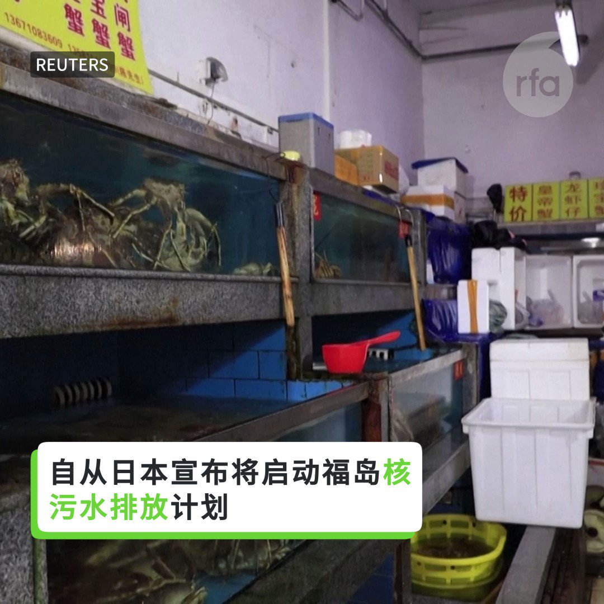
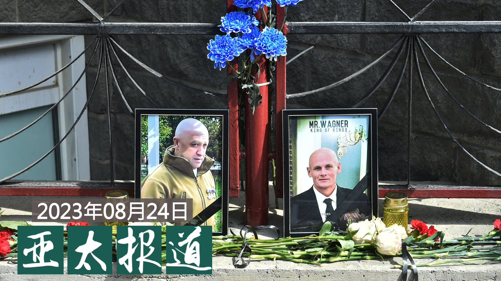
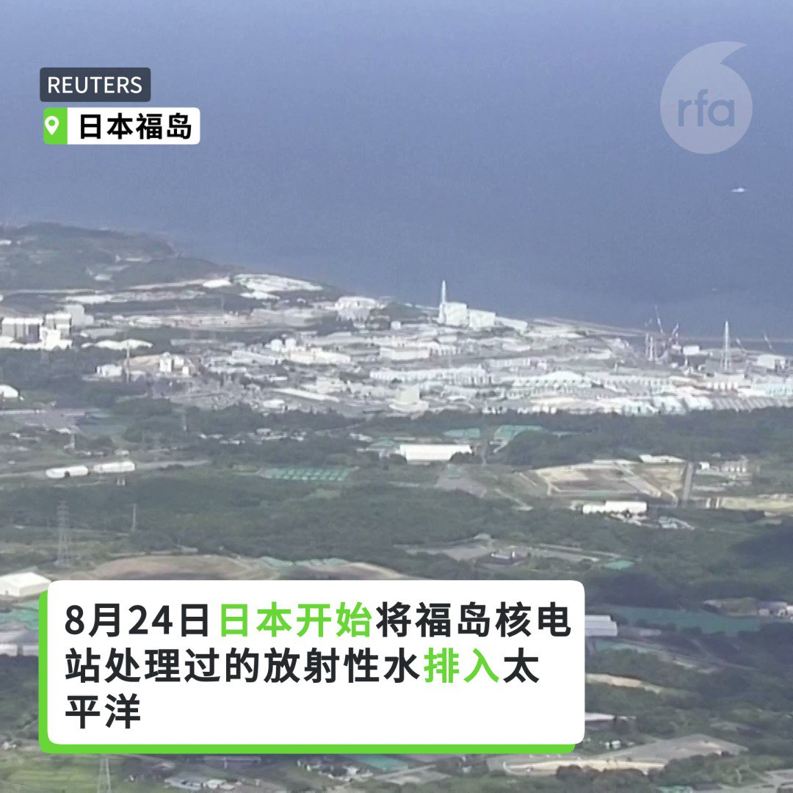
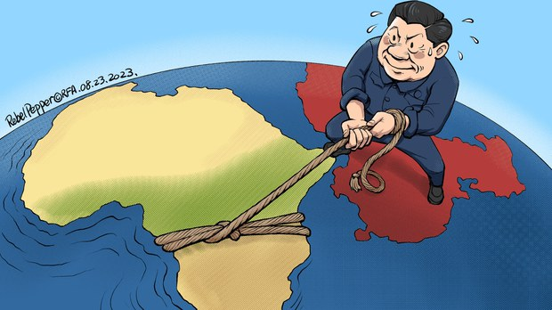

自由亚洲电台 北京时间 2023-08-25T04:31:18Z 1694809628968899003 【海鲜变核鲜？中国民众很焦虑】
自从日本宣布将启动 #福岛核污水排放 计划，引发了中国民众特别是海鲜市场摊主们的担心。 https://t.co/Gf6a0hmSFX   自由亚洲电台 北京时间 2023-08-25T05:28:31Z 1694824030610858326 专栏 | #军事无禁区：制空权是硬道理－#解放军对台演训 关键所在
 https://t.co/ux9sW8fI2T   自由亚洲电台 北京时间 2023-08-25T07:00:09Z 1694847088725741750 【#亚太报道（2023-8-24）】
欢迎收听和订阅播客【亚太报道】 https://t.co/MjLNSvVMqc

中国网民热议“#俄版林彪事件” / #宝能地产 百亿股权被冻结 / 美国对参与 #西藏同化政策 的中国官员实施制裁 / 新疆一男子因在婚礼朗读《#古兰经》遭刑拘 / 人权组织联署呼吁释放 #卢思位 律师 https://t.co/nqLj8hvCyA   自由亚洲电台 北京时间 2023-08-25T04:02:59Z 1694802505170100538 中国司法部数据显示，从2017年起，在中国注册进行业务的 #外国律师事务所 办事处连续5年减少。至今年6月14日数据，这些办事处已从5年前的244家跌至205家，共减少了39家。就连全球知名的 #瑞生国际律师事务所（Latham &amp; Watkins）也计划关闭在上海经营了20年的办事处。
 https://t.co/Yso0mONz6f   自由亚洲电台 北京时间 2023-08-25T04:26:22Z 1694808388767785103 【#日本排放核废水 中国全面 #暂停进口日本水产品】

8月24日日本开始将 #福岛 核电站处理过的放射性水排入太平洋。尽管日本坚称水经过处理且无害，但中国仍禁止进口所有日本海鲜. https://t.co/OXSOCCelqz   自由亚洲电台 北京时间 2023-08-25T04:47:32Z 1694813716049486209 【中国禁止进口日本海鲜　政治意义大于经济意义？】
8月24日日本开始排放核污水，中国宣布禁止进口日本海鲜。
对日本有何影响？
日本对外贸易主要以汽车为主，海产品仅占日本全球贸易不到1%，中国是日本最大海鲜出口市场。
去年日本向中国供应的15.6万吨海产品仅占中国188亿美元海产品进口额的不到4% https://t.co/zXZJ8ZaHTj   自由亚洲电台 北京时间 2023-08-25T06:00:01Z 1694831954393452660 专栏 | #中国透视：#小北约 乃北京造　繁华散尽皇城孤
 https://t.co/i8SrDWjby6   自由亚洲电台 北京时间 2023-08-25T00:57:59Z 1694755946797662687 美国政府日前表示，新一波对台五亿美元 #军售 案进入"知会国会"程序。美国台湾商业委员会也表示，拜登政府可能正在调整和扩大支持 #台湾防务 的力度，以应对中国军事威胁。

 https://t.co/7x8O8eZdRF   自由亚洲电台 北京时间 2023-08-25T03:03:52Z 1694787625725612153 根据中央及地方政策文件、在线招聘广告，以及知情人士披露的信息，“#千人计划”目前已由中国工业和信息化部监管的“#启明计划”所取代。 https://t.co/hylBiZICiA   自由亚洲电台 北京时间 2023-08-25T03:23:34Z 1694792583426265306 【#变态辣椒：一带一绳】
中共与坦桑尼亚、莫桑比克、纳米比亚、安哥拉、南非及津巴布韦等国执政党联手建校，对非洲领导人进行政治培训，灌输带有浓厚中共独裁色彩的执政理念。坦桑尼亚的"姆瓦利姆·朱利叶斯·尼雷尔领导力学校"将教授经济发展战略以及如何保持永久执政的课程。中国在经济方面对整个非洲有重大影响，而中共对以上六国合作伙伴的密切关系早在殖民地的解放时期就已建立。   自由亚洲电台 北京时间 2023-08-25T03:29:13Z 1694794007661191425 新疆昌吉州哈萨克族男子库斯曼·热黑木在参加一场穆斯林婚礼后被警察抄家及拘留。当事人的弟弟对本台投诉，警察在他的哥哥家抄到一本《#古兰经》，并指库斯曼在非宗教场合从事宗教活动，将其刑事拘留。#新疆 警方拒绝对相关问题作出回应。

 https://t.co/MI0XGo5FIa   自由亚洲电台 北京时间 2023-08-25T03:45:38Z 1694798138362724582 在“#小红书”里，台湾用户定位在“中国台湾”，找不到六四事件的历史真相，看不见以台湾民主选举为背景的热播台剧，甚至无法在闲聊里提到“习大大”。#亚洲事实查核实验室 以观察、测试、采访等方式，揭露小红书如何呈现某种中国式，去政治后的“美好”。

 https://t.co/MemgQbXVdZ   自由亚洲电台 北京时间 2023-08-25T04:15:29Z 1694805650143146219 据维权网信息中心24日消息，今年六四前夕在老挝首都万象被中国警方跨境抓捕的拆墙运动发起人 #乔鑫鑫（本名 #杨泽伟）已于今年7月7日被衡阳市检察院批准，由衡阳市公安局直属分局执行逮捕，其罪名是“煽动颠覆国家政权罪”。报道中还包括乔鑫鑫逮捕通知书图片。
 https://t.co/kll1ZhSWHI   自由亚洲电台 北京时间 2023-08-25T00:34:24Z 1694750010414604746 知情人士：“他（#周远志）在 #秦永敏 70岁生日时， 发一些怀念他的文章，以及 #河北水灾 的事情。可能这些在当地政府眼里是容不下的，说要拘留他十几天，到底拘留多少天，这方面没有通知书，什么都没有。当局还上门找他们家里人要药，因为他身患几种疾病。”

 https://t.co/la0AAEuljN   自由亚洲电台 北京时间 2023-08-25T01:48:26Z 1694768644348334317 中国人权律师 #卢思位 上月底在老挝被捕，#加拿大 五个人权组织发联署信函并亲自到老挝驻加拿大领事馆抗议，呼吁老挝尽快释放卢思位。并呼吁加拿大政府不要对中国干预的问题轻轻放下，因为这涉及所有人的安危。

 https://t.co/ph4nfC0GT1   