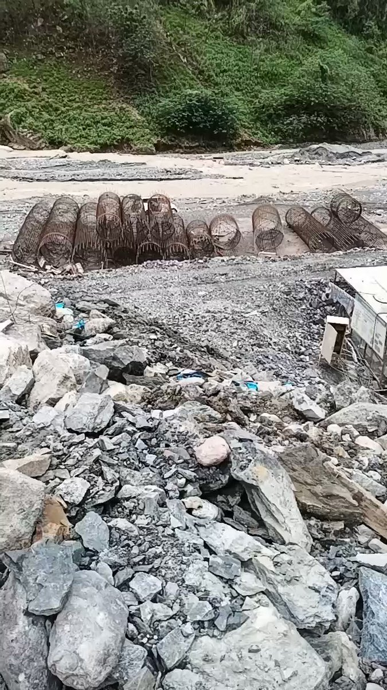
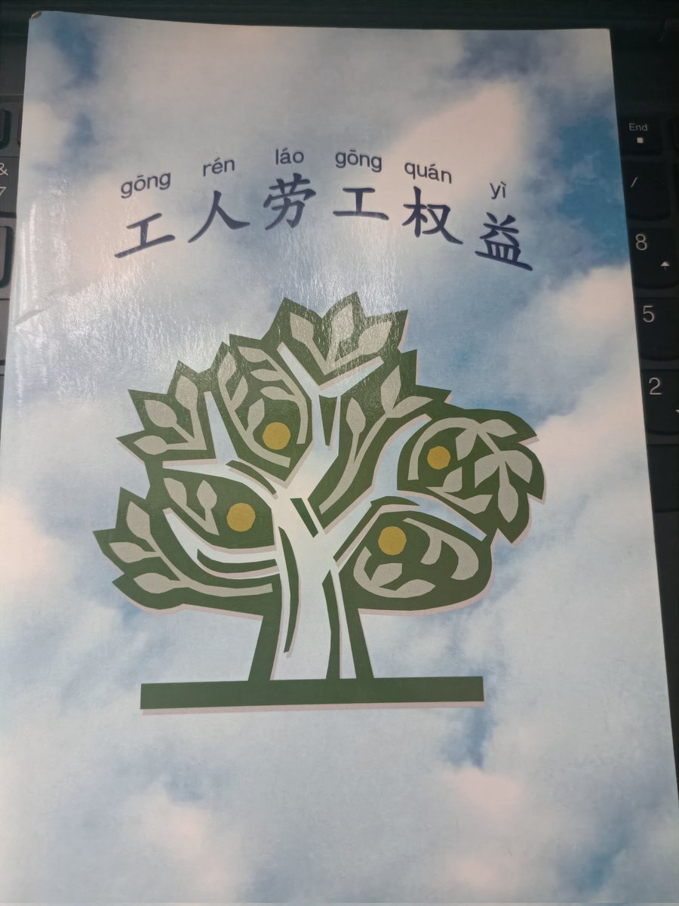
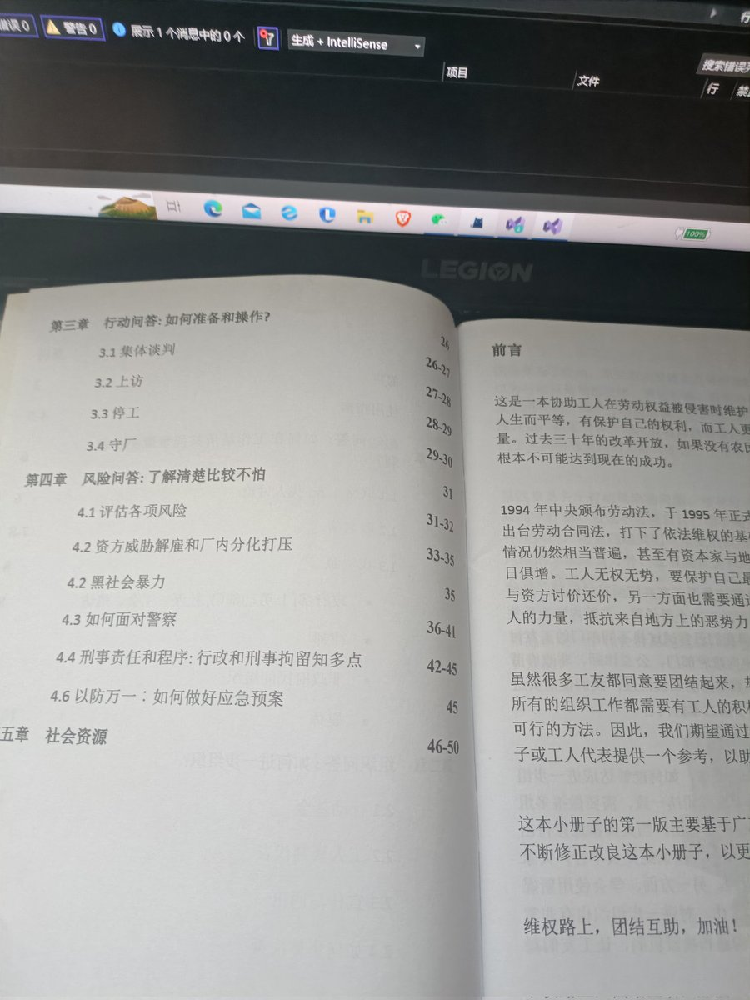
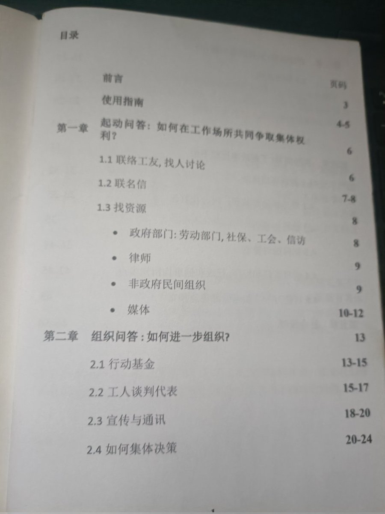
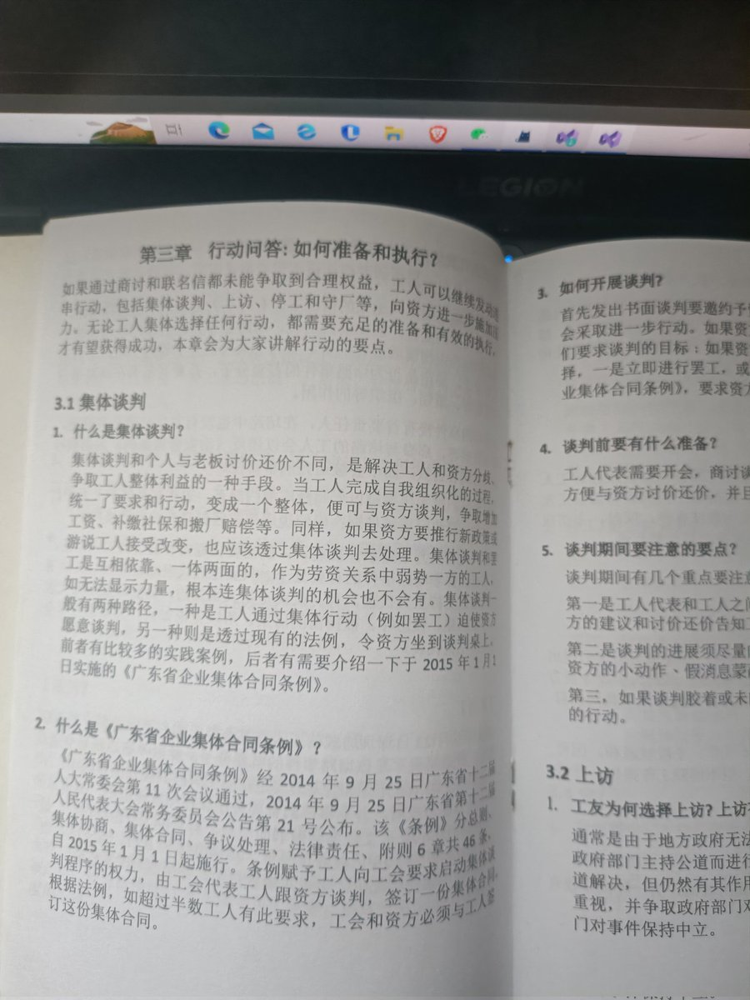

谁将十万横扫三江 北京时间 2023-08-25T13:45:38Z 1694949132035842312 凉山州金阳县山洪，现在只能假装救人，死亡不止6人 https://t.co/FZOALQL4ot   谁将十万横扫三江 北京时间 2023-08-25T14:04:47Z 1694953950766936475 RT @pear14525902: 为什么美国也是资本主义，但是长得和中国这种纯资本主义国家不一样？因为当年北美洲的地位就跟今天的非洲差不多，是一个原料出口地，是被英、法等帝国剥削的一块地方，当地人民已经受够了资产阶级政府的毒害了，对政府的本质有所了解，称之为“必要之恶”。美国…   谁将十万横扫三江 北京时间 2023-08-25T10:33:40Z 1694900821878546526 RT @xjpcnm1141514: 今天翻书柜发现了这本好书，这是深圳佳士运动期间，托派在工友和学生里散发的小册子，我认为这本小册子仍有很强的实用性，我想找个机会，把它做成PDF。 https://t.co/P0vgoIWzDV   