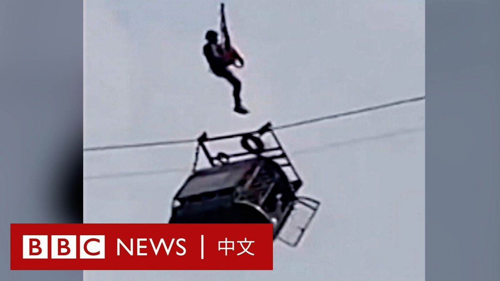
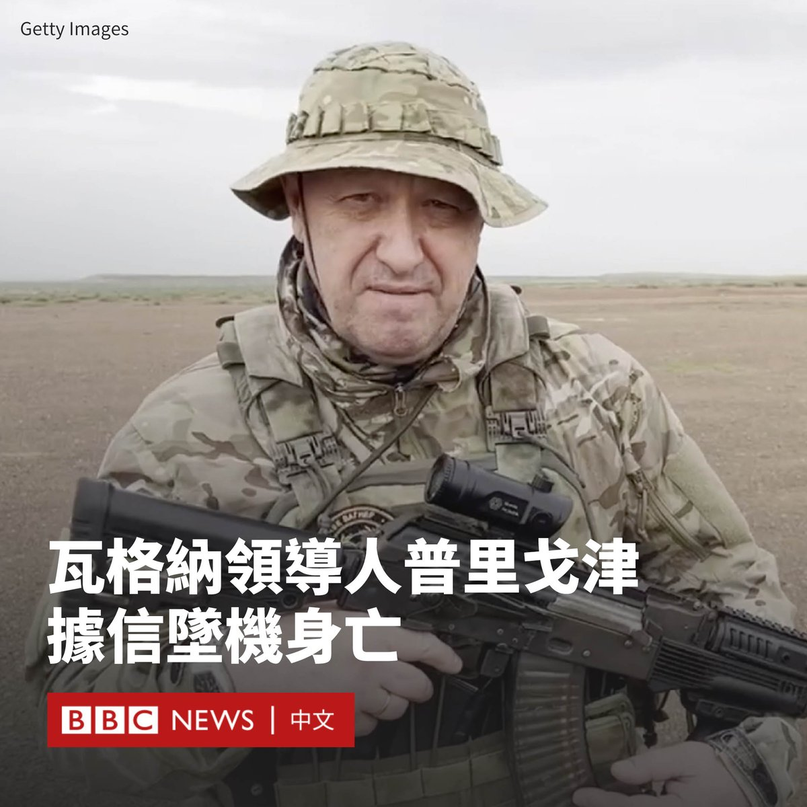
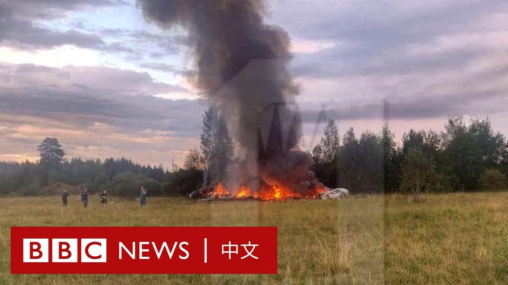
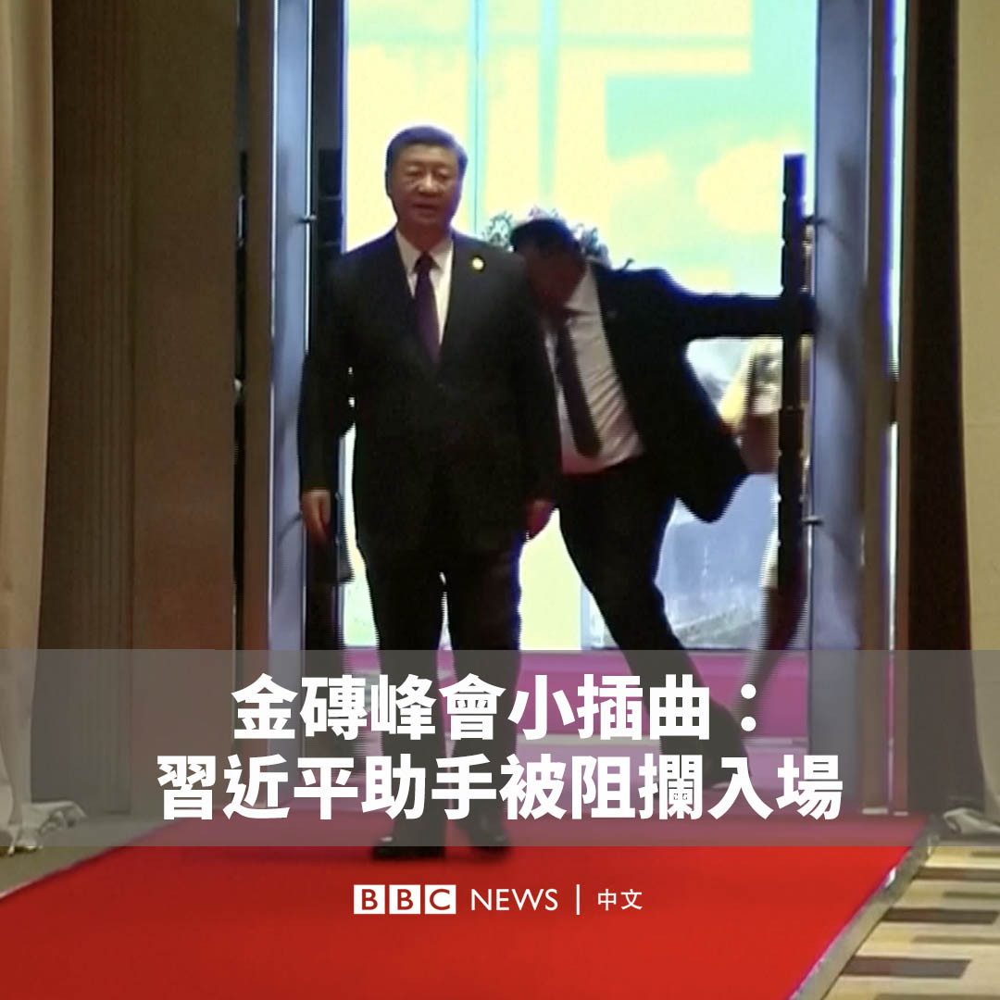

D英国广播公司BBC 北京时间 2023-08-24T13:37:58Z 1694584813494165669 【最新消息】中国海关总署宣布全面暂停进口原产地为日本的水产品。日本于星期四（8月24日）下午开始排放福岛核电站经处理的放射性污水。 https://t.co/t4gQXi1Eog   D英国广播公司BBC 北京时间 2023-08-24T12:13:48Z 1694563633039032675 【最新消息】日本当局确认，东电福岛第一核电站已开始向太平洋排放其所称经过处理的放射性污水。

敬请关注BBC News 中文的多媒体直播页面：https://t.co/leYDP31NPx   D英国广播公司BBC 北京时间 2023-08-24T09:57:18Z 1694529281052053597 巴基斯坦一个山谷上的缆车缆索断裂，六名儿童和两名老师被困于仅由一根绳子挂着的车厢内。 巴基斯坦空军出动直升机营救，最终8人全部获救。 https://t.co/fwLun4a95N   D英国广播公司BBC 北京时间 2023-08-24T09:13:11Z 1694518181522747861 普里戈津事件最新进展：

- 一架私人飞机在莫斯科以北的特维尔州坠毁，机上有十人。

- 影片显示，一架飞机在空中解体坠落，随后发生爆炸。

- 俄罗斯联邦航空署将普里戈津的名字列入失事航班乘客名单中，瓦格纳指挥官兼联合创始人德米特里·乌特金也在机上。

- 俄罗斯国际文传电讯社援引紧急服务部门的话称，失事客机上所有乘客的遗体均已被找到。

- 瓦格纳相关的Telegram频道“灰区”（Grey Zone）承认普里戈津已经死亡。

- 俄罗斯官方称，已对事故原因启动刑事调查，但尚未明确证实普里戈津已经死亡。   D英国广播公司BBC 北京时间 2023-08-24T02:29:12Z 1694416513783283768 瓦格纳集团首领普里戈津（Yevgeny Prigozhin）被推定在一场空难中身亡。

俄罗斯民航部门表示，俄罗斯一架私人飞机在莫斯科以北的特维尔州坠毁，机上人员全部遇难，而普里戈津在该飞机的乘客名单上。不过，目前尚无独立渠道确认普里戈津是否在飞机上。

现场画面显示，一架飞机从天上坠落，随后起火。 https://t.co/QinnqOdze5   D英国广播公司BBC 北京时间 2023-08-24T01:22:21Z 1694399692312809501 【最新消息】据俄罗斯媒体报道，瓦格纳集团首领普里戈津（Yevgeny Prigozhin）在俄罗斯一场空难中死亡，机上另外九人也遇难。 https://t.co/uSkjhefsVZ   D英国广播公司BBC 北京时间 2023-08-24T00:14:23Z 1694382587501072652 金砖国家（BRICS）南非峰会出现小插曲。在中国领导人习近平走入会场时，他的一名助手似乎引起安保人员的怀疑，被阻止入场。 https://t.co/WWeHpnhzZZ   