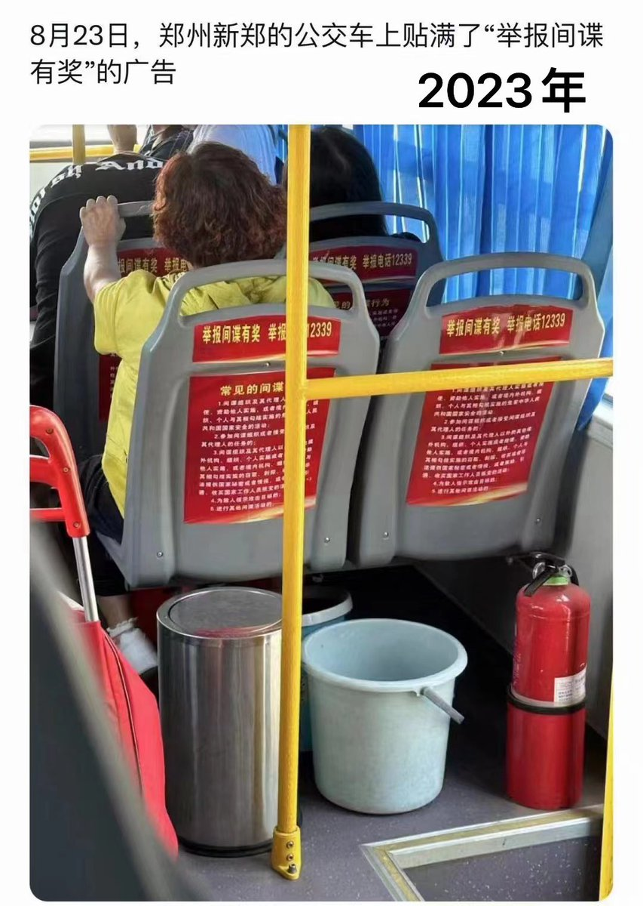
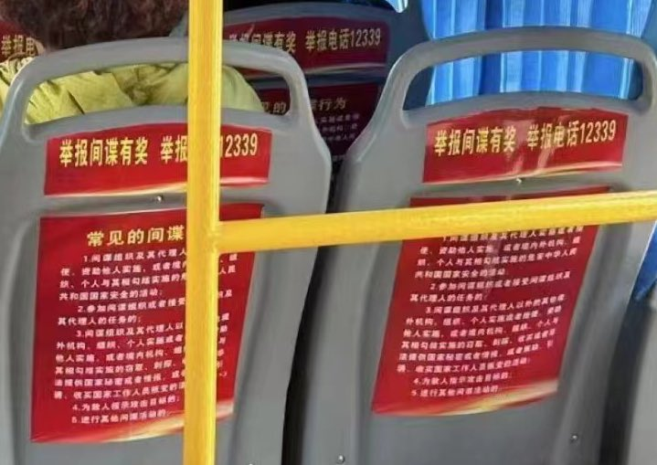
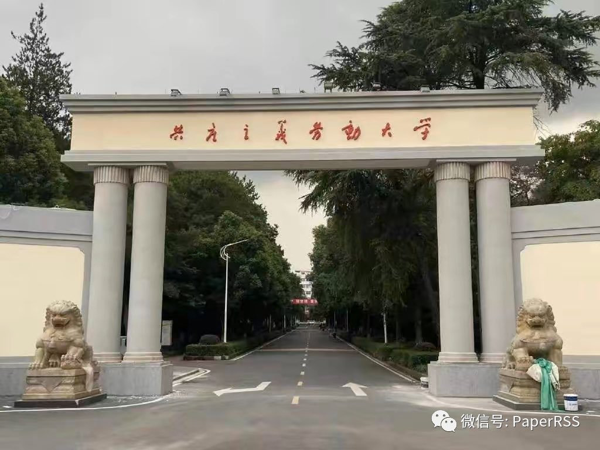
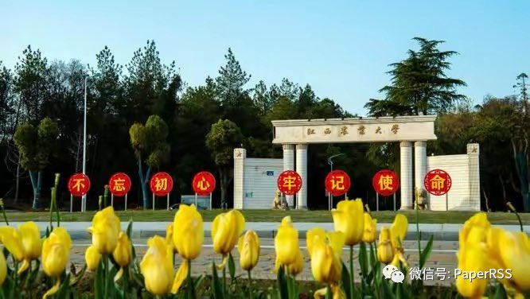
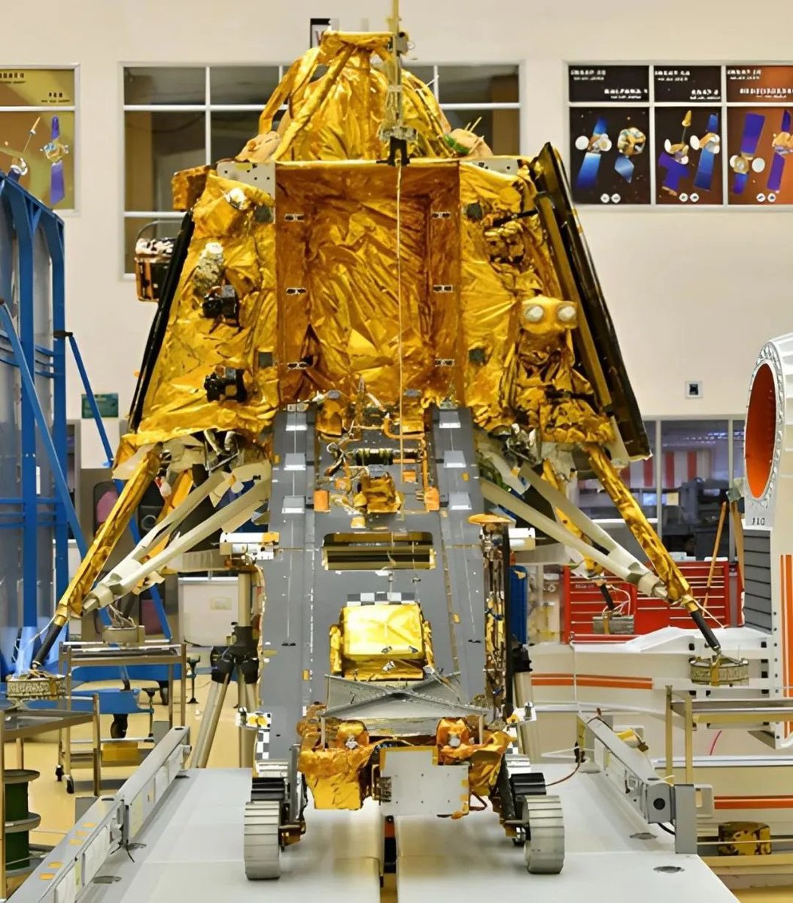
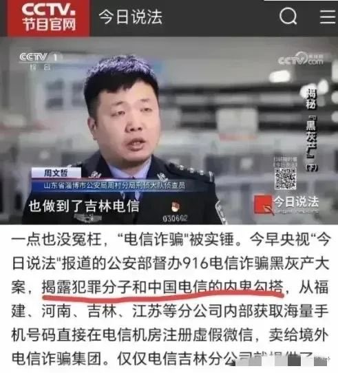
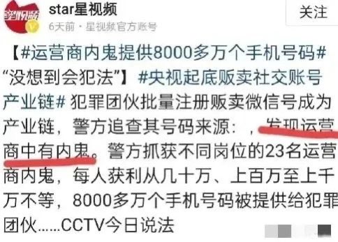

Petrichor 北京时间 2023-08-24T13:53:31Z 1694588726800793956 习主席问：这些黑人的击鼓跟谁学的？ https://t.co/100lk36ULS   Petrichor 北京时间 2023-08-24T13:38:21Z 1694584910260977910 郑州号召乘公交人的举报间谍，不知那些乘公交的人一辈子是否有机会遇到一次真正的外国间谍？他们生活之交应该几乎没有。 https://t.co/H5luRUAlhK   Petrichor 北京时间 2023-08-24T13:56:30Z 1694589480055775588 原来如此。 https://t.co/IJ5DSVvIln   Petrichor 北京时间 2023-08-24T14:17:50Z 1694594848148394044 近日一则网帖称江西农业大学将大学校门上的校名“江西农业大学”更换回“共产主义劳动大学”。该消息立刻引起人们大学是否重回文革的关注。面对舆论压力，8月23日下午，江西农业大学党委宣传部负责人表示，“江西农业大学没有更名，网传图片上的建筑是学校重建了在“共产主义劳动大学”时期的老校门。今年暑假期间，学校将该建筑恢复了历史原貌，作为校内的一处历史文化景观，以示“不忘初心、牢记使命”。共产党的初心就是消灭私有制，实现共产主义。   Petrichor 北京时间 2023-08-24T05:39:20Z 1694464365016084929 8月23日20时34分，印度月船3号探测器成功软着陆在月球南纬69.37度、东经32.35度的南极附近区域，使印度成为“月球着陆俱乐部”第四个成员。月船3号探测器包括1个推进模块、1个着陆器和1辆月球车。“月船3号”的着陆器比“前辈”重了200多公斤，体现其装载设备和安全保障措施升级。成功着陆后，着陆器需借助坡道释放26公斤重的普拉吉安号月球车，正式探索月球表面。

2008年10月，印度发射了本国首个探月器，即“月船1号”，同时是印度航天第一次深空任务。这个探月器包括1个轨道器和1个撞击器探测器，通过巡视和撞击月面，对月球的表面和内部进行细致勘测，并发回了大量数据。通过分析这些探测成果，科学家们初步确定：月球上存在固态的水冰资源。

这些表明，印度军事特别是导弹研发能力非同小可，喜玛拉雅山脉不再是中印两国之间不可逾越的屏障。   Petrichor 北京时间 2023-08-24T00:36:20Z 1694388111092912144 据央视报道：吉林电信涉嫌向缅甸一诈骗集团提供了超过8000万个号码的信息。每年有7万华人被卖到缅甸！国企竟然如此不要脸的胡作非为！另据泰国警方统计，每年大概有7万名华人从泰国被贩卖到了缅甸的妙瓦底镇，相当于平均每天将近200人，而这还仅仅是泰国官方公布的数据。对于骗到缅北的中国人，中国政府做什么呢？被割去的器官又到哪里去了？移植进入什么人的身体？别问我为什么我不爱这样的政府官员，他们对待百姓的态度解释一切。   