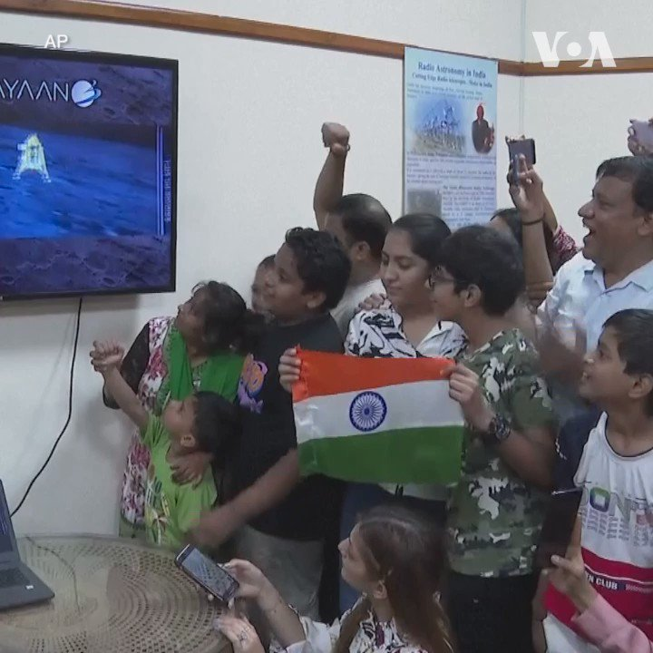
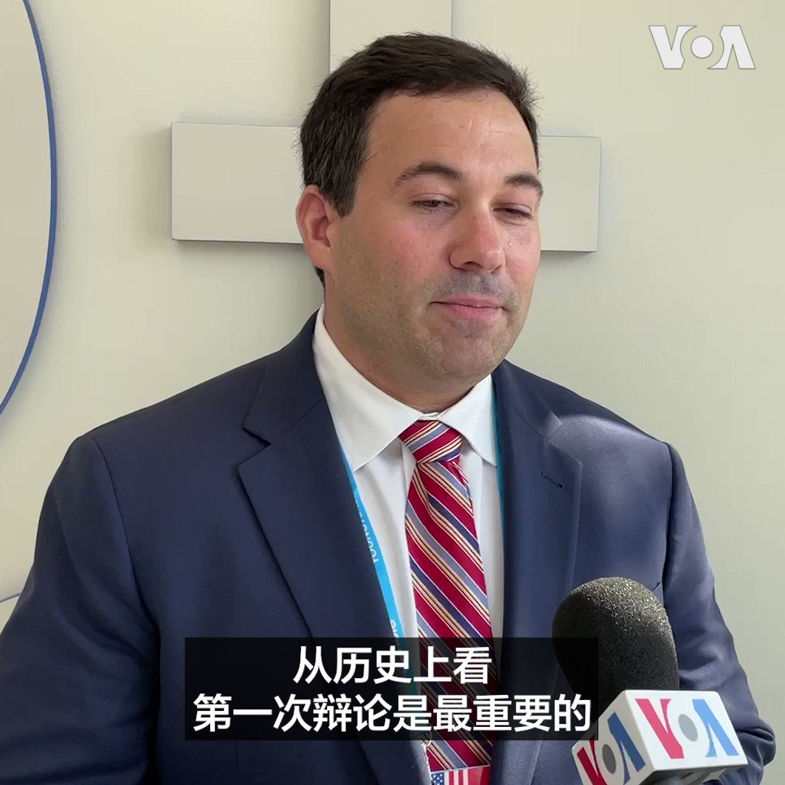

美国之音中文网 北京时间 2023-08-24T11:38:04Z 1694554641630126302 商务部长雷蒙多本周末访华，面临经济困境，北京反应积极 https://t.co/3mE4c5Bvv6   美国之音中文网 北京时间 2023-08-24T03:24:19Z 1694430385789415545 印度航天局8月23日说，印度“月球三号”探测器当天成功地在月球南极实现软着陆。这使印度成为继美国、前苏联和中国之后又一个着陆月球的国家。正在南非出席金砖国家峰会的印度总理莫迪观看了实况转播。在新德里，当地居民对印度着陆月球表示自豪。详细：https://t.co/yOW5csxGpv https://t.co/aXGBGknDWH   美国之音中文网 北京时间 2023-08-24T06:42:02Z 1694480142788386834 乌军情报局称其诱使俄军直升机降落在乌克兰 https://t.co/g62CDoEZqm   美国之音中文网 北京时间 2023-08-24T08:21:40Z 1694505214286446966 #共和党初选首场辩论 瓦格纳集团首领普里戈津坠机死亡的消息，或成为美国共和党总统候选人首场辩论的国际议题焦点。美国密歇根大学大选辩论研究专家考尔(Aaron Kall)告诉美国之音，俄罗斯问题可能主导辩论的国际议题，但中国问题也可能有所触及。 https://t.co/7hmOgxYQIq   美国之音中文网 北京时间 2023-08-24T09:00:01Z 1694514865967128880 一键解锁#美国热搜 榜1、突发：习近平金砖会议上先玩失踪，翻译被安保控制，孤身赴会；普里戈任空难身亡2、四十年繁荣落寞，中国各阶层生活写真3、经济倾覆，房奴遭殃4、霸州灾民冲击市政府5、中国政府七夕情人节催生6、央视主播歌颂苦难遭群嘲7、市民捣毁中共政治广告 https://t.co/WizK30k4jT https://t.co/s8hMczmi6U   美国之音中文网 北京时间 2023-08-24T09:58:03Z 1694529470680777005 共和党初选首场辩论登场 特朗普缺席仍抢对手风采 https://t.co/TO4E0LKGRv   美国之音中文网 北京时间 2023-08-24T04:34:32Z 1694448057491116369 美国指控加密货币公司创始人犯有洗钱罪 https://t.co/1sHNR6973o   美国之音中文网 北京时间 2023-08-24T07:00:00Z 1694484663677702456 中国房地产公司接连爆雷，楼市摇摇欲坠，问题更蔓延到金融信托领域。为什么政府的救市措施不起作用？房地产危机外溢对整体国民经济影响多大？新加坡联合早报刊登社评《问题在经济，根子在政治》引发热烈反响。我们请到作者刘梦熊先生讨论这个问题，请看8/24日时事大家谈并留言互动。 https://t.co/9xBnjTsXDa   美国之音中文网 北京时间 2023-08-24T07:39:03Z 1694494492781650082 台湾纪念“八二三炮战”65周年，美国在台海紧张局势中寻求更强大的联盟 https://t.co/S1zrYeVe68   美国之音中文网 北京时间 2023-08-24T08:06:03Z 1694501287193383072 中国间谍利用领英窃取英国情报 https://t.co/xxb5HxttRq   美国之音中文网 北京时间 2023-08-24T08:39:34Z 1694509722274279828 韩国参加应对朝鲜威胁的战备演习 https://t.co/lqhH5W7f4L   美国之音中文网 北京时间 2023-08-24T09:01:51Z 1694515326531055960 #现场直击 共和党选择了美国中西部城市密尔沃基作为今晚第一场总统候选人辩论的主场，这里也将在明年七月召开共和党的党代会，推选出党内的总统候选人。在距离辩论开场前三小时，Fiserv Forum体育场外聚集的人越来越多，预计今晚现场观众有4000到6000人。跟着美国之音的现场镜头一起看一下。 https://t.co/HBWx4WakSe   美国之音中文网 北京时间 2023-08-24T00:43:02Z 1694389797199261931 港府获喘息机会，申请抗议歌曲禁制令被拒后获上诉许可 https://t.co/wR4DbcPUCb   美国之音中文网 北京时间 2023-08-24T04:18:32Z 1694444028194910289 #现场直击 几小时后，美国2024总统竞选活动的首场造势活动将在威斯康星州城市密尔沃基登场，八名角逐党内提名的共和党总统候选人将登上第一轮辩论的舞台。前总统特朗普的缺席成为这场辩论前的主要话题，但美国选民们对其他候选人的辩论表现也有不同的期待，包括这些候选人在中国议题上的论述。 https://t.co/BBQShwBwmK   美国之音中文网 北京时间 2023-08-24T05:25:03Z 1694460768606101768 俄民航当局：一架私人飞机坠毁，死者包括瓦纳格首领普里戈津与军事指挥官乌特金 https://t.co/bl8Fn8MJDA   美国之音中文网 北京时间 2023-08-24T05:25:05Z 1694460776013238657 因缅甸军政府对本国人发动空袭，美国扩大对其飞机燃料的制裁 https://t.co/c9QuLGW6aX   美国之音中文网 北京时间 2023-08-24T05:46:31Z 1694466170785616068 共和党初选首场辩论23日晚在著名“摇摆州”威斯康星州的密尔沃基举行，有8名候选人登台辩论，党内支持率遥遥领先的前总统特朗普将缺席。辩论将聚焦哪些议题？谁能脱颖而出，挑战特朗普的支持率？中国议题上，候选人们会有新的提议和表述吗？美国之音中文网从现场为您带来最新动向https://t.co/KhqI8d4dMa https://t.co/H15viFzHDs   美国之音中文网 北京时间 2023-08-24T06:12:34Z 1694472725388247079 “林某直呼内行”：瓦格纳首领据报死于坠机，中国事务专家和网民皆称像极林彪 https://t.co/CYqZqWokGB   美国之音中文网 北京时间 2023-08-24T00:28:06Z 1694386039664844942 俄军大将苏罗维金或因参与瓦格纳兵变被解职 https://t.co/l7XLQfWsdj   美国之音中文网 北京时间 2023-08-24T01:20:33Z 1694399240431399026 印度“月船3号”在月球南极表面成功软着陆，莫迪称是“全人类的胜利” https://t.co/P78TjeQ5uO   美国之音中文网 北京时间 2023-08-24T02:25:47Z 1694415655251182077 中国海警船22日试图阻挡菲律宾供应船向驻守在第二托马斯浅滩的菲律宾部队送去食物及物资。美联社视频显示中国海警船用英文发出警告说中国“对南沙群岛有无可争议的主权”, 并警告菲律宾海岸警卫队离开, 否则要承担一切责任。两艘护送供应船的菲律宾海岸警卫队船只被至少四艘中国海警船包围了近五个小时。 https://t.co/tsogSGSro7   美国之音中文网 北京时间 2023-08-24T02:39:33Z 1694419118806671452 香港终审法院裁定国安案认罪不获全数减刑期 大律师忧对刑期较轻被告不公 https://t.co/W8dTtEgZ9n   美国之音中文网 北京时间 2023-08-24T02:53:33Z 1694422642932232283 一架私人喷气式飞机在莫斯科附近坠毁，普里戈津在乘客名单上 https://t.co/h1GgNn0rxk   美国之音中文网 北京时间 2023-08-24T02:53:35Z 1694422650591096992 美宣布售台价值5亿美元F-16战机红外搜索跟踪系统 https://t.co/bMGF2lCdN2   美国之音中文网 北京时间 2023-08-24T03:24:03Z 1694430318756069620 外国律师事务所纷纷撤出中国 https://t.co/LcDSaosDhe   美国之音中文网 北京时间 2023-08-24T03:33:55Z 1694432800840331750 正在南非约翰内斯堡参加金砖国家峰会的印度总理莫迪观看了印度“月船3号”太空探测器23日在月球南极表面软着陆的实况转播。 https://t.co/MAqTykUX8R   美国之音中文网 北京时间 2023-08-24T00:28:04Z 1694386032119271770 日本周四排放福岛废水 中港协调封杀日本水产品进口 澳门更甚近乎全禁 https://t.co/btFIhxbvuO   美国之音中文网 北京时间 2023-08-24T01:49:39Z 1694406562930962721 快讯！瓦格纳集团首领普里戈津的一架私人飞机在莫斯科北部坠毁，俄罗斯紧急部门表示，机上10人全部罹难。普里戈津的名字在乘客名单上。 https://t.co/73UbhSH2Y8   