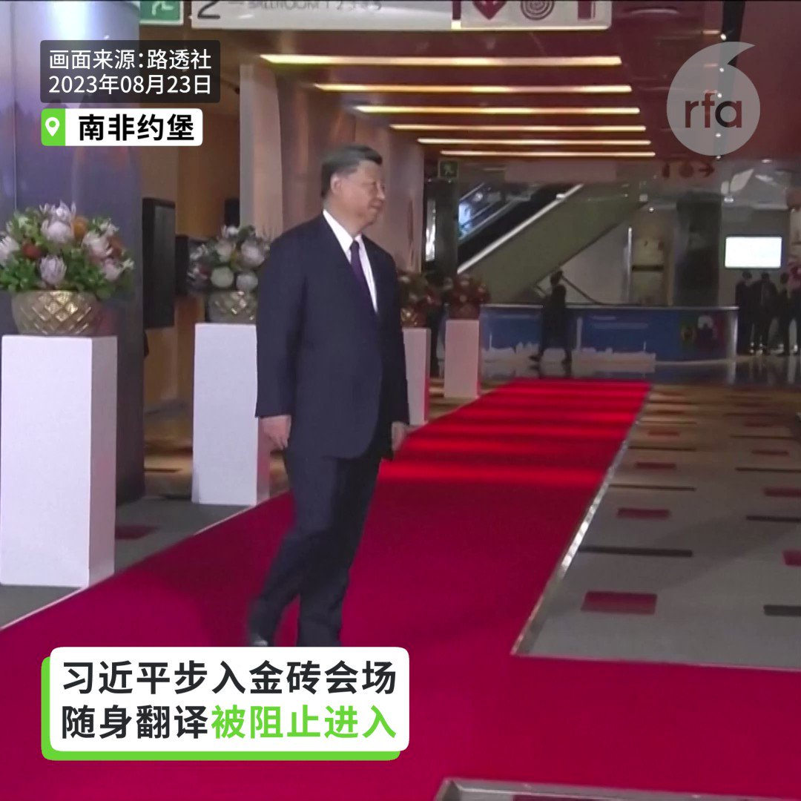
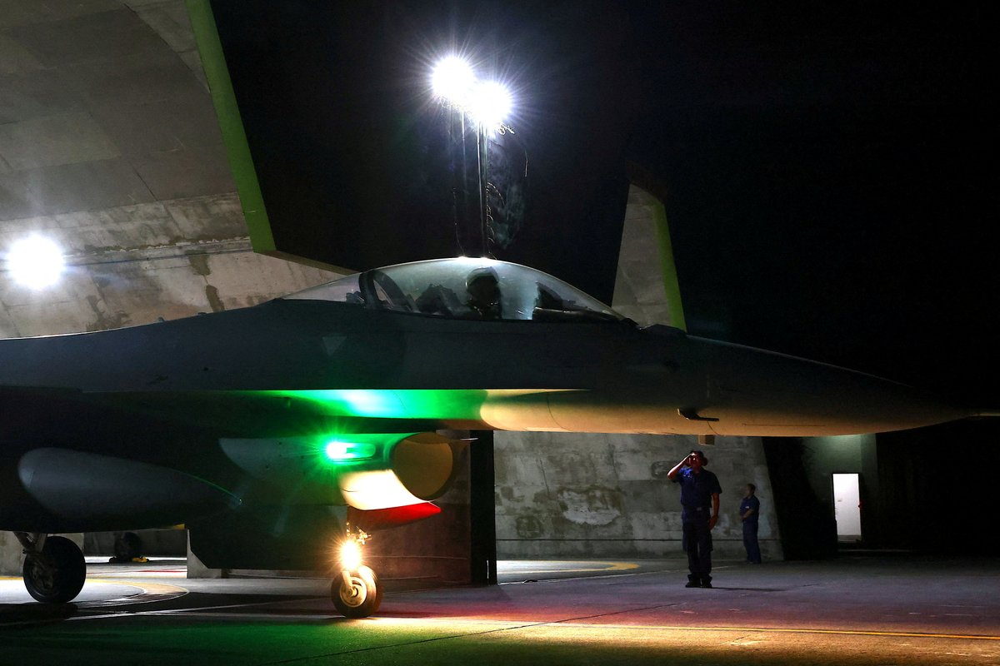
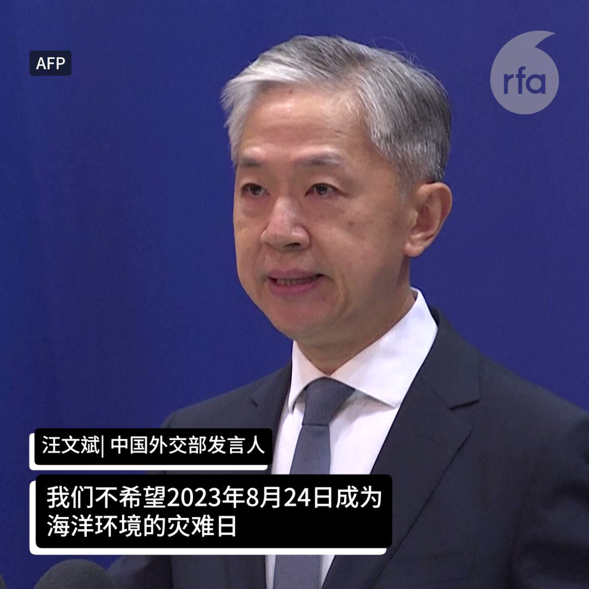
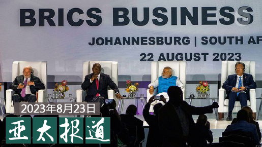

自由亚洲电台 北京时间 2023-08-24T18:22:51Z 1694656509878173728 RT @RFA_Chinese: 【#亚太报道（2023-8-23）】
欢迎收听和订阅播客【亚太报道】 https://t.co/MjLNSvVMqc

#习近平缺席南非金砖闭幕 引揣测 /#日本核废水排海 中国老百姓如何看？/中国多个 #同性恋 公众号被关闭/ “#自由之家”…   自由亚洲电台 北京时间 2023-08-24T19:39:00Z 1694675670276690130 RT @RFA_Chinese: 【金砖国家集团扩张 能否撼动国际秩序？】

#习近平 在8月23日的 #金砖国家领导人峰会 上，呼吁加快金砖国家集团的扩张。 https://t.co/qxA2i8DGfW   自由亚洲电台 北京时间 2023-08-24T14:34:41Z 1694599086488662154 【习近平步入金砖会场 翻译被拦在门外】
【习近平频回头 显得十分不安】
金砖国家领导人参加峰会第二天，中国国家主席习近平步入会场后，他的随行翻译也试图进入，遭工作人员制止，拦在门外。习近平发现翻译没跟上，停下脚步，频频回头察看，显得十分不安。
习近平当时心里在想什么?
#习近平 #金砖 #翻译   自由亚洲电台 北京时间 2023-08-24T10:39:17Z 1694539848756130176 【美售台F-16战机追踪系统】
【台国防部：大幅提升空战效能】

台湾国防部24日清晨发布新闻稿指出，美国政府在美东时间8月23日，针对“红外线搜索追踪荚舱（IRST)”，金额5亿美元对台军售案，进行“知会国会”程序，可望在1个月后正式生效。此次美方同意供售的红外线搜索追踪荚舱，是配合F-16V BLK70战机研发的最新型式，可强化战机对远距目标侦测追踪能力，大幅提升空中作战效能。https://t.co/cKtf6jZdVD   自由亚洲电台 北京时间 2023-08-24T10:01:33Z 1694530353434935688 #事实查核｜因过于"#男性化"，中国女选手被 #世界田联 除名？
 https://t.co/hC1Tzwlp8t   自由亚洲电台 北京时间 2023-08-24T11:28:23Z 1694552203522875711 RT @RFA_Chinese: 身在南非的中国国家主席 #习近平 没有现身工商论坛闭幕式，成为这次 #金砖五国峰会 的焦点。 "#习近平去哪儿"瞬间成为国际热门话题。中国外交部对此闪烁其词引发更多揣测。对于事件背后，是否涉及更高的机密，专家学者各有看法。

 https://…   自由亚洲电台 北京时间 2023-08-24T04:52:09Z 1694452489406353719 日本宣布将于本周四（24日）启动排放经处理的 #福岛核废水。对此，中港台三方各有不同的处理手法。其中，中国外交部反应最为强烈，不仅派副外长召见日本驻华大使，并向日方提出"严正交涉"。而中国民间的反应却相对冷淡。这是为什么呢？
https://t.co/h8OqnnzV3D   自由亚洲电台 北京时间 2023-08-24T09:54:02Z 1694528461057208559 【#日本拟排放核废水 中国反应很大】 https://t.co/WHrIeFg9og   自由亚洲电台 北京时间 2023-08-24T09:59:39Z 1694529872545341679 【#亚太报道（2023-8-23）】
欢迎收听和订阅播客【亚太报道】 https://t.co/MjLNSvVMqc

#习近平缺席南非金砖闭幕 引揣测 /#日本核废水排海 中国老百姓如何看？/中国多个 #同性恋 公众号被关闭/ “#自由之家”报告显示 #中国抗议事件 激增/#东莞 再有两家企业关闭 https://t.co/Ve4g6yWLPV   自由亚洲电台 北京时间 2023-08-24T10:05:54Z 1694531449008034165 【金砖国家集团扩张 能否撼动国际秩序？】

#习近平 在8月23日的 #金砖国家领导人峰会 上，呼吁加快金砖国家集团的扩张。 https://t.co/qxA2i8DGfW   自由亚洲电台 北京时间 2023-08-24T07:13:40Z 1694488104516596020 如果中国真的出现2008年那样的经济危机，是否会严重蔓延到世界其他地区，尤其是美国？
8月22日，《纽约时报》刊发专栏作家保罗·克鲁格曼文章《中国的经济危机有多可怕》称：美国受中国潜在危机的影响小得惊人。
美国在中国投资仅5150亿美元。
2022年中国从美国购买产品仅约1500亿美元，不到美国GDP的1%。
保罗·克鲁格曼的结论是：“在经济方面，我们似乎看到的是中国内部的潜在危机，而不是2008年那样的全球事件。”
您同意吗？   自由亚洲电台 北京时间 2023-08-24T04:34:10Z 1694447963718705189 第二届 #香港节 即将在美国加州湾区小城米尔皮塔斯举行。有关本届香港节活动的详情, 本台记者孙诚日前采访了活动的主办者。
https://t.co/7tnJs97u9X   自由亚洲电台 北京时间 2023-08-24T04:53:53Z 1694452926628946015 美国防部上周发布报告，声称美国正处于 #生物防御 的关键时刻，必须采取紧急行动，应对 #生物武器 或 #大流行病 在内的灾难性事件。报告强调了中国日益增长的威胁，以及来自俄罗斯的急切危险和来自朝鲜、伊朗和暴力极端组织的持续威胁。
https://t.co/wnArf7xVmz   自由亚洲电台 北京时间 2023-08-24T04:57:12Z 1694453762079752641 有人权组织发布的最新报告指出，即使面对愈发严格的审查和镇压，过去一年内中国有关劳工和住房的 #群体性抗议事件 激增。有分析指出，受中国经济持续萎靡的拖累，#失业率 攀升和 #房地产危机 已经切身影响到普通群众的日常生存。
https://t.co/O5W3I9IT45   自由亚洲电台 北京时间 2023-08-24T05:02:40Z 1694455136184136162 RT @RFA_Chinese: "#瓦格纳集团"首领 #普里戈津 专机可能被击落 普里戈津生死未卜
https://t.co/XLgoFAxiu9   自由亚洲电台 北京时间 2023-08-24T00:57:53Z 1694393536169509341 广东 #东莞 近期又传出外企和民企双双关闭的消息。东莞兴明服饰有限公司、台资东莞普士奇家具有限公司因订单不足，分别于本月和下个月关闭。这是广东省在一个月内，三家企业因经营环境恶化而关闭。

 https://t.co/VdUlhyjhFp   自由亚洲电台 北京时间 2023-08-24T01:24:39Z 1694400269700981045 去年10月份北京 #四通桥 上有民众抗议习近平独裁的事件至今在不少中国民众中记忆犹新。网传为事件主角的 #彭立发 目前仍下落不明。据民生观察网的消息，吉林网友张玉红上周五（8月18日）前往黑龙江，看望彭立发的家人时，被多名警察拦截带走，被扣押近两天后获释。

 https://t.co/QSngaTRyob   自由亚洲电台 北京时间 2023-08-24T03:40:58Z 1694434574300811370 "#瓦格纳集团"首领 #普里戈津 专机可能被击落 普里戈津生死未卜
https://t.co/XLgoFAxiu9   自由亚洲电台 北京时间 2023-08-24T01:23:51Z 1694400067200012441 美国国务院周二（8月22日）发布了关于 #西藏强迫同化 问题的 #签证限制 公告，指控中国不少官员参与了强迫超过一百万藏族儿童在政府开办的寄宿学校就读；这些政策旨在年轻一代藏人中消除西藏独特的语言、文化和宗教传统。美国将限制这些官员取得美国签证。

 https://t.co/hyuwNZC6lZ   自由亚洲电台 北京时间 2023-08-24T01:26:27Z 1694400721998008716 新加坡总理 #李显龙 要交权， 不少中文网友在推特上表示赞许。身在北京的时事评论人士章立凡在推文中说，“知进知退，不当僵尸。”还有人暗示性地说，“李显龙不对权力恋栈，让人有联想…”似乎在暗指中国国家主席 #习近平 第二次连任的事情。 https://t.co/g2v6sUsqUU   自由亚洲电台 北京时间 2023-08-24T00:06:38Z 1694380635052507216 时评人桑普:“‘情节严重’是具有中国法律特色的说法。这跟香港原有法律制度是矛盾的。譬如说，#分裂国家 的同时有暴力行为就会加刑。那是比较具体的构成要件。哪些情节算严重都没有具体定义，就等同在法治原则上倒退，等于把中国（大陆）那套抽象模糊的档次，拉到 #香港 来。”

 https://t.co/5RTdMoeT4P   